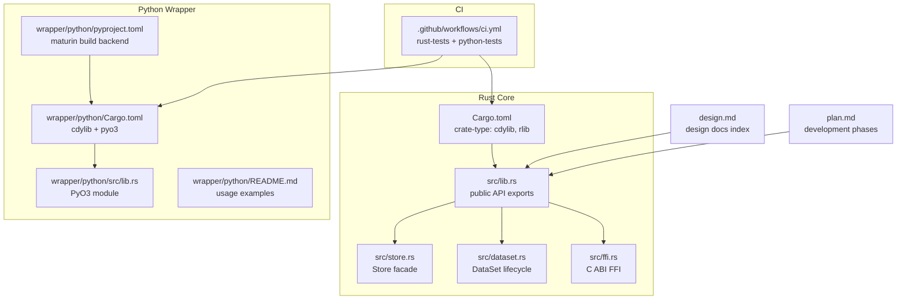
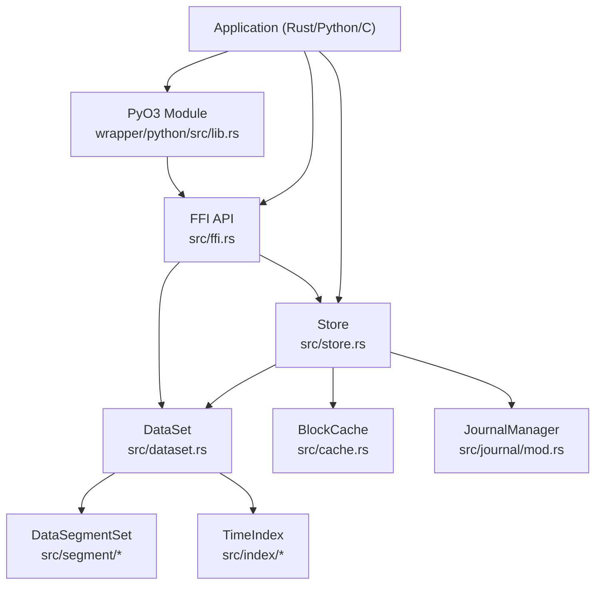
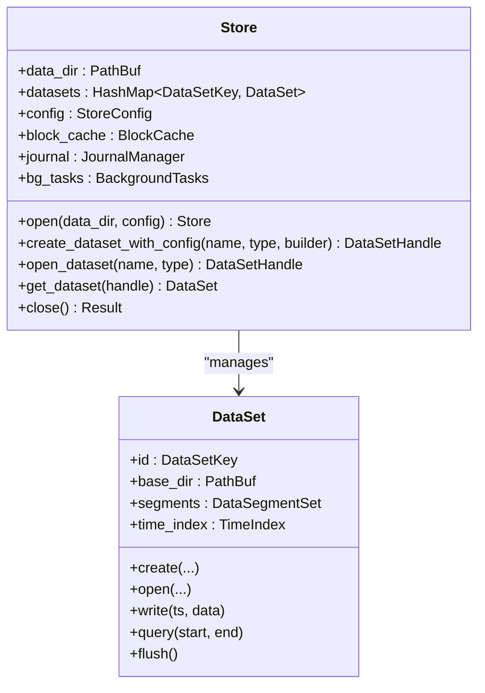
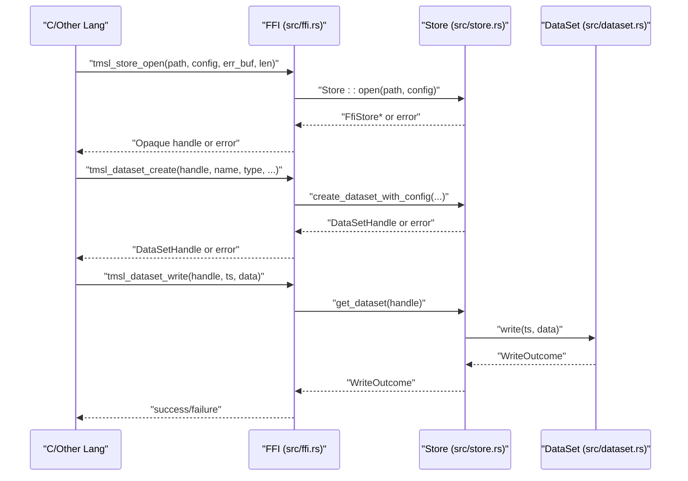
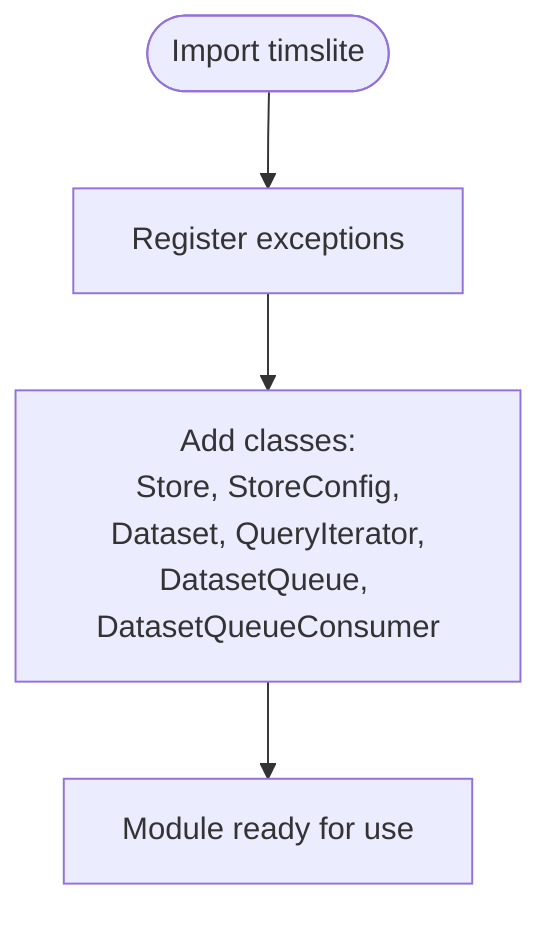
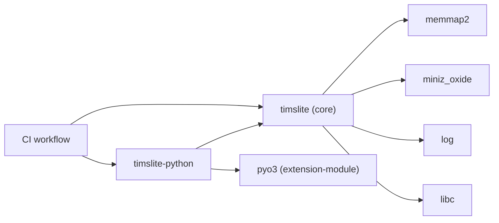
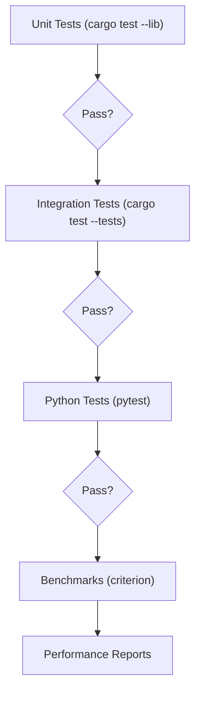

# Development Guide

<cite>
**Referenced Files in This Document**
- [Cargo.toml](file://Cargo.toml)
- [wrapper/python/Cargo.toml](file://wrapper/python/Cargo.toml)
- [wrapper/python/pyproject.toml](file://wrapper/python/pyproject.toml)
- [.github/workflows/ci.yml](file://.github/workflows/ci.yml)
- [design.md](file://design.md)
- [plan.md](file://plan.md)
- [src/lib.rs](file://src/lib.rs)
- [src/store.rs](file://src/store.rs)
- [src/dataset.rs](file://src/dataset.rs)
- [src/ffi.rs](file://src/ffi.rs)
- [wrapper/python/src/lib.rs](file://wrapper/python/src/lib.rs)
- [wrapper/python/README.md](file://wrapper/python/README.md)
- [tests/dataset_basic_test.rs](file://tests/dataset_basic_test.rs)
- [wrapper/python/tests/test_basic.py](file://wrapper/python/tests/test_basic.py)
</cite>

## Table of Contents
1. [Introduction](#introduction)
2. [Project Structure](#project-structure)
3. [Core Components](#core-components)
4. [Architecture Overview](#architecture-overview)
5. [Detailed Component Analysis](#detailed-component-analysis)
6. [Dependency Analysis](#dependency-analysis)
7. [Performance Considerations](#performance-considerations)
8. [Testing Strategy](#testing-strategy)
9. [Development Setup](#development-setup)
10. [Coding Standards and Quality Assurance](#coding-standards-and-quality-assurance)
11. [Contribution Workflow](#contribution-workflow)
12. [Debugging and Local Development](#debugging-and-local-development)
13. [Release Procedures and Version Management](#release-procedures-and-version-management)
14. [Troubleshooting Guide](#troubleshooting-guide)
15. [Conclusion](#conclusion)

## Introduction
This guide explains how to contribute to TimSLite, a high-performance time-series data storage library with a Rust core exposing a C ABI FFI interface and a Python wrapper. It covers development setup, build and dependency management, coding standards, testing, contribution workflow, debugging, and release practices. The project emphasizes correctness, performance, and cross-language interoperability.

## Project Structure
TimSLite is organized as:
- Rust core library crate exporting a cdylib for FFI
- Python wrapper crate built with PyO3 and Maturin
- Comprehensive documentation split into design and plan documents
- Unit and integration tests under the Rust crate and Python tests under the Python wrapper
- Continuous integration configured via GitHub Actions

**Diagram sources**
- [Cargo.toml:1-18](file://Cargo.toml#L1-L18)
- [src/lib.rs:1-133](file://src/lib.rs#L1-L133)
- [src/store.rs:1-200](file://src/store.rs#L1-L200)
- [src/dataset.rs:1-200](file://src/dataset.rs#L1-L200)
- [src/ffi.rs:1-200](file://src/ffi.rs#L1-L200)
- [wrapper/python/Cargo.toml:1-13](file://wrapper/python/Cargo.toml#L1-L13)
- [wrapper/python/pyproject.toml:1-22](file://wrapper/python/pyproject.toml#L1-L22)
- [wrapper/python/src/lib.rs:1-29](file://wrapper/python/src/lib.rs#L1-L29)
- [wrapper/python/README.md:1-77](file://wrapper/python/README.md#L1-L77)
- [.github/workflows/ci.yml:1-86](file://.github/workflows/ci.yml#L1-L86)
- [design.md:1-105](file://design.md#L1-L105)
- [plan.md:1-122](file://plan.md#L1-L122)

**Section sources**
- [Cargo.toml:1-18](file://Cargo.toml#L1-L18)
- [wrapper/python/Cargo.toml:1-13](file://wrapper/python/Cargo.toml#L1-L13)
- [wrapper/python/pyproject.toml:1-22](file://wrapper/python/pyproject.toml#L1-L22)
- [design.md:1-105](file://design.md#L1-L105)
- [plan.md:1-122](file://plan.md#L1-L122)

## Core Components
- Store: Top-level facade managing datasets, background tasks, caches, and journals. Supports automatic or manual background execution.
- DataSet: Encapsulates a named dataset type with explicit create/open/close lifecycle, segment sets, time index, and queue integration.
- FFI: Exposes C ABI functions for opening stores, creating/opening datasets, writing, reading, querying, and managing background tasks.
- Python wrapper: PyO3-based thin binding around the Rust API with Pythonic classes and context managers.

Key responsibilities and relationships are defined in the core modules and public re-exports.

**Section sources**
- [src/lib.rs:38-133](file://src/lib.rs#L38-L133)
- [src/store.rs:46-161](file://src/store.rs#L46-L161)
- [src/dataset.rs:71-200](file://src/dataset.rs#L71-L200)
- [src/ffi.rs:104-200](file://src/ffi.rs#L104-L200)
- [wrapper/python/src/lib.rs:14-28](file://wrapper/python/src/lib.rs#L14-L28)

## Architecture Overview
The system follows a layered architecture:
- Application code (Rust or Python) interacts with Store and DataSet APIs
- Store coordinates background tasks, caches, and journals
- DataSet manages DataSegmentSet and TimeIndex for a (name, type) pair
- FFI provides a stable C ABI for external integrations
- Python wrapper exposes idiomatic Python classes backed by the Rust core

**Diagram sources**
- [src/store.rs:46-161](file://src/store.rs#L46-L161)
- [src/dataset.rs:71-200](file://src/dataset.rs#L71-L200)
- [src/ffi.rs:104-200](file://src/ffi.rs#L104-L200)
- [wrapper/python/src/lib.rs:14-28](file://wrapper/python/src/lib.rs#L14-L28)

## Detailed Component Analysis

### Store Facade
The Store manages:
- Dataset registry keyed by (name, type)
- Background tasks (threaded or manual)
- Block cache
- Journal manager
- Directory scanning and dataset loading

**Diagram sources**
- [src/store.rs:46-161](file://src/store.rs#L46-L161)
- [src/dataset.rs:71-200](file://src/dataset.rs#L71-L200)

**Section sources**
- [src/store.rs:46-161](file://src/store.rs#L46-L161)
- [src/dataset.rs:71-200](file://src/dataset.rs#L71-L200)

### FFI Integration Flow
End-to-end flow from C ABI to Rust core and back.

**Diagram sources**
- [src/ffi.rs:104-200](file://src/ffi.rs#L104-L200)
- [src/store.rs:163-200](file://src/store.rs#L163-L200)
- [src/dataset.rs:84-160](file://src/dataset.rs#L84-L160)

**Section sources**
- [src/ffi.rs:104-200](file://src/ffi.rs#L104-L200)
- [src/store.rs:163-200](file://src/store.rs#L163-L200)
- [src/dataset.rs:84-160](file://src/dataset.rs#L84-L160)

### Python Binding Layer
The Python wrapper registers classes and exposes a Pythonic API.

**Diagram sources**
- [wrapper/python/src/lib.rs:14-28](file://wrapper/python/src/lib.rs#L14-L28)

**Section sources**
- [wrapper/python/src/lib.rs:14-28](file://wrapper/python/src/lib.rs#L14-L28)
- [wrapper/python/README.md:1-77](file://wrapper/python/README.md#L1-L77)

## Dependency Analysis
- Rust core depends on memory-mapped IO, compression, logging, and libc.
- Python wrapper depends on PyO3 extension module and the Rust core crate.
- CI enforces formatting, linting, and tests for both Rust and Python.

**Diagram sources**
- [Cargo.toml:10-17](file://Cargo.toml#L10-L17)
- [wrapper/python/Cargo.toml:10-12](file://wrapper/python/Cargo.toml#L10-L12)
- [.github/workflows/ci.yml:12-86](file://.github/workflows/ci.yml#L12-L86)

**Section sources**
- [Cargo.toml:10-17](file://Cargo.toml#L10-L17)
- [wrapper/python/Cargo.toml:10-12](file://wrapper/python/Cargo.toml#L10-L12)
- [.github/workflows/ci.yml:12-86](file://.github/workflows/ci.yml#L12-L86)

## Performance Considerations
- Block-level aggregation and delayed compression reduce I/O overhead.
- Memory-mapped IO and LRU block caching improve throughput.
- Lazy segment lifecycle and idle-close minimize resource usage.
- Continuous index mode and O(1) optimizations accelerate queries.
- Journal and queue features support real-time consumption and recovery.

[No sources needed since this section provides general guidance]

## Testing Strategy
- Unit tests: Validate core logic, constants, and module-level behavior.
- Integration tests: Exercise dataset lifecycle, persistence, block aggregation, and multi-dataset isolation.
- Python tests: Smoke tests for imports, context managers, and configuration defaults.
- Benchmarks: Criterion is configured; benchmarks directory exists for performance workloads.

**Diagram sources**
- [.github/workflows/ci.yml:40-85](file://.github/workflows/ci.yml#L40-L85)

**Section sources**
- [.github/workflows/ci.yml:40-85](file://.github/workflows/ci.yml#L40-L85)
- [tests/dataset_basic_test.rs:17-61](file://tests/dataset_basic_test.rs#L17-L61)
- [wrapper/python/tests/test_basic.py:7-58](file://wrapper/python/tests/test_basic.py#L7-L58)

## Development Setup
- Prerequisites
  - Rust toolchain (nightly recommended for development; stable for CI)
  - Maturin for building the Python package
  - Python 3.9+ for the Python wrapper
- Environment
  - Use the provided Cargo manifests to manage Rust dependencies.
  - Use the Python project manifest to configure the build backend and Python source layout.
- Build and Install
  - Rust core: build with standard cargo commands.
  - Python wrapper: use Maturin to develop or build in release mode.
- IDE and Tooling
  - Enable rust-analyzer and Python extensions.
  - Configure linters and formatters as enforced by CI.

**Section sources**
- [Cargo.toml:1-18](file://Cargo.toml#L1-L18)
- [wrapper/python/pyproject.toml:1-22](file://wrapper/python/pyproject.toml#L1-L22)
- [wrapper/python/README.md:5-10](file://wrapper/python/README.md#L5-L10)

## Coding Standards and Quality Assurance
- Formatting and Linting
  - Enforced by CI: cargo fmt -- --check and cargo clippy --all-targets -- -D warnings.
- Documentation
  - Design and plan documents provide detailed specifications and rationale.
- Error Handling
  - Centralized error types and consistent propagation across modules.
- Concurrency and Safety
  - Guarded access to shared state, careful use of Arc/Mutex/RwLock, and crash-safety considerations.

**Section sources**
- [.github/workflows/ci.yml:34-38](file://.github/workflows/ci.yml#L34-L38)
- [design.md:1-105](file://design.md#L1-L105)
- [plan.md:1-122](file://plan.md#L1-L122)

## Contribution Workflow
- Issue Reporting
  - Use repository issues to report bugs, request features, or discuss design decisions.
- Branching and Commits
  - Keep commits focused and descriptive; reference related issues in commit messages.
- Pull Requests
  - Open PRs against the default branch; ensure CI passes and tests are green.
- Code Review
  - Expect feedback on design alignment, performance, safety, and adherence to standards.
- CI Validation
  - Rust formatting, clippy strictness, unit and integration tests, and Python tests run on CI.

**Section sources**
- [.github/workflows/ci.yml:1-86](file://.github/workflows/ci.yml#L1-L86)

## Debugging and Local Development
- Rust
  - Use cargo test for targeted unit/integration tests.
  - Add logs with the log crate to trace execution paths.
  - Use debug builds locally; switch to release for performance measurements.
- Python
  - Use pytest to run Python tests; leverage the provided test suite for smoke checks.
  - Develop with Maturin in editable mode for rapid iteration.
- FFI
  - Validate opaque handle lifetimes and error buffer handling.
  - Ensure panic safety wrappers are used consistently.

**Section sources**
- [.github/workflows/ci.yml:40-85](file://.github/workflows/ci.yml#L40-L85)
- [wrapper/python/README.md:43-76](file://wrapper/python/README.md#L43-L76)

## Release Procedures and Version Management
- Versioning
  - Versions are tracked in Cargo manifests; update as part of release preparation.
- Backward Compatibility
  - FFI version constants indicate compatibility boundaries; maintain them carefully.
  - Respect semantic versioning and document breaking changes.
- Packaging
  - Publish Python package via Maturin; ensure wheel artifacts include the Rust cdylib.
- CI Artifacts
  - CI builds and tests both Rust and Python; use artifacts for distribution if needed.

**Section sources**
- [Cargo.toml:2-4](file://Cargo.toml#L2-L4)
- [wrapper/python/Cargo.toml:2-4](file://wrapper/python/Cargo.toml#L2-L4)
- [wrapper/python/pyproject.toml:6-7](file://wrapper/python/pyproject.toml#L6-L7)
- [src/ffi.rs:101-120](file://src/ffi.rs#L101-L120)

## Troubleshooting Guide
- CI Failures
  - Formatting or clippy errors: run cargo fmt and cargo clippy locally before pushing.
  - Test failures: reproduce with cargo test and cargo test --tests; for Python, run pytest in the wrapper directory.
- Python Wrapper Issues
  - Import errors: ensure the package is installed in development mode with Maturin.
  - Runtime errors: check context manager usage and handle exceptions raised by the underlying Rust code.
- FFI Stability
  - Verify FFI version compatibility and avoid changing opaque handle lifetimes.
  - Ensure error buffers are properly allocated and handled.

**Section sources**
- [.github/workflows/ci.yml:34-85](file://.github/workflows/ci.yml#L34-L85)
- [wrapper/python/tests/test_basic.py:7-58](file://wrapper/python/tests/test_basic.py#L7-L58)
- [src/ffi.rs:32-97](file://src/ffi.rs#L32-L97)

## Conclusion
This guide consolidates the essential practices for developing TimSLite. By following the setup, testing, and contribution workflows, and by leveraging the documented architecture and quality gates, contributors can efficiently implement features, maintain performance, and ensure robust cross-language interoperability.