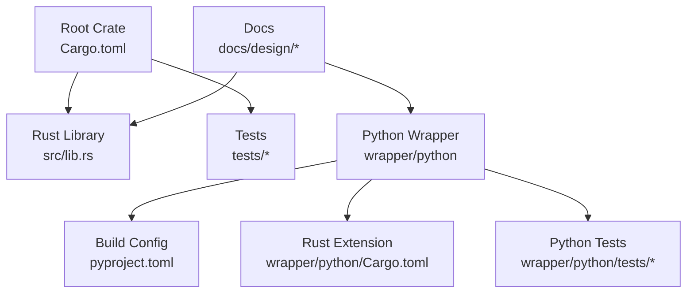
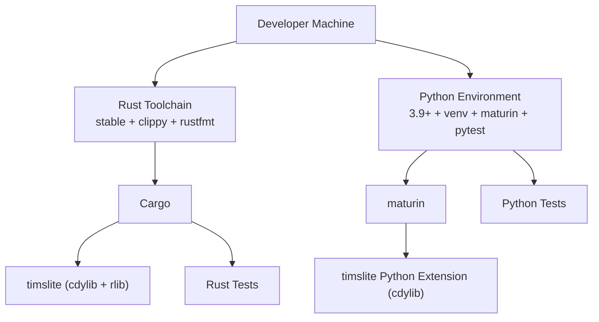
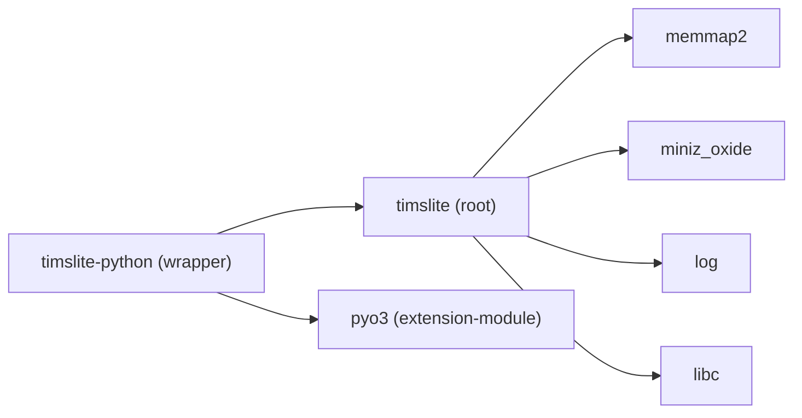

# Getting Started

<cite>
**Referenced Files in This Document**
- [Cargo.toml](file://Cargo.toml)
- [design.md](file://design.md)
- [.github/workflows/ci.yml](file://.github/workflows/ci.yml)
- [docs/design/cargo-and-config.md](file://docs/design/cargo-and-config.md)
- [wrapper/python/pyproject.toml](file://wrapper/python/pyproject.toml)
- [wrapper/python/Cargo.toml](file://wrapper/python/Cargo.toml)
- [wrapper/python/README.md](file://wrapper/python/README.md)
- [src/lib.rs](file://src/lib.rs)
- [wrapper/python/src/lib.rs](file://wrapper/python/src/lib.rs)
- [tests/dataset_basic_test.rs](file://tests/dataset_basic_test.rs)
- [wrapper/python/tests/test_basic.py](file://wrapper/python/tests/test_basic.py)
</cite>

## Table of Contents
1. [Introduction](#introduction)
2. [Project Structure](#project-structure)
3. [Core Components](#core-components)
4. [Architecture Overview](#architecture-overview)
5. [Detailed Component Analysis](#detailed-component-analysis)
6. [Dependency Analysis](#dependency-analysis)
7. [Performance Considerations](#performance-considerations)
8. [Troubleshooting Guide](#troubleshooting-guide)
9. [Conclusion](#conclusion)
10. [Appendices](#appendices)

## Introduction
This guide helps you set up a development environment for TimSLite, build from source, configure your IDE, and run quick-start examples. TimSLite is a high-performance time-series data storage library written in Rust with:
- A native Rust library exposing a C ABI FFI interface
- A Python wrapper built with PyO3 and maturin
- Memory-mapped files, block-level aggregation, delayed compression, and background tasks

You will learn:
- System requirements and toolchain versions
- How to prepare a Python virtual environment
- How to build and test the Rust core and Python wrapper
- How to verify your installation works
- Essential development commands and common troubleshooting tips

## Project Structure
TimSLite is organized into:
- Core Rust library under the root crate
- Python wrapper under wrapper/python
- Design and planning docs under docs/
- Tests under tests/ and wrapper/python/tests/

**Diagram sources**
- [Cargo.toml:1-18](file://Cargo.toml#L1-L18)
- [src/lib.rs:1-133](file://src/lib.rs#L1-L133)
- [wrapper/python/pyproject.toml:1-22](file://wrapper/python/pyproject.toml#L1-L22)
- [wrapper/python/Cargo.toml:1-13](file://wrapper/python/Cargo.toml#L1-L13)
- [wrapper/python/tests/test_basic.py:1-58](file://wrapper/python/tests/test_basic.py#L1-L58)

**Section sources**
- [Cargo.toml:1-18](file://Cargo.toml#L1-L18)
- [design.md:1-105](file://design.md#L1-L105)

## Core Components
- Rust core library exports public APIs for Store, DataSet, queues, and FFI-compatible constants. It also exposes background task tick results and query iterators.
- Python wrapper builds a cdylib extension using PyO3 and registers Python classes for Store, Dataset, QueryIterator, and Queue types.

What you will use most during development:
- Build and test the Rust library
- Build and test the Python wrapper
- Run quick-start examples to verify installation

**Section sources**
- [src/lib.rs:38-133](file://src/lib.rs#L38-L133)
- [wrapper/python/src/lib.rs:1-29](file://wrapper/python/src/lib.rs#L1-L29)

## Architecture Overview
The development stack consists of:
- Rust toolchain with stable channel and optional clippy/rustfmt components
- Python 3.9+ with maturin for building the extension
- Cargo for Rust builds and tests
- pytest for Python tests

**Diagram sources**
- [.github/workflows/ci.yml:19-21](file://.github/workflows/ci.yml#L19-L21)
- [docs/design/cargo-and-config.md:35-53](file://docs/design/cargo-and-config.md#L35-L53)
- [wrapper/python/pyproject.toml:1-22](file://wrapper/python/pyproject.toml#L1-L22)
- [wrapper/python/Cargo.toml:10-12](file://wrapper/python/Cargo.toml#L10-L12)

## Detailed Component Analysis

### System Requirements
- Rust toolchain
  - Stable channel
  - Optional components: clippy, rustfmt
- Python environment
  - Python 3.9 or newer
  - maturin for building the extension
  - pytest for running Python tests
- Platform-specific notes
  - Building produces a cdylib suitable for cross-platform consumption
  - The Python wrapper targets a shared library artifact appropriate for your OS

Verification references:
- CI workflow installs the stable toolchain and checks formatting and lints
- Python wrapper requires Python >= 3.9 and uses maturin as the build backend

**Section sources**
- [.github/workflows/ci.yml:19-21](file://.github/workflows/ci.yml#L19-L21)
- [wrapper/python/pyproject.toml:10](file://wrapper/python/pyproject.toml#L10)
- [docs/design/cargo-and-config.md:35-53](file://docs/design/cargo-and-config.md#L35-L53)

### Step-by-Step Installation

#### 1) Install Rust toolchain
- Use your preferred installer to install the Rust stable toolchain
- Ensure clippy and rustfmt components are available

Reference:
- CI workflow uses the stable toolchain with clippy and rustfmt

**Section sources**
- [.github/workflows/ci.yml:19-21](file://.github/workflows/ci.yml#L19-L21)

#### 2) Prepare Python environment
- Create a virtual environment with Python 3.9+
- Install maturin and pytest inside the venv

Reference:
- Python wrapper pyproject.toml declares requires-python >= 3.9
- CI workflow demonstrates installing maturin and pytest in a venv

**Section sources**
- [wrapper/python/pyproject.toml:10](file://wrapper/python/pyproject.toml#L10)
- [.github/workflows/ci.yml:73-77](file://.github/workflows/ci.yml#L73-L77)

#### 3) Build the Rust core
- Build debug or release
- Run formatting and clippy checks

Reference:
- Cargo commands for build, test, clippy, and fmt are documented in design docs

**Section sources**
- [docs/design/cargo-and-config.md:35-53](file://docs/design/cargo-and-config.md#L35-L53)

#### 4) Build the Python wrapper
- From wrapper/python, run maturin develop (or develop --release for release mode)

Reference:
- Python wrapper README shows maturin develop usage

**Section sources**
- [wrapper/python/README.md:7-10](file://wrapper/python/README.md#L7-L10)

#### 5) Run quick-start examples
- Rust: run a subset of tests to verify the core library
- Python: run pytest on the wrapper tests

References:
- Rust integration test demonstrates typical dataset lifecycle
- Python smoke tests verify imports and basic Store operations

**Section sources**
- [tests/dataset_basic_test.rs:17-61](file://tests/dataset_basic_test.rs#L17-L61)
- [wrapper/python/tests/test_basic.py:24-33](file://wrapper/python/tests/test_basic.py#L24-L33)

### IDE Setup Tips
- Rust
  - Enable rust-analyzer or IntelliJ Rust
  - Configure clippy and rustfmt as pre-commit checks
- Python
  - Point your IDE to the Python venv created earlier
  - Use pytest integration to run tests from the wrapper/python directory

[No sources needed since this section provides general guidance]

### Quick Start Examples

#### Rust: Basic dataset lifecycle
- Open a Store
- Create a dataset
- Write records
- Query records
- Close the Store

Reference:
- Integration test shows a complete lifecycle and query verification

**Section sources**
- [tests/dataset_basic_test.rs:17-61](file://tests/dataset_basic_test.rs#L17-L61)

#### Python: Import and basic usage
- Import the module
- Open a Store
- Create and use a Dataset
- Read latest timestamp and iterate over a range
- Close the Store

Reference:
- Python README shows typical usage patterns

**Section sources**
- [wrapper/python/README.md:14-41](file://wrapper/python/README.md#L14-L41)

#### Python: Manual background tasks
- Disable automatic background thread
- Periodically call tick_background_tasks()

Reference:
- Python README shows manual background task usage

**Section sources**
- [wrapper/python/README.md:43-76](file://wrapper/python/README.md#L43-L76)

### Essential Development Commands
- Build Rust core (debug)
- Build Rust core (release)
- Run Rust tests
- Run Rust clippy
- Check formatting
- Build Python wrapper (development)
- Build Python wrapper (release)
- Run Python tests

References:
- Cargo commands and CI matrix

**Section sources**
- [docs/design/cargo-and-config.md:35-53](file://docs/design/cargo-and-config.md#L35-L53)
- [.github/workflows/ci.yml:34-44](file://.github/workflows/ci.yml#L34-L44)
- [.github/workflows/ci.yml:79-85](file://.github/workflows/ci.yml#L79-L85)

## Dependency Analysis
The build-time dependencies are declared in Cargo.toml and the Python wrapper’s Cargo.toml. The Python wrapper depends on the root crate and PyO3.

**Diagram sources**
- [Cargo.toml:10-14](file://Cargo.toml#L10-L14)
- [wrapper/python/Cargo.toml:10-12](file://wrapper/python/Cargo.toml#L10-L12)

**Section sources**
- [Cargo.toml:10-18](file://Cargo.toml#L10-L18)
- [wrapper/python/Cargo.toml:10-12](file://wrapper/python/Cargo.toml#L10-L12)

## Performance Considerations
- Use release builds for performance-sensitive workloads
- Keep clippy and formatting checks enabled to maintain code quality
- Prefer batch writes and leverage background tasks for maintenance operations

[No sources needed since this section provides general guidance]

## Troubleshooting Guide
Common issues and resolutions:
- Python import fails
  - Ensure maturin develop was run in wrapper/python and the venv is activated
  - Confirm Python version meets the minimum requirement
- Rust formatting or lint errors
  - Run cargo fmt and cargo clippy locally before committing
- Tests fail due to concurrency
  - Some tests enforce single-threaded execution; run with the recommended flags

References:
- CI workflow enforces formatting, clippy strictness, and single-threaded tests
- Python wrapper README shows maturin develop usage

**Section sources**
- [.github/workflows/ci.yml:34-44](file://.github/workflows/ci.yml#L34-L44)
- [wrapper/python/README.md:7-10](file://wrapper/python/README.md#L7-L10)

## Conclusion
You now have the essentials to build TimSLite from source, set up a Python development environment, and run quick-start examples. Use the referenced commands and references to continue exploring the Rust core and Python wrapper.

[No sources needed since this section summarizes without analyzing specific files]

## Appendices

### Appendix A: Build Targets and Outputs
- Rust core
  - cdylib + rlib outputs suitable for FFI consumption
- Python wrapper
  - cdylib extension built via maturin

References:
- Root Cargo.toml lib crate-type
- Python wrapper Cargo.toml lib crate-type

**Section sources**
- [Cargo.toml:6-8](file://Cargo.toml#L6-L8)
- [wrapper/python/Cargo.toml:6-8](file://wrapper/python/Cargo.toml#L6-L8)

### Appendix B: Design References
- High-level design and module breakdown are documented in design.md
- Build and configuration details are in docs/design/cargo-and-config.md

**Section sources**
- [design.md:1-105](file://design.md#L1-L105)
- [docs/design/cargo-and-config.md:1-84](file://docs/design/cargo-and-config.md#L1-L84)