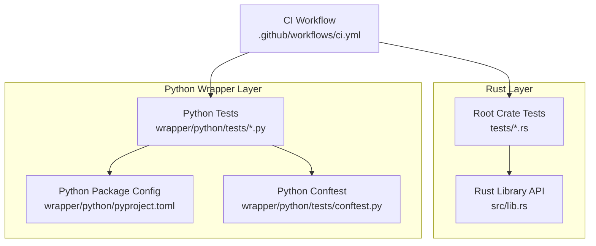
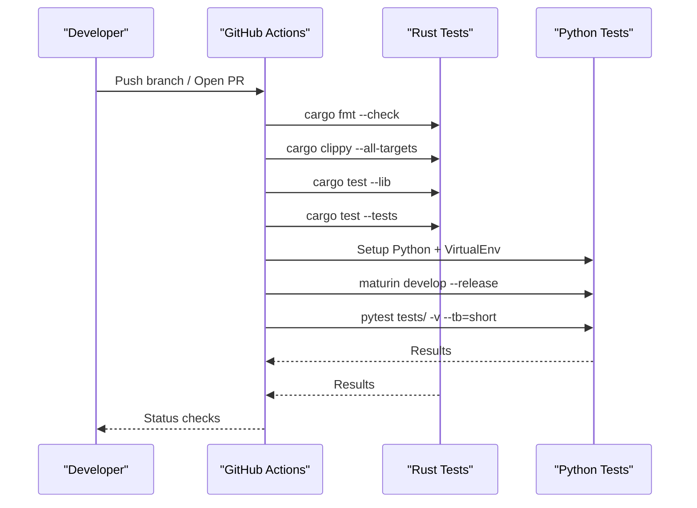
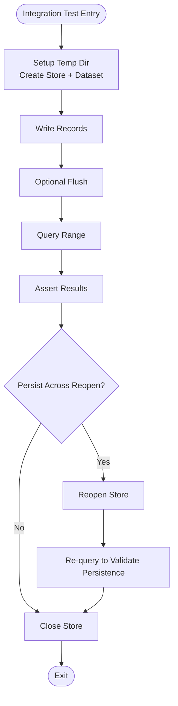
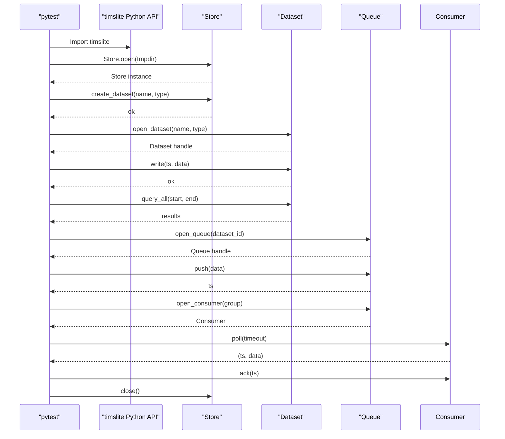
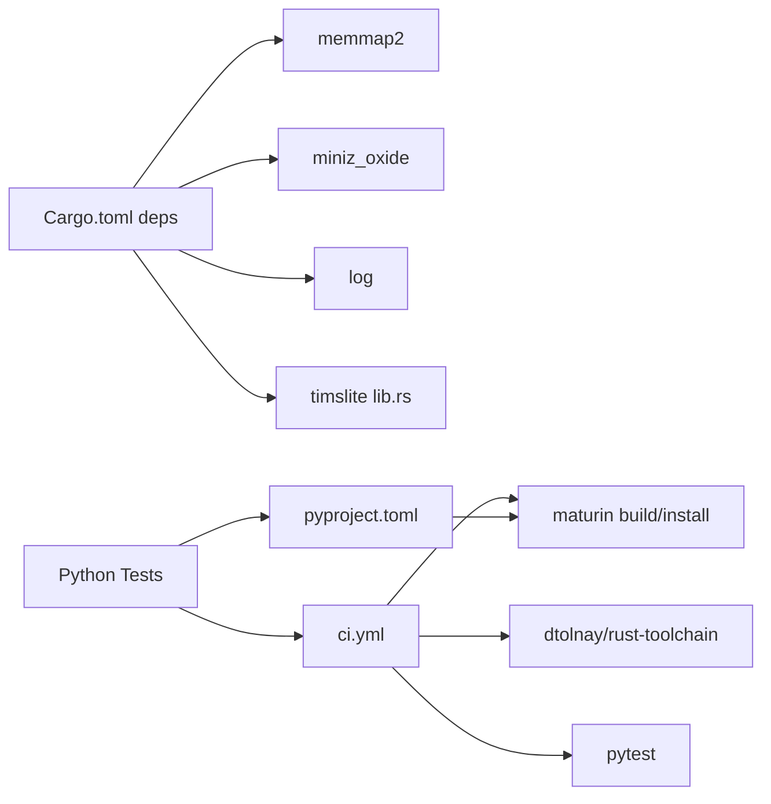

# Testing Strategy

<cite>
**Referenced Files in This Document**
- [Cargo.toml](file://Cargo.toml)
- [.github/workflows/ci.yml](file://.github/workflows/ci.yml)
- [src/lib.rs](file://src/lib.rs)
- [tests/dataset_basic_test.rs](file://tests/dataset_basic_test.rs)
- [tests/query_test.rs](file://tests/query_test.rs)
- [tests/background_test.rs](file://tests/background_test.rs)
- [tests/journal_test.rs](file://tests/journal_test.rs)
- [wrapper/python/pyproject.toml](file://wrapper/python/pyproject.toml)
- [wrapper/python/tests/conftest.py](file://wrapper/python/tests/conftest.py)
- [wrapper/python/tests/test_basic.py](file://wrapper/python/tests/test_basic.py)
- [wrapper/python/tests/test_write_query.py](file://wrapper/python/tests/test_write_query.py)
- [wrapper/python/tests/test_lifecycle.py](file://wrapper/python/tests/test_lifecycle.py)
- [wrapper/python/tests/test_queue.py](file://wrapper/python/tests/test_queue.py)
- [wrapper/python/tests/test_exceptions.py](file://wrapper/python/tests/test_exceptions.py)
</cite>

## Table of Contents
1. [Introduction](#introduction)
2. [Project Structure](#project-structure)
3. [Core Components](#core-components)
4. [Architecture Overview](#architecture-overview)
5. [Detailed Component Analysis](#detailed-component-analysis)
6. [Dependency Analysis](#dependency-analysis)
7. [Performance Considerations](#performance-considerations)
8. [Troubleshooting Guide](#troubleshooting-guide)
9. [Conclusion](#conclusion)
10. [Appendices](#appendices)

## Introduction
This document defines the comprehensive testing strategy for TimSLite, covering unit tests, integration tests, and performance benchmarks. It explains the testing frameworks used (Rust tests and Python pytest), test organization and naming conventions, performance testing methodologies, benchmarking procedures, regression testing strategies, coverage requirements, continuous integration testing, local testing workflows, guidelines for writing effective tests, mocking strategies, test data management, debugging techniques, test isolation, and common pitfalls in concurrent and memory-mapped environments.

## Project Structure
TimSLite’s testing is organized across two primary layers:
- Rust unit and integration tests under the root crate, validating core store, dataset, queue, journal, and background tasks.
- Python wrapper tests under the Python package, validating the FFI-exposed API surface and end-to-end behaviors.

Key characteristics:
- Rust tests are grouped by functional area (e.g., dataset lifecycle, query, background tasks, journal).
- Python tests mirror Rust behaviors and exercise the public API exposed to Python via the FFI wrapper.
- Continuous Integration (CI) runs Rust formatting, linting, unit tests, integration tests, and Python tests across multiple Python versions.

**Diagram sources**
- [.github/workflows/ci.yml:1-86](file://.github/workflows/ci.yml#L1-L86)
- [src/lib.rs:1-133](file://src/lib.rs#L1-L133)
- [wrapper/python/pyproject.toml:1-22](file://wrapper/python/pyproject.toml#L1-L22)
- [wrapper/python/tests/conftest.py:1-32](file://wrapper/python/tests/conftest.py#L1-L32)

**Section sources**
- [.github/workflows/ci.yml:1-86](file://.github/workflows/ci.yml#L1-L86)
- [src/lib.rs:1-133](file://src/lib.rs#L1-L133)

## Core Components
- Rust unit/integration tests validate:
  - Store lifecycle, dataset creation/open/close, write/query, persistence, flush behavior, and background task scheduling.
  - Query iterators and edge cases (empty ranges, backward compatibility).
  - Journal behavior (defaults, enable/disable, reopen persistence, read-only constraints).
  - Queue module semantics (push/poll/ack, consumer groups, concurrency, persistence).
- Python tests validate:
  - Import and basic API usage, context manager behavior, default and custom configuration.
  - Write/query patterns, iterator protocol, partial consumption, error handling, and exception hierarchy.
  - Lifecycle operations (create/open/close/drop), error propagation, and queue operations.

Test organization and naming conventions:
- Rust tests use descriptive prefixes indicating feature areas (e.g., t8_1_* for dataset lifecycle, t13_* for query).
- Python tests use class-based suites (TestBasic, TestLifecycle, TestWriteQuery, TestQueue, TestExceptions) and method names that describe behavior.

**Section sources**
- [tests/dataset_basic_test.rs:1-286](file://tests/dataset_basic_test.rs#L1-L286)
- [tests/query_test.rs:1-110](file://tests/query_test.rs#L1-L110)
- [tests/background_test.rs:1-122](file://tests/background_test.rs#L1-L122)
- [tests/journal_test.rs:1-206](file://tests/journal_test.rs#L1-L206)
- [wrapper/python/tests/test_basic.py:1-58](file://wrapper/python/tests/test_basic.py#L1-L58)
- [wrapper/python/tests/test_write_query.py:1-128](file://wrapper/python/tests/test_write_query.py#L1-L128)
- [wrapper/python/tests/test_lifecycle.py:1-50](file://wrapper/python/tests/test_lifecycle.py#L1-L50)
- [wrapper/python/tests/test_queue.py:1-268](file://wrapper/python/tests/test_queue.py#L1-L268)
- [wrapper/python/tests/test_exceptions.py:1-52](file://wrapper/python/tests/test_exceptions.py#L1-L52)

## Architecture Overview
The testing architecture ensures layered validation:
- Rust tests validate low-level APIs, concurrency, and memory-mapped behavior.
- Python tests validate high-level behaviors and FFI boundaries.
- CI enforces formatting, strict linting, and runs both Rust and Python test suites.

**Diagram sources**
- [.github/workflows/ci.yml:1-86](file://.github/workflows/ci.yml#L1-L86)

**Section sources**
- [.github/workflows/ci.yml:1-86](file://.github/workflows/ci.yml#L1-L86)

## Detailed Component Analysis

### Rust Unit and Integration Tests
- Dataset lifecycle and persistence:
  - Validates create/open/close, multi-dataset isolation, facade read/write/query, block aggregation, persistence across reopen, and flush behavior without sealing.
- Query behavior:
  - Iterators, small-range queries, backward compatibility (ts_start > ts_end), and empty ranges.
- Background tasks:
  - Manual tick lifecycle, next-delay consistency, and concurrent manual tick with background thread.
- Journal:
  - Defaults, enable/disable, public handle restrictions, reopen persistence, and record kinds for create/drop/open/close.

**Diagram sources**
- [tests/dataset_basic_test.rs:17-61](file://tests/dataset_basic_test.rs#L17-L61)
- [tests/query_test.rs:17-52](file://tests/query_test.rs#L17-L52)

**Section sources**
- [tests/dataset_basic_test.rs:1-286](file://tests/dataset_basic_test.rs#L1-L286)
- [tests/query_test.rs:1-110](file://tests/query_test.rs#L1-L110)
- [tests/background_test.rs:1-122](file://tests/background_test.rs#L1-L122)
- [tests/journal_test.rs:1-206](file://tests/journal_test.rs#L1-L206)

### Python Wrapper Tests
- Basic API:
  - Import validation, context manager behavior, default and custom StoreConfig values.
- Lifecycle:
  - Create/open/write/close, duplicate create raises, open nonexistent raises, drop and recreate, operations on closed store raise.
- Write and query:
  - Single write/query, append semantics, range queries, empty range, iterator protocol, partial consumption, invalid timestamps rejected, out-of-order writes, manual flush.
- Exceptions:
  - All exception classes importable, hierarchy, catching specific exceptions, and meaningful messages.
- Queue:
  - Push/poll/ack, multiple pushes, timeouts, various payloads, independent progress, shared progress, errors (open twice, push to closed, poll after close, ack nonexistent, open consumer after close), persistence of pending entries, drop and recreate consumer, concurrency via clones.

**Diagram sources**
- [wrapper/python/tests/test_basic.py:7-28](file://wrapper/python/tests/test_basic.py#L7-L28)
- [wrapper/python/tests/test_write_query.py:7-128](file://wrapper/python/tests/test_write_query.py#L7-L128)
- [wrapper/python/tests/test_queue.py:7-268](file://wrapper/python/tests/test_queue.py#L7-L268)

**Section sources**
- [wrapper/python/tests/test_basic.py:1-58](file://wrapper/python/tests/test_basic.py#L1-L58)
- [wrapper/python/tests/test_lifecycle.py:1-50](file://wrapper/python/tests/test_lifecycle.py#L1-L50)
- [wrapper/python/tests/test_write_query.py:1-128](file://wrapper/python/tests/test_write_query.py#L1-L128)
- [wrapper/python/tests/test_exceptions.py:1-52](file://wrapper/python/tests/test_exceptions.py#L1-L52)
- [wrapper/python/tests/test_queue.py:1-268](file://wrapper/python/tests/test_queue.py#L1-L268)

## Dependency Analysis
- Rust crate dependencies include memory-mapped files and compression libraries, which inform testing strategies around mmap-backed files and compression/decompression paths.
- CI depends on Rust toolchain, maturin for building the Python extension, and pytest for Python tests.
- Python tests rely on the built extension installed in development mode.

**Diagram sources**
- [Cargo.toml:10-17](file://Cargo.toml#L10-L17)
- [src/lib.rs:39-57](file://src/lib.rs#L39-L57)
- [.github/workflows/ci.yml:19-85](file://.github/workflows/ci.yml#L19-L85)
- [wrapper/python/pyproject.toml:1-22](file://wrapper/python/pyproject.toml#L1-L22)

**Section sources**
- [Cargo.toml:1-18](file://Cargo.toml#L1-L18)
- [src/lib.rs:39-57](file://src/lib.rs#L39-L57)
- [.github/workflows/ci.yml:1-86](file://.github/workflows/ci.yml#L1-L86)
- [wrapper/python/pyproject.toml:1-22](file://wrapper/python/pyproject.toml#L1-L22)

## Performance Considerations
- Benchmarking framework:
  - Criterion is declared as a dev dependency, enabling formal benchmark suites. Benchmarks should be placed under the benches directory and executed via cargo bench to produce statistical summaries and HTML reports.
- Benchmarking procedures:
  - Isolate memory-mapped I/O by using temporary directories per benchmark iteration.
  - Measure write/query throughput with varying payload sizes and block aggregation thresholds.
  - Compare manual vs. background flush strategies and journal-enabled vs. disabled modes.
- Regression testing:
  - Track performance baselines per benchmark and alert on regressions in CI by comparing recent runs or using external reporting.
- Local workflows:
  - Run benchmarks locally with cargo bench and review generated reports before committing performance-sensitive changes.

[No sources needed since this section provides general guidance]

## Troubleshooting Guide
- Temporary directory cleanup on Windows:
  - The Python conftest fixture implements a robust retry-and-force-remove strategy to handle mmap-backed files held by background threads, preventing persistent test pollution.
- Test isolation:
  - Use per-test temporary directories and deterministic dataset names to avoid cross-test interference.
- Concurrency and background tasks:
  - Disable background threads during manual tick tests to ensure deterministic timing.
  - Avoid simultaneous manual tick and background thread execution to prevent race conditions; when enabled, verify task counts remain bounded.
- Memory-mapped environments:
  - Ensure proper closing of stores and queues to release mmap regions before deleting directories.
  - On Windows, expect delayed cleanup; use the provided fixture to mitigate flakiness.
- Error handling:
  - Validate exception hierarchies and messages in Python tests to confirm correct propagation of Rust-side errors.
  - Confirm that reopen preserves journal entries and that read-only journal handles reject append operations.

**Section sources**
- [wrapper/python/tests/conftest.py:1-32](file://wrapper/python/tests/conftest.py#L1-L32)
- [tests/background_test.rs:82-121](file://tests/background_test.rs#L82-L121)
- [tests/journal_test.rs:190-205](file://tests/journal_test.rs#L190-L205)

## Conclusion
TimSLite’s testing strategy combines rigorous Rust unit and integration tests with comprehensive Python wrapper tests, enforced by CI. The approach emphasizes correctness, isolation, and resilience in concurrent and memory-mapped environments. By adopting Criterion for performance benchmarks, maintaining strict naming conventions, and leveraging CI for regression detection, the project sustains quality across feature additions and platform differences.

[No sources needed since this section summarizes without analyzing specific files]

## Appendices

### Test Organization and Naming Conventions
- Rust tests:
  - Prefixes indicate feature areas (e.g., t8_1_* for dataset lifecycle, t13_* for query, t21_* for background tasks, t28_* for journal).
  - Each test file focuses on a functional domain and uses descriptive function names.
- Python tests:
  - Class-based suites (TestBasic, TestLifecycle, TestWriteQuery, TestQueue, TestExceptions) organize related behaviors.
  - Method names describe specific scenarios (e.g., single_write_query, push_poll_ack, invalid_data_error).

**Section sources**
- [tests/dataset_basic_test.rs:1-286](file://tests/dataset_basic_test.rs#L1-L286)
- [tests/query_test.rs:1-110](file://tests/query_test.rs#L1-L110)
- [tests/background_test.rs:1-122](file://tests/background_test.rs#L1-L122)
- [tests/journal_test.rs:1-206](file://tests/journal_test.rs#L1-L206)
- [wrapper/python/tests/test_basic.py:1-58](file://wrapper/python/tests/test_basic.py#L1-L58)
- [wrapper/python/tests/test_write_query.py:1-128](file://wrapper/python/tests/test_write_query.py#L1-L128)
- [wrapper/python/tests/test_lifecycle.py:1-50](file://wrapper/python/tests/test_lifecycle.py#L1-L50)
- [wrapper/python/tests/test_queue.py:1-268](file://wrapper/python/tests/test_queue.py#L1-L268)
- [wrapper/python/tests/test_exceptions.py:1-52](file://wrapper/python/tests/test_exceptions.py#L1-L52)

### Continuous Integration Testing
- Rust jobs:
  - Formatting check, clippy linting, unit tests (--lib), integration tests (--tests), with test threads set to 1 for determinism.
- Python jobs:
  - Matrix across Python versions, virtualenv creation, maturin installation, development build, and pytest execution.

**Section sources**
- [.github/workflows/ci.yml:13-85](file://.github/workflows/ci.yml#L13-L85)

### Local Testing Workflows
- Rust:
  - cargo fmt --check, cargo clippy --all-targets, cargo test --lib, cargo test --tests.
- Python:
  - Create virtualenv, install maturin and pytest, run maturin develop --release, then python -m pytest tests/.

**Section sources**
- [.github/workflows/ci.yml:34-85](file://.github/workflows/ci.yml#L34-L85)

### Guidelines for Writing Effective Tests
- Isolation:
  - Use temporary directories per test; avoid global state.
- Determinism:
  - Disable background threads for manual tick tests; set explicit flush intervals when timing is critical.
- Coverage:
  - Include edge cases (empty ranges, invalid timestamps, out-of-order writes, reopen persistence).
- Mocking:
  - Prefer real memory-mapped files to validate mmap behavior; mock only where necessary (e.g., simulated delays).
- Assertions:
  - Validate both presence and content of results; compare iterator and convenience-method outputs.

[No sources needed since this section provides general guidance]