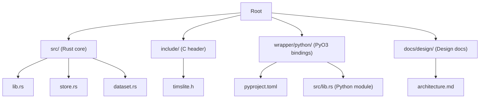
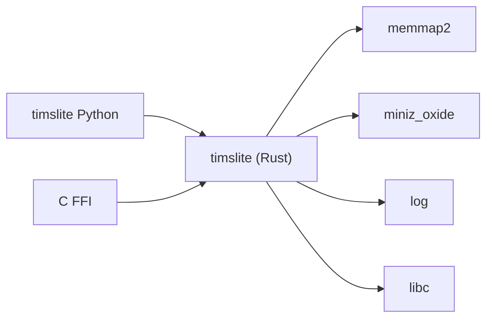

# Getting Started

<cite>
**Referenced Files in This Document**
- [Cargo.toml](file://Cargo.toml)
- [README.md](file://README.md)
- [include/timslite.h](file://include/timslite.h)
- [src/lib.rs](file://src/lib.rs)
- [src/store.rs](file://src/store.rs)
- [src/dataset.rs](file://src/dataset.rs)
- [wrapper/python/README.md](file://wrapper/python/README.md)
- [wrapper/python/pyproject.toml](file://wrapper/python/pyproject.toml)
- [wrapper/python/src/lib.rs](file://wrapper/python/src/lib.rs)
- [wrapper/python/tests/test_basic.py](file://wrapper/python/tests/test_basic.py)
- [docs/design/architecture.md](file://docs/design/architecture.md)
- [docs/design/cargo-and-config.md](file://docs/design/cargo-and-config.md)
</cite>

## Table of Contents
1. [Introduction](#introduction)
2. [Project Structure](#project-structure)
3. [Core Components](#core-components)
4. [Architecture Overview](#architecture-overview)
5. [Detailed Component Analysis](#detailed-component-analysis)
6. [Dependency Analysis](#dependency-analysis)
7. [Performance Considerations](#performance-considerations)
8. [Troubleshooting Guide](#troubleshooting-guide)
9. [Conclusion](#conclusion)
10. [Appendices](#appendices)

## Introduction
TimSLite is a high-performance, mmap-backed time-series data store designed for low-latency writes and efficient range queries. It exposes a C ABI FFI interface for cross-language interoperability and provides a Python binding built with PyO3 and maturin. The system organizes data by dataset name and type, with explicit lifecycle management (create/open/write/query/close/drop), lazy segment lifecycle, block-level aggregation with delayed compression, and optional continuous indexing for sparse logical gaps.

This guide helps you install and run TimSLite across supported platforms and languages, then quickly create stores, datasets, and perform basic read/write operations. It also covers common setup patterns, environment configuration, and verification steps.

## Project Structure
TimSLite is organized into:
- Core Rust library with FFI exports and C header
- Python wrapper with PyO3 bindings and tests
- Design and planning documentation



**Diagram sources**
- [docs/design/architecture.md:1-133](file://docs/design/architecture.md#L1-L133)
- [src/lib.rs:1-133](file://src/lib.rs#L1-L133)
- [include/timslite.h:1-358](file://include/timslite.h#L1-L358)
- [wrapper/python/pyproject.toml:1-22](file://wrapper/python/pyproject.toml#L1-L22)
- [wrapper/python/src/lib.rs:1-29](file://wrapper/python/src/lib.rs#L1-L29)

**Section sources**
- [docs/design/architecture.md:1-133](file://docs/design/architecture.md#L1-L133)
- [src/lib.rs:1-133](file://src/lib.rs#L1-L133)

## Core Components
- Store: Top-level facade managing datasets, background tasks, and caches. It validates dataset names/types, scans existing datasets, and orchestrates background operations.
- DataSet: Encapsulates a dataset’s data and index segments, with lifecycle methods (create/open/close/drop), write/read/query operations, and optional queue subsystem.
- FFI/C API: Exposes extern "C" functions for store and dataset operations, plus iterators and background task control.
- Python Binding: Thin PyO3 wrapper exposing Store, StoreConfig, Dataset, QueryIterator, and queue classes with Pythonic semantics.

Key capabilities:
- Create/open/drop datasets with immutable parameters stored in meta files
- Write, append, read, delete, and range query records
- Optional continuous indexing for sparse logical gaps
- Background tasks (flush, idle-close, cache eviction, retention reclaim)
- Queue subsystem for producer/consumer semantics

**Section sources**
- [src/store.rs:45-161](file://src/store.rs#L45-L161)
- [src/dataset.rs:71-220](file://src/dataset.rs#L71-L220)
- [include/timslite.h:53-351](file://include/timslite.h#L53-L351)
- [wrapper/python/src/lib.rs:14-28](file://wrapper/python/src/lib.rs#L14-L28)

## Architecture Overview
TimSLite’s architecture centers on a store directory containing named/type subdirectories, each with a meta file and separate data/index directories. The store manages datasets, background tasks, and caches. The FFI layer provides C-compatible APIs for external consumers.

```mermaid
graph TB
subgraph "Store Directory"
N1["{dataset_name}/"]
N2["{dataset_type}/"]
N1 --> N2
N2 --> N2a["meta"]
N2 --> N2b["data/"]
N2 --> N2c["index/"]
end
subgraph "Store"
S1["Store"]
S2["DataSet"]
S3["BackgroundTasks"]
S4["BlockCache"]
end
subgraph "FFI"
F1["C API (extern \"C\")"]
end
subgraph "Python"
P1["PyO3 Module"]
end
S1 --> S2
S1 --> S3
S1 --> S4
S2 --> N2b
S2 --> N2c
F1 --> S1
F1 --> S2
P1 --> F1
```

**Diagram sources**
- [docs/design/architecture.md:28-83](file://docs/design/architecture.md#L28-L83)
- [src/store.rs:46-56](file://src/store.rs#L46-L56)
- [include/timslite.h:53-351](file://include/timslite.h#L53-L351)
- [wrapper/python/src/lib.rs:14-28](file://wrapper/python/src/lib.rs#L14-L28)

## Detailed Component Analysis

### Installation and Environment Setup

- Supported platforms and languages
  - Rust: Build the dynamic library and link against it in your Rust project
  - C: Use the provided C header and FFI functions
  - Python: Install via pip from a prebuilt wheel or build locally with maturin

- System requirements and dependencies
  - Rust toolchain (edition 2021)
  - memmap2, miniz_oxide, log, libc (Rust dependencies)
  - Python 3.9+ (for Python wrapper)
  - maturin (for building the Python package)

- Environment setup
  - Rust: Install rustup and use the stable toolchain
  - Python: Install Python 3.9+ and pip; optionally use a virtual environment
  - Build the Rust library (dynamic library) and ensure the C header is available

- Platform-specific notes
  - Linux/macOS/Windows: The Rust library builds to platform-appropriate shared libraries (.so/.dylib/.dll)
  - Python wheels are built for multiple platforms in CI (Ubuntu, macOS, Windows)

**Section sources**
- [Cargo.toml:10-14](file://Cargo.toml#L10-L14)
- [docs/design/cargo-and-config.md:63-84](file://docs/design/cargo-and-config.md#L63-L84)
- [wrapper/python/pyproject.toml:10](file://wrapper/python/pyproject.toml#L10)

### Quick Start: Rust

- Steps
  1. Add the dependency to your Rust project
  2. Open a store with a data directory and configuration
  3. Create a dataset with desired parameters
  4. Open the dataset and write records
  5. Query records in a time range
  6. Close the store to flush and release resources

- Practical guidance
  - Use StoreConfig builder to set flush interval, idle timeout, segment sizes, compression level, and retention
  - Create datasets with immutable parameters written to meta; open datasets read parameters from meta
  - Use background tasks or manually tick when configured without a background thread

- Verification
  - Confirm store opens without error
  - Verify dataset creation and opening succeed
  - Write and query records; confirm expected results
  - Close store and ensure no errors

**Section sources**
- [README.md:86-141](file://README.md#L86-L141)
- [src/store.rs:58-161](file://src/store.rs#L58-L161)
- [src/dataset.rs:84-220](file://src/dataset.rs#L84-L220)

### Quick Start: C

- Steps
  1. Include the C header
  2. Open a store at a data directory
  3. Create a dataset with segment sizes, compression level, and retention
  4. Write records and read single records or iterate over ranges
  5. Close the dataset and store

- Practical guidance
  - Use tmsl_store_config_default to initialize defaults
  - Use tmsl_dataset_create_with_config for explicit parameters and initial sizes
  - Memory ownership: tmsl_dataset_read and tmsl_iter_next allocate data; free with tmsl_data_free/tmsl_iter_free_data
  - Background tasks: call tmsl_store_tick_background_tasks or tmsl_store_next_background_delay when not using the background thread

- Verification
  - Confirm store and dataset handles are non-null
  - Write and query records; iterate and free buffers properly
  - Close handles and verify no errors

**Section sources**
- [include/timslite.h:24-351](file://include/timslite.h#L24-L351)
- [README.md:143-186](file://README.md#L143-L186)

### Quick Start: Python

- Steps
  1. Install the Python package (pip install timslite) or build locally with maturin develop
  2. Import timslite and open a store with a data directory
  3. Create a dataset and open it
  4. Write records and read single records or iterate over ranges
  5. Optionally manage background tasks manually
  6. Close the store

- Practical guidance
  - Use StoreConfig to customize behavior; default values are reasonable for most workloads
  - Use context manager (with statement) to ensure proper closing
  - Manual background tasks: call tick_background_tasks() periodically and next_background_delay() to schedule work

- Verification
  - Import succeeds and classes are accessible
  - Store opens and closes without error
  - Dataset creation and opening succeed
  - Write and query produce expected results
  - Manual background tasks can be ticked and queried

**Section sources**
- [wrapper/python/README.md:1-77](file://wrapper/python/README.md#L1-L77)
- [wrapper/python/tests/test_basic.py:7-58](file://wrapper/python/tests/test_basic.py#L7-L58)
- [wrapper/python/pyproject.toml:10](file://wrapper/python/pyproject.toml#L10)

### Basic Concepts

- Store initialization
  - Open a store at a writable data directory
  - Configure background tasks, caching, and retention
  - Optionally disable the background thread and tick manually

- Dataset creation
  - Create a dataset with immutable parameters (data/index segment sizes, compression level, retention window)
  - Parameters are written to meta and cannot be changed later
  - Open datasets by name and type; parameters are read from meta

- Simple read/write operations
  - Write records with positive timestamps
  - Read single records by exact timestamp or latest (-1)
  - Append to the latest record under constraints
  - Delete records by timestamp (marks index entry as sentinel)
  - Query ranges and iterate over results

- Background tasks
  - Automatic: background thread executes flush, idle-close, cache eviction, and retention reclaim
  - Manual: tick_background_tasks() and next_background_delay() when background thread is disabled

**Section sources**
- [src/store.rs:58-161](file://src/store.rs#L58-L161)
- [src/dataset.rs:84-220](file://src/dataset.rs#L84-L220)
- [include/timslite.h:24-351](file://include/timslite.h#L24-L351)

### Common Setup Patterns

- Rust
  - Use StoreConfig::builder to set flush_interval, idle_timeout, segment sizes, compress_level, retention_check_hour
  - Create datasets with DataSetConfigBuilder inheriting store defaults
  - Use background thread or manual tick depending on deployment needs

- C
  - Initialize TmslStoreConfigFFI with tmsl_store_config_default
  - Use tmsl_dataset_create_with_config for explicit parameters
  - Manage memory ownership carefully for returned buffers

- Python
  - Use StoreConfig.default() for sensible defaults
  - Use context manager for automatic resource cleanup
  - For manual background tasks, periodically call tick_background_tasks() and sleep according to next_background_delay()

**Section sources**
- [README.md:86-141](file://README.md#L86-L141)
- [include/timslite.h:24-351](file://include/timslite.h#L24-L351)
- [wrapper/python/README.md:43-76](file://wrapper/python/README.md#L43-L76)

### Verification Steps

- Rust
  - Run tests to validate behavior
  - Ensure store opens and closes without errors
  - Verify dataset creation, opening, writing, and querying

- C
  - Confirm FFI functions return valid handles
  - Iterate over query results and free allocated buffers
  - Close handles and verify no errors

- Python
  - Import timslite and instantiate Store/StoreConfig
  - Use context manager and basic operations
  - Run smoke tests to validate imports and defaults

**Section sources**
- [wrapper/python/tests/test_basic.py:7-58](file://wrapper/python/tests/test_basic.py#L7-L58)
- [docs/design/cargo-and-config.md:63-84](file://docs/design/cargo-and-config.md#L63-L84)

## Dependency Analysis



**Diagram sources**
- [Cargo.toml:10-14](file://Cargo.toml#L10-L14)
- [wrapper/python/pyproject.toml:10](file://wrapper/python/pyproject.toml#L10)

**Section sources**
- [Cargo.toml:10-14](file://Cargo.toml#L10-L14)
- [wrapper/python/pyproject.toml:10](file://wrapper/python/pyproject.toml#L10)

## Performance Considerations
- Block-level aggregation reduces metadata overhead; delayed compression seals blocks on overflow or idle-close
- mmap-backed reads/writes minimize copies; lazy segment lifecycle conserves file descriptors
- Background tasks unify periodic maintenance; tune flush and idle intervals for workload characteristics
- Continuous indexing can reduce gaps in sparse data at the cost of extra filler entries

[No sources needed since this section provides general guidance]

## Troubleshooting Guide

- Store fails to open
  - Ensure the data directory exists and is writable
  - Check for invalid dataset name/type components (only alphanumeric, hyphen, underscore)
  - Verify no conflicting handles are open when closing

- Dataset creation fails
  - Confirm dataset name/type are valid and not reserved
  - Ensure meta file does not already exist for the target path
  - Check segment sizes and compression level are within supported ranges

- Read/Write/Delete errors
  - Timestamp must be positive; correction writes require the latest timestamp
  - Append operations must target the latest timestamp and respect record size limits
  - Deletion marks index entries as sentinels; query results skip filler entries

- Background tasks not running
  - If background thread is disabled, call tick_background_tasks() periodically
  - Use next_background_delay() to determine sleep intervals

- Python import/build issues
  - Install Python 3.9+ and maturin
  - Use maturin develop to build and install the package in development mode
  - Run pytest in wrapper/python/tests to validate installation

**Section sources**
- [src/store.rs:19-40](file://src/store.rs#L19-L40)
- [src/dataset.rs:25-36](file://src/dataset.rs#L25-L36)
- [wrapper/python/README.md:5-10](file://wrapper/python/README.md#L5-L10)
- [wrapper/python/tests/test_basic.py:7-58](file://wrapper/python/tests/test_basic.py#L7-L58)

## Conclusion
You can integrate TimSLite across Rust, C, and Python with a consistent API. Start by installing dependencies, initializing a store, creating a dataset, and performing simple write/read operations. Use background tasks automatically or manually depending on your runtime constraints. Validate your setup with the provided tests and examples, and consult the troubleshooting section for common issues.

[No sources needed since this section summarizes without analyzing specific files]

## Appendices

### API Reference Highlights

- Store management
  - Open/close store, tick background tasks, query next delay
- Dataset management
  - Create/open/close/drop datasets, flush, latest timestamp
- Data operations
  - Write, append, read, delete records
- Query iteration
  - Range query, iterator next, free data, close iterator

**Section sources**
- [include/timslite.h:53-351](file://include/timslite.h#L53-L351)