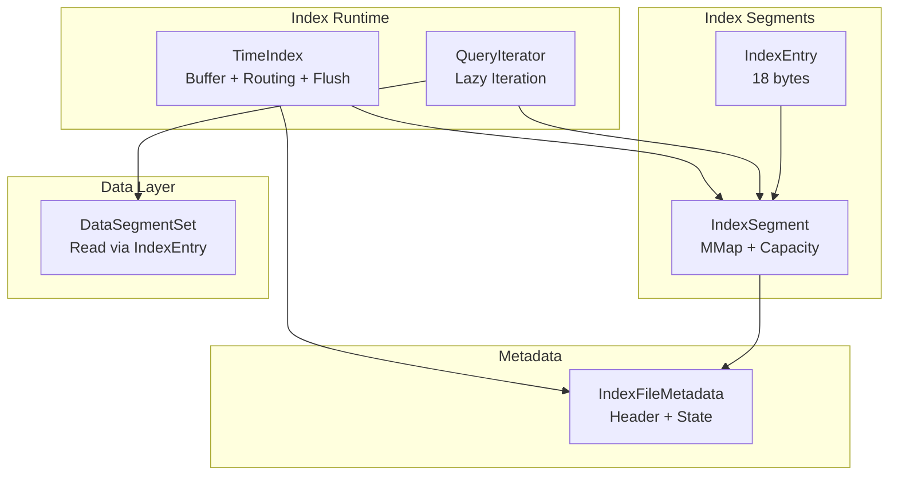
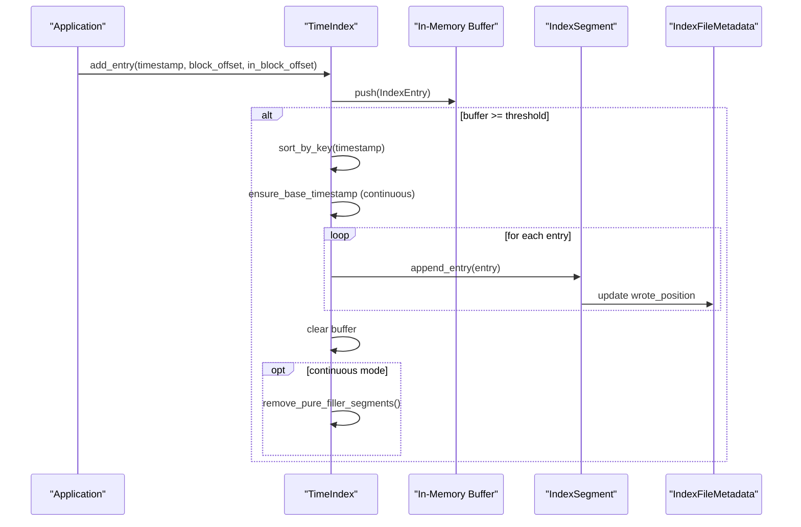
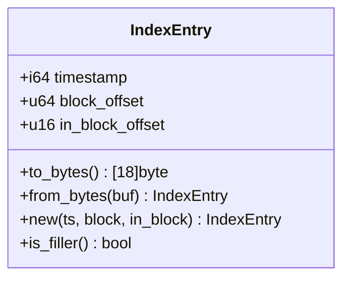
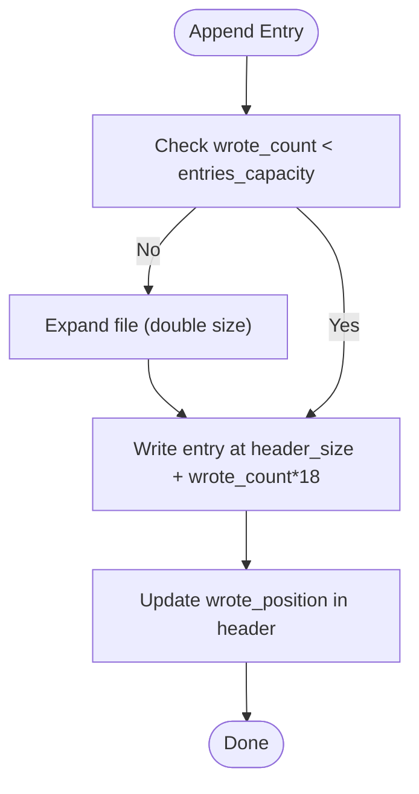
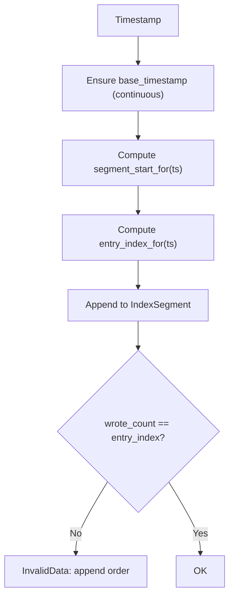
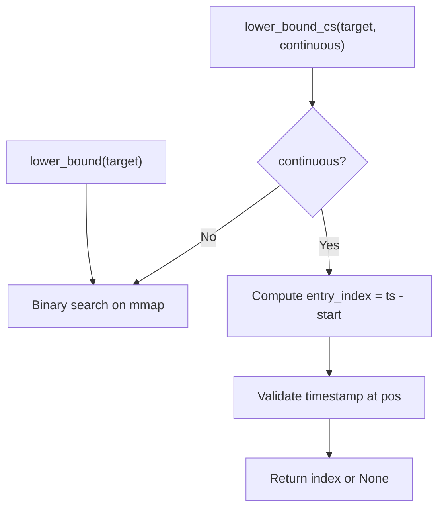
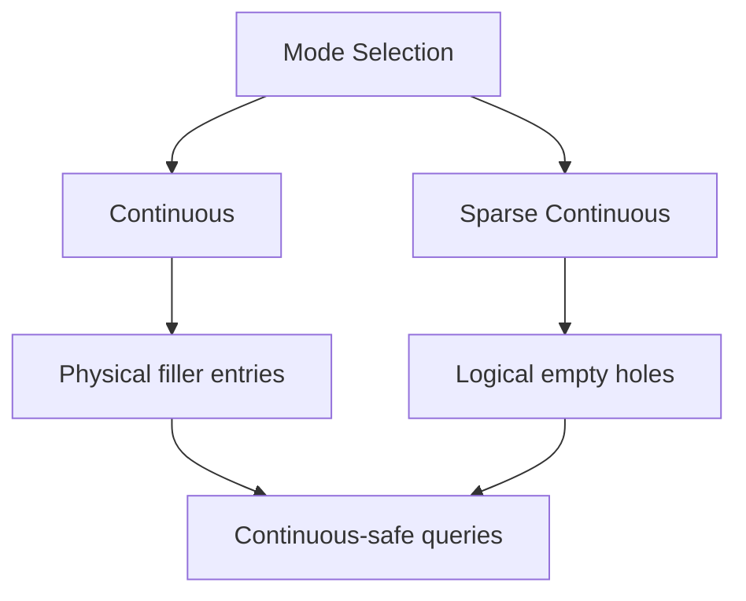
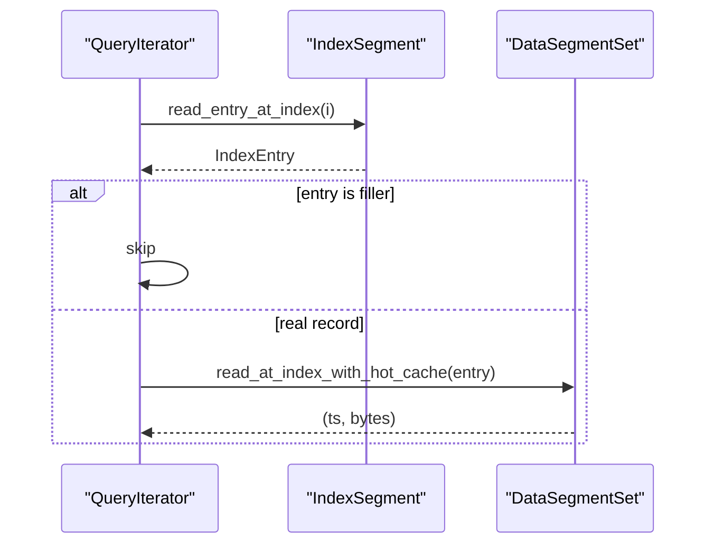
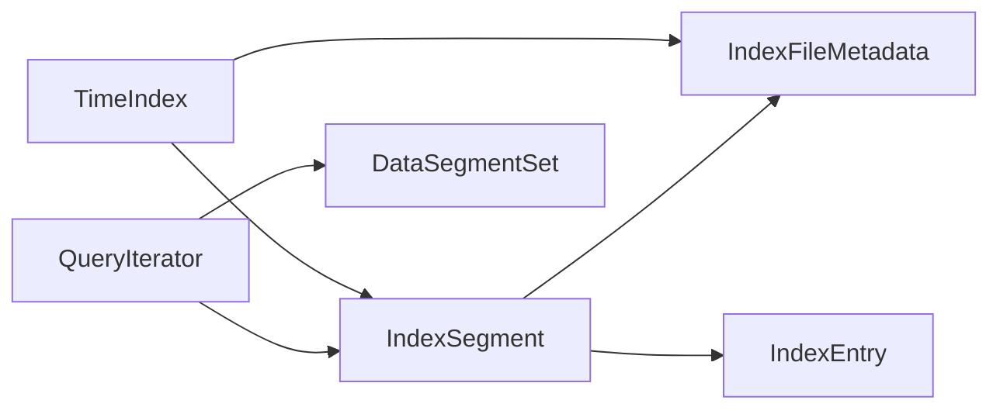

# Index Architecture

<cite>
**Referenced Files in This Document**
- [index/mod.rs](file://src/index/mod.rs)
- [index/segment.rs](file://src/index/segment.rs)
- [header.rs](file://src/header.rs)
- [query/iter.rs](file://src/query/iter.rs)
- [dataset.rs](file://src/dataset.rs)
- [time-index.md](file://docs/design/time-index.md)
- [phase-04-time-index.md](file://docs/plan/phase-04-time-index.md)
- [phase-24-sparse-continuous-index.md](file://docs/plan/phase-24-sparse-continuous-index.md)
- [lazy-allocation.md](file://docs/design/lazy-allocation.md)
</cite>

## Table of Contents
1. [Introduction](#introduction)
2. [Project Structure](#project-structure)
3. [Core Components](#core-components)
4. [Architecture Overview](#architecture-overview)
5. [Detailed Component Analysis](#detailed-component-analysis)
6. [Dependency Analysis](#dependency-analysis)
7. [Performance Considerations](#performance-considerations)
8. [Troubleshooting Guide](#troubleshooting-guide)
9. [Conclusion](#conclusion)

## Introduction
This document explains TimSLite’s index architecture with a focus on time-indexed indexing. It covers the IndexEntry structure, timestamp-to-location mapping, binary search implementation, and continuous versus sparse indexing modes. It also documents index segment structure, memory layout, index consistency guarantees, and corruption prevention mechanisms. Architectural diagrams illustrate the index hierarchy and component interactions.

## Project Structure
TimSLite organizes index-related logic under the index module, with supporting header metadata and query integration:
- Index runtime: TimeIndex orchestrates buffering, flushing, routing, and querying across index segments.
- Index segment: IndexSegment persists IndexEntry records in memory-mapped files with lifecycle and query helpers.
- Header metadata: Shared file header and state definitions for index segments.
- Query integration: QuerySource and QueryIterator lazily iterate index entries and read data records.

**Diagram sources**
- [index/mod.rs:20-31](file://src/index/mod.rs#L20-L31)
- [index/segment.rs:72-93](file://src/index/segment.rs#L72-L93)
- [header.rs:15-42](file://src/header.rs#L15-L42)
- [query/iter.rs:14-30](file://src/query/iter.rs#L14-L30)
- [dataset.rs:245-523](file://src/dataset.rs#L245-L523)

**Section sources**
- [index/mod.rs:1-80](file://src/index/mod.rs#L1-L80)
- [index/segment.rs:1-50](file://src/index/segment.rs#L1-L50)
- [header.rs:1-42](file://src/header.rs#L1-L42)
- [query/iter.rs:1-30](file://src/query/iter.rs#L1-L30)
- [time-index.md:1-27](file://docs/design/time-index.md#L1-L27)

## Core Components
- IndexEntry: Fixed-size record (18 bytes) storing timestamp, block_offset, and in-block offset. It defines serialization and sentinel semantics for filler entries.
- IndexSegment: Single index file with memory-mapped entries, lifecycle management, and query helpers (lower_bound, upper_bound, find_exact, query_range).
- TimeIndex: Manages in-memory buffer, flush policy, continuous mode routing, and cross-segment queries. It supports both continuous and non-continuous modes.
- QuerySource and QueryIterator: Provide lazy iteration over index entries and read underlying data records.

Key design principles:
- Time-indexed append-only structure with sorted entries per segment.
- Memory-mapped IO for efficient random access and range scans.
- Two-phase flush: buffer entries in memory until threshold, then write to disk segments.
- Continuous mode: O(1) direct lookup by computing segment start and entry index from timestamp.

**Section sources**
- [index/segment.rs:24-64](file://src/index/segment.rs#L24-L64)
- [index/segment.rs:72-93](file://src/index/segment.rs#L72-L93)
- [index/mod.rs:20-31](file://src/index/mod.rs#L20-L31)
- [query/iter.rs:14-30](file://src/query/iter.rs#L14-L30)
- [time-index.md:70-94](file://docs/design/time-index.md#L70-L94)

## Architecture Overview
The index architecture separates concerns between buffering, persistence, and querying:
- Buffering: TimeIndex accumulates entries in memory until flush threshold.
- Persistence: Flush sorts entries, ensures base timestamp for continuous mode, and appends to appropriate segments.
- Querying: TimeIndex aggregates results from in-memory buffer, open segments, and closed segments (temporarily opened), deduplicating and sorting results.

**Diagram sources**
- [index/mod.rs:67-82](file://src/index/mod.rs#L67-L82)
- [index/mod.rs:412-457](file://src/index/mod.rs#L412-L457)
- [index/segment.rs:175-195](file://src/index/segment.rs#L175-L195)
- [header.rs:70-71](file://src/header.rs#L70-L71)

**Section sources**
- [index/mod.rs:67-82](file://src/index/mod.rs#L67-L82)
- [index/mod.rs:412-457](file://src/index/mod.rs#L412-L457)
- [index/segment.rs:175-195](file://src/index/segment.rs#L175-L195)
- [header.rs:70-71](file://src/header.rs#L70-L71)

## Detailed Component Analysis

### IndexEntry: Structure and Serialization
IndexEntry is a compact 18-byte record:
- timestamp: i64 (LE)
- block_offset: u64 (LE)
- in_block_offset: u16 (LE)

Sentinel semantics:
- Filler entries use special sentinel values for block_offset and in_block_offset to represent logical deletion or absence of real data.

**Diagram sources**
- [index/segment.rs:24-64](file://src/index/segment.rs#L24-L64)

**Section sources**
- [index/segment.rs:24-64](file://src/index/segment.rs#L24-L64)
- [time-index.md:70-94](file://docs/design/time-index.md#L70-L94)

### IndexSegment: Lifecycle, Memory Layout, and Queries
IndexSegment encapsulates:
- File path, start timestamp, header size, capacity, wrote_count, and mmap.
- Creation/opening with metadata validation and header size computation.
- Append with expansion (doubling) up to max file size.
- Query helpers: lower_bound, upper_bound, find_exact, query_range, and continuous-safe variants.

Memory layout:
- Header area (variable-length metadata + state).
- Index area: contiguous 18-byte entries starting at header_size.

**Diagram sources**
- [index/segment.rs:175-195](file://src/index/segment.rs#L175-L195)
- [index/segment.rs:202-229](file://src/index/segment.rs#L202-L229)
- [header.rs:70-71](file://src/header.rs#L70-L71)

**Section sources**
- [index/segment.rs:95-173](file://src/index/segment.rs#L95-L173)
- [index/segment.rs:175-229](file://src/index/segment.rs#L175-L229)
- [index/segment.rs:238-554](file://src/index/segment.rs#L238-L554)
- [lazy-allocation.md:40-86](file://docs/design/lazy-allocation.md#L40-L86)

### TimeIndex: Continuous Mode, Routing, and Consistency
Continuous mode design:
- Base timestamp is initialized upon first real write and determines logical segment boundaries.
- Segment start is computed as base + ordinal * capacity; entry index is timestamp − segment_start.
- Direct lookup validates timestamp at calculated position to guard against corruption.

Routing and flushing:
- add_entry routes to in-memory buffer; flush sorts, validates base timestamp, and appends to disk.
- append_continuous_entry_to_disk enforces strict ordering: entry_index must equal wrote_count.
- remove_pure_filler_segments prunes segments containing only filler entries.

**Diagram sources**
- [index/mod.rs:152-170](file://src/index/mod.rs#L152-L170)
- [index/mod.rs:486-503](file://src/index/mod.rs#L486-L503)

**Section sources**
- [index/mod.rs:119-170](file://src/index/mod.rs#L119-L170)
- [index/mod.rs:486-503](file://src/index/mod.rs#L486-L503)
- [index/mod.rs:505-550](file://src/index/mod.rs#L505-L550)
- [time-index.md:181-201](file://docs/design/time-index.md#L181-L201)

### Binary Search and Continuous-Safe Operations
IndexSegment provides both binary search and continuous-safe operations:
- Binary search: lower_bound, upper_bound, find_exact, find_entry_index.
- Continuous-safe variants: lower_bound_cs, upper_bound_cs, find_exact_cs, find_entry_index_cs, direct_lookup.

Continuous-safe operations:
- Direct lookup validates timestamp at computed position.
- Range queries compute start index directly and scan forward until end timestamp.

**Diagram sources**
- [index/segment.rs:260-294](file://src/index/segment.rs#L260-L294)
- [index/segment.rs:386-425](file://src/index/segment.rs#L386-L425)
- [index/segment.rs:240-258](file://src/index/segment.rs#L240-L258)

**Section sources**
- [index/segment.rs:260-330](file://src/index/segment.rs#L260-L330)
- [index/segment.rs:386-425](file://src/index/segment.rs#L386-L425)
- [index/segment.rs:240-258](file://src/index/segment.rs#L240-L258)

### Continuous vs Sparse Indexing Modes
- Continuous mode: Enforces O(1) direct lookup and logical grid segmentation; missing timestamps are represented as either physical filler entries or logical empty holes.
- Sparse continuous mode: Only creates filler entries at segment boundaries; middle segments remain logically empty, avoiding unnecessary disk writes for large gaps.

Trade-offs:
- Continuous mode: Lower query latency, predictable segment routing, but may create filler entries.
- Sparse continuous mode: Reduced disk I/O for large gaps, but requires careful handling of logical empty holes during queries and updates.

**Diagram sources**
- [phase-24-sparse-continuous-index.md:11-29](file://docs/plan/phase-24-sparse-continuous-index.md#L11-L29)
- [index/mod.rs:84-117](file://src/index/mod.rs#L84-L117)

**Section sources**
- [phase-24-sparse-continuous-index.md:1-80](file://docs/plan/phase-24-sparse-continuous-index.md#L1-L80)
- [index/mod.rs:84-117](file://src/index/mod.rs#L84-L117)

### Index Consistency Guarantees and Corruption Prevention
Consistency mechanisms:
- Wrote position in header tracks the next write location; continuous mode validates entry_index alignment.
- Direct lookup verifies timestamp at computed position to detect mismatches.
- Pure filler segments are removed after flush to prevent phantom data.
- Lazy allocation and doubling expansion preserve header integrity; actual file size is derived from OS metadata.

Corruption prevention:
- Metadata validation on open (magic/version/file_type).
- Truncated entry detection via header state and bounds checks.
- Read-only last-entry timestamp for retention decisions without keeping segments open.

**Section sources**
- [index/segment.rs:231-236](file://src/index/segment.rs#L231-L236)
- [index/segment.rs:240-258](file://src/index/segment.rs#L240-L258)
- [index/mod.rs:505-550](file://src/index/mod.rs#L505-L550)
- [index/segment.rs:582-617](file://src/index/segment.rs#L582-L617)
- [header.rs:105-126](file://src/header.rs#L105-L126)

### Relationship Between Time Indices and Data Segments
- IndexEntry.block_offset and in_block_offset guide DataSegmentSet to locate and read the underlying record.
- QueryIterator skips filler entries and reads only real records, using hot block caching for performance.
- Out-of-order and correction writes update index entries and may increment invalid_record_count on the old data segment.

**Diagram sources**
- [query/iter.rs:64-101](file://src/query/iter.rs#L64-L101)
- [query/iter.rs:183-191](file://src/query/iter.rs#L183-L191)
- [dataset.rs:245-523](file://src/dataset.rs#L245-L523)

**Section sources**
- [query/iter.rs:14-30](file://src/query/iter.rs#L14-L30)
- [query/iter.rs:64-101](file://src/query/iter.rs#L64-L101)
- [query/iter.rs:183-191](file://src/query/iter.rs#L183-L191)
- [dataset.rs:245-523](file://src/dataset.rs#L245-L523)

## Dependency Analysis
Index components depend on shared header metadata and integrate with the data layer for record retrieval.

**Diagram sources**
- [index/mod.rs:10-16](file://src/index/mod.rs#L10-L16)
- [index/segment.rs:11-13](file://src/index/segment.rs#L11-L13)
- [header.rs:15-42](file://src/header.rs#L15-L42)
- [query/iter.rs:3-11](file://src/query/iter.rs#L3-L11)

**Section sources**
- [index/mod.rs:10-16](file://src/index/mod.rs#L10-L16)
- [index/segment.rs:11-13](file://src/index/segment.rs#L11-L13)
- [header.rs:15-42](file://src/header.rs#L15-L42)
- [query/iter.rs:3-11](file://src/query/iter.rs#L3-L11)

## Performance Considerations
- Continuous mode direct lookup: O(1) per entry; binary search fallback O(log n) for non-continuous segments.
- Lazy allocation and doubling expansion minimize disk waste and reduce initial overhead for small datasets.
- Deduplication and sorting in TimeIndex.query ensure clean results with minimal overhead.
- QueryIterator defers segment opening and reads entries on demand, reducing memory footprint.

[No sources needed since this section provides general guidance]

## Troubleshooting Guide
Common issues and resolutions:
- Segment full during append: Trigger expansion; if already at max file size, segment is sealed and flush continues with a new segment.
- InvalidData errors for continuous mode: Indicates timestamp before base, wrong append order, or truncated entries.
- NotFound for updates/deletes: Entry does not exist or is already a filler; verify timestamp routing and segment boundaries.
- Retention cleanup: Use last_entry_timestamp to safely reclaim expired segments without keeping them open.

**Section sources**
- [index/segment.rs:175-195](file://src/index/segment.rs#L175-L195)
- [index/mod.rs:459-473](file://src/index/mod.rs#L459-L473)
- [index/mod.rs:431-450](file://src/index/mod.rs#L431-L450)
- [index/segment.rs:582-617](file://src/index/segment.rs#L582-L617)

## Conclusion
TimSLite’s index architecture balances performance and flexibility through time-indexed, append-only segments with memory-mapped IO. Continuous mode delivers O(1) lookups with logical grid segmentation, while sparse continuous mode reduces I/O for large gaps. Robust consistency and corruption prevention mechanisms, combined with lazy allocation and efficient query iteration, provide a scalable foundation for time-series workloads.