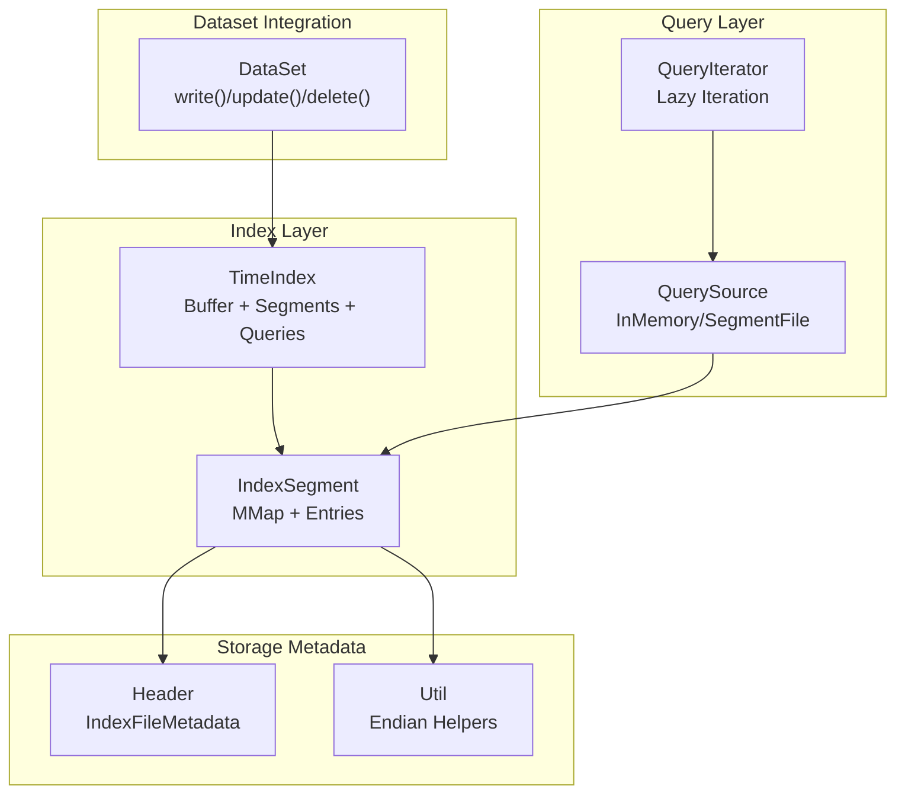
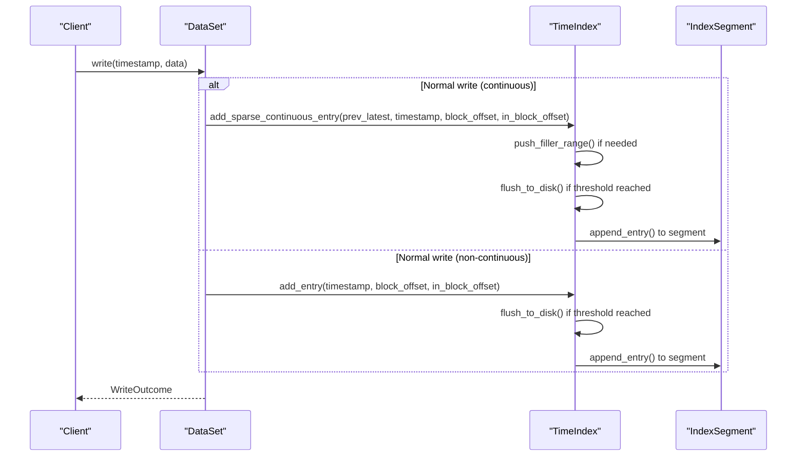
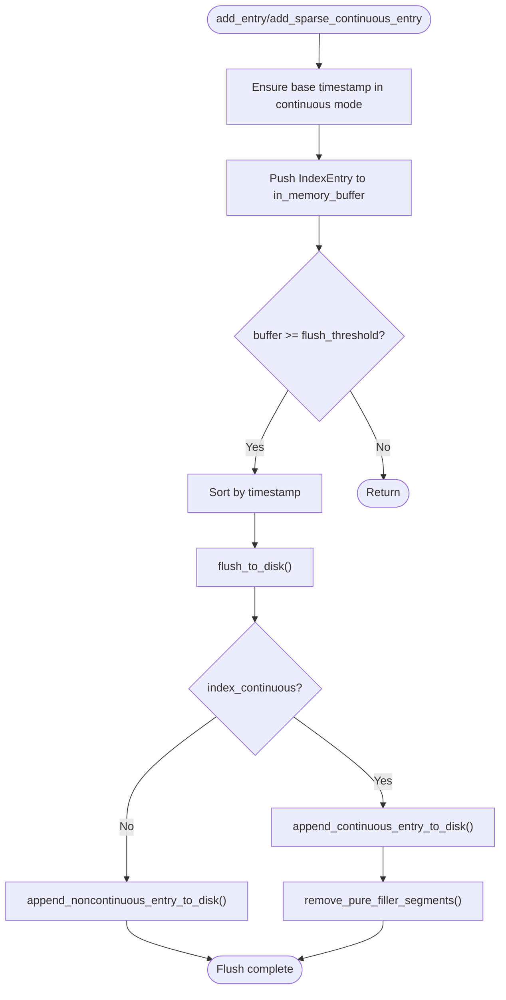
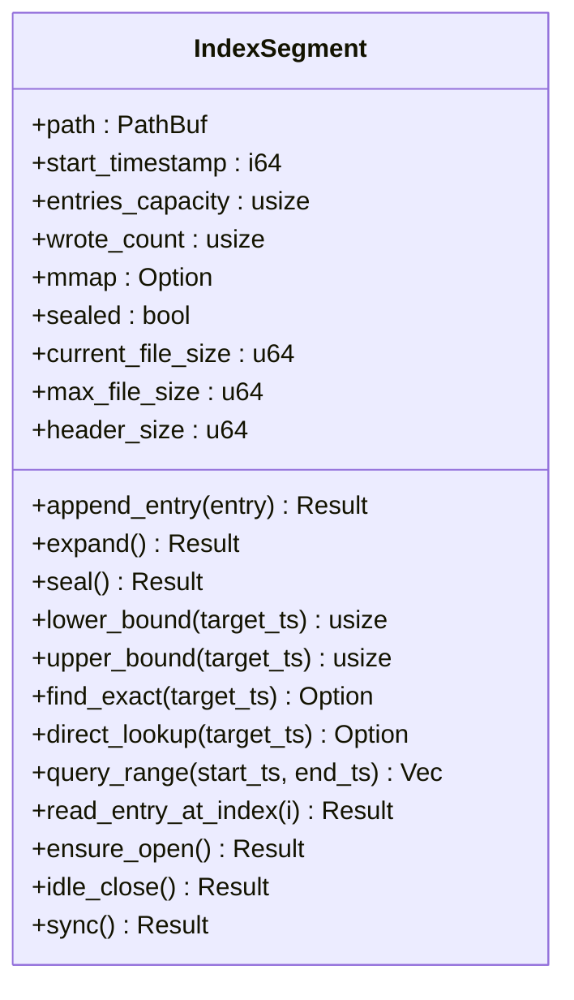
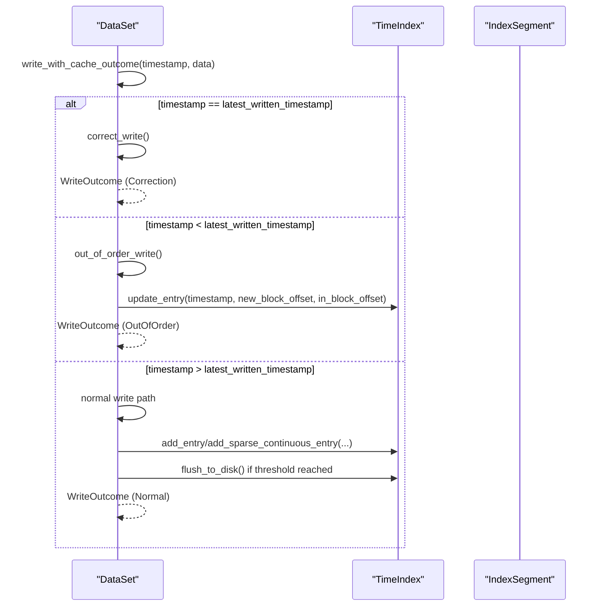
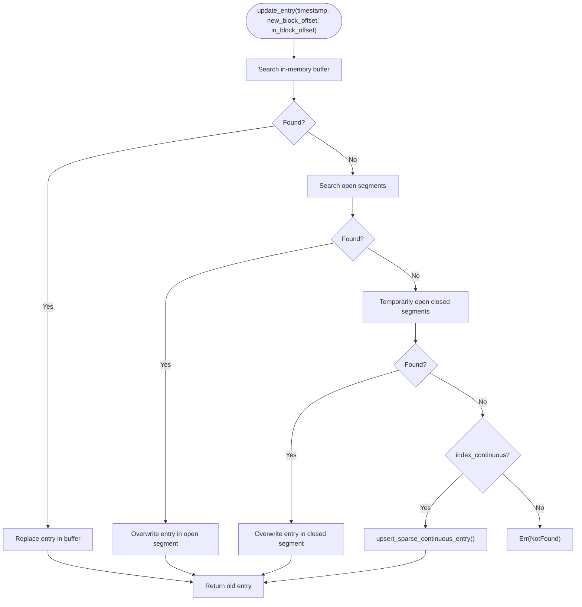
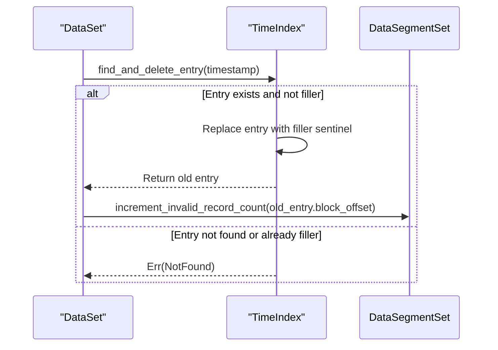
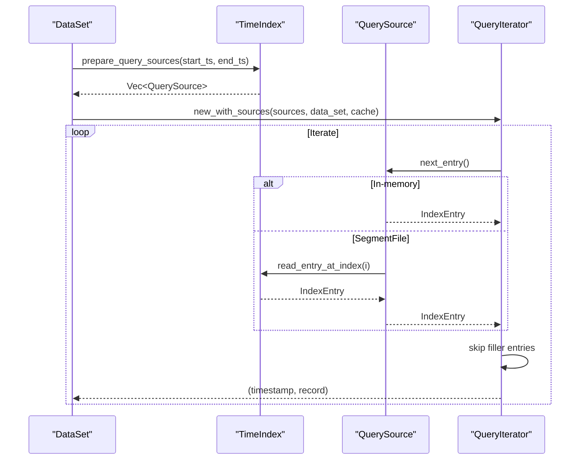
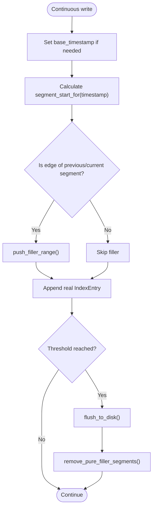
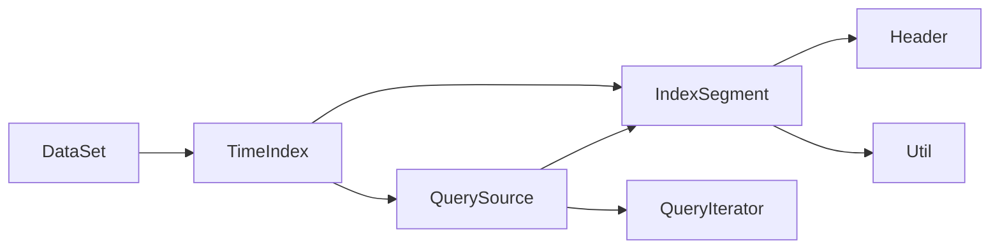

# Index Operations

<cite>
**Referenced Files in This Document**
- [mod.rs](file://src/index/mod.rs)
- [segment.rs](file://src/index/segment.rs)
- [iter.rs](file://src/query/iter.rs)
- [dataset.rs](file://src/dataset.rs)
- [header.rs](file://src/header.rs)
- [util.rs](file://src/util.rs)
- [correction_write_test.rs](file://tests/correction_write_test.rs)
- [out_of_order_delete_test.rs](file://tests/out_of_order_delete_test.rs)
</cite>

## Table of Contents
1. [Introduction](#introduction)
2. [Project Structure](#project-structure)
3. [Core Components](#core-components)
4. [Architecture Overview](#architecture-overview)
5. [Detailed Component Analysis](#detailed-component-analysis)
6. [Dependency Analysis](#dependency-analysis)
7. [Performance Considerations](#performance-considerations)
8. [Troubleshooting Guide](#troubleshooting-guide)
9. [Conclusion](#conclusion)

## Introduction
This document explains index operations in TimSLite, focusing on how the time index is created, maintained, and queried. It covers:
- Index creation and buffering
- Index insertion during writes (normal, correction, out-of-order)
- Index updates during corrections and out-of-order writes
- Index deletion during tombstoning
- Index search, range queries, and timestamp-based lookups
- Traversal patterns and lazy query iteration
- Continuous vs non-continuous modes, filler entries, and sparse index behavior
- Consistency checks, validation, and recovery
- Practical workflows and performance considerations

## Project Structure
TimSLite’s index layer is composed of:
- TimeIndex: orchestrates index segments, buffering, flushing, and queries
- IndexSegment: a single on-disk segment with memory-mapped entries and lifecycle
- QueryIterator: lazy iteration over index sources and data segments
- Header and utilities: on-disk metadata and endian helpers
- Dataset integration: write/update/delete paths that drive index operations

**Diagram sources**
- [mod.rs:20-31](file://src/index/mod.rs#L20-L31)
- [segment.rs:72-93](file://src/index/segment.rs#L72-L93)
- [iter.rs:14-30](file://src/query/iter.rs#L14-L30)
- [dataset.rs:241-316](file://src/dataset.rs#L241-L316)
- [header.rs:466-584](file://src/header.rs#L466-L584)
- [util.rs:55-109](file://src/util.rs#L55-L109)

**Section sources**
- [mod.rs:1-1166](file://src/index/mod.rs#L1-L1166)
- [segment.rs:1-727](file://src/index/segment.rs#L1-L727)
- [iter.rs:1-258](file://src/query/iter.rs#L1-L258)
- [dataset.rs:1-896](file://src/dataset.rs#L1-L896)
- [header.rs:1-919](file://src/header.rs#L1-L919)
- [util.rs:1-163](file://src/util.rs#L1-L163)

## Core Components
- TimeIndex: manages in-memory buffer, segment lifecycle, continuous/sparse behavior, and query preparation. It supports:
  - Buffered index entries and periodic flush-to-disk
  - Continuous mode with filler entries and sparse logical holes
  - Exact lookup, range queries, and lazy source preparation
  - Reclamation of expired segments and closing of segments
- IndexSegment: a single index file with:
  - Memory-mapped entries and lifecycle (open/idle_close/sync)
  - Binary search and continuous-safe bounds
  - Direct lookup for continuous mode and overwrite for backfill
  - Range queries and index-based reads
- QueryIterator: consumes prepared QuerySource items (in-memory entries or segment ranges) and yields records while skipping filler entries
- Header and utilities: define on-disk metadata layout and endian conversions used by index segments

**Section sources**
- [mod.rs:20-31](file://src/index/mod.rs#L20-L31)
- [segment.rs:72-93](file://src/index/segment.rs#L72-L93)
- [iter.rs:14-30](file://src/query/iter.rs#L14-L30)
- [header.rs:20-21](file://src/header.rs#L20-L21)
- [util.rs:55-109](file://src/util.rs#L55-L109)

## Architecture Overview
Index operations are tightly integrated with dataset write/update/delete flows. Writes trigger index updates; queries prepare sources and iterate lazily.

**Diagram sources**
- [dataset.rs:257-316](file://src/dataset.rs#L257-L316)
- [mod.rs:85-117](file://src/index/mod.rs#L85-L117)
- [mod.rs:412-457](file://src/index/mod.rs#L412-L457)
- [segment.rs:175-195](file://src/index/segment.rs#L175-L195)

## Detailed Component Analysis

### TimeIndex: Creation, Buffering, and Flushing
- Construction sets base directory, segment sizes, thresholds, and continuous mode flag
- Buffered entries are sorted and flushed when threshold is reached
- Continuous mode enforces base timestamp and ensures filler entries are not materialized unnecessarily
- Pure filler segments are pruned after flush in continuous mode

**Diagram sources**
- [mod.rs:34-54](file://src/index/mod.rs#L34-L54)
- [mod.rs:67-82](file://src/index/mod.rs#L67-L82)
- [mod.rs:85-117](file://src/index/mod.rs#L85-L117)
- [mod.rs:412-457](file://src/index/mod.rs#L412-L457)
- [mod.rs:505-550](file://src/index/mod.rs#L505-L550)

**Section sources**
- [mod.rs:34-54](file://src/index/mod.rs#L34-L54)
- [mod.rs:67-82](file://src/index/mod.rs#L67-L82)
- [mod.rs:85-117](file://src/index/mod.rs#L85-L117)
- [mod.rs:412-457](file://src/index/mod.rs#L412-L457)
- [mod.rs:505-550](file://src/index/mod.rs#L505-L550)

### IndexSegment: Lifecycle and Search
- Creation and opening manage header sizes, capacities, and memory mapping
- Append operations write entries and update wrote positions atomically
- Binary search helpers support lower_bound, upper_bound, and exact match
- Continuous-safe variants compute indices directly for O(1) lookup
- Range queries and index-based reads support lazy iteration

**Diagram sources**
- [segment.rs:72-93](file://src/index/segment.rs#L72-L93)
- [segment.rs:175-195](file://src/index/segment.rs#L175-L195)
- [segment.rs:260-330](file://src/index/segment.rs#L260-L330)
- [segment.rs:486-523](file://src/index/segment.rs#L486-L523)
- [segment.rs:468-484](file://src/index/segment.rs#L468-L484)

**Section sources**
- [segment.rs:96-173](file://src/index/segment.rs#L96-L173)
- [segment.rs:175-195](file://src/index/segment.rs#L175-L195)
- [segment.rs:260-330](file://src/index/segment.rs#L260-L330)
- [segment.rs:486-523](file://src/index/segment.rs#L486-L523)
- [segment.rs:468-484](file://src/index/segment.rs#L468-L484)

### Index Insertion During Writes
- Normal write (non-continuous): append to latest segment and add entry to index
- Normal write (continuous): append to latest segment and add sparse continuous entry (may insert filler entries)
- Correction write: overwrite last record in place; index unchanged
- Out-of-order write: append to latest segment and update existing index entry in place

**Diagram sources**
- [dataset.rs:257-316](file://src/dataset.rs#L257-L316)
- [dataset.rs:450-476](file://src/dataset.rs#L450-L476)
- [dataset.rs:487-523](file://src/dataset.rs#L487-L523)
- [mod.rs:247-305](file://src/index/mod.rs#L247-L305)
- [mod.rs:412-457](file://src/index/mod.rs#L412-L457)

**Section sources**
- [dataset.rs:257-316](file://src/dataset.rs#L257-L316)
- [dataset.rs:450-476](file://src/dataset.rs#L450-L476)
- [dataset.rs:487-523](file://src/dataset.rs#L487-L523)
- [mod.rs:247-305](file://src/index/mod.rs#L247-L305)
- [mod.rs:412-457](file://src/index/mod.rs#L412-L457)

### Index Updates During Corrections and Out-of-Order Writes
- Correction write attempts in-place overwrite; if not possible, falls back to out-of-order write
- Out-of-order write updates the index entry at the target timestamp and increments invalid record count on the old segment
- Continuous mode may upsert sparse entries by filling logical holes

**Diagram sources**
- [mod.rs:247-305](file://src/index/mod.rs#L247-L305)
- [mod.rs:307-339](file://src/index/mod.rs#L307-L339)

**Section sources**
- [mod.rs:247-305](file://src/index/mod.rs#L247-L305)
- [mod.rs:307-339](file://src/index/mod.rs#L307-L339)

### Index Deletion During Tombstones
- Deletion marks the index entry as a filler sentinel and increments invalid record count on the old segment
- Prevents re-reading deleted entries and ensures query iteration skips filler entries

**Diagram sources**
- [mod.rs:346-410](file://src/index/mod.rs#L346-L410)
- [dataset.rs:544-572](file://src/dataset.rs#L544-L572)

**Section sources**
- [mod.rs:346-410](file://src/index/mod.rs#L346-L410)
- [dataset.rs:544-572](file://src/dataset.rs#L544-L572)

### Index Search, Range Queries, and Timestamp-Based Lookups
- Exact match and index-based lookup supported by IndexSegment
- Continuous-safe bounds and direct lookup enable O(1) access in continuous mode
- Range queries compute start/end indices and stream entries
- QueryIterator consumes prepared sources and skips filler entries

**Diagram sources**
- [mod.rs:651-709](file://src/index/mod.rs#L651-L709)
- [iter.rs:14-30](file://src/query/iter.rs#L14-L30)
- [iter.rs:64-111](file://src/query/iter.rs#L64-L111)
- [segment.rs:468-484](file://src/index/segment.rs#L468-L484)

**Section sources**
- [segment.rs:240-330](file://src/index/segment.rs#L240-L330)
- [segment.rs:486-523](file://src/index/segment.rs#L486-L523)
- [mod.rs:616-709](file://src/index/mod.rs#L616-L709)
- [iter.rs:14-111](file://src/query/iter.rs#L14-L111)

### Continuous Mode, Fillers, and Sparse Index Behavior
- Base timestamp anchors continuous segments; gaps are filled with filler entries
- Sparse continuous mode materializes filler entries only around edges of contiguous writes
- Pure filler segments are removed after flush to conserve disk
- Backfilling replaces filler entries with real entries

**Diagram sources**
- [mod.rs:119-132](file://src/index/mod.rs#L119-L132)
- [mod.rs:152-170](file://src/index/mod.rs#L152-L170)
- [mod.rs:172-179](file://src/index/mod.rs#L172-L179)
- [mod.rs:412-457](file://src/index/mod.rs#L412-L457)
- [mod.rs:505-550](file://src/index/mod.rs#L505-L550)

**Section sources**
- [mod.rs:119-179](file://src/index/mod.rs#L119-L179)
- [mod.rs:412-457](file://src/index/mod.rs#L412-L457)
- [mod.rs:505-550](file://src/index/mod.rs#L505-L550)

### Index Reclamation and Recovery
- Reclaim expired segments removes index files whose last timestamp is below the retention threshold
- Recovery of latest written timestamp scans closed/open buffers and segments
- Header utilities provide on-disk metadata access and validation

**Section sources**
- [mod.rs:739-771](file://src/index/mod.rs#L739-L771)
- [dataset.rs:769-813](file://src/dataset.rs#L769-L813)
- [header.rs:535-584](file://src/header.rs#L535-L584)

## Dependency Analysis
Index operations depend on:
- Header metadata for segment sizing and state
- Utilities for endian-safe memory-mapped reads/writes
- Query layer for lazy iteration and filler filtering
- Dataset layer for write/update/delete orchestration

**Diagram sources**
- [dataset.rs:241-316](file://src/dataset.rs#L241-L316)
- [mod.rs:20-31](file://src/index/mod.rs#L20-L31)
- [segment.rs:72-93](file://src/index/segment.rs#L72-L93)
- [header.rs:466-584](file://src/header.rs#L466-L584)
- [util.rs:55-109](file://src/util.rs#L55-L109)
- [iter.rs:14-30](file://src/query/iter.rs#L14-L30)

**Section sources**
- [dataset.rs:241-316](file://src/dataset.rs#L241-L316)
- [mod.rs:20-31](file://src/index/mod.rs#L20-L31)
- [segment.rs:72-93](file://src/index/segment.rs#L72-L93)
- [header.rs:466-584](file://src/header.rs#L466-L584)
- [util.rs:55-109](file://src/util.rs#L55-L109)
- [iter.rs:14-30](file://src/query/iter.rs#L14-L30)

## Performance Considerations
- Continuous mode enables O(1) direct lookup and sparse filler minimization, reducing disk footprint and IO
- In-memory buffer reduces frequent disk writes; tune flush threshold for workload
- Binary search is O(log N) per segment; continuous-safe bounds reduce to O(1) when applicable
- Lazy query iteration defers segment opening and minimizes memory copies
- Segment expansion doubles file size up to a limit; plan segment sizes to minimize expansions

[No sources needed since this section provides general guidance]

## Troubleshooting Guide
Common issues and resolutions:
- Invalid timestamp in continuous mode: ensure timestamps are monotonic and not earlier than base timestamp
- Segment full errors: flush buffer or expand segment; verify max file size limits
- Not found during update/delete: verify entry exists and is not already a filler
- Retention reclaim failures: check read-only mmap access and file permissions

**Section sources**
- [mod.rs:119-132](file://src/index/mod.rs#L119-L132)
- [mod.rs:496-502](file://src/index/mod.rs#L496-L502)
- [mod.rs:301-305](file://src/index/mod.rs#L301-L305)
- [mod.rs:393-410](file://src/index/mod.rs#L393-L410)
- [mod.rs:760-768](file://src/index/mod.rs#L760-L768)

## Conclusion
TimSLite’s index layer provides robust, efficient time-based indexing with continuous mode optimizations, sparse filler management, and lazy query iteration. By leveraging buffered writes, continuous-safe lookups, and careful segment lifecycle management, it balances performance and storage efficiency while maintaining strong consistency guarantees through metadata and validation routines.