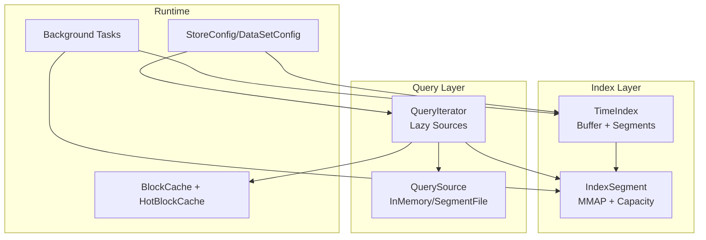
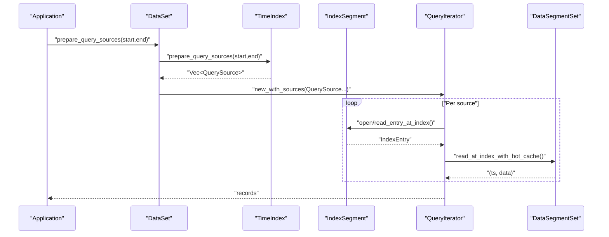
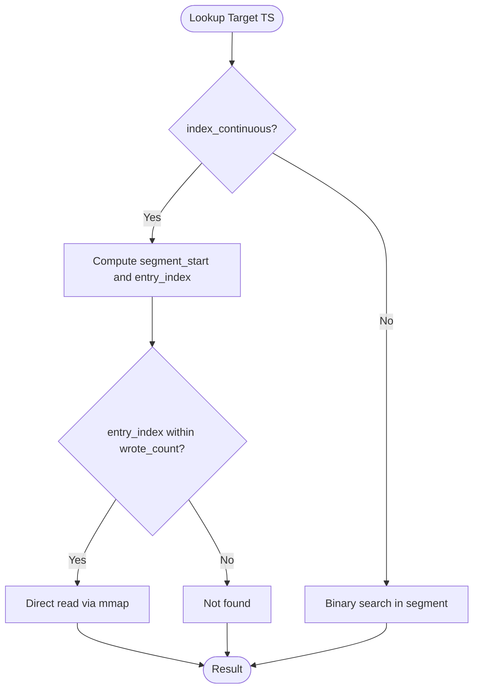
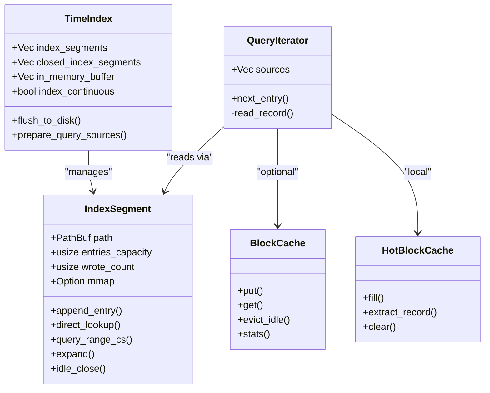
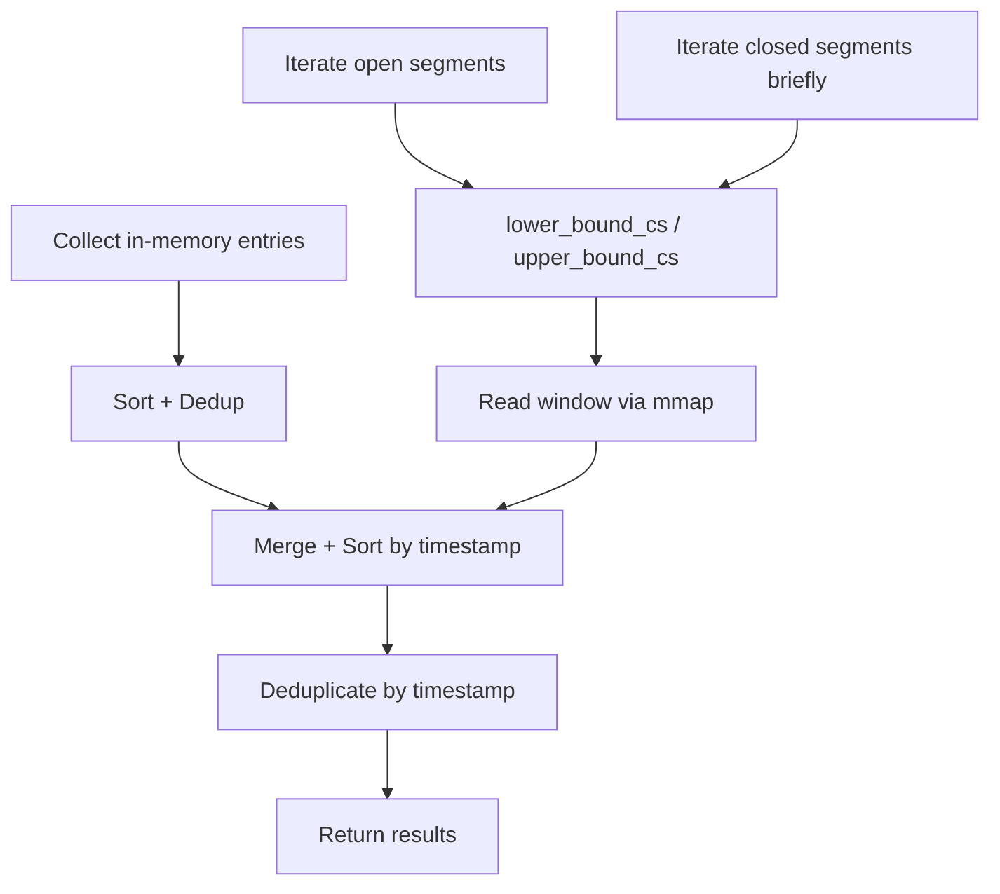
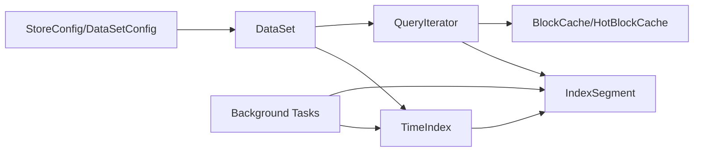

# Index Optimization

<cite>
**Referenced Files in This Document**
- [index/mod.rs](file://src/index/mod.rs)
- [index/segment.rs](file://src/index/segment.rs)
- [query/iter.rs](file://src/query/iter.rs)
- [cache.rs](file://src/cache.rs)
- [config.rs](file://src/config.rs)
- [dataset.rs](file://src/dataset.rs)
- [bg/mod.rs](file://src/bg/mod.rs)
- [ffi.rs](file://src/ffi.rs)
- [lazy-allocation.md](file://docs/design/lazy-allocation.md)
- [time-index.md](file://docs/design/time-index.md)
- [dataset-operations.md](file://docs/design/dataset-operations.md)
- [data-model.md](file://docs/design/data-model.md)
</cite>

## Table of Contents
1. [Introduction](#introduction)
2. [Project Structure](#project-structure)
3. [Core Components](#core-components)
4. [Architecture Overview](#architecture-overview)
5. [Detailed Component Analysis](#detailed-component-analysis)
6. [Dependency Analysis](#dependency-analysis)
7. [Performance Considerations](#performance-considerations)
8. [Troubleshooting Guide](#troubleshooting-guide)
9. [Conclusion](#conclusion)
10. [Appendices](#appendices)

## Introduction
This document explains index optimization techniques in TimSLite with a focus on search optimization strategies, query planning, and performance tuning. It covers index sizing, continuous versus sparse indexing, memory usage patterns, prefetching and cache-friendly access, locality optimization, maintenance scheduling, and fragmentation handling. It also outlines benchmarking methodologies and trade-offs to help tune index performance for typical workloads.

## Project Structure
TimSLite’s index subsystem centers around a time-ordered index that supports both continuous and non-continuous modes. Index entries are stored in memory buffers and periodically flushed to on-disk segments. Query planning leverages lazy sources and memory-mapped segments to minimize IO and maximize locality.

**Diagram sources**
- [index/mod.rs:20-80](file://src/index/mod.rs#L20-L80)
- [index/segment.rs:72-93](file://src/index/segment.rs#L72-L93)
- [query/iter.rs:14-126](file://src/query/iter.rs#L14-L126)
- [config.rs:26-71](file://src/config.rs#L26-L71)
- [bg/mod.rs:610-686](file://src/bg/mod.rs#L610-L686)
- [cache.rs:43-191](file://src/cache.rs#L43-L191)

**Section sources**
- [index/mod.rs:1-1166](file://src/index/mod.rs#L1-L1166)
- [index/segment.rs:1-727](file://src/index/segment.rs#L1-L727)
- [query/iter.rs:1-258](file://src/query/iter.rs#L1-L258)
- [config.rs:1-501](file://src/config.rs#L1-L501)
- [bg/mod.rs:610-686](file://src/bg/mod.rs#L610-L686)
- [cache.rs:1-427](file://src/cache.rs#L1-L427)

## Core Components
- TimeIndex: Manages in-memory buffering, segment lifecycle, continuous/sparse modes, and query planning. It supports O(1) direct lookup in continuous mode and maintains metadata for closed segments.
- IndexSegment: Single memory-mapped segment with append-only semantics, binary search or O(1) direct lookup, and dynamic expansion up to configured limits.
- QueryIterator and QuerySource: Lazy iteration over in-memory entries and on-disk segments, minimizing IO and enabling cache-friendly access patterns.
- BlockCache and HotBlockCache: Read cache for decompressed blocks and per-query hot cache to reduce repeated decompression and parsing overhead.
- Config: Provides defaults and tunables for segment sizes, initial sizes, cache memory, and background scheduling.

**Section sources**
- [index/mod.rs:20-80](file://src/index/mod.rs#L20-L80)
- [index/segment.rs:72-93](file://src/index/segment.rs#L72-L93)
- [query/iter.rs:14-126](file://src/query/iter.rs#L14-L126)
- [cache.rs:43-191](file://src/cache.rs#L43-L191)
- [config.rs:26-71](file://src/config.rs#L26-L71)

## Architecture Overview
Continuous indexing enables O(1) direct lookup by mapping timestamps to fixed grid positions within logical segments. Non-continuous mode uses binary search within segments. Queries are planned as lazy sources to reduce IO and leverage memory-mapped reads.

**Diagram sources**
- [index/mod.rs:651-709](file://src/index/mod.rs#L651-L709)
- [query/iter.rs:128-216](file://src/query/iter.rs#L128-L216)
- [index/segment.rs:468-484](file://src/index/segment.rs#L468-L484)

## Detailed Component Analysis

### Continuous vs Non-Continuous Indexing
- Continuous mode:
  - Fixed grid: segment_start = base + floor((ts - base) / capacity) * capacity, entry_index = ts - segment_start.
  - O(1) direct lookup and O(1 + k) range scan.
  - Sparse continuous mode materializes filler entries only where needed to maintain grid invariants.
- Non-continuous mode:
  - Binary search via lower_bound/upper_bound and exact match via find_exact/find_entry_index.
  - O(log n) for lookups and O(log n + k) for ranges.

**Diagram sources**
- [index/segment.rs:240-330](file://src/index/segment.rs#L240-L330)
- [index/segment.rs:332-425](file://src/index/segment.rs#L332-L425)

**Section sources**
- [index/mod.rs:152-170](file://src/index/mod.rs#L152-L170)
- [index/segment.rs:240-330](file://src/index/segment.rs#L240-L330)
- [index/segment.rs:332-425](file://src/index/segment.rs#L332-L425)
- [time-index.md:170-192](file://docs/design/time-index.md#L170-L192)

### Index Sizing Strategies and Segment Configuration
- Initial vs Max segment sizes:
  - Initial sizes reduce disk waste for small datasets; segments expand up to configured max size.
  - Index segment size must exceed header length plus at least one entry.
- Recommendations:
  - Choose index_segment_size to fit workload’s expected entries per segment.
  - Use initial_index_segment_size to minimize early disk allocation while allowing growth.
  - Align segment sizes with typical query ranges to improve locality.

**Section sources**
- [config.rs:26-71](file://src/config.rs#L26-L71)
- [config.rs:116-131](file://src/config.rs#L116-L131)
- [index/segment.rs:102-142](file://src/index/segment.rs#L102-L142)
- [lazy-allocation.md:17-39](file://docs/design/lazy-allocation.md#L17-L39)

### Memory Usage Patterns and Cache-Friendly Access
- IndexSegment uses memory-mapped IO to avoid copies and reduce GC pressure.
- QueryIterator lazily opens segments and advances through entries, reducing peak memory.
- HotBlockCache avoids repeated decompression by caching a whole block payload per query iteration.
- BlockCache provides global read caching with LRU eviction and idle eviction.

**Diagram sources**
- [index/mod.rs:20-80](file://src/index/mod.rs#L20-L80)
- [index/segment.rs:72-93](file://src/index/segment.rs#L72-L93)
- [query/iter.rs:128-216](file://src/query/iter.rs#L128-L216)
- [cache.rs:43-191](file://src/cache.rs#L43-L191)

**Section sources**
- [index/segment.rs:175-236](file://src/index/segment.rs#L175-L236)
- [query/iter.rs:183-216](file://src/query/iter.rs#L183-L216)
- [cache.rs:288-359](file://src/cache.rs#L288-L359)

### Prefetching Mechanisms and Locality Optimization
- Continuous mode improves spatial locality by aligning entries to grid boundaries.
- Query planning groups sources by first timestamp and iterates in order, reducing segment switches.
- HotBlockCache reduces intra-block deserialization costs by caching decompressed payloads.

**Section sources**
- [index/mod.rs:651-709](file://src/index/mod.rs#L651-L709)
- [query/iter.rs:64-111](file://src/query/iter.rs#L64-L111)
- [cache.rs:288-359](file://src/cache.rs#L288-L359)

### Query Planning Algorithms
- In-memory entries are filtered and deduplicated before segment scans.
- For each segment, compute start/end indices using continuous-safe bounds and read only the required window.
- Results are merged and deduplicated by timestamp.

**Diagram sources**
- [index/mod.rs:618-648](file://src/index/mod.rs#L618-L648)
- [index/segment.rs:448-523](file://src/index/segment.rs#L448-L523)

**Section sources**
- [index/mod.rs:618-648](file://src/index/mod.rs#L618-L648)
- [index/segment.rs:277-330](file://src/index/segment.rs#L277-L330)

### Maintenance Scheduling and Background Tasks
- Background thread executes periodic tasks: flush intervals, idle-close timeouts, cache idle eviction, and retention reclaim.
- External tick APIs allow deterministic task execution when threads are disabled.

**Section sources**
- [config.rs:26-71](file://src/config.rs#L26-L71)
- [bg/mod.rs:610-686](file://src/bg/mod.rs#L610-L686)
- [ffi.rs:360-393](file://src/ffi.rs#L360-L393)

### Fragmentation Handling and Retention Reclaim
- Pure filler segments are pruned in continuous mode to avoid empty segments.
- Retention reclaim deletes index segments whose last timestamp is below a threshold; requires all segments to be closed first.

**Section sources**
- [index/mod.rs:505-550](file://src/index/mod.rs#L505-L550)
- [index/mod.rs:736-771](file://src/index/mod.rs#L736-L771)
- [dataset-operations.md:634-646](file://docs/design/dataset-operations.md#L634-L646)

## Dependency Analysis
Index behavior depends on configuration, segment lifecycle, and background maintenance. The following diagram shows key dependencies.

**Diagram sources**
- [config.rs:26-71](file://src/config.rs#L26-L71)
- [dataset.rs:71-82](file://src/dataset.rs#L71-L82)
- [index/mod.rs:20-80](file://src/index/mod.rs#L20-L80)
- [index/segment.rs:72-93](file://src/index/segment.rs#L72-L93)
- [query/iter.rs:128-216](file://src/query/iter.rs#L128-L216)
- [cache.rs:43-191](file://src/cache.rs#L43-L191)
- [bg/mod.rs:610-686](file://src/bg/mod.rs#L610-L686)

**Section sources**
- [config.rs:26-71](file://src/config.rs#L26-L71)
- [dataset.rs:71-82](file://src/dataset.rs#L71-L82)
- [index/mod.rs:20-80](file://src/index/mod.rs#L20-L80)
- [index/segment.rs:72-93](file://src/index/segment.rs#L72-L93)
- [query/iter.rs:128-216](file://src/query/iter.rs#L128-L216)
- [cache.rs:43-191](file://src/cache.rs#L43-L191)
- [bg/mod.rs:610-686](file://src/bg/mod.rs#L610-L686)

## Performance Considerations
- Continuous vs Non-continuous:
  - Prefer continuous mode for predictable O(1) lookups and improved locality.
  - Use non-continuous mode when timestamps are highly sparse or irregular.
- Segment sizing:
  - Tune index_segment_size to balance entries per segment and query window size.
  - Use initial_index_segment_size to reduce early disk footprint.
- Cache tuning:
  - Increase cache_max_memory for read-heavy workloads; monitor hit ratio via cache stats.
  - Adjust cache_idle_timeout to balance memory usage and hit rate.
- Background scheduling:
  - Shorten flush_interval for stricter durability; increase idle_timeout to reduce frequent open/close churn.
- Query planning:
  - Keep query ranges aligned with segment boundaries to minimize cross-segment scans.

[No sources needed since this section provides general guidance]

## Troubleshooting Guide
- Segment full errors during continuous append indicate insufficient capacity or base timestamp mismatch; verify segment_capacity and base_timestamp logic.
- Pure filler segments being reclaimed indicates continuous mode behavior; confirm expected sparsity.
- Retention reclaim failures often mean segments remain open; ensure idle_close_all is invoked before reclaim.
- Background task execution issues: use external tick APIs when background threads are disabled.

**Section sources**
- [index/mod.rs:486-503](file://src/index/mod.rs#L486-L503)
- [index/mod.rs:505-550](file://src/index/mod.rs#L505-L550)
- [index/mod.rs:736-771](file://src/index/mod.rs#L736-L771)
- [ffi.rs:360-393](file://src/ffi.rs#L360-L393)

## Conclusion
TimSLite’s index optimization combines continuous indexing for O(1) access, memory-mapped segments for low-latency IO, and lazy query planning for efficient scanning. Proper sizing of index segments, judicious cache configuration, and background maintenance are essential to achieving high throughput and low latency. Continuous mode is recommended for most workloads, with non-continuous mode reserved for sparse or irregular timestamp distributions.

[No sources needed since this section summarizes without analyzing specific files]

## Appendices

### Benchmarking Methodologies and Measurement Techniques
- Microbenchmarks:
  - Measure index append latency under varying buffer sizes and segment capacities.
  - Benchmark query latency for point lookups and range scans in continuous vs non-continuous modes.
- Macrobenchmarks:
  - Simulate realistic write loads and query mixes to capture cache effects and IO patterns.
  - Track cache hit ratio and idle eviction rates to assess cache effectiveness.
- Metrics:
  - Throughput (ops/sec), latency percentiles (P50/P95/P99), memory usage, and disk IO utilization.

[No sources needed since this section provides general guidance]

### Optimization Trade-offs
- Continuous mode:
  - Pros: O(1) lookups, better locality, sparse mode support.
  - Cons: Grid alignment overhead, potential filler entries in sparse mode.
- Non-continuous mode:
  - Pros: Flexible timestamp distribution, minimal filler overhead.
  - Cons: O(log n) lookups, higher CPU for queries.
- Cache:
  - Larger caches improve hit rates but increase memory pressure and eviction overhead.
- Segment sizing:
  - Larger segments reduce IO and improve locality but increase idle-close and retention reclaim costs.

[No sources needed since this section provides general guidance]