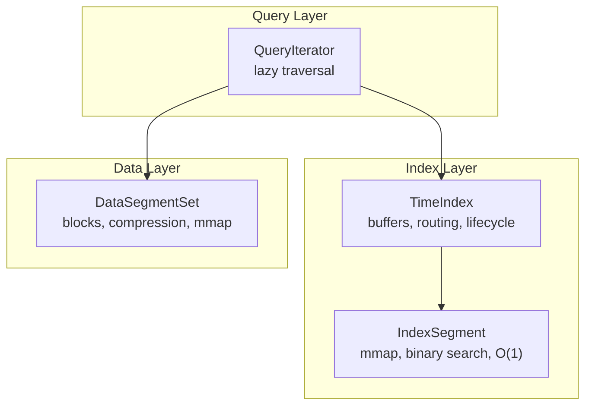
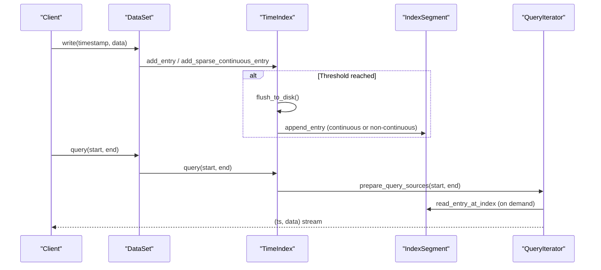
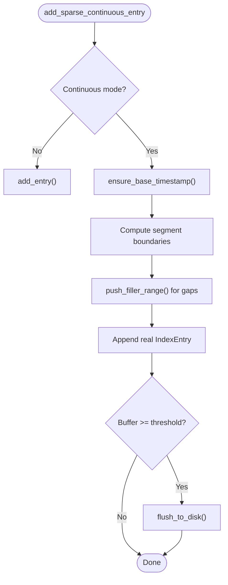
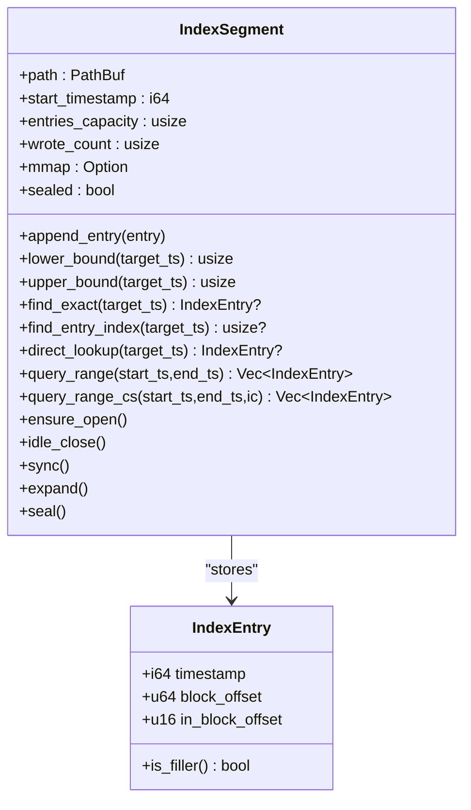
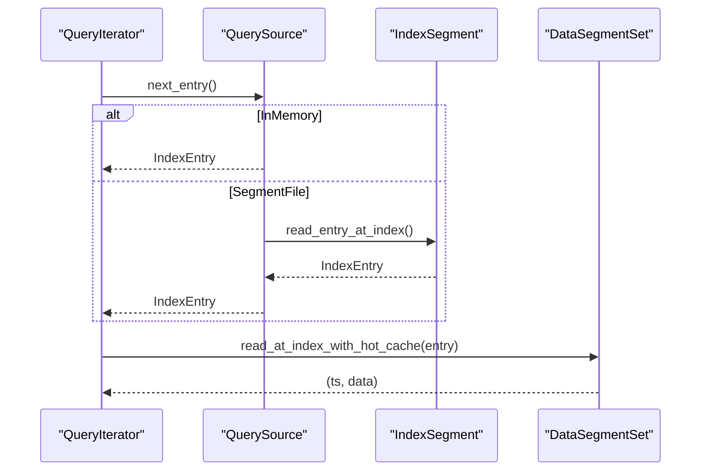
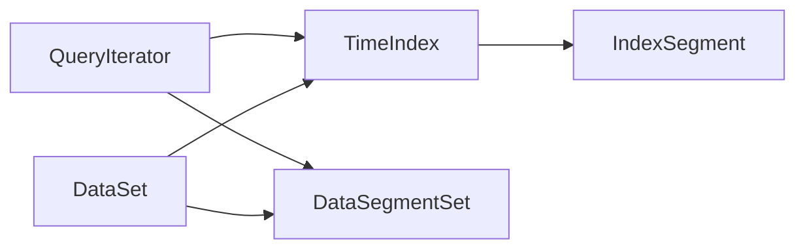

# Indexing System

<cite>
**Referenced Files in This Document**
- [index/mod.rs](file://src/index/mod.rs)
- [index/segment.rs](file://src/index/segment.rs)
- [segment/data.rs](file://src/segment/data.rs)
- [query/iter.rs](file://src/query/iter.rs)
- [dataset.rs](file://src/dataset.rs)
- [error.rs](file://src/error.rs)
- [time-index.md](file://docs/design/time-index.md)
- [phase-04-time-index.md](file://docs/plan/phase-04-time-index.md)
- [phase-11-o1-optimization.md](file://docs/plan/phase-11-o1-optimization.md)
- [phase-24-sparse-continuous-index.md](file://docs/plan/phase-24-sparse-continuous-index.md)
</cite>

## Table of Contents
1. [Introduction](#introduction)
2. [Project Structure](#project-structure)
3. [Core Components](#core-components)
4. [Architecture Overview](#architecture-overview)
5. [Detailed Component Analysis](#detailed-component-analysis)
6. [Dependency Analysis](#dependency-analysis)
7. [Performance Considerations](#performance-considerations)
8. [Troubleshooting Guide](#troubleshooting-guide)
9. [Conclusion](#conclusion)
10. [Appendices](#appendices)

## Introduction
This document explains TimSLite’s indexing architecture with a focus on the time-indexed index design, binary search capabilities, continuous versus sparse indexing modes, and performance characteristics. It covers index segment management, creation and maintenance operations, rebuilding strategies, search optimization, traversal patterns, query planning, consistency guarantees, and recovery from corruption. The goal is to help both developers and operators understand how the index works, how to tune it for different workloads, and how to troubleshoot index-related issues.

## Project Structure
TimSLite organizes indexing around two primary modules:
- TimeIndex: orchestrates index segments, buffers, and lifecycle management.
- IndexSegment: a single memory-mapped index file with binary search and O(1) continuous-mode lookups.

These components integrate with the broader system:
- DataSegmentSet: manages data segments and blocks.
- QueryIterator: lazily iterates over index sources and reads data via DataSegmentSet.
- DataSet: the public API that coordinates writes, queries, and retention.

**Diagram sources**
- [index/mod.rs:20-31](file://src/index/mod.rs#L20-L31)
- [index/segment.rs:72-93](file://src/index/segment.rs#L72-L93)
- [query/iter.rs:14-30](file://src/query/iter.rs#L14-L30)
- [dataset.rs:71-82](file://src/dataset.rs#L71-L82)

**Section sources**
- [index/mod.rs:18-31](file://src/index/mod.rs#L18-L31)
- [index/segment.rs:66-93](file://src/index/segment.rs#L66-L93)
- [query/iter.rs:13-30](file://src/query/iter.rs#L13-L30)
- [dataset.rs:71-82](file://src/dataset.rs#L71-L82)

## Core Components
- TimeIndex
  - Manages in-memory buffer and flush thresholds.
  - Routes entries to open/closed segments and supports continuous mode with base timestamp and segment capacity.
  - Provides query and lazy-source preparation for efficient iteration.
  - Handles lifecycle: sync, idle-close, and reclaim expired segments.
- IndexSegment
  - Single memory-mapped file storing 18-byte IndexEntry records.
  - Implements binary search and continuous-safe O(1) lookups.
  - Supports expansion, sealing, and lazy open/close.
- QueryIterator
  - Consumes prepared QuerySource items (in-memory or segment-backed) and reads data records via DataSegmentSet.
  - Skips filler entries automatically.

**Section sources**
- [index/mod.rs:20-31](file://src/index/mod.rs#L20-L31)
- [index/segment.rs:24-64](file://src/index/segment.rs#L24-L64)
- [index/segment.rs:95-142](file://src/index/segment.rs#L95-L142)
- [query/iter.rs:14-30](file://src/query/iter.rs#L14-L30)

## Architecture Overview
The indexing architecture is designed for high-performance time-series writes and reads:
- Writes buffer index entries in memory until threshold, then flush to disk segments.
- Continuous mode uses a fixed grid (base timestamp + segment capacity) to compute positions directly (O(1)).
- Non-continuous mode uses binary search within segments.
- Queries can leverage lazy sources to avoid loading entire segments.

**Diagram sources**
- [index/mod.rs:67-82](file://src/index/mod.rs#L67-L82)
- [index/mod.rs:412-457](file://src/index/mod.rs#L412-L457)
- [index/segment.rs:175-195](file://src/index/segment.rs#L175-L195)
- [index/mod.rs:616-648](file://src/index/mod.rs#L616-L648)
- [query/iter.rs:144-156](file://src/query/iter.rs#L144-L156)

## Detailed Component Analysis

### TimeIndex: buffering, routing, and lifecycle
- Buffering and flushing
  - Maintains an in-memory buffer sized by a configurable threshold. On flush, entries are sorted by timestamp and appended to disk segments.
  - In continuous mode, ensures base timestamp is established before appending real entries.
- Continuous mode
  - Computes segment start and entry index directly from base timestamp and segment capacity.
  - Supports sparse continuous writes: only boundary segments are materialized; internal gaps remain logical holes.
- Sparse continuous entry insertion
  - When inserting a real entry, fills gaps between previous latest and current timestamp with filler entries only where necessary.
- Update and deletion
  - Finds and updates an existing entry (used for out-of-order writes).
  - Deletes an entry by marking it as a filler sentinel and returning the old entry for data segment invalidation accounting.
- Query and lazy sources
  - Aggregates results from in-memory buffer, open segments, and closed segments (temporarily opened).
  - Prepares lazy QuerySource items to iterate efficiently without loading entire segments.
- Lifecycle and retention
  - Synchronizes and idle-closes segments to release resources.
  - Reclaims expired index segments based on last entry timestamps.

**Diagram sources**
- [index/mod.rs:85-117](file://src/index/mod.rs#L85-L117)
- [index/mod.rs:172-179](file://src/index/mod.rs#L172-L179)
- [index/mod.rs:412-457](file://src/index/mod.rs#L412-L457)

**Section sources**
- [index/mod.rs:33-54](file://src/index/mod.rs#L33-L54)
- [index/mod.rs:66-82](file://src/index/mod.rs#L66-L82)
- [index/mod.rs:84-117](file://src/index/mod.rs#L84-L117)
- [index/mod.rs:207-305](file://src/index/mod.rs#L207-L305)
- [index/mod.rs:341-410](file://src/index/mod.rs#L341-L410)
- [index/mod.rs:616-709](file://src/index/mod.rs#L616-L709)
- [index/mod.rs:711-771](file://src/index/mod.rs#L711-L771)

### IndexSegment: memory-mapped index file with binary search and O(1) continuous lookup
- Data model
  - Stores 18-byte IndexEntry records: timestamp, block_offset, in_block_offset.
  - Uses memory-mapped I/O for fast random access.
- Binary search operations
  - Lower bound, upper bound, exact match, and index lookup via binary search.
- Continuous-safe operations
  - Direct lookup computes entry index directly from start timestamp and entry count.
  - Continuous-aware variants accept an index_continuous flag and choose O(1) or binary search paths.
- Range queries
  - Computes start/end indices using continuous-safe bounds and streams entries.
- Lifecycle
  - Create/open with metadata, expand file size by doubling (up to max), seal, and lazy open/close.

**Diagram sources**
- [index/segment.rs:24-64](file://src/index/segment.rs#L24-L64)
- [index/segment.rs:238-554](file://src/index/segment.rs#L238-L554)

**Section sources**
- [index/segment.rs:17-64](file://src/index/segment.rs#L17-L64)
- [index/segment.rs:238-554](file://src/index/segment.rs#L238-L554)

### QueryIterator: lazy traversal and skipping fillers
- QuerySource
  - In-memory entries and segment-backed sources with start/end indices and first timestamp.
- Iteration
  - Lazily opens segments only when needed, reads entries, and skips filler entries automatically.
- Integration
  - Works with TimeIndex prepared sources and DataSegmentSet to fetch record payloads.

**Diagram sources**
- [query/iter.rs:14-30](file://src/query/iter.rs#L14-L30)
- [query/iter.rs:64-111](file://src/query/iter.rs#L64-L111)
- [query/iter.rs:158-216](file://src/query/iter.rs#L158-L216)

**Section sources**
- [query/iter.rs:14-30](file://src/query/iter.rs#L14-L30)
- [query/iter.rs:64-111](file://src/query/iter.rs#L64-L111)
- [query/iter.rs:158-216](file://src/query/iter.rs#L158-L216)

### Continuous vs Sparse Indexing Modes
- Continuous mode
  - Fixed time step of 1; segment capacity derived from segment size minus header size divided by 18.
  - Base timestamp initialized on first real write; segment start computed from base and capacity.
  - O(1) direct lookup and continuous-safe bounds.
- Sparse continuous mode
  - Only materializes filler entries at segment boundaries; internal gaps remain logical holes.
  - Reduces disk IO and CPU for large gaps during writes.
- Non-continuous mode
  - Uses binary search within segments; no base timestamp or segment grid.

**Section sources**
- [index/mod.rs:119-170](file://src/index/mod.rs#L119-L170)
- [index/segment.rs:240-330](file://src/index/segment.rs#L240-L330)
- [phase-24-sparse-continuous-index.md:20-42](file://docs/plan/phase-24-sparse-continuous-index.md#L20-L42)
- [time-index.md:181-202](file://docs/design/time-index.md#L181-L202)

### Search Optimization and Query Planning
- Continuous-safe operations
  - Continuous-aware methods compute indices directly when possible; otherwise fall back to binary search.
- Lazy sources
  - prepare_query_sources builds ordered sources by first timestamp, enabling minimal I/O and predictable ordering.
- Filler skipping
  - QueryIterator ignores filler entries automatically, reducing downstream processing.

**Section sources**
- [index/segment.rs:277-330](file://src/index/segment.rs#L277-L330)
- [index/mod.rs:650-709](file://src/index/mod.rs#L650-L709)
- [query/iter.rs:160-174](file://src/query/iter.rs#L160-L174)

### Index Segment Management, Creation, and Maintenance
- Creation and expansion
  - IndexSegment::create sets up metadata and initial capacity; expand doubles file size up to max.
- Sealing and lazy lifecycle
  - append_entry writes entries and marks segment full when capacity is reached; seal prevents further writes.
  - ensure_open/idle_close manage mmap lifetimes; sync flushes changes.
- Routing and segment selection
  - TimeIndex routes entries to open segments or creates new ones; closed segments are reopened only when needed.

**Section sources**
- [index/segment.rs:95-142](file://src/index/segment.rs#L95-L142)
- [index/segment.rs:202-229](file://src/index/segment.rs#L202-L229)
- [index/segment.rs:231-236](file://src/index/segment.rs#L231-L236)
- [index/segment.rs:527-554](file://src/index/segment.rs#L527-L554)
- [index/mod.rs:552-614](file://src/index/mod.rs#L552-L614)

### Rebuilding Strategies and Retention
- Reclaim expired segments
  - idle_close_all must be called to close all segments; then reclaim_expired_segments removes segments whose last timestamp is below the threshold.
  - Uses last_entry_timestamp to read last entry without keeping segments open.
- Pure filler cleanup
  - remove_pure_filler_segments removes segments that contain only filler entries to reclaim disk space.

**Section sources**
- [index/mod.rs:711-771](file://src/index/mod.rs#L711-L771)
- [index/segment.rs:582-617](file://src/index/segment.rs#L582-L617)
- [index/mod.rs:505-550](file://src/index/mod.rs#L505-L550)

### Relationship Between Time Indices and Data Segments
- IndexEntry.block_offset points to a block header in the data area; the data segment must be located and read using segment metadata.
- QueryIterator reads records via DataSegmentSet using the index entry’s offsets.
- Correction writes and out-of-order updates rely on index entries to locate and modify data in place when possible.

**Section sources**
- [index/segment.rs:24-30](file://src/index/segment.rs#L24-L30)
- [query/iter.rs:183-191](file://src/query/iter.rs#L183-L191)
- [dataset.rs:478-522](file://src/dataset.rs#L478-L522)

### Consistency Guarantees and Corruption Recovery
- Consistency
  - Index entries are the publication point for queries; data writes must complete block/header state before appending index entries.
  - Continuous mode maintains logical holes for gaps; queries skip filler entries.
- Corruption detection and recovery
  - Invalid magic and version checks in file headers.
  - Segment full errors trigger expansion or sealing; last_entry_timestamp safely reads last entry without keeping segments open.
  - Tests demonstrate extended headers and overwriting entries without breaking correctness.

**Section sources**
- [time-index.md:166-169](file://docs/design/time-index.md#L166-L169)
- [index/segment.rs:144-173](file://src/index/segment.rs#L144-L173)
- [index/segment.rs:582-617](file://src/index/segment.rs#L582-L617)
- [error.rs:8-43](file://src/error.rs#L8-L43)

## Dependency Analysis
- TimeIndex depends on IndexSegment for segment operations and on QuerySource for lazy iteration.
- IndexSegment depends on memory-mapped I/O and metadata structures.
- QueryIterator depends on IndexSegment and DataSegmentSet to resolve entries to data.
- DataSet integrates TimeIndex and DataSegmentSet into a cohesive API.

**Diagram sources**
- [index/mod.rs:20-31](file://src/index/mod.rs#L20-L31)
- [query/iter.rs:14-30](file://src/query/iter.rs#L14-L30)
- [dataset.rs:71-82](file://src/dataset.rs#L71-L82)

**Section sources**
- [index/mod.rs:20-31](file://src/index/mod.rs#L20-L31)
- [query/iter.rs:14-30](file://src/query/iter.rs#L14-L30)
- [dataset.rs:71-82](file://src/dataset.rs#L71-L82)

## Performance Considerations
- Continuous mode O(1) lookups
  - Direct computation of entry index avoids binary search within segments.
- Sparse continuous writes
  - Minimizes disk IO and CPU for large gaps by only materializing boundary segments.
- Lazy iteration
  - prepare_query_sources orders sources by first timestamp; QueryIterator opens segments on demand.
- Segment sizing and expansion
  - Initial and max segment sizes influence write amplification and memory usage; expansion doubles file size up to a limit.
- In-memory buffer
  - Tuning flush threshold balances latency and throughput.

[No sources needed since this section provides general guidance]

## Troubleshooting Guide
Common issues and remedies:
- Segment full errors
  - Triggered when a segment reaches capacity or file size limit; expand the segment or create a new one.
- Invalid magic/version
  - Indicates corrupted or incompatible files; verify file headers and reinitialize if necessary.
- Not found/expired
  - Timestamp outside retention or missing index entry; confirm retention settings and index coverage.
- Pending state inconsistencies
  - Ensure proper closing and reopening; pending raw state is restored on reopen.

**Section sources**
- [error.rs:8-43](file://src/error.rs#L8-L43)
- [index/segment.rs:202-229](file://src/index/segment.rs#L202-L229)
- [index/mod.rs:711-771](file://src/index/mod.rs#L711-L771)

## Conclusion
TimSLite’s indexing system combines a robust time-indexed design with flexible continuous and non-continuous modes. Continuous mode achieves O(1) lookups and sparse writes to minimize overhead for large gaps, while non-continuous mode offers simplicity with binary search. The lazy query pipeline and strict consistency rules ensure reliable reads and efficient maintenance. Proper tuning of segment sizes, buffer thresholds, and retention policies yields strong performance across diverse workloads.

## Appendices

### API and Operation Reference
- TimeIndex
  - add_entry, add_sparse_continuous_entry, flush_to_disk, query, prepare_query_sources, idle_close_all, reclaim_expired_segments.
- IndexSegment
  - append_entry, lower_bound, upper_bound, find_exact, find_entry_index, direct_lookup, query_range, query_range_cs, ensure_open, idle_close, sync, expand, seal.
- QueryIterator
  - new, new_with_sources, next_entry, collect_all, entries_remaining, current_index.

**Section sources**
- [index/mod.rs:66-82](file://src/index/mod.rs#L66-L82)
- [index/mod.rs:84-117](file://src/index/mod.rs#L84-L117)
- [index/mod.rs:412-457](file://src/index/mod.rs#L412-L457)
- [index/mod.rs:616-709](file://src/index/mod.rs#L616-L709)
- [index/segment.rs:175-195](file://src/index/segment.rs#L175-L195)
- [index/segment.rs:260-330](file://src/index/segment.rs#L260-L330)
- [index/segment.rs:486-523](file://src/index/segment.rs#L486-L523)
- [query/iter.rs:128-216](file://src/query/iter.rs#L128-L216)