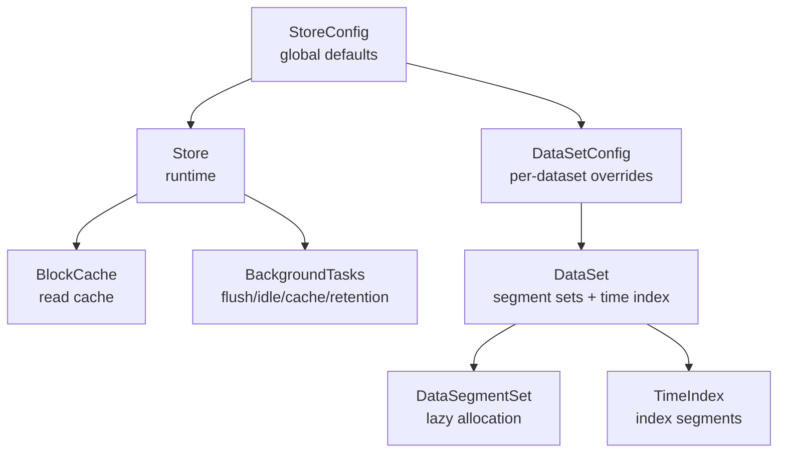
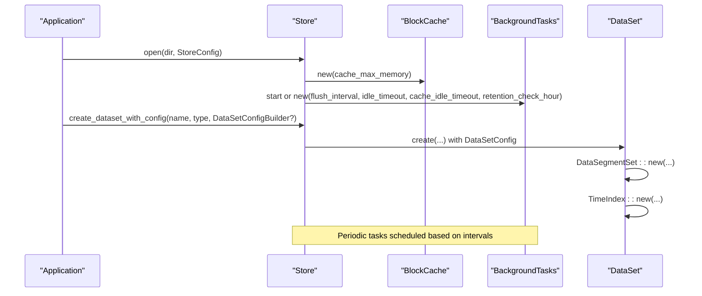
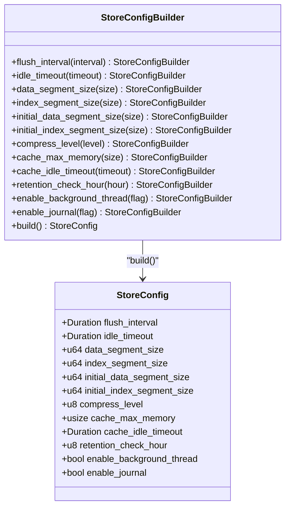
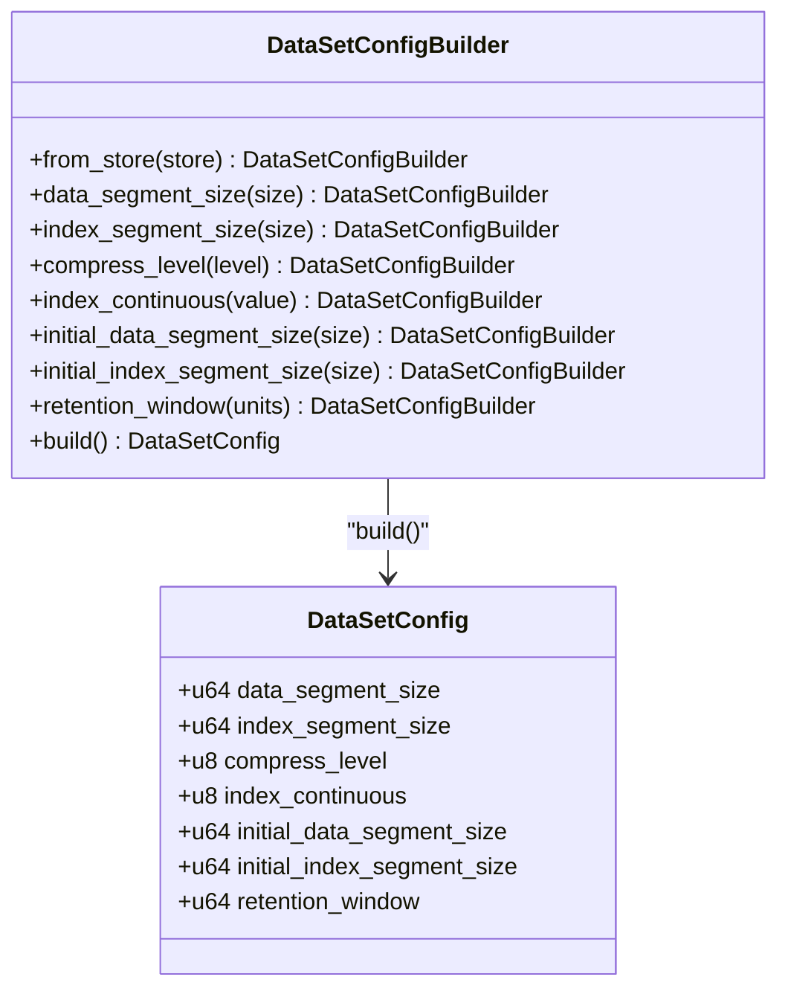
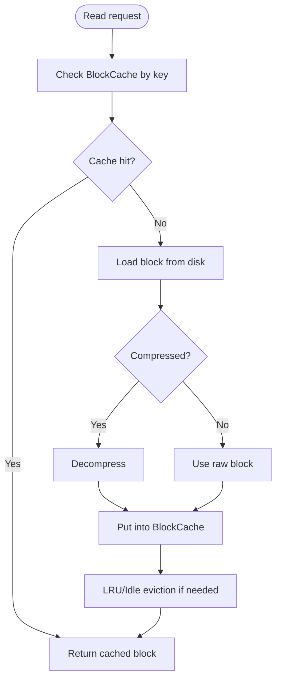
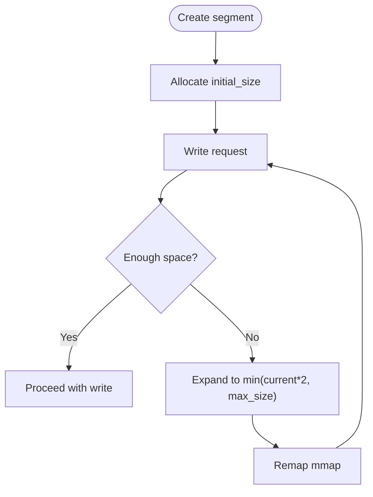
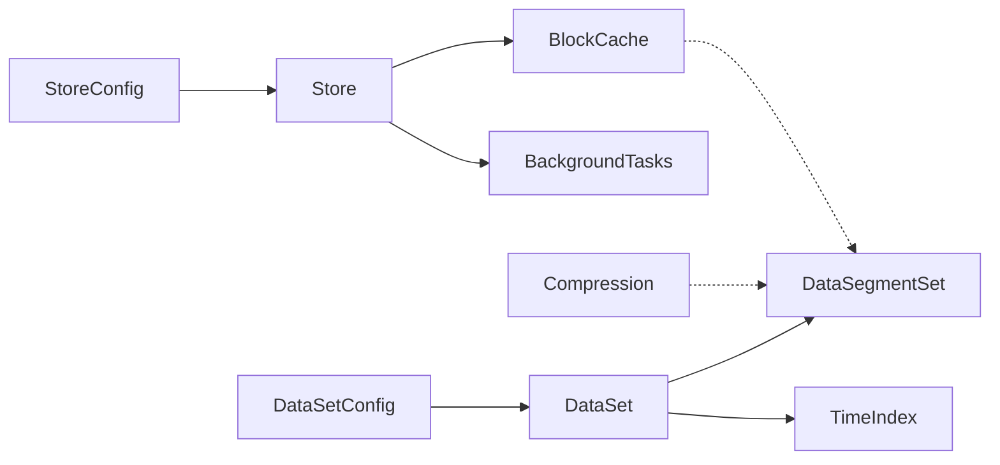

# Configuration Tuning

<cite>
**Referenced Files in This Document**
- [config.rs](file://src/config.rs)
- [cache.rs](file://src/cache.rs)
- [compress.rs](file://src/compress.rs)
- [dataset.rs](file://src/dataset.rs)
- [store.rs](file://src/store.rs)
- [data.rs](file://src/segment/data.rs)
- [mod.rs (bg)](file://src/bg/mod.rs)
- [config.rs (Python wrapper)](file://wrapper/python/src/config.rs)
- [test_config.py](file://wrapper/python/tests/test_config.py)
- [config_test.rs](file://tests/config_test.rs)
- [Cargo.toml](file://Cargo.toml)
</cite>

## Table of Contents
1. [Introduction](#introduction)
2. [Project Structure](#project-structure)
3. [Core Components](#core-components)
4. [Architecture Overview](#architecture-overview)
5. [Detailed Component Analysis](#detailed-component-analysis)
6. [Dependency Analysis](#dependency-analysis)
7. [Performance Considerations](#performance-considerations)
8. [Troubleshooting Guide](#troubleshooting-guide)
9. [Conclusion](#conclusion)
10. [Appendices](#appendices)

## Introduction
This document provides a comprehensive guide to configuring TimSLite for optimal performance. It covers all configuration parameters—cache size, compression settings, buffer and segment sizing—and explains their impact on throughput, latency, and memory usage. It also includes tuning guidelines for high-write, high-read, and mixed workloads, along with builders, validation rules, environment-specific optimizations, JVM considerations for Java wrappers, and container deployment notes.

## Project Structure
TimSLite exposes configuration at two levels:
- StoreConfig: global store-level settings and defaults for newly created datasets
- DataSetConfig: per-dataset parameters persisted in meta and used for opening existing datasets

Key areas:
- Configuration model and builders
- Runtime cache and compression
- Segment sizing and lazy allocation
- Background task scheduling
- Python wrapper configuration

**Diagram sources**
- [config.rs:26-203](file://src/config.rs#L26-L203)
- [dataset.rs:71-82](file://src/dataset.rs#L71-L82)
- [store.rs:46-56](file://src/store.rs#L46-L56)
- [cache.rs:43-49](file://src/cache.rs#L43-L49)
- [mod.rs (bg):193-218](file://src/bg/mod.rs#L193-L218)

**Section sources**
- [config.rs:26-203](file://src/config.rs#L26-L203)
- [dataset.rs:71-82](file://src/dataset.rs#L71-L82)
- [store.rs:46-56](file://src/store.rs#L46-L56)

## Core Components
- StoreConfig: global defaults and controls for flush intervals, idle timeouts, segment sizes, compression level, block cache memory, cache idle eviction, retention check hour, background thread enablement, and journal enablement.
- DataSetConfig: per-dataset parameters including data/index segment sizes, compression level, index continuity, initial segment sizes, and retention window.
- Builders: StoreConfigBuilder and DataSetConfigBuilder provide fluent APIs to set parameters and build validated configurations.
- Validation: Parameters are validated during build and at dataset creation/open time.

Key defaults and ranges:
- flush_interval: seconds (default 600)
- idle_timeout: seconds (default 1800)
- data_segment_size: bytes (default 64 MiB)
- index_segment_size: bytes (default 4 MiB)
- initial_data_segment_size: bytes (default 256 KiB)
- initial_index_segment_size: bytes (default 4 KiB)
- compress_level: 0–9 (default 6)
- cache_max_memory: bytes (default 256 MiB; 0 disables cache)
- cache_idle_timeout: seconds (default 1800)
- retention_check_hour: 0–23 (default 0)
- enable_background_thread: bool (default true)
- enable_journal: bool (default true)
- index_continuous: 0 or 1 (default 0)
- retention_window: timestamp units (default 0, no limit)

**Section sources**
- [config.rs:12-71](file://src/config.rs#L12-L71)
- [config.rs:74-203](file://src/config.rs#L74-L203)
- [config.rs:205-345](file://src/config.rs#L205-L345)
- [config.rs (Python wrapper):14-53](file://wrapper/python/src/config.rs#L14-L53)

## Architecture Overview
Configuration flows from StoreConfig to DataSetConfig and affects runtime behavior:
- Store initializes BlockCache and BackgroundTasks based on StoreConfig
- DataSet uses DataSetConfig to create/open DataSegmentSet and TimeIndex with appropriate sizes and compression
- BackgroundTasks execute periodic flushes, idle-close checks, cache eviction, and retention reclaim

**Diagram sources**
- [store.rs:124-158](file://src/store.rs#L124-L158)
- [dataset.rs:127-139](file://src/dataset.rs#L127-L139)
- [mod.rs (bg):193-218](file://src/bg/mod.rs#L193-L218)

## Detailed Component Analysis

### StoreConfig and Builders
- Purpose: centralize store-level defaults and runtime controls
- Key fields and defaults:
  - flush_interval: controls background flush frequency
  - idle_timeout: triggers automatic closing of inactive segments
  - data_segment_size/index_segment_size: maximum segment sizes for expansion
  - initial_data_segment_size/initial_index_segment_size: initial allocation to reduce disk waste
  - compress_level: compression level for new data blocks
  - cache_max_memory: block cache capacity; 0 disables cache
  - cache_idle_timeout: idle eviction for cache entries
  - retention_check_hour: daily retention reclamation hour (UTC)
  - enable_background_thread: whether to spawn a background thread or require manual ticks
  - enable_journal: enable internal journal/logs
- Builder behavior:
  - Partial overrides are supported; unset fields inherit defaults
  - Values are clamped or capped where applicable (e.g., compress_level capped at 9, retention_check_hour clamped to 0–23)
- Validation:
  - Tests confirm default correctness and builder partial/override behavior
  - Python wrapper validates defaults and custom values

**Diagram sources**
- [config.rs:26-203](file://src/config.rs#L26-L203)

**Section sources**
- [config.rs:12-71](file://src/config.rs#L12-L71)
- [config.rs:74-203](file://src/config.rs#L74-L203)
- [config_test.rs:17-43](file://tests/config_test.rs#L17-L43)
- [config_test.rs:45-76](file://tests/config_test.rs#L45-L76)
- [config_test.rs:78-107](file://tests/config_test.rs#L78-L107)
- [config.rs (Python wrapper):14-53](file://wrapper/python/src/config.rs#L14-L53)
- [test_config.py:8-46](file://wrapper/python/tests/test_config.py#L8-L46)

### DataSetConfig and Builders
- Purpose: define per-dataset immutable parameters persisted in meta
- Fields:
  - data_segment_size, index_segment_size, compress_level, index_continuous, initial_data_segment_size, initial_index_segment_size, retention_window
- Builder behavior:
  - DataSetConfigBuilder::from_store pre-fills with StoreConfig defaults
  - Unset fields inherit store defaults; index_continuous defaults to 0
- Validation:
  - Meta parsing rejects invalid combinations (e.g., invalid index_continuous values, initial sizes exceeding max sizes)

**Diagram sources**
- [config.rs:205-345](file://src/config.rs#L205-L345)

**Section sources**
- [config.rs:205-345](file://src/config.rs#L205-L345)
- [config_test.rs:45-76](file://tests/config_test.rs#L45-L76)
- [config_test.rs:78-107](file://tests/config_test.rs#L78-L107)
- [test_config.py:47-72](file://wrapper/python/tests/test_config.py#L47-L72)

### Block Cache
- Capacity: controlled by cache_max_memory; 0 disables caching
- Eviction policy: LRU-like eviction when approaching capacity; idle eviction based on cache_idle_timeout
- HotBlockCache: per-query local cache to avoid lock contention during reads
- Impact: reduces disk IO for repeated reads; increases memory usage proportional to cache_max_memory

**Diagram sources**
- [cache.rs:68-113](file://src/cache.rs#L68-L113)
- [cache.rs:129-173](file://src/cache.rs#L129-L173)
- [compress.rs:8-16](file://src/compress.rs#L8-L16)

**Section sources**
- [cache.rs:43-191](file://src/cache.rs#L43-L191)
- [compress.rs:8-23](file://src/compress.rs#L8-L23)

### Compression
- Level: 0–9; higher levels trade CPU for reduced storage
- Decision: should_use_compressed compares compressed vs original size
- Impact: lower storage footprint and network transfer; increased CPU usage for compression/decompression

**Section sources**
- [compress.rs:8-23](file://src/compress.rs#L8-L23)

### Segment Sizing and Lazy Allocation
- Data/index segments expand by doubling when space is insufficient, up to configured max sizes
- Initial sizes reduce disk waste for small datasets; enforced by validation
- Expansion occurs when remaining capacity is insufficient for writes

**Diagram sources**
- [data.rs:76-99](file://src/segment/data.rs#L76-L99)
- [lazy-allocation.md:56-86](file://docs/design/lazy-allocation.md#L56-L86)

**Section sources**
- [data.rs:76-99](file://src/segment/data.rs#L76-L99)
- [lazy-allocation.md:17-29](file://docs/design/lazy-allocation.md#L17-L29)
- [lazy-allocation.md:56-86](file://docs/design/lazy-allocation.md#L56-L86)

### Background Tasks
- Flush: syncs in-memory buffers to disk across all datasets
- Idle check: closes inactive segments based on idle_timeout
- Cache eviction: removes idle entries based on cache_idle_timeout
- Retention reclaim: daily cleanup at retention_check_hour
- Manual vs automatic: when enable_background_thread is false, callers must periodically invoke tick_background_tasks()

**Section sources**
- [mod.rs (bg):193-218](file://src/bg/mod.rs#L193-L218)
- [mod.rs (bg):320-332](file://src/bg/mod.rs#L320-L332)
- [mod.rs (bg):334-351](file://src/bg/mod.rs#L334-L351)
- [mod.rs (bg):312-318](file://src/bg/mod.rs#L312-L318)
- [store.rs:139-158](file://src/store.rs#L139-L158)

## Dependency Analysis
- StoreConfig drives Store initialization of BlockCache and BackgroundTasks
- DataSetConfig drives DataSegmentSet and TimeIndex construction
- Compression and cache are orthogonal to segment sizing but influence CPU and memory usage
- BackgroundTasks depend on intervals set in StoreConfig

**Diagram sources**
- [store.rs:124-158](file://src/store.rs#L124-L158)
- [dataset.rs:127-139](file://src/dataset.rs#L127-L139)
- [compress.rs:8-16](file://src/compress.rs#L8-L16)
- [cache.rs:43-49](file://src/cache.rs#L43-L49)

**Section sources**
- [store.rs:124-158](file://src/store.rs#L124-L158)
- [dataset.rs:127-139](file://src/dataset.rs#L127-L139)
- [compress.rs:8-16](file://src/compress.rs#L8-L16)
- [cache.rs:43-49](file://src/cache.rs#L43-L49)

## Performance Considerations

### Parameter Impact Summary
- flush_interval
  - Lower values increase flush frequency; improves durability/consistency but raises IO and CPU
  - Recommended: 300–600s for balanced durability and performance
- idle_timeout
  - Lower values free resources sooner; reduces memory but may cause frequent reopen costs
  - Recommended: 1800s default for most workloads
- data_segment_size
  - Larger segments reduce segment switching overhead; increase disk footprint
  - Recommended: 64 MiB default for typical throughput
- index_segment_size
  - Larger index segments reduce index expansion; impacts memory footprint
  - Recommended: 4 MiB default
- initial_data_segment_size / initial_index_segment_size
  - Reduce disk waste for small datasets; must be ≥ header size and ≤ max size
  - Recommended: defaults balance space and performance
- compress_level
  - Higher levels reduce storage but increase CPU; choose based on storage vs CPU trade-off
  - Recommended: 6 default; 9 for heavy compression needs
- cache_max_memory
  - Larger cache reduces IO; memory usage scales with capacity
  - Recommended: 256 MiB default; scale up for high-read workloads
- cache_idle_timeout
  - Controls idle eviction cadence; balances memory retention vs stale data
  - Recommended: 1800s default
- retention_check_hour
  - Daily retention reclaim timing; align with maintenance windows
  - Recommended: 0 UTC for simplicity
- enable_background_thread
  - Automatic vs manual task execution; manual mode requires periodic tick calls
  - Recommended: true for production; false for controlled environments
- enable_journal
  - Change log overhead; disable only if audit trail not needed
  - Recommended: true

### Workload-Specific Tuning Guidelines
- High-write
  - Increase data_segment_size and index_segment_size to reduce segment churn
  - Keep flush_interval moderate (e.g., 300–600s) to balance durability and throughput
  - Consider cache_max_memory at 512 MiB–1 GiB to mitigate read amplification post-write
  - Use compress_level 6–9 depending on storage pressure
  - Keep enable_journal true for safety
- High-read
  - Increase cache_max_memory significantly (e.g., 1–2 GiB) to maximize hit rate
  - Keep cache_idle_timeout high (e.g., 3600s) to retain hot blocks
  - Use compress_level 6 for balanced CPU/storage
  - Consider larger index_segment_size to reduce index expansion
- Mixed
  - Start with defaults; monitor cache hit ratio and IO patterns
  - Adjust cache_max_memory and compress_level based on observed hotspots
  - Tune flush_interval to meet durability SLAs

### Environment-Specific Optimizations
- Linux
  - Prefer direct IO and aligned buffers where applicable; ensure filesystem supports efficient random IO
  - Monitor dirty page pressure; adjust flush_interval accordingly
- Windows
  - Be mindful of memory-mapped file behavior; ensure sufficient virtual address space
- Storage
  - SSDs: favor higher compress_level and larger segments for throughput
  - HDDs: favor larger segments and moderate compression to reduce seek amplification

### JVM Tuning for Java Applications
- Heap sizing: allocate sufficient heap for application; TimSLite’s native library uses minimal JVM overhead
- Garbage collection: use G1GC or ZGC for low-latency workloads
- Off-heap memory: ensure OS allows large mappings for memory-mapped files
- Container limits: configure ulimits and cgroups appropriately

### Container Deployment Considerations
- Resource requests/limits: set memory limits aligned with cache_max_memory and segment sizes
- Persistent volumes: ensure adequate disk space for initial_data_segment_size and growth up to segment_size
- Readiness probes: allow time for background tasks to stabilize after startup
- Health checks: monitor flush and idle-check intervals via logs and metrics

## Troubleshooting Guide
- Symptoms: high IO wait, frequent segment expansions
  - Actions: increase data_segment_size and index_segment_size; raise cache_max_memory; reduce compress_level if CPU-bound
- Symptoms: memory pressure, GC pauses
  - Actions: reduce cache_max_memory; shorten cache_idle_timeout; lower compress_level
- Symptoms: delayed durability
  - Actions: reduce flush_interval; ensure enable_background_thread is true
- Symptoms: resource leaks or stale cache
  - Actions: verify cache_idle_timeout; ensure regular background ticks when manual mode is used
- Validation failures
  - Ensure initial sizes are within bounds and index_continuous is 0 or 1
  - Verify compress_level is within 0–9

**Section sources**
- [config.rs:134-138](file://src/config.rs#L134-L138)
- [config.rs:152-156](file://src/config.rs#L152-L156)
- [config.rs:334-344](file://src/config.rs#L334-L344)
- [data.rs:84-89](file://src/segment/data.rs#L84-L89)
- [lazy-allocation.md:24-28](file://docs/design/lazy-allocation.md#L24-L28)

## Conclusion
TimSLite’s configuration system centers on StoreConfig and DataSetConfig with robust builders and validation. Optimal performance emerges from balancing segment sizes, compression, cache capacity, and background task intervals according to workload characteristics. Start with defaults, measure cache hit ratios and IO patterns, and iterate toward workload-specific targets.

## Appendices

### Configuration Reference
- StoreConfig fields and defaults
  - flush_interval: seconds
  - idle_timeout: seconds
  - data_segment_size: bytes
  - index_segment_size: bytes
  - initial_data_segment_size: bytes
  - initial_index_segment_size: bytes
  - compress_level: 0–9
  - cache_max_memory: bytes
  - cache_idle_timeout: seconds
  - retention_check_hour: 0–23
  - enable_background_thread: bool
  - enable_journal: bool
- DataSetConfig fields
  - data_segment_size, index_segment_size, compress_level, index_continuous, initial_data_segment_size, initial_index_segment_size, retention_window

**Section sources**
- [config.rs:12-71](file://src/config.rs#L12-L71)
- [config.rs:205-345](file://src/config.rs#L205-L345)

### Python Wrapper Notes
- StoreConfig constructor mirrors StoreConfig fields with sensible defaults
- create_dataset kwargs override store defaults for per-dataset parameters
- index_continuous kwarg toggles continuous storage mode

**Section sources**
- [config.rs (Python wrapper):14-53](file://wrapper/python/src/config.rs#L14-L53)
- [test_config.py:47-72](file://wrapper/python/tests/test_config.py#L47-L72)

### Dependencies
- memmap2: memory-mapped IO
- miniz_oxide: compression
- log, libc: logging and system bindings

**Section sources**
- [Cargo.toml:10-17](file://Cargo.toml#L10-L17)