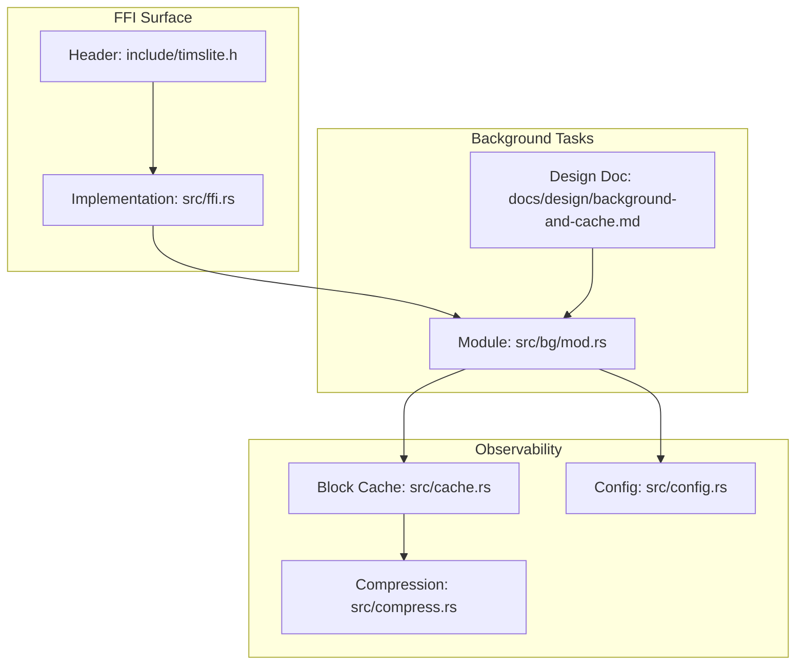
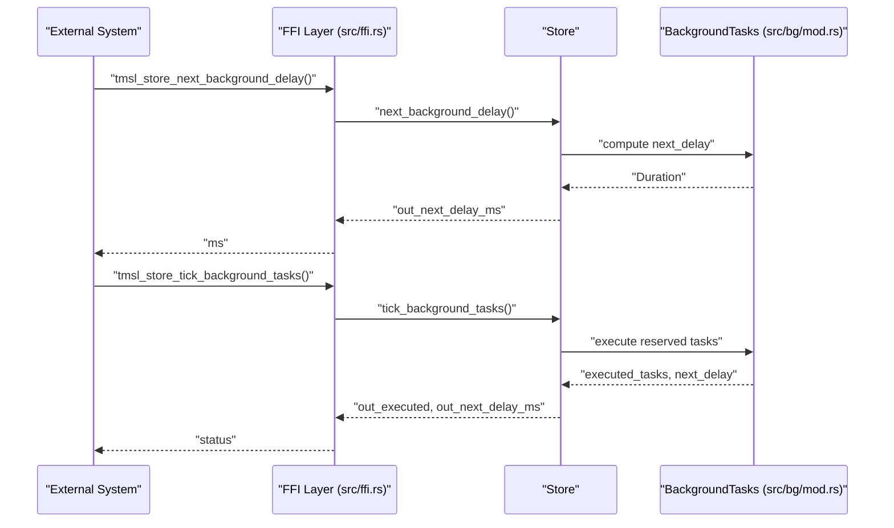
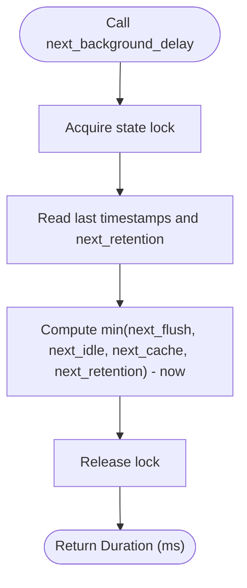
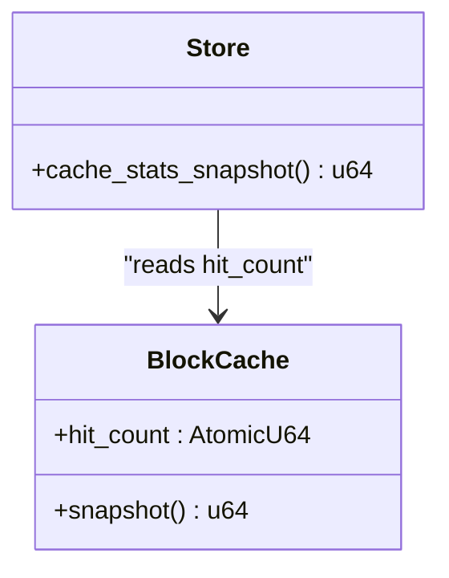
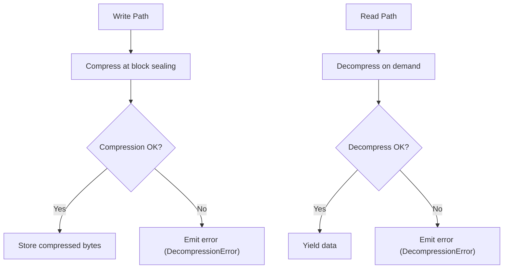
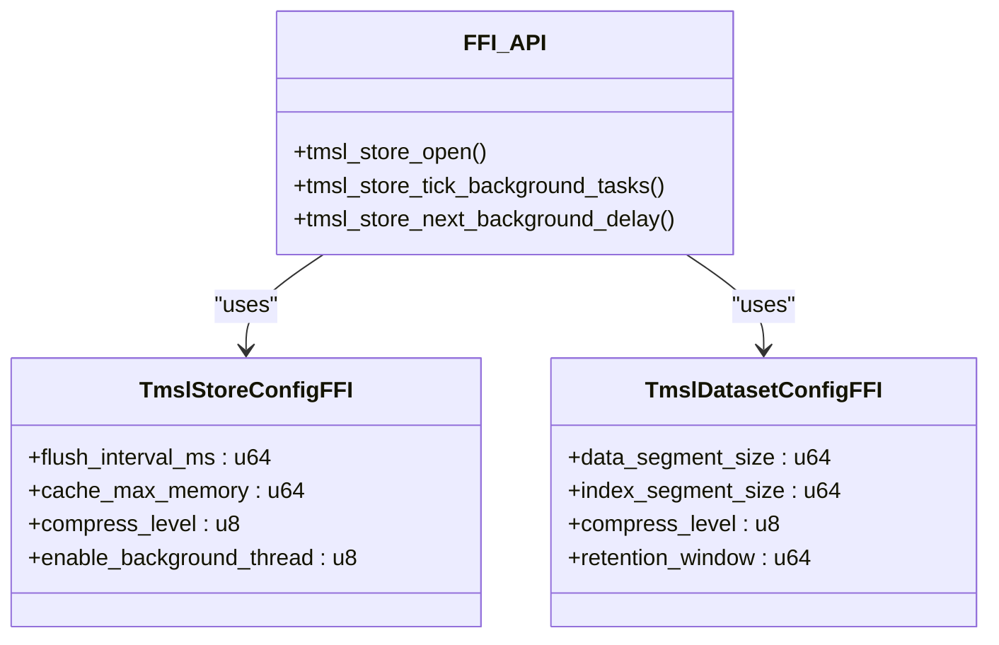
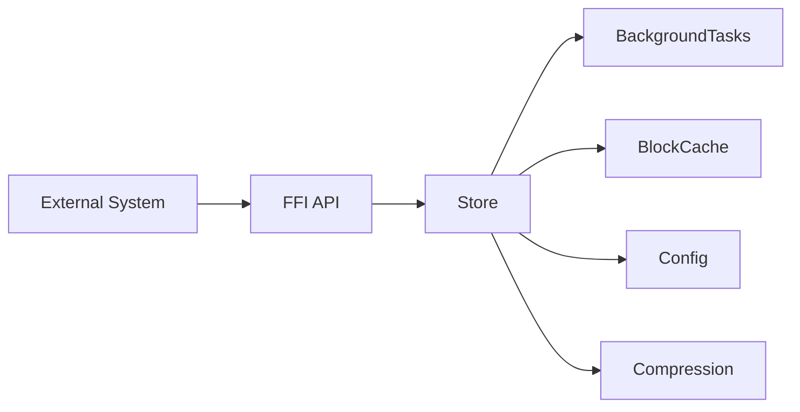

# Monitoring and Metrics

<cite>
**Referenced Files in This Document**
- [timslite.h](file://include/timslite.h)
- [mod.rs](file://src/bg/mod.rs)
- [background-and-cache.md](file://docs/design/background-and-cache.md)
- [store-and-ffi.md](file://docs/design/store-and-ffi.md)
- [ffi.rs](file://src/ffi.rs)
- [cache.rs](file://src/cache.rs)
- [compress.rs](file://src/compress.rs)
- [config.rs](file://src/config.rs)
- [error.rs](file://src/error.rs)
- [dataset_basic_test.rs](file://tests/dataset_basic_test.rs)
- [background_test.rs](file://tests/background_test.rs)
</cite>

## Table of Contents
1. [Introduction](#introduction)
2. [Project Structure](#project-structure)
3. [Core Components](#core-components)
4. [Architecture Overview](#architecture-overview)
5. [Detailed Component Analysis](#detailed-component-analysis)
6. [Dependency Analysis](#dependency-analysis)
7. [Performance Considerations](#performance-considerations)
8. [Troubleshooting Guide](#troubleshooting-guide)
9. [Conclusion](#conclusion)
10. [Appendices](#appendices)

## Introduction
This document describes monitoring and metrics for TimSLite operational performance tracking. It covers built-in metrics collection (cache statistics, compression behavior, I/O throughput proxies, and background task performance), integration with external monitoring systems via the FFI interface, custom metric collection strategies, alerting approaches, and practical dashboards and trend analysis techniques. It also provides guidance for capacity planning, regression detection, anomaly identification, log analysis, profiling, and troubleshooting workflows grounded in TimSLite’s observable surfaces.

## Project Structure
TimSLite exposes a C ABI surface for integration with external systems and provides internal observability hooks for cache hits and background task scheduling. The most relevant areas for monitoring are:
- FFI API surface for external instrumentation and control
- Background task scheduler and its scheduling signals
- Block cache with atomic hit counters
- Compression utilities and configuration

**Diagram sources**
- [timslite.h:95-124](file://include/timslite.h#L95-L124)
- [ffi.rs:101-140](file://src/ffi.rs#L101-L140)
- [mod.rs:263-300](file://src/bg/mod.rs#L263-L300)
- [background-and-cache.md:1-306](file://docs/design/background-and-cache.md#L1-L306)
- [cache.rs:46-80](file://src/cache.rs#L46-L80)
- [compress.rs:6-17](file://src/compress.rs#L6-L17)
- [config.rs:38-47](file://src/config.rs#L38-L47)

**Section sources**
- [timslite.h:95-124](file://include/timslite.h#L95-L124)
- [ffi.rs:101-140](file://src/ffi.rs#L101-L140)
- [mod.rs:263-300](file://src/bg/mod.rs#L263-L300)
- [background-and-cache.md:1-306](file://docs/design/background-and-cache.md#L1-L306)
- [cache.rs:46-80](file://src/cache.rs#L46-L80)
- [compress.rs:6-17](file://src/compress.rs#L6-L17)
- [config.rs:38-47](file://src/config.rs#L38-L47)

## Core Components
- Background task scheduling and execution signals:
  - Manual tick and next-delay APIs expose scheduling cadence and task execution counts.
  - Design doc details intervals and concurrency safety.
- Block cache hit counters:
  - Atomic counters track cache hits for basic cache utilization visibility.
- Compression configuration and behavior:
  - Compression level is configurable per dataset; compression routines provide failure diagnostics.
- FFI configuration and lifecycle:
  - Store and dataset configuration structures include cache and compression parameters exposed to external systems.

Key observability levers:
- Background task tick and next-delay queries
- Cache hit count snapshots
- Compression errors surfaced via error types

**Section sources**
- [timslite.h:95-124](file://include/timslite.h#L95-L124)
- [mod.rs:263-300](file://src/bg/mod.rs#L263-L300)
- [background-and-cache.md:1-306](file://docs/design/background-and-cache.md#L1-L306)
- [cache.rs:46-80](file://src/cache.rs#L46-L80)
- [compress.rs:6-17](file://src/compress.rs#L6-L17)
- [config.rs:38-47](file://src/config.rs#L38-L47)
- [ffi.rs:101-140](file://src/ffi.rs#L101-L140)

## Architecture Overview
The monitoring architecture centers on the FFI surface and background task scheduler. External systems can:
- Poll next-background-delay to schedule wakeups
- Invoke manual ticks to trigger flush/idle/cache/retention tasks
- Snapshot cache hit counts for utilization metrics
- Observe compression outcomes and errors

**Diagram sources**
- [timslite.h:95-124](file://include/timslite.h#L95-L124)
- [ffi.rs:101-140](file://src/ffi.rs#L101-L140)
- [mod.rs:263-300](file://src/bg/mod.rs#L263-L300)

## Detailed Component Analysis

### Background Task Metrics and Scheduling Signals
- Purpose:
  - Expose scheduling cadence and task execution counts to external systems.
- Key APIs:
  - Manual tick: returns number of tasks executed and next scheduled delay.
  - Next-delay: returns milliseconds until the next task is due.
- Behavior:
  - Tasks: flush, idle-check, cache-eviction, retention-reclaim.
  - Intervals: configurable flush interval; fixed periodic intervals for other tasks; daily retention window.
  - Concurrency: state machine with running flags prevents duplicate executions; scheduling computed dynamically.

**Diagram sources**
- [timslite.h:112-122](file://include/timslite.h#L112-L122)
- [mod.rs:276-296](file://src/bg/mod.rs#L276-L296)
- [background-and-cache.md:278-296](file://docs/design/background-and-cache.md#L278-L296)

**Section sources**
- [timslite.h:95-124](file://include/timslite.h#L95-L124)
- [mod.rs:263-300](file://src/bg/mod.rs#L263-L300)
- [background-and-cache.md:1-306](file://docs/design/background-and-cache.md#L1-L306)

### Cache Statistics
- Purpose:
  - Track cache hit rate to infer read locality and effectiveness of caching.
- Mechanism:
  - Atomic counter incremented on cache hit.
  - Snapshot method returns current hit count.
- Usage:
  - Periodically sample hit counts to compute hit rates over windows.

**Diagram sources**
- [cache.rs:46-80](file://src/cache.rs#L46-L80)
- [cache.rs:186-190](file://src/cache.rs#L186-L190)

**Section sources**
- [cache.rs:46-80](file://src/cache.rs#L46-L80)
- [cache.rs:186-190](file://src/cache.rs#L186-L190)

### Compression Metrics and Observability
- Purpose:
  - Understand compression effectiveness and detect anomalies in compression behavior.
- Mechanism:
  - Compression level configured per dataset.
  - Decompression failures surfaced as structured errors.
- Usage:
  - Track compression ratio indirectly via stored sizes and uncompressed lengths.
  - Alert on decompression errors.

**Diagram sources**
- [compress.rs:6-17](file://src/compress.rs#L6-L17)
- [error.rs:18-19](file://src/error.rs#L18-L19)

**Section sources**
- [compress.rs:6-17](file://src/compress.rs#L6-L17)
- [error.rs:18-19](file://src/error.rs#L18-L19)
- [config.rs:38-47](file://src/config.rs#L38-L47)

### FFI Configuration and Lifecycle for Monitoring
- Purpose:
  - Provide configuration structures and lifecycle functions for external monitoring and control.
- Mechanism:
  - Store and dataset configuration structs include cache and compression parameters.
  - FFI functions for opening/closing stores and datasets, and for background task control.

**Diagram sources**
- [ffi.rs:101-140](file://src/ffi.rs#L101-L140)
- [timslite.h:268-287](file://include/timslite.h#L268-L287)

**Section sources**
- [ffi.rs:101-140](file://src/ffi.rs#L101-L140)
- [timslite.h:232-310](file://include/timslite.h#L232-L310)
- [store-and-ffi.md:232-310](file://docs/design/store-and-ffi.md#L232-L310)

## Dependency Analysis
- External systems depend on FFI for:
  - Opening stores and datasets
  - Controlling and observing background task execution
- Internal dependencies:
  - Background task scheduler depends on store state and cache
  - Cache statistics depend on block cache internals
  - Compression behavior depends on configuration and error handling

**Diagram sources**
- [timslite.h:95-124](file://include/timslite.h#L95-L124)
- [ffi.rs:101-140](file://src/ffi.rs#L101-L140)
- [mod.rs:263-300](file://src/bg/mod.rs#L263-L300)
- [cache.rs:46-80](file://src/cache.rs#L46-L80)
- [compress.rs:6-17](file://src/compress.rs#L6-L17)
- [config.rs:38-47](file://src/config.rs#L38-L47)

**Section sources**
- [timslite.h:95-124](file://include/timslite.h#L95-L124)
- [ffi.rs:101-140](file://src/ffi.rs#L101-L140)
- [mod.rs:263-300](file://src/bg/mod.rs#L263-L300)
- [cache.rs:46-80](file://src/cache.rs#L46-L80)
- [compress.rs:6-17](file://src/compress.rs#L6-L17)
- [config.rs:38-47](file://src/config.rs#L38-L47)

## Performance Considerations
- Background task cadence:
  - Tune flush interval to balance durability and I/O overhead.
  - Monitor next-delay to ensure timely task execution without unnecessary wakeups.
- Cache hit rate:
  - Use cache hit snapshots to assess read locality and adjust cache size.
- Compression:
  - Higher compression levels reduce storage but increase CPU; monitor decompression errors and latency.
- Throughput proxies:
  - Count of executed background tasks can proxy I/O activity; combine with filesystem-level metrics for total throughput.

[No sources needed since this section provides general guidance]

## Troubleshooting Guide
- Decompression errors:
  - Indicates corruption or incompatible versions; escalate to data integrity checks.
- Unexpected delays:
  - Verify next-delay values and background thread configuration; ensure external event loops honor returned delays.
- Cache starvation:
  - Low hit rate combined with high memory pressure suggests tuning cache size or access patterns.

**Section sources**
- [error.rs:18-19](file://src/error.rs#L18-L19)
- [background-and-cache.md:297-306](file://docs/design/background-and-cache.md#L297-L306)
- [cache.rs:186-190](file://src/cache.rs#L186-L190)

## Conclusion
TimSLite offers a pragmatic set of observability primitives: background task scheduling signals, cache hit counters, and compression error reporting. Combined with the FFI surface, operators can build robust monitoring, alerting, and dashboards to track operational performance, capacity, and regressions. The design doc and module-level code provide precise semantics for integrating these signals into external systems.

[No sources needed since this section summarizes without analyzing specific files]

## Appendices

### Built-in Metrics Inventory
- Background task metrics
  - Executed tasks per tick
  - Next scheduled delay (ms)
- Cache metrics
  - Cache hit count snapshot
- Compression metrics
  - Decompression error events
  - Compression level per dataset

**Section sources**
- [timslite.h:95-124](file://include/timslite.h#L95-L124)
- [cache.rs:46-80](file://src/cache.rs#L46-L80)
- [compress.rs:6-17](file://src/compress.rs#L6-L17)
- [error.rs:18-19](file://src/error.rs#L18-L19)

### Monitoring Integration with External Systems
- Use FFI to:
  - Open stores and datasets
  - Poll next-background-delay for scheduling
  - Manually tick background tasks for deterministic control
- Export metrics to external systems using the observed signals.

**Section sources**
- [timslite.h:268-287](file://include/timslite.h#L268-L287)
- [store-and-ffi.md:209-231](file://docs/design/store-and-ffi.md#L209-L231)

### Custom Metric Collection Strategies
- Derive cache hit rate from hit count snapshots over time windows.
- Compute compression ratio proxies using stored vs. uncompressed sizes.
- Aggregate executed task counts to approximate I/O throughput.

**Section sources**
- [cache.rs:186-190](file://src/cache.rs#L186-L190)
- [compress.rs:6-17](file://src/compress.rs#L6-L17)

### Alerting Strategies
- Immediate:
  - Decompression errors
  - Excessively long next-delay values indicating stalled background work
- Trend-based:
  - Declining cache hit rate
  - Rising compression error frequency
- Capacity:
  - Near-full retention windows or cache memory thresholds

**Section sources**
- [error.rs:18-19](file://src/error.rs#L18-L19)
- [background-and-cache.md:297-306](file://docs/design/background-and-cache.md#L297-L306)
- [cache.rs:186-190](file://src/cache.rs#L186-L190)

### Performance Dashboards and KPIs
- KPIs:
  - Background task execution rate
  - Cache hit rate
  - Compression error rate
- Panels:
  - Task execution histogram
  - Cache hit rate over time
  - Compression error timeline

**Section sources**
- [timslite.h:95-124](file://include/timslite.h#L95-L124)
- [cache.rs:186-190](file://src/cache.rs#L186-L190)
- [compress.rs:6-17](file://src/compress.rs#L6-L17)

### Trend Analysis and Regression Detection
- Establish baselines for:
  - Background task latencies
  - Cache hit rate
  - Compression error rate
- Use moving averages and control charts to detect deviations.

**Section sources**
- [background-and-cache.md:278-296](file://docs/design/background-and-cache.md#L278-L296)
- [cache.rs:186-190](file://src/cache.rs#L186-L190)
- [compress.rs:6-17](file://src/compress.rs#L6-L17)

### Anomaly Identification
- Sudden spikes in:
  - Decompression errors
  - Background task execution counts
- Sustained drops in:
  - Cache hit rate
- Investigate configuration drift and workload changes.

**Section sources**
- [error.rs:18-19](file://src/error.rs#L18-L19)
- [background-and-cache.md:297-306](file://docs/design/background-and-cache.md#L297-L306)
- [cache.rs:186-190](file://src/cache.rs#L186-L190)

### Log Analysis and Profiling
- Correlate logs with:
  - Background task tick results
  - Cache hit snapshots
  - Compression error events
- Profile write/read paths by measuring:
  - Time-to-first-byte for queries
  - Batch write throughput

**Section sources**
- [background-and-cache.md:239-255](file://docs/design/background-and-cache.md#L239-L255)
- [cache.rs:186-190](file://src/cache.rs#L186-L190)
- [compress.rs:6-17](file://src/compress.rs#L6-L17)

### Operational Workflows Using Metrics Data
- Capacity planning:
  - Use retention window and segment sizes to estimate growth; monitor cache hit rate to size buffers.
- Performance regression detection:
  - Track rolling averages of task execution times and cache hit rates.
- Troubleshooting:
  - On alerts, capture next-delay, executed tasks, and cache hit snapshots; verify compression error logs.

**Section sources**
- [config.rs:38-47](file://src/config.rs#L38-L47)
- [cache.rs:186-190](file://src/cache.rs#L186-L190)
- [error.rs:18-19](file://src/error.rs#L18-L19)