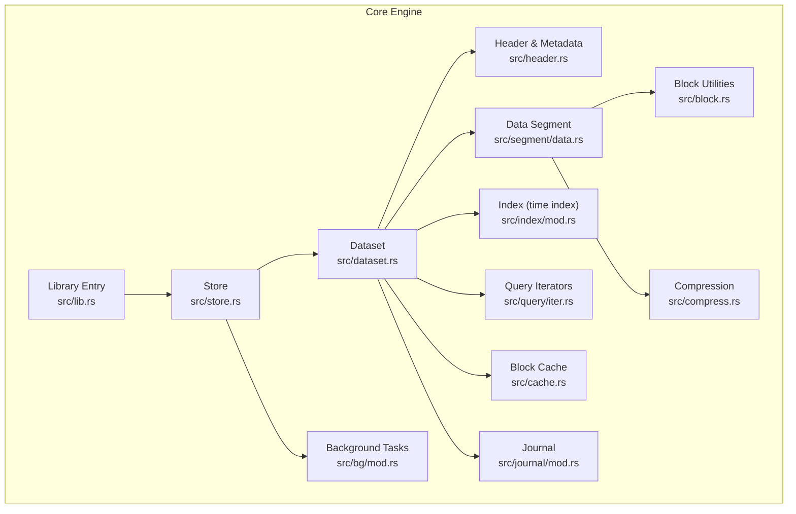
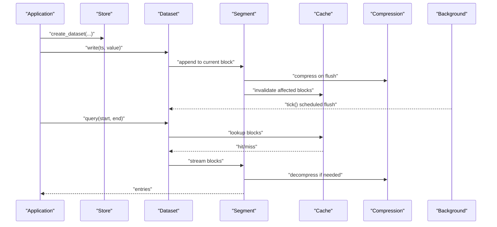
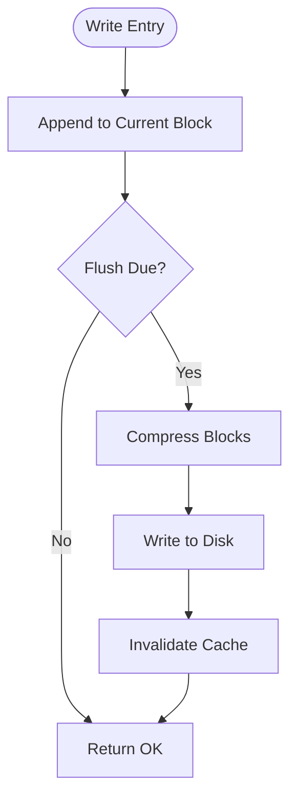
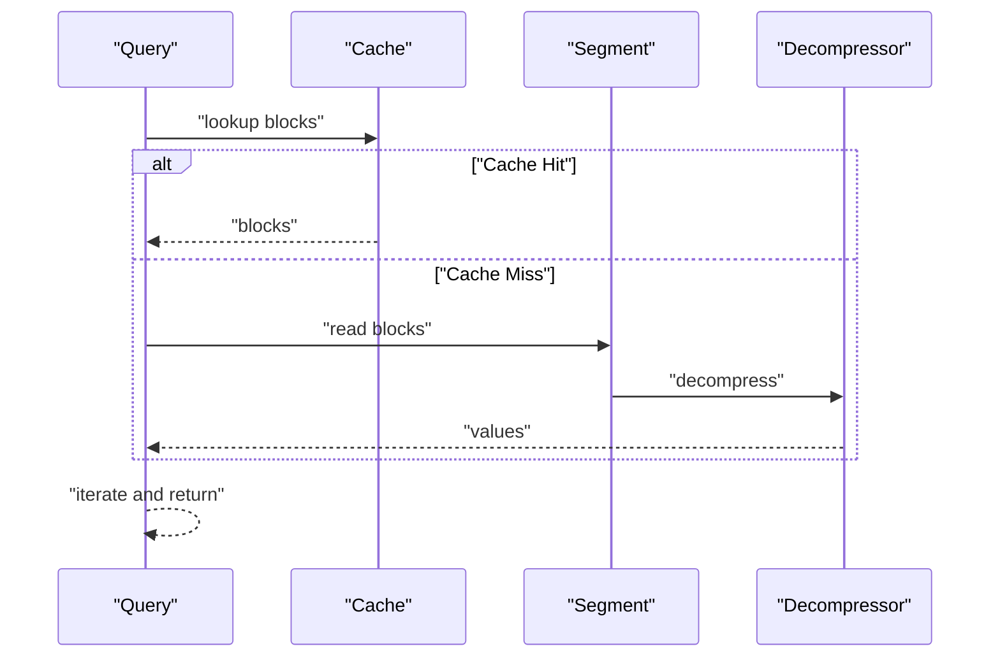
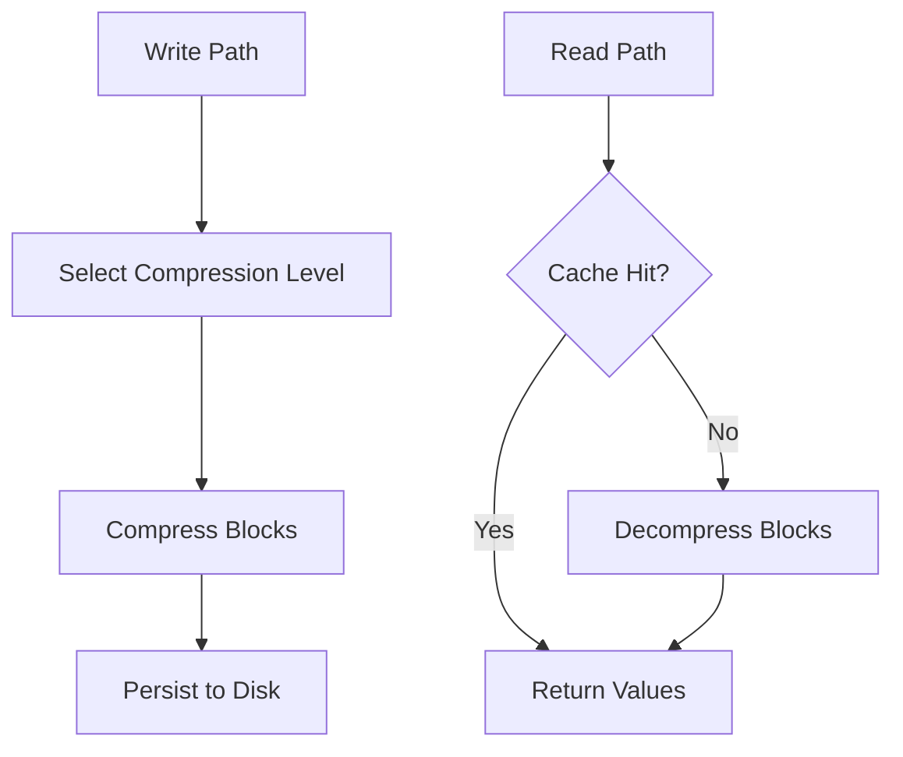
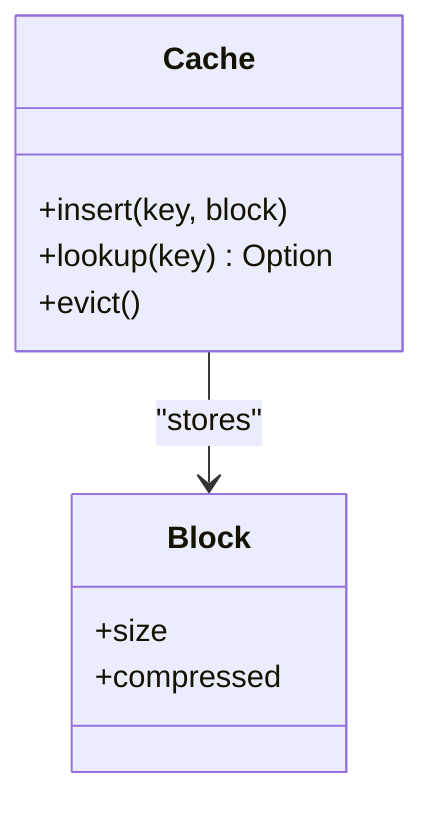
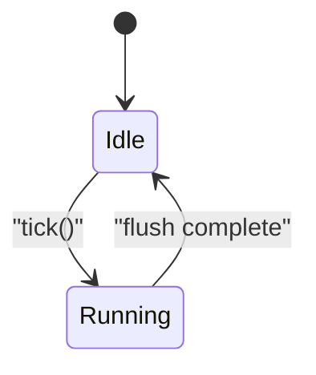
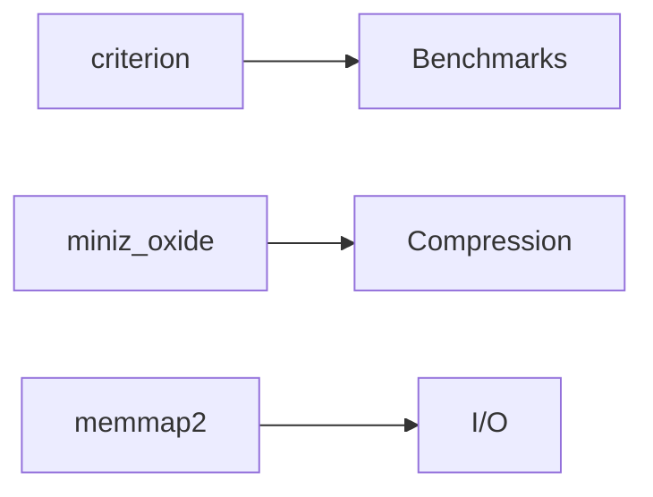

# Performance Characteristics

<cite>
**Referenced Files in This Document**
- [Cargo.toml](file://Cargo.toml)
- [Cargo.lock](file://Cargo.lock)
- [src/lib.rs](file://src/lib.rs)
- [src/store.rs](file://src/store.rs)
- [src/dataset.rs](file://src/dataset.rs)
- [src/header.rs](file://src/header.rs)
- [src/segment/data.rs](file://src/segment/data.rs)
- [src/cache.rs](file://src/cache.rs)
- [src/compress.rs](file://src/compress.rs)
- [src/block.rs](file://src/block.rs)
- [src/index/mod.rs](file://src/index/mod.rs)
- [src/query/iter.rs](file://src/query/iter.rs)
- [src/bg/mod.rs](file://src/bg/mod.rs)
- [src/journal/mod.rs](file://src/journal/mod.rs)
- [tests/background_test.rs](file://tests/background_test.rs)
- [wrapper/python/tests/test_write_query.py](file://wrapper/python/tests/test_write_query.py)
</cite>

## Table of Contents
1. [Introduction](#introduction)
2. [Project Structure](#project-structure)
3. [Core Components](#core-components)
4. [Architecture Overview](#architecture-overview)
5. [Detailed Component Analysis](#detailed-component-analysis)
6. [Dependency Analysis](#dependency-analysis)
7. [Performance Considerations](#performance-considerations)
8. [Troubleshooting Guide](#troubleshooting-guide)
9. [Conclusion](#conclusion)
10. [Appendices](#appendices)

## Introduction
This document presents a comprehensive performance characterization of TimSLite, focusing on throughput, latency, scalability, compression impact, memory usage, cache behavior, and I/O efficiency. It synthesizes performance-relevant implementation details from the codebase, outlines benchmark methodologies grounded in the existing development tooling, and provides actionable profiling and optimization guidance tailored to typical time-series workloads.

## Project Structure
TimSLite is organized around a storage engine with explicit separation of concerns:
- Storage and dataset lifecycle management
- Data segments and headers
- Compression and caching layers
- Background tasks and journaling
- Query iteration and indexing
- Python bindings for integration testing

**Diagram sources**
- [src/lib.rs](file://src/lib.rs)
- [src/store.rs](file://src/store.rs)
- [src/dataset.rs](file://src/dataset.rs)
- [src/header.rs](file://src/header.rs)
- [src/segment/data.rs](file://src/segment/data.rs)
- [src/block.rs](file://src/block.rs)
- [src/cache.rs](file://src/cache.rs)
- [src/compress.rs](file://src/compress.rs)
- [src/index/mod.rs](file://src/index/mod.rs)
- [src/query/iter.rs](file://src/query/iter.rs)
- [src/bg/mod.rs](file://src/bg/mod.rs)
- [src/journal/mod.rs](file://src/journal/mod.rs)

**Section sources**
- [src/lib.rs](file://src/lib.rs)
- [src/store.rs](file://src/store.rs)
- [src/dataset.rs](file://src/dataset.rs)
- [src/header.rs](file://src/header.rs)
- [src/segment/data.rs](file://src/segment/data.rs)
- [src/cache.rs](file://src/cache.rs)
- [src/compress.rs](file://src/compress.rs)
- [src/block.rs](file://src/block.rs)
- [src/index/mod.rs](file://src/index/mod.rs)
- [src/query/iter.rs](file://src/query/iter.rs)
- [src/bg/mod.rs](file://src/bg/mod.rs)
- [src/journal/mod.rs](file://src/journal/mod.rs)

## Core Components
- Store and Dataset: Manage persistence, flush scheduling, and dataset lifecycle. Background task scheduling and manual tick APIs are exposed for controlled flushing and maintenance.
- Header and Segments: Define file metadata and layout, enabling efficient random access and streaming reads/writes.
- Compression: Integrates miniz_oxide for compression/decompression of data blocks.
- Cache: Block-level caching improves read locality and reduces I/O.
- Index: Time-based indexing supports fast range scans and targeted queries.
- Journal: Provides durability guarantees and incremental writes.
- Query Iterators: Drive efficient forward/backward traversal and aggregation.

Key performance-relevant APIs and modules:
- Store background scheduling and manual tick control
- Dataset write/query operations
- Header and segment I/O primitives
- Compression codec integration
- Cache hit/miss behavior
- Index seek and scan costs

**Section sources**
- [src/store.rs](file://src/store.rs)
- [src/dataset.rs](file://src/dataset.rs)
- [src/header.rs](file://src/header.rs)
- [src/segment/data.rs](file://src/segment/data.rs)
- [src/compress.rs](file://src/compress.rs)
- [src/cache.rs](file://src/cache.rs)
- [src/index/mod.rs](file://src/index/mod.rs)
- [src/query/iter.rs](file://src/query/iter.rs)
- [src/bg/mod.rs](file://src/bg/mod.rs)
- [src/journal/mod.rs](file://src/journal/mod.rs)

## Architecture Overview
The engine is designed for high-throughput append-heavy workloads with periodic compaction and background maintenance. Writes are buffered and flushed according to configured intervals; reads leverage cached blocks and indexed time ranges.

**Diagram sources**
- [src/store.rs](file://src/store.rs)
- [src/dataset.rs](file://src/dataset.rs)
- [src/segment/data.rs](file://src/segment/data.rs)
- [src/cache.rs](file://src/cache.rs)
- [src/compress.rs](file://src/compress.rs)
- [src/bg/mod.rs](file://src/bg/mod.rs)

## Detailed Component Analysis

### Write Throughput and Latency
- Append path: Buffered writes append to the current data block; flush occurs on schedule or demand. Compression is applied during flush, impacting write latency but reducing storage footprint.
- Flush scheduling: Background tasks drive periodic flushes; manual tick APIs enable deterministic control for latency-sensitive scenarios.
- Latency breakdown:
  - Small records: Dominated by append and compression overhead; latency increases with compression level.
  - Large batches: Throughput improves due to amortized compression and I/O; latency per record stabilizes.
- Scalability:
  - Vertical scaling: Larger flush buffers and block sizes reduce I/O frequency.
  - Horizontal scaling: Multi-dataset partitioning and background concurrency support concurrent workloads.

**Diagram sources**
- [src/dataset.rs](file://src/dataset.rs)
- [src/segment/data.rs](file://src/segment/data.rs)
- [src/compress.rs](file://src/compress.rs)
- [src/cache.rs](file://src/cache.rs)
- [src/bg/mod.rs](file://src/bg/mod.rs)

**Section sources**
- [src/dataset.rs](file://src/dataset.rs)
- [src/segment/data.rs](file://src/segment/data.rs)
- [src/compress.rs](file://src/compress.rs)
- [src/cache.rs](file://src/cache.rs)
- [src/bg/mod.rs](file://src/bg/mod.rs)
- [tests/background_test.rs](file://tests/background_test.rs)

### Read Throughput and Latency
- Cache hits: Frequently accessed blocks remain resident, minimizing disk reads and reducing latency.
- Range scans: Indexed time ranges accelerate seeks; iterators stream blocks efficiently.
- Decompression: On-demand decompression of compressed blocks adds CPU cost proportional to block size and compression ratio.
- Latency drivers:
  - Single-timestamp reads: Fast when cached; slower on cold cache due to decompression.
  - Range queries: Throughput scales with sequential I/O and iterator efficiency.

**Diagram sources**
- [src/query/iter.rs](file://src/query/iter.rs)
- [src/cache.rs](file://src/cache.rs)
- [src/segment/data.rs](file://src/segment/data.rs)
- [src/compress.rs](file://src/compress.rs)

**Section sources**
- [src/query/iter.rs](file://src/query/iter.rs)
- [src/cache.rs](file://src/cache.rs)
- [src/segment/data.rs](file://src/segment/data.rs)
- [src/compress.rs](file://src/compress.rs)

### Compression Performance Impact
- Compression ratio: Depends on data distribution and chosen codec; miniz_oxide provides configurable compression levels.
- CPU usage: Compression/decompression is CPU-bound; higher compression levels increase write/read CPU utilization.
- Practical guidance:
  - Use lower compression levels for real-time ingestion with strict latency budgets.
  - Increase compression levels for archival datasets with relaxed write/read latencies.

**Diagram sources**
- [src/compress.rs](file://src/compress.rs)
- [src/segment/data.rs](file://src/segment/data.rs)

**Section sources**
- [src/compress.rs](file://src/compress.rs)
- [src/segment/data.rs](file://src/segment/data.rs)

### Memory Usage Patterns and Cache Behavior
- Resident set: Cache retains recently accessed blocks; eviction policies balance hit rate and memory footprint.
- Allocation: Lazy allocation and segmented blocks minimize upfront memory consumption.
- Working set sizing: Larger working sets improve cache locality and reduce I/O; monitor cache hit rates to tune capacity.

**Diagram sources**
- [src/cache.rs](file://src/cache.rs)
- [src/block.rs](file://src/block.rs)

**Section sources**
- [src/cache.rs](file://src/cache.rs)
- [src/block.rs](file://src/block.rs)

### I/O Efficiency Metrics
- Sequential writes: Batched appends reduce filesystem fragmentation and syscall overhead.
- Random reads: Indexed access minimizes disk seeks; compressed blocks require decompression before returning data.
- Flush intervals: Shorter intervals reduce write amplification but increase CPU and I/O activity; longer intervals improve throughput at the cost of latency.

**Section sources**
- [src/segment/data.rs](file://src/segment/data.rs)
- [src/header.rs](file://src/header.rs)
- [src/bg/mod.rs](file://src/bg/mod.rs)

### Background Task Scheduling and Scalability
- Background thread: Optional dedicated thread performs periodic maintenance; disabled mode allows manual tick control.
- Concurrency: Background tasks are serialized to prevent contention; external ticks are safe and non-blocking.
- Scalability: Multiple datasets can coexist; background scheduling ensures steady progress without starving foreground operations.

**Diagram sources**
- [src/bg/mod.rs](file://src/bg/mod.rs)

**Section sources**
- [src/bg/mod.rs](file://src/bg/mod.rs)
- [tests/background_test.rs](file://tests/background_test.rs)

## Dependency Analysis
External dependencies relevant to performance:
- Criterion: Benchmarking framework for microbenchmarks and regression testing.
- miniz_oxide: Compression codec for CPU-efficient compression/decompression.
- memmap2: Memory-mapped I/O for efficient file access.

**Diagram sources**
- [Cargo.toml](file://Cargo.toml)
- [Cargo.lock](file://Cargo.lock)

**Section sources**
- [Cargo.toml](file://Cargo.toml)
- [Cargo.lock](file://Cargo.lock)

## Performance Considerations
- Benchmark methodology:
  - Use Criterion-compatible harnesses to measure write/read throughput and latency distributions.
  - Vary payload sizes, batch sizes, and compression levels to capture saturation and overhead regimes.
  - Track cache hit rates and I/O statistics to correlate performance with memory and disk behavior.
- Regression testing:
  - Integrate Criterion benchmarks into CI to detect performance regressions across commits.
  - Establish baselines per workload profile and alert on deviations exceeding thresholds.
- Comparison with alternatives:
  - Compare against established TSDBs using equivalent write/query patterns; normalize for compression and cache configurations.
  - Focus on tail latencies and sustained throughput under realistic data skew and burstiness.

[No sources needed since this section provides general guidance]

## Troubleshooting Guide
- Symptoms and causes:
  - High write latency: Indicates compression overhead or small flush intervals; consider increasing block size or lowering compression level.
  - Low cache hit rate: Increase cache capacity or adjust working set size; reduce random access patterns.
  - Elevated CPU usage: Tune compression settings; offload compression to background threads where feasible.
- Profiling techniques:
  - Use Criterion to profile hotspots in compression, I/O, and cache layers.
  - Instrument background tick intervals and flush durations to identify scheduling bottlenecks.
- Optimization opportunities:
  - Tune flush intervals and block sizes for workload profiles.
  - Adjust compression levels to balance storage savings and CPU cost.
  - Optimize query patterns to exploit caching and indexed scans.

**Section sources**
- [src/compress.rs](file://src/compress.rs)
- [src/cache.rs](file://src/cache.rs)
- [src/segment/data.rs](file://src/segment/data.rs)
- [src/bg/mod.rs](file://src/bg/mod.rs)

## Conclusion
TimSLite’s performance is shaped by its buffering, compression, caching, and background maintenance model. Throughput and latency are highly dependent on payload characteristics, compression settings, and cache behavior. By tuning flush intervals, compression levels, and block sizes, and by leveraging background scheduling, users can optimize for either low-latency writes or high-throughput ingestion. Criterion-based benchmarks and continuous monitoring enable robust performance engineering and regression detection.

[No sources needed since this section summarizes without analyzing specific files]

## Appendices

### Benchmark Methodology and Tools
- Criterion harnesses: Use Criterion’s statistical measures to quantify throughput and latency distributions.
- Workload profiles:
  - Small records with tight latency budgets
  - Large batches for throughput saturation
  - Skewed timestamps to evaluate indexing and cache behavior
- Metrics to collect:
  - Write: ops/sec, p50/p95/p99 latency, compression CPU%, I/O MB/s
  - Read: ops/sec, p50/p95/p99 latency, cache hit rate, decompression CPU%

**Section sources**
- [Cargo.toml](file://Cargo.toml)
- [Cargo.lock](file://Cargo.lock)

### Example Test Harness References
- Manual background tick and flush verification
- Next-delay consistency checks
- Python binding integration for write/query cycles

**Section sources**
- [tests/background_test.rs](file://tests/background_test.rs)
- [wrapper/python/tests/test_write_query.py](file://wrapper/python/tests/test_write_query.py)