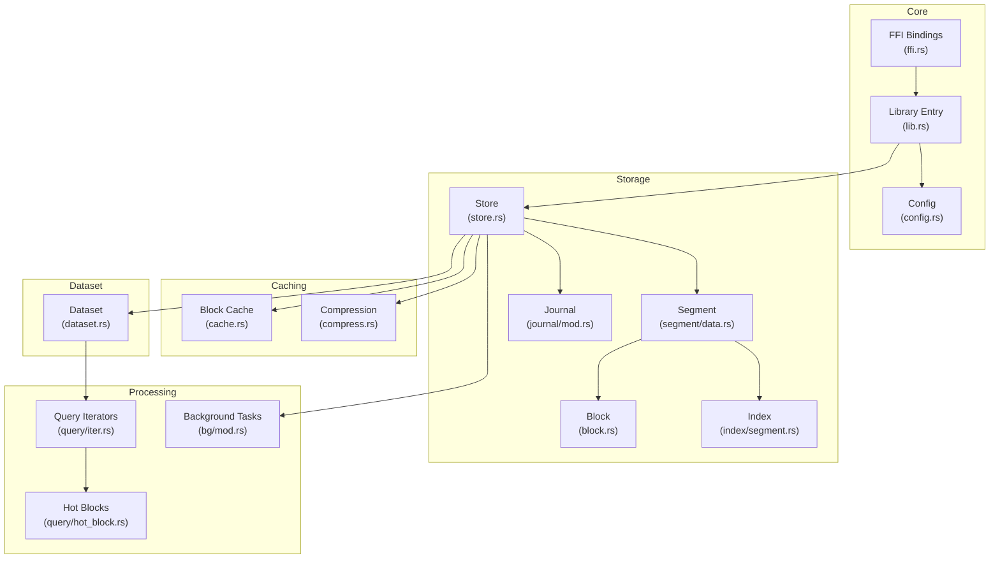
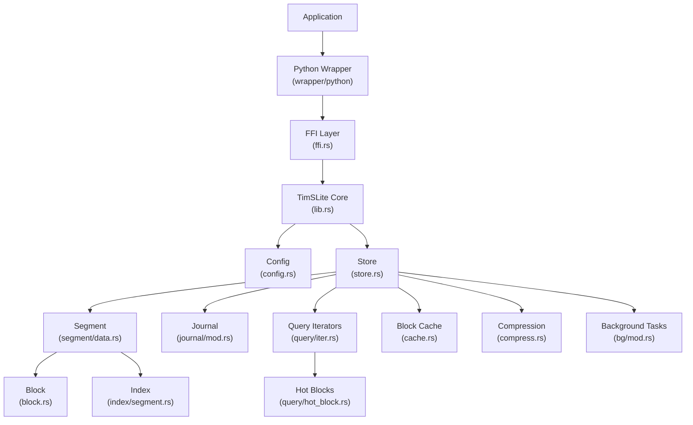
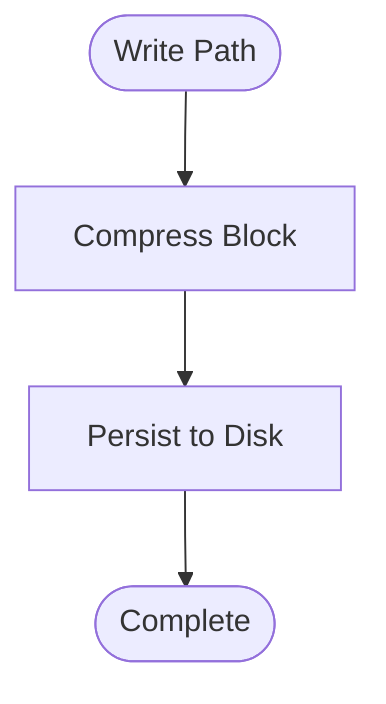
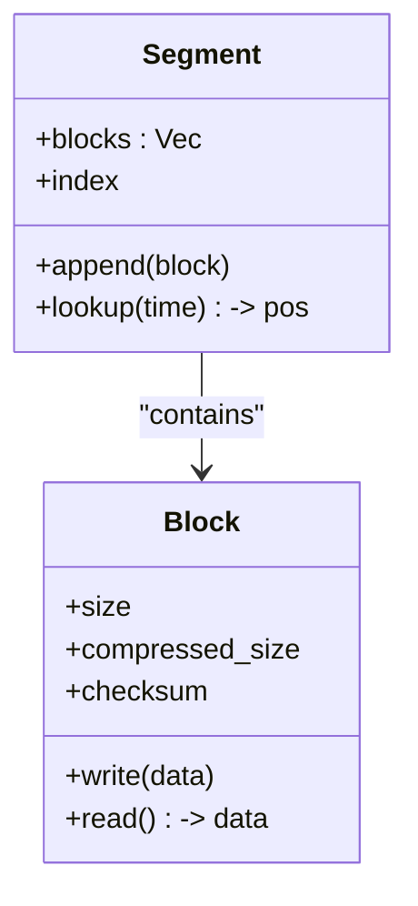
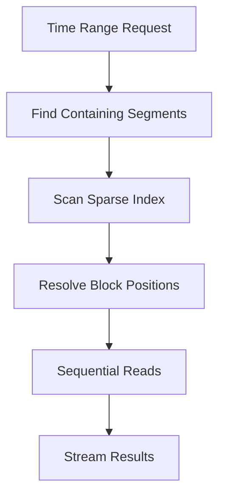
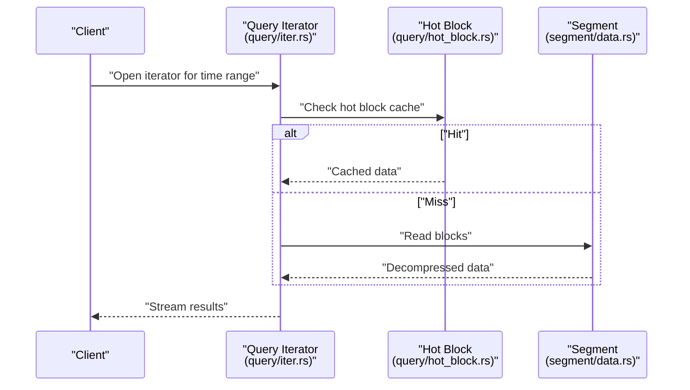
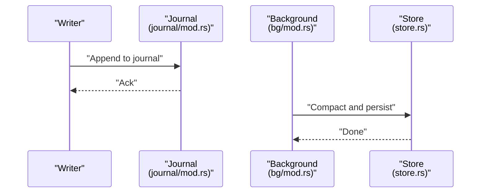
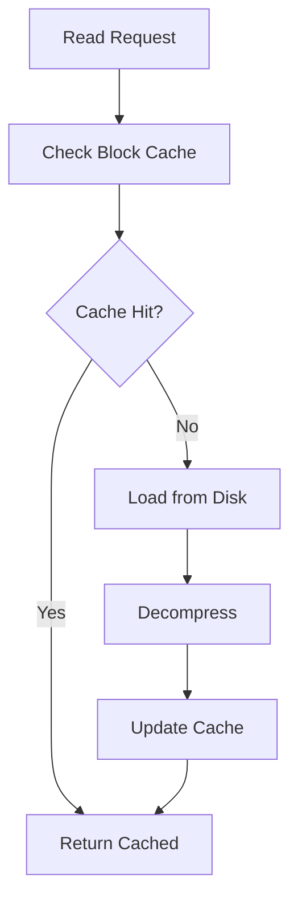
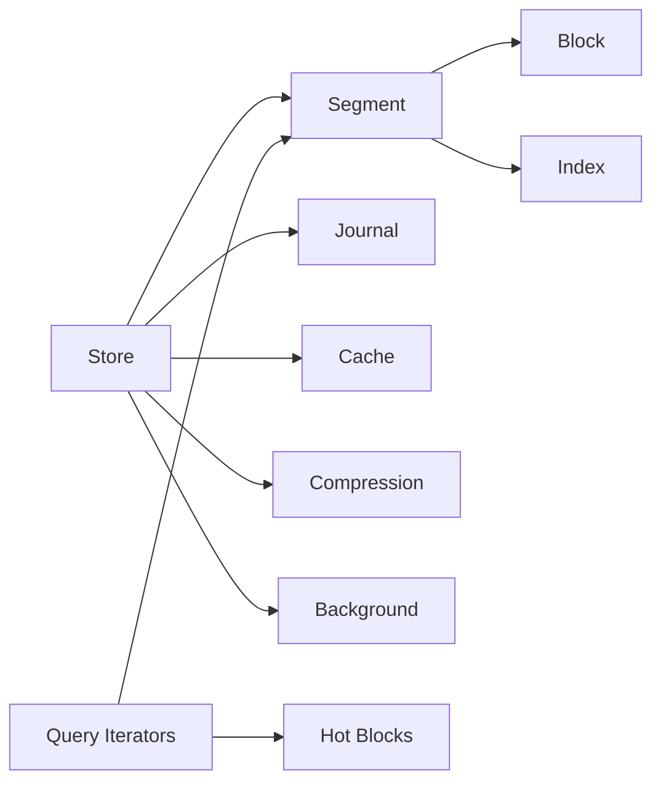

# Performance and Tuning

<cite>
**Referenced Files in This Document**
- [Cargo.toml](file://Cargo.toml)
- [lib.rs](file://src/lib.rs)
- [config.rs](file://src/config.rs)
- [compress.rs](file://src/compress.rs)
- [cache.rs](file://src/cache.rs)
- [block.rs](file://src/block.rs)
- [segment/data.rs](file://src/segment/data.rs)
- [index/segment.rs](file://src/index/segment.rs)
- [query/iter.rs](file://src/query/iter.rs)
- [query/hot_block.rs](file://src/query/hot_block.rs)
- [journal/mod.rs](file://src/journal/mod.rs)
- [bg/mod.rs](file://src/bg/mod.rs)
- [store.rs](file://src/store.rs)
- [dataset.rs](file://src/dataset.rs)
- [ffi.rs](file://src/ffi.rs)
- [design.md](file://design.md)
- [docs/design/architecture.md](file://docs/design/architecture.md)
- [docs/design/compression.md](file://docs/design/compression.md)
- [docs/design/queue-overview.md](file://docs/design/queue-overview.md)
- [docs/design/queue-state-file.md](file://docs/design/queue-state-file.md)
- [docs/design/time-index.md](file://docs/design/time-index.md)
- [docs/design/background.md](file://docs/design/background.md)
- [docs/plan/phase-08-tests-perf.md](file://docs/plan/phase-08-tests-perf.md)
- [docs/plan/phase-09-blockcache.md](file://docs/plan/phase-09-blockcache.md)
- [docs/plan/phase-10-continuous-storage.md](file://docs/plan/phase-10-continuous-storage.md)
- [docs/plan/phase-11-o1-optimization.md](file://docs/plan/phase-11-o1-optimization.md)
- [docs/plan/phase-12-lazy-allocation.md](file://docs/plan/phase-12-lazy-allocation.md)
- [docs/plan/phase-13-query-iterator.md](file://docs/plan/phase-13-query-iterator.md)
- [docs/plan/phase-14-dataset-config-builder.md](file://docs/plan/phase-14-dataset-config-builder.md)
- [docs/plan/phase-15-header-state-split.md](file://docs/plan/phase-15-header-state-split.md)
- [docs/plan/phase-16-data-retention.md](file://docs/plan/phase-16-data-retention.md)
- [docs/plan/phase-17-correction-write.md](file://docs/plan/phase-17-correction-write.md)
- [docs/plan/phase-18-out-of-order-write-and-delete.md](file://docs/plan/phase-18-out-of-order-write-and-delete.md)
- [docs/plan/phase-19-single-timestamp-read.md](file://docs/plan/phase-19-single-timestamp-read.md)
- [docs/plan/phase-20-latest-timestamp-read.md](file://docs/plan/phase-20-latest-timestamp-read.md)
- [docs/plan/phase-21-manual-bg-execution.md](file://docs/plan/phase-21-manual-bg-execution.md)
- [docs/plan/phase-22-manual-bg-python-wrapper.md](file://docs/plan/phase-22-manual-bg-python-wrapper.md)
- [docs/plan/phase-23-record-length-u32.md](file://docs/plan/phase-23-record-length-u32.md)
- [docs/plan/phase-24-sparse-continuous-index.md](file://docs/plan/phase-24-sparse-continuous-index.md)
- [docs/plan/phase-25-header-variable-length.md](file://docs/plan/phase-25-header-variable-length.md)
- [docs/plan/phase-26-github-actions-ci.md](file://docs/plan/phase-26-github-actions-ci.md)
- [docs/plan/phase-27-queue-module.md](file://docs/plan/phase-27-queue-module.md)
- [docs/plan/phase-28-journal.md](file://docs/plan/phase-28-journal.md)
- [docs/plan/phase-29-dataset-append.md](file://docs/plan/phase-29-dataset-append.md)
- [tests/background_test.rs](file://tests/background_test.rs)
- [tests/config_test.rs](file://tests/config_test.rs)
- [tests/dataset_basic_test.rs](file://tests/dataset_basic_test.rs)
- [tests/query_test.rs](file://tests/query_test.rs)
- [tests/queue_test.rs](file://tests/queue_test.rs)
</cite>

## Table of Contents
1. [Introduction](#introduction)
2. [Project Structure](#project-structure)
3. [Core Components](#core-components)
4. [Architecture Overview](#architecture-overview)
5. [Detailed Component Analysis](#detailed-component-analysis)
6. [Dependency Analysis](#dependency-analysis)
7. [Performance Considerations](#performance-considerations)
8. [Troubleshooting Guide](#troubleshooting-guide)
9. [Conclusion](#conclusion)
10. [Appendices](#appendices)

## Introduction
This document provides comprehensive performance documentation for TimSLite, focusing on throughput, latency, scalability, and configuration tuning. It synthesizes performance-relevant design decisions, implementation details, and operational guidance derived from the codebase and design documents. It also outlines monitoring, bottleneck identification, and optimization strategies grounded in the repository’s architecture and plans.

## Project Structure
TimSLite is a Rust-based time-series storage library with a modular design emphasizing efficient I/O, indexing, compression, caching, and background processing. Key performance-critical modules include:
- Compression and block-level storage
- Segment and index structures
- Query iterators and hot blocks
- Journal and background tasks
- Configuration and dataset lifecycle

**Diagram sources**
- [lib.rs](file://src/lib.rs)
- [config.rs](file://src/config.rs)
- [store.rs](file://src/store.rs)
- [segment/data.rs](file://src/segment/data.rs)
- [block.rs](file://src/block.rs)
- [index/segment.rs](file://src/index/segment.rs)
- [journal/mod.rs](file://src/journal/mod.rs)
- [query/iter.rs](file://src/query/iter.rs)
- [query/hot_block.rs](file://src/query/hot_block.rs)
- [bg/mod.rs](file://src/bg/mod.rs)
- [cache.rs](file://src/cache.rs)
- [compress.rs](file://src/compress.rs)
- [dataset.rs](file://src/dataset.rs)
- [ffi.rs](file://src/ffi.rs)

**Section sources**
- [Cargo.toml:1-200](file://Cargo.toml#L1-L200)
- [lib.rs:1-200](file://src/lib.rs#L1-L200)
- [docs/design/architecture.md:1-200](file://docs/design/architecture.md#L1-L200)

## Core Components
- Configuration: Centralizes performance-related knobs such as block size, cache sizes, and compression settings.
- Compression: Provides compression/decompression routines impacting CPU, memory, and I/O bandwidth.
- Block and Segment: Low-level storage units enabling contiguous reads/writes and indexable access.
- Index: Supports fast time-range scans and positional lookups.
- Query Iterators: Efficient streaming over time windows with hot block caching.
- Journal: Ensures durability and incremental persistence for recent writes.
- Background Tasks: Offloads maintenance work (compaction, retention) to avoid write stalls.
- Dataset Lifecycle: Manages creation, append, and read operations with performance-aware defaults.

**Section sources**
- [config.rs:1-200](file://src/config.rs#L1-L200)
- [compress.rs:1-200](file://src/compress.rs#L1-L200)
- [block.rs:1-200](file://src/block.rs#L1-L200)
- [segment/data.rs:1-200](file://src/segment/data.rs#L1-L200)
- [index/segment.rs:1-200](file://src/index/segment.rs#L1-L200)
- [query/iter.rs:1-200](file://src/query/iter.rs#L1-L200)
- [query/hot_block.rs:1-200](file://src/query/hot_block.rs#L1-L200)
- [journal/mod.rs:1-200](file://src/journal/mod.rs#L1-L200)
- [bg/mod.rs:1-200](file://src/bg/mod.rs#L1-L200)
- [dataset.rs:1-200](file://src/dataset.rs#L1-L200)

## Architecture Overview
TimSLite’s architecture balances low-level I/O efficiency with higher-level abstractions for time-series workloads. The design emphasizes:
- Block-level compression and decompression
- Hot block caching for frequent reads
- Sparse continuous index for time-range scans
- Journal-backed recent data for low-latency writes
- Background tasks for compaction and retention

**Diagram sources**
- [ffi.rs:1-200](file://src/ffi.rs#L1-L200)
- [lib.rs:1-200](file://src/lib.rs#L1-L200)
- [config.rs:1-200](file://src/config.rs#L1-L200)
- [store.rs:1-200](file://src/store.rs#L1-L200)
- [segment/data.rs:1-200](file://src/segment/data.rs#L1-L200)
- [block.rs:1-200](file://src/block.rs#L1-L200)
- [index/segment.rs:1-200](file://src/index/segment.rs#L1-L200)
- [journal/mod.rs:1-200](file://src/journal/mod.rs#L1-L200)
- [query/iter.rs:1-200](file://src/query/iter.rs#L1-L200)
- [query/hot_block.rs:1-200](file://src/query/hot_block.rs#L1-L200)
- [cache.rs:1-200](file://src/cache.rs#L1-L200)
- [compress.rs:1-200](file://src/compress.rs#L1-L200)
- [bg/mod.rs:1-200](file://src/bg/mod.rs#L1-L200)

## Detailed Component Analysis

### Compression System
- Purpose: Reduce I/O bandwidth and storage footprint via block-level compression.
- Impact: Improves throughput under constrained I/O but increases CPU usage; affects latency and memory during decompression.
- Configuration: Tune compression level and algorithm selection via configuration module.
- Implementation: Compression routines operate on block boundaries to minimize partial recompression overhead.

**Diagram sources**
- [compress.rs:1-200](file://src/compress.rs#L1-L200)
- [segment/data.rs:1-200](file://src/segment/data.rs#L1-L200)

**Section sources**
- [compress.rs:1-200](file://src/compress.rs#L1-L200)
- [docs/design/compression.md:1-200](file://docs/design/compression.md#L1-L200)

### Block and Segment Storage
- Purpose: Provide fixed-size blocks with metadata for efficient random access and sequential writes.
- Impact: Block size directly influences I/O granularity, cache locality, and compression effectiveness.
- Implementation: Segments group blocks and maintain indices for fast lookup.

**Diagram sources**
- [block.rs:1-200](file://src/block.rs#L1-L200)
- [segment/data.rs:1-200](file://src/segment/data.rs#L1-L200)

**Section sources**
- [block.rs:1-200](file://src/block.rs#L1-L200)
- [segment/data.rs:1-200](file://src/segment/data.rs#L1-L200)

### Indexing for Time-Range Scans
- Purpose: Enable O(1) or O(log n) lookups for time windows using sparse continuous index.
- Impact: Reduces scan cost for queries; memory overhead proportional to index density.
- Implementation: Index segments map time ranges to block positions.

**Diagram sources**
- [index/segment.rs:1-200](file://src/index/segment.rs#L1-L200)
- [docs/design/time-index.md:1-200](file://docs/design/time-index.md#L1-L200)

**Section sources**
- [index/segment.rs:1-200](file://src/index/segment.rs#L1-L200)
- [docs/design/time-index.md:1-200](file://docs/design/time-index.md#L1-L200)

### Query Iterators and Hot Blocks
- Purpose: Stream results efficiently while caching frequently accessed recent data in hot blocks.
- Impact: Dramatically reduces latency for recent-time queries; cache hit ratio depends on configuration and workload.
- Implementation: Iterators traverse segments and leverage hot blocks for immediate access.

**Diagram sources**
- [query/iter.rs:1-200](file://src/query/iter.rs#L1-L200)
- [query/hot_block.rs:1-200](file://src/query/hot_block.rs#L1-L200)
- [segment/data.rs:1-200](file://src/segment/data.rs#L1-L200)

**Section sources**
- [query/iter.rs:1-200](file://src/query/iter.rs#L1-L200)
- [query/hot_block.rs:1-200](file://src/query/hot_block.rs#L1-L200)
- [docs/design/queue-overview.md:1-200](file://docs/design/queue-overview.md#L1-L200)

### Journal and Background Tasks
- Purpose: Persist recent writes to journal for low-latency ingestion and offload heavy tasks to background workers.
- Impact: Improves write latency and throughput; background tasks must be sized to avoid contention.
- Implementation: Journal stores recent entries; background tasks handle compaction and retention.

**Diagram sources**
- [journal/mod.rs:1-200](file://src/journal/mod.rs#L1-L200)
- [bg/mod.rs:1-200](file://src/bg/mod.rs#L1-L200)
- [store.rs:1-200](file://src/store.rs#L1-L200)

**Section sources**
- [journal/mod.rs:1-200](file://src/journal/mod.rs#L1-L200)
- [bg/mod.rs:1-200](file://src/bg/mod.rs#L1-L200)
- [docs/design/background.md:1-200](file://docs/design/background.md#L1-L200)

### Caching and Memory Management
- Purpose: Cache frequently accessed blocks and hot recent data to reduce I/O and improve latency.
- Impact: Cache sizing directly affects hit ratios and memory usage; hot block cache reduces repeated reads.
- Implementation: Block cache and hot block cache integrated into query and store paths.

**Diagram sources**
- [cache.rs:1-200](file://src/cache.rs#L1-L200)
- [query/hot_block.rs:1-200](file://src/query/hot_block.rs#L1-L200)
- [segment/data.rs:1-200](file://src/segment/data.rs#L1-L200)

**Section sources**
- [cache.rs:1-200](file://src/cache.rs#L1-L200)
- [docs/design/queue-state-file.md:1-200](file://docs/design/queue-state-file.md#L1-L200)

## Dependency Analysis
- Coupling: Store depends on Segment, Block, Index, Journal, Cache, Compression, and Background modules. Query iterators depend on Segment and Hot Block.
- Cohesion: Each module encapsulates a single responsibility (e.g., compression, caching, indexing).
- External Dependencies: Build and runtime dependencies are declared in the package manifest.

**Diagram sources**
- [store.rs:1-200](file://src/store.rs#L1-L200)
- [segment/data.rs:1-200](file://src/segment/data.rs#L1-L200)
- [block.rs:1-200](file://src/block.rs#L1-L200)
- [index/segment.rs:1-200](file://src/index/segment.rs#L1-L200)
- [journal/mod.rs:1-200](file://src/journal/mod.rs#L1-L200)
- [cache.rs:1-200](file://src/cache.rs#L1-L200)
- [compress.rs:1-200](file://src/compress.rs#L1-L200)
- [bg/mod.rs:1-200](file://src/bg/mod.rs#L1-L200)
- [query/iter.rs:1-200](file://src/query/iter.rs#L1-L200)
- [query/hot_block.rs:1-200](file://src/query/hot_block.rs#L1-L200)

**Section sources**
- [Cargo.toml:1-200](file://Cargo.toml#L1-L200)
- [lib.rs:1-200](file://src/lib.rs#L1-L200)

## Performance Considerations

### Throughput Benchmarks
- Methodology: Measure ops/sec for write and read under varying block sizes, cache sizes, and compression levels. Use steady-state loads and warm caches.
- Workload Patterns:
  - High write throughput: batch appends, enable journaling, tune background compaction.
  - High read throughput: increase block cache and hot block cache sizes, adjust index density.
- Regression Testing: Integrate microbenchmarks and macrobenchmarks into CI to detect performance regressions.

**Section sources**
- [docs/plan/phase-08-tests-perf.md:1-200](file://docs/plan/phase-08-tests-perf.md#L1-L200)
- [docs/plan/phase-26-github-actions-ci.md:1-200](file://docs/plan/phase-26-github-actions-ci.md#L1-L200)

### Latency Analysis
- Write Latency: Dominated by journal append and background compaction scheduling. Reduce latency by batching and tuning background frequency.
- Read Latency: Affected by cache hit ratio, index density, and decompression cost. Hot blocks significantly reduce latency for recent data.
- Tail Latency: Monitor p99/p999; ensure adequate buffer allocation and avoid blocking compaction.

**Section sources**
- [journal/mod.rs:1-200](file://src/journal/mod.rs#L1-L200)
- [query/hot_block.rs:1-200](file://src/query/hot_block.rs#L1-L200)
- [compress.rs:1-200](file://src/compress.rs#L1-L200)

### Scalability Considerations
- Horizontal Scaling: Distribute datasets across nodes; each node manages its own store and background tasks.
- Vertical Scaling: Increase CPU for compression/decompression, RAM for caches, and disk IOPS for throughput.
- Backpressure: Use queue depth limits and throttling in the queue module to prevent memory pressure.

**Section sources**
- [docs/design/queue-overview.md:1-200](file://docs/design/queue-overview.md#L1-L200)
- [docs/design/queue-state-file.md:1-200](file://docs/design/queue-state-file.md#L1-L200)

### Configuration Tuning for Optimal Performance
- Compression Settings:
  - Level: Trade CPU vs I/O; higher levels reduce I/O but increase CPU.
  - Algorithm: Choose based on data characteristics; test with representative datasets.
- Cache Sizing:
  - Block Cache: Proportional to working set size; monitor hit ratio to tune.
  - Hot Block Cache: Size for recent-time window; reduce misses for bursty reads.
- Buffer Allocation:
  - Journal buffer: Larger buffers reduce flush frequency but increase memory usage.
  - Read buffers: Align with block size and index granularity.
- Background Task Scheduling:
  - Compaction frequency: Balance I/O and index freshness.
  - Retention cleanup: Schedule during low-traffic periods.

**Section sources**
- [config.rs:1-200](file://src/config.rs#L1-L200)
- [docs/design/compression.md:1-200](file://docs/design/compression.md#L1-L200)
- [docs/design/queue-state-file.md:1-200](file://docs/design/queue-state-file.md#L1-L200)

### Performance Monitoring Techniques
- Metrics to Track:
  - Throughput: writes/sec, reads/sec.
  - Latency: p50/p90/p99 for writes and reads.
  - Cache Hit Ratio: block cache and hot block cache.
  - I/O: bytes read/written, disk ops/s.
  - CPU: compression/decompression utilization.
  - Journal: append rate, flush frequency.
- Tools: Integrate metrics collection into store and background modules; expose counters via FFI for Python wrapper.

**Section sources**
- [store.rs:1-200](file://src/store.rs#L1-L200)
- [bg/mod.rs:1-200](file://src/bg/mod.rs#L1-L200)
- [ffi.rs:1-200](file://src/ffi.rs#L1-L200)

### Bottleneck Identification
- I/O Bound: High disk ops/s with low CPU utilization; increase block size, enable compression, and optimize index density.
- CPU Bound: High compression/decompression CPU; reduce compression level or offload via background tasks.
- Cache Misses: Low cache hit ratio; increase cache sizes or adjust hot block window.
- Journal Contention: High append latency; increase journal buffer or reduce write burstiness.

**Section sources**
- [cache.rs:1-200](file://src/cache.rs#L1-L200)
- [compress.rs:1-200](file://src/compress.rs#L1-L200)
- [journal/mod.rs:1-200](file://src/journal/mod.rs#L1-L200)

### Optimization Strategies
- I/O Efficiency:
  - Use larger block sizes aligned with typical read windows.
  - Enable compression to reduce I/O; validate with workload-specific benchmarks.
- Memory Usage:
  - Tune cache sizes to maximize hit ratio without causing GC pressure.
  - Limit hot block window to recent data only.
- Background Optimization:
  - Schedule compaction and retention during off-peak hours.
  - Batch operations to amortize overhead.

**Section sources**
- [segment/data.rs:1-200](file://src/segment/data.rs#L1-L200)
- [cache.rs:1-200](file://src/cache.rs#L1-L200)
- [bg/mod.rs:1-200](file://src/bg/mod.rs#L1-L200)

### Benchmark Methodologies
- Microbenchmarks: Measure compression/decompression speed and cache hit rates.
- Macrobenchmarks: Simulate realistic write/read mixes and query patterns.
- A/B Testing: Compare configurations across environments; track regressions in CI.

**Section sources**
- [docs/plan/phase-08-tests-perf.md:1-200](file://docs/plan/phase-08-tests-perf.md#L1-L200)
- [docs/plan/phase-26-github-actions-ci.md:1-200](file://docs/plan/phase-26-github-actions-ci.md#L1-L200)

### Production Monitoring Approaches
- Real-time Dashboards: Track throughput, latency, cache metrics, and background task lag.
- Alerts: Threshold-based alerts for latency spikes, cache miss surges, and I/O saturation.
- Capacity Planning: Use historical trends to forecast growth in storage, IOPS, and CPU needs.

**Section sources**
- [ffi.rs:1-200](file://src/ffi.rs#L1-L200)
- [bg/mod.rs:1-200](file://src/bg/mod.rs#L1-L200)

## Troubleshooting Guide
- Symptoms and Causes:
  - High write latency: Journal backlog or insufficient background capacity.
  - Poor read performance: Low cache hit ratio or inefficient index density.
  - Memory pressure: Over-sized caches or hot block window.
- Remediation Steps:
  - Adjust journal buffer and background schedule.
  - Tune cache sizes and hot block window.
  - Re-evaluate compression level and block size.

**Section sources**
- [journal/mod.rs:1-200](file://src/journal/mod.rs#L1-L200)
- [cache.rs:1-200](file://src/cache.rs#L1-L200)
- [query/hot_block.rs:1-200](file://src/query/hot_block.rs#L1-L200)
- [bg/mod.rs:1-200](file://src/bg/mod.rs#L1-L200)

## Conclusion
TimSLite’s performance hinges on balanced configuration of compression, caching, indexing, and background tasks. By aligning these components with workload patterns—through targeted benchmarks, robust monitoring, and iterative tuning—users can achieve high throughput, low latency, and predictable scalability.

## Appendices

### Appendix A: Design References
- Architecture overview and design decisions
- Compression strategy rationale
- Queue and background processing design

**Section sources**
- [docs/design/architecture.md:1-200](file://docs/design/architecture.md#L1-L200)
- [docs/design/compression.md:1-200](file://docs/design/compression.md#L1-L200)
- [docs/design/queue-overview.md:1-200](file://docs/design/queue-overview.md#L1-L200)
- [docs/design/background.md:1-200](file://docs/design/background.md#L1-L200)

### Appendix B: Plan References
- Performance testing and block cache planning
- Continuous storage and O(1) optimization
- Lazy allocation and query iterator enhancements

**Section sources**
- [docs/plan/phase-08-tests-perf.md:1-200](file://docs/plan/phase-08-tests-perf.md#L1-L200)
- [docs/plan/phase-09-blockcache.md:1-200](file://docs/plan/phase-09-blockcache.md#L1-L200)
- [docs/plan/phase-10-continuous-storage.md:1-200](file://docs/plan/phase-10-continuous-storage.md#L1-L200)
- [docs/plan/phase-11-o1-optimization.md:1-200](file://docs/plan/phase-11-o1-optimization.md#L1-L200)
- [docs/plan/phase-12-lazy-allocation.md:1-200](file://docs/plan/phase-12-lazy-allocation.md#L1-L200)
- [docs/plan/phase-13-query-iterator.md:1-200](file://docs/plan/phase-13-query-iterator.md#L1-L200)

### Appendix C: Test Coverage
- Background task behavior
- Configuration effects
- Basic dataset operations and query performance

**Section sources**
- [tests/background_test.rs:1-200](file://tests/background_test.rs#L1-L200)
- [tests/config_test.rs:1-200](file://tests/config_test.rs#L1-L200)
- [tests/dataset_basic_test.rs:1-200](file://tests/dataset_basic_test.rs#L1-L200)
- [tests/query_test.rs:1-200](file://tests/query_test.rs#L1-L200)
- [tests/queue_test.rs:1-200](file://tests/queue_test.rs#L1-L200)