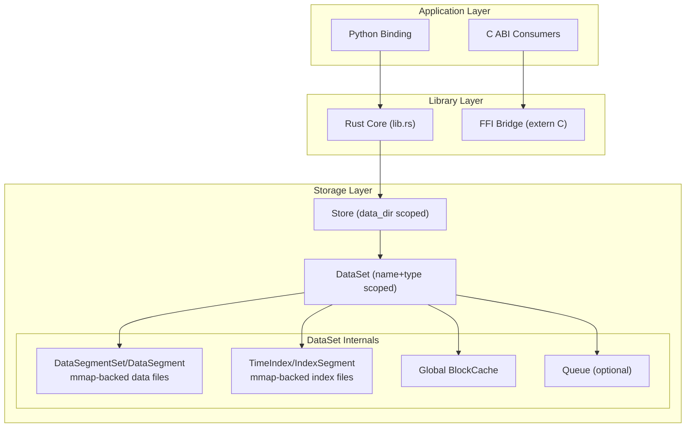
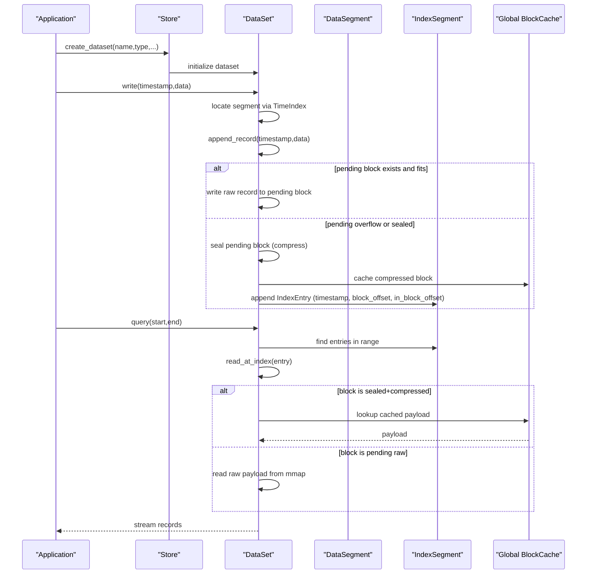
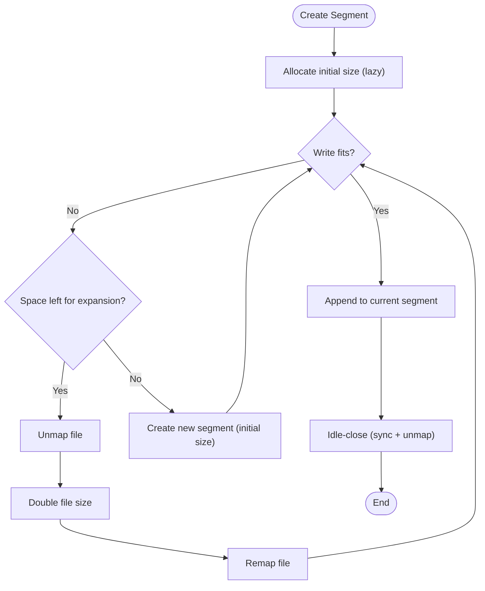
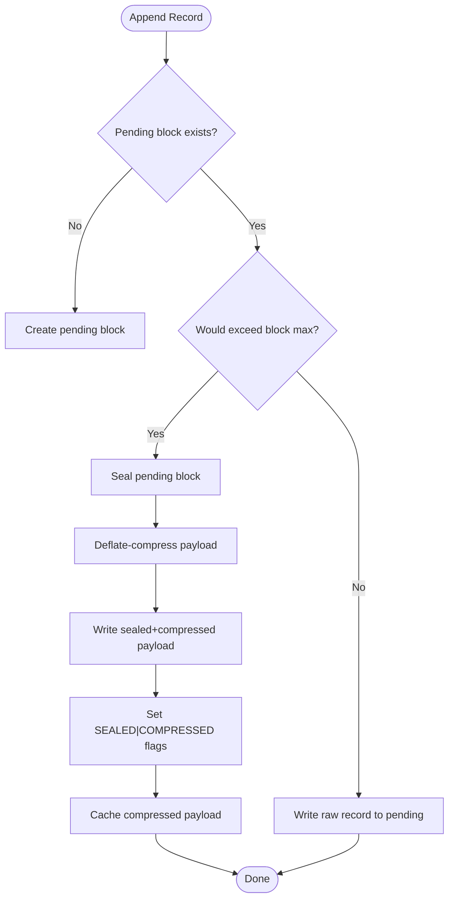
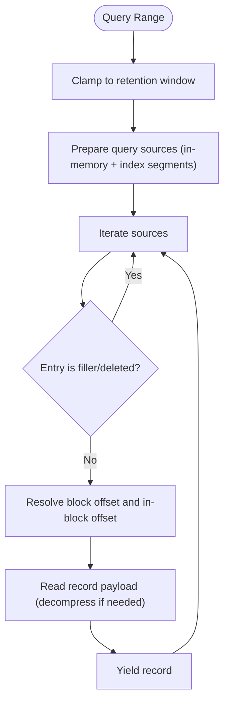
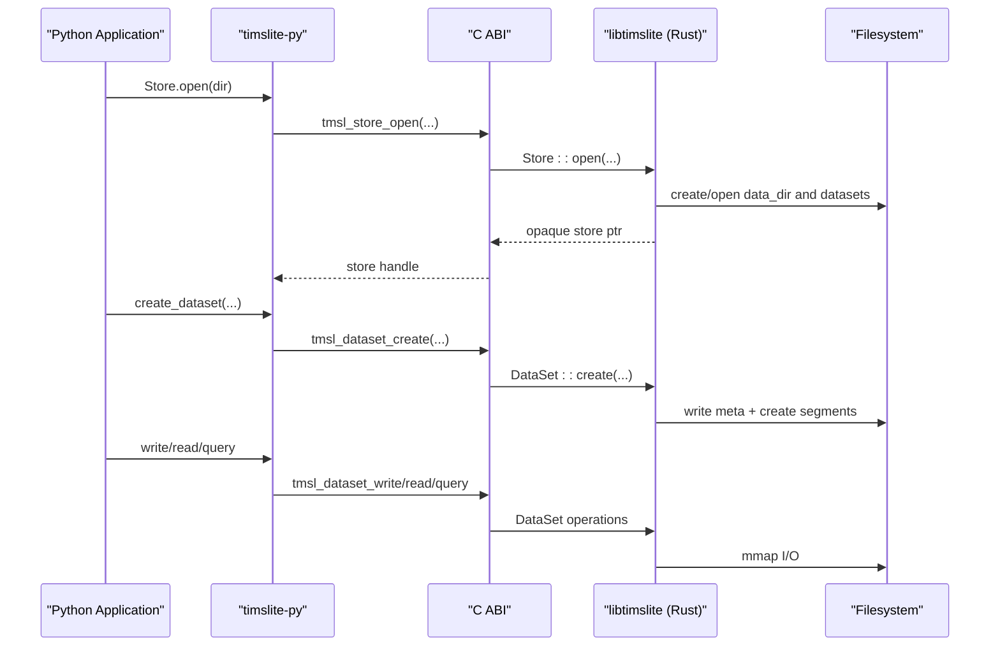
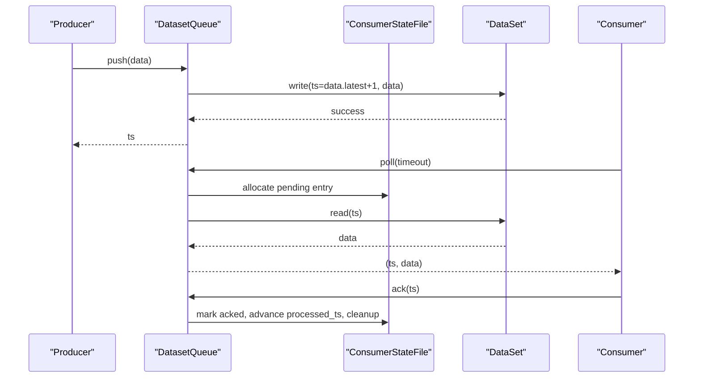
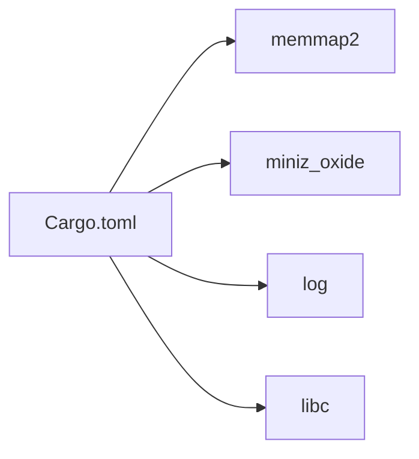

# Project Overview

<cite>
**Referenced Files in This Document**
- [Cargo.toml](file://Cargo.toml)
- [lib.rs](file://src/lib.rs)
- [timslite.h](file://include/timslite.h)
- [architecture.md](file://docs/design/architecture.md)
- [compression.md](file://docs/design/compression.md)
- [data-segment.md](file://docs/design/data-segment.md)
- [time-index.md](file://docs/design/time-index.md)
- [lazy-allocation.md](file://docs/design/lazy-allocation.md)
- [query-iterator.md](file://docs/design/query-iterator.md)
- [store-and-ffi.md](file://docs/design/store-and-ffi.md)
- [queue-overview.md](file://docs/design/queue-overview.md)
- [README.md](file://wrapper/python/README.md)
- [dataset_basic_test.rs](file://tests/dataset_basic_test.rs)
- [test_basic.py](file://wrapper/python/tests/test_basic.py)
</cite>

## Table of Contents
1. [Introduction](#introduction)
2. [Project Structure](#project-structure)
3. [Core Components](#core-components)
4. [Architecture Overview](#architecture-overview)
5. [Detailed Component Analysis](#detailed-component-analysis)
6. [Dependency Analysis](#dependency-analysis)
7. [Performance Considerations](#performance-considerations)
8. [Troubleshooting Guide](#troubleshooting-guide)
9. [Conclusion](#conclusion)
10. [Appendices](#appendices)

## Introduction
TimSLite is a high-performance, memory-mapped time-series data storage library designed for efficient ingestion, indexing, and retrieval of high-frequency telemetry and event streams. It targets latency-sensitive applications requiring durable, low-overhead persistence with predictable resource usage and strong isolation guarantees across datasets.

Key value propositions:
- Memory-mapped I/O for near-native disk throughput and minimal kernel overhead
- Block-level aggregation with delayed compression to maximize storage density and reduce I/O
- Transparent compression that is applied automatically during sealing and cached for reads
- Lazy segment lifecycle to minimize idle resource consumption
- Time-indexed queries with binary search and optional continuous index for O(1) lookup
- Cross-language compatibility via a stable C ABI FFI, plus a Python wrapper for rapid prototyping and integration

Target use cases:
- Real-time telemetry ingestion (sensor readings, metrics, logs)
- Event streaming with durable persistence and ordered delivery
- Low-latency analytics pipelines with built-in retention and compaction-friendly layout
- Embedded or edge deployments where deterministic footprint and performance matter
- Multi-language environments needing a shared, high-throughput time-series backend

## Project Structure
At a high level, TimSLite exposes a Rust core with a C ABI FFI surface and a Python binding package. Internally, it organizes storage around dataset-scoped data and index segments, each backed by memory-mapped files. The design emphasizes:
- Strong isolation: each dataset name/type pair has independent directories and metadata
- Predictable growth: segments are lazily allocated and expanded by doubling up to configured limits
- Efficient reads: compressed blocks are cached globally; hot blocks are cached per-query
- Robust writes: pending raw blocks allow in-place correction and tail append under strict conditions

**Diagram sources**
- [lib.rs:38-57](file://src/lib.rs#L38-L57)
- [store-and-ffi.md:13-52](file://docs/design/store-and-ffi.md#L13-L52)
- [architecture.md:8-24](file://docs/design/architecture.md#L8-L24)

**Section sources**
- [lib.rs:1-133](file://src/lib.rs#L1-L133)
- [architecture.md:1-133](file://docs/design/architecture.md#L1-L133)

## Core Components
- Store: top-level facade managing a data directory, dataset registry, background tasks, and global caches. It supports manual or threaded background execution and integrates a journal dataset for change capture.
- DataSet: dataset-level entity with explicit lifecycle (create/open/close), write/read/query APIs, and optional queue integration for streaming semantics.
- DataSegmentSet/DataSegment: manages data file segments with lazy allocation, expansion, and pending/raw block handling. Uses memory-mapped files for I/O.
- TimeIndex/IndexSegment: maintains a time-ordered index of records with optional continuous mode for O(1) lookups and sparse materialization.
- Compression: block-level delayed compression with flags ensuring sealed/compressed consistency; compressed payloads are cached globally.
- QueryIterator/HotBlockCache: lazy, iterator-based range scans with per-iteration hot block caching to reduce repeated decompressions.
- Queue: optional dataset queue supporting multiple consumer groups, persistent progress tracking, and wait/notify semantics.

**Section sources**
- [store-and-ffi.md:13-52](file://docs/design/store-and-ffi.md#L13-L52)
- [data-segment.md:14-82](file://docs/design/data-segment.md#L14-L82)
- [time-index.md:7-27](file://docs/design/time-index.md#L7-L27)
- [compression.md:1-83](file://docs/design/compression.md#L1-L83)
- [query-iterator.md:84-101](file://docs/design/query-iterator.md#L84-L101)
- [queue-overview.md:38-90](file://docs/design/queue-overview.md#L38-L90)

## Architecture Overview
TimSLite’s architecture centers on memory-mapped files and a compact, extensible file format. Writes append to a pending raw block within the current data segment; when the block exceeds a fixed payload size or when overflow occurs, the pending block is sealed and compressed. The index stores entries mapping timestamps to block offsets, enabling binary search queries. Continuous index mode enables O(1) direct lookup by computing segment and entry index from a base timestamp and fixed step.

**Diagram sources**
- [data-segment.md:124-190](file://docs/design/data-segment.md#L124-L190)
- [time-index.md:113-140](file://docs/design/time-index.md#L113-L140)
- [compression.md:59-72](file://docs/design/compression.md#L59-L72)

**Section sources**
- [architecture.md:6-27](file://docs/design/architecture.md#L6-L27)
- [data-segment.md:94-120](file://docs/design/data-segment.md#L94-L120)
- [time-index.md:143-164](file://docs/design/time-index.md#L143-L164)

## Detailed Component Analysis

### Memory-Mapped I/O and Segment Lifecycle
- Segments are lazily allocated at creation and expanded by doubling until reaching a configured maximum size. The header persists the maximum file size while the actual file grows only as needed, minimizing disk waste for small datasets.
- DataSegment tracks runtime state (e.g., wrote positions, record counts) and uses memory-mapped regions for reads and writes. Idle-close operations persist state and unmap files to conserve resources.
- IndexSegment mirrors this pattern for the index area, with entries stored contiguously and accessed via binary search.

**Diagram sources**
- [lazy-allocation.md:44-74](file://docs/design/lazy-allocation.md#L44-L74)
- [data-segment.md:349-358](file://docs/design/data-segment.md#L349-L358)

**Section sources**
- [lazy-allocation.md:1-128](file://docs/design/lazy-allocation.md#L1-L128)
- [data-segment.md:336-359](file://docs/design/data-segment.md#L336-L359)

### Block-Level Aggregation and Transparent Compression
- Records are aggregated into blocks with a fixed maximum payload size. Pending raw blocks allow in-place correction and tail append under strict conditions; overflow triggers sealing and compression.
- Compression is applied to sealed blocks and cached globally. Decompression is performed on demand and the decompressed payload is cached for subsequent reads.
- The design enforces invariants: sealed and compressed flags must co-exist; pending raw blocks are not cached globally.

**Diagram sources**
- [data-segment.md:124-169](file://docs/design/data-segment.md#L124-L169)
- [compression.md:12-41](file://docs/design/compression.md#L12-L41)

**Section sources**
- [compression.md:1-83](file://docs/design/compression.md#L1-L83)
- [data-segment.md:122-190](file://docs/design/data-segment.md#L122-L190)

### Time-Indexed Queries and Continuous Index
- Index entries store timestamp-to-block mappings with 18-byte fixed-size serialization. Binary search is used for range queries.
- Continuous index mode computes segment and entry index directly from a base timestamp and fixed step, avoiding filler entries for gaps and enabling O(1) lookups.

**Diagram sources**
- [time-index.md:42-68](file://docs/design/time-index.md#L42-L68)
- [query-iterator.md:24-49](file://docs/design/query-iterator.md#L24-L49)

**Section sources**
- [time-index.md:170-179](file://docs/design/time-index.md#L170-L179)
- [query-iterator.md:1-171](file://docs/design/query-iterator.md#L1-L171)

### Cross-Language Compatibility and Integration
- The C ABI FFI defines versioned configuration structs and a comprehensive set of functions for store and dataset management, writing, reading, and querying.
- The Python wrapper provides idiomatic bindings for quick integration, including context managers, manual background task execution, and queue operations.

**Diagram sources**
- [timslite.h:244-310](file://include/timslite.h#L244-L310)
- [store-and-ffi.md:244-310](file://docs/design/store-and-ffi.md#L244-L310)
- [README.md:1-77](file://wrapper/python/README.md#L1-L77)

**Section sources**
- [timslite.h:1-358](file://include/timslite.h#L1-L358)
- [store-and-ffi.md:209-372](file://docs/design/store-and-ffi.md#L209-L372)
- [README.md:1-77](file://wrapper/python/README.md#L1-L77)

### Queue Semantics and Streaming
- Optional queue support adds producer/consumer semantics atop datasets with persistent progress tracking per consumer group and wait/notify via condition variables.
- Push allocates monotonically increasing timestamps; poll returns the next available record and updates progress upon acknowledgment.

**Diagram sources**
- [queue-overview.md:309-330](file://docs/design/queue-overview.md#L309-L330)
- [queue-overview.md:336-406](file://docs/design/queue-overview.md#L336-L406)
- [queue-overview.md:428-457](file://docs/design/queue-overview.md#L428-L457)

**Section sources**
- [queue-overview.md:1-498](file://docs/design/queue-overview.md#L1-L498)

## Dependency Analysis
External dependencies include memory-mapped I/O and compression libraries, with logging and libc for platform abstractions. The design relies on these to deliver mmap-backed storage and efficient compression.

**Diagram sources**
- [Cargo.toml:10-14](file://Cargo.toml#L10-L14)

**Section sources**
- [Cargo.toml:1-18](file://Cargo.toml#L1-L18)

## Performance Considerations
- Memory-mapped I/O reduces kernel overhead and improves throughput for sequential workloads typical in time-series ingestion and scanning.
- Block-level aggregation and delayed compression increase storage density and reduce I/O volume; compressed payloads are cached globally to amortize decompression cost.
- Lazy segment allocation minimizes disk footprint for small datasets, with controlled expansion to avoid frequent remapping.
- Continuous index mode trades disk space for reduced index maintenance by skipping filler entries and enabling O(1) lookups.
- QueryIterator avoids loading entire index ranges into memory, iterating sources and reading records on demand; HotBlockCache reduces repeated decompressions within a single query.

[No sources needed since this section provides general guidance]

## Troubleshooting Guide
Common operational pitfalls and remedies:
- Not closing child handles before closing the store: ensure all dataset and iterator handles are closed prior to store closure.
- Ignoring background task scheduling: when disabling the internal background thread, periodically call the manual tick function to drive flushes, idle-closes, cache evictions, and retention reclaim.
- Misinterpreting “latest timestamp”: the latest timestamp reflects the maximum written timestamp regardless of deletion; use single-record read with a sentinel timestamp to retrieve the most recent valid record.
- Queue errors: ensure the queue is open before polling or acknowledging; check for closed queue or missing consumer groups.

**Section sources**
- [store-and-ffi.md:321-326](file://docs/design/store-and-ffi.md#L321-L326)
- [README.md:43-76](file://wrapper/python/README.md#L43-L76)

## Conclusion
TimSLite delivers a focused, high-performance time-series storage solution optimized for ingestion speed, predictable footprint, and cross-language interoperability. Its memory-mapped design, block-level aggregation with transparent compression, and robust query model make it suitable for real-time telemetry, event streaming, and analytics pipelines. Optional queue semantics and a stable C ABI further broaden its applicability across diverse environments.

[No sources needed since this section summarizes without analyzing specific files]

## Appendices

### Practical Examples and Deployment Scenarios
- Basic ingestion and querying in Python:
  - Create a store, dataset, write records, and iterate over a time range.
  - See [README.md:14-41](file://wrapper/python/README.md#L14-L41).
- Manual background task execution in Python:
  - Disable the internal background thread and drive tasks manually in an event loop.
  - See [README.md:43-76](file://wrapper/python/README.md#L43-L76).
- Rust integration basics:
  - Open a store, create a dataset, write and query records, and flush.
  - See [dataset_basic_test.rs:18-61](file://tests/dataset_basic_test.rs#L18-L61).
- Python smoke tests:
  - Import checks, store open/close, and default configuration inspection.
  - See [test_basic.py:7-58](file://wrapper/python/tests/test_basic.py#L7-L58).

**Section sources**
- [README.md:14-76](file://wrapper/python/README.md#L14-L76)
- [dataset_basic_test.rs:18-61](file://tests/dataset_basic_test.rs#L18-L61)
- [test_basic.py:7-58](file://wrapper/python/tests/test_basic.py#L7-L58)