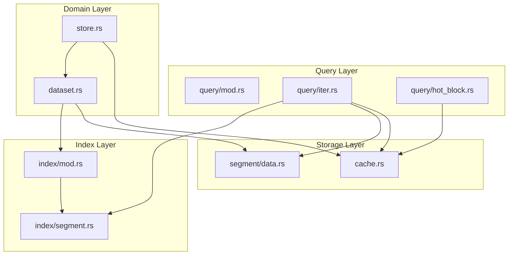
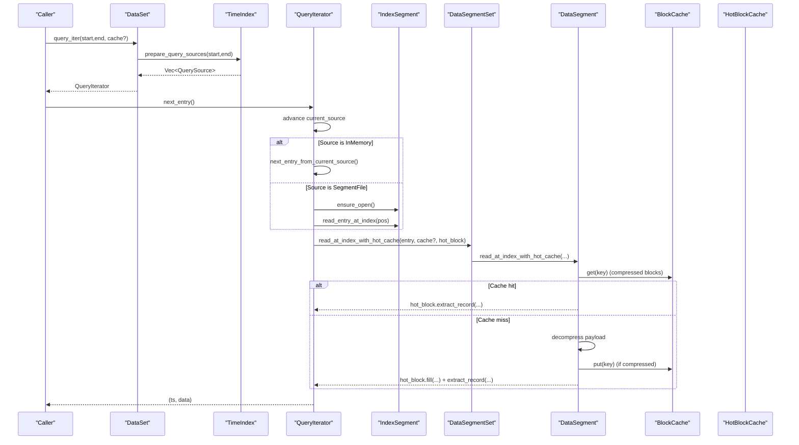
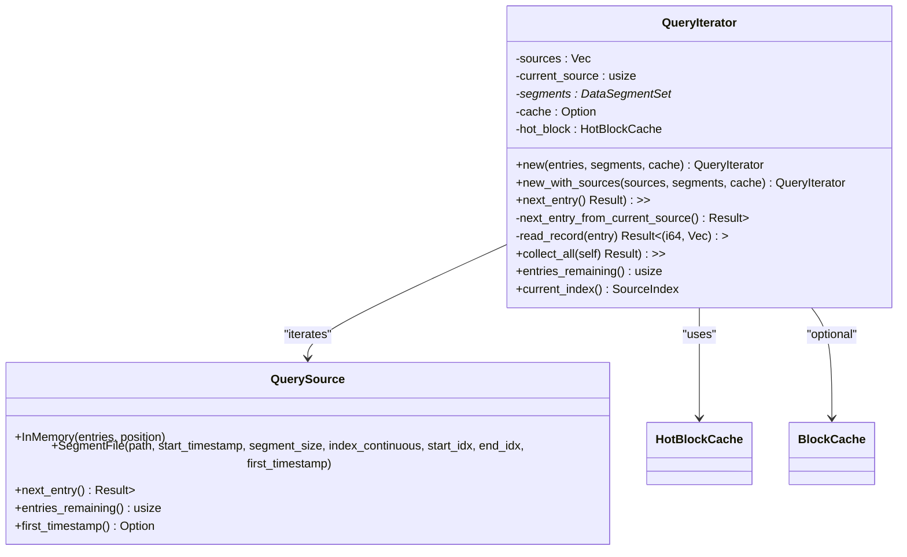
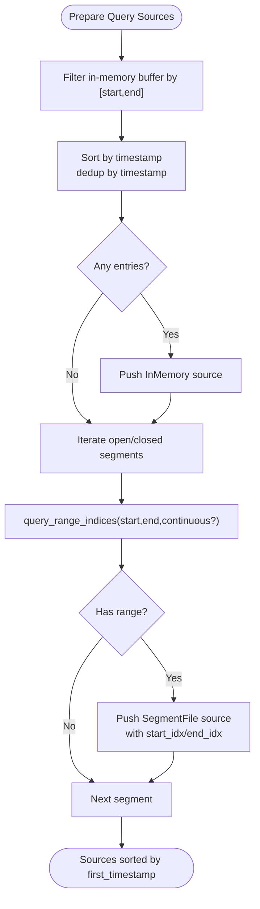
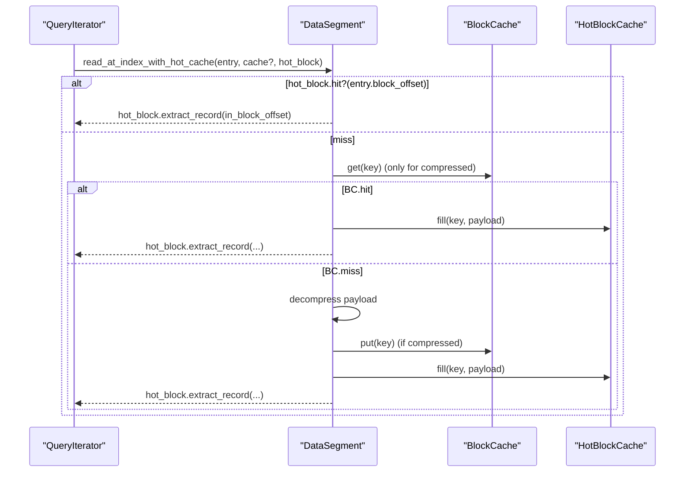
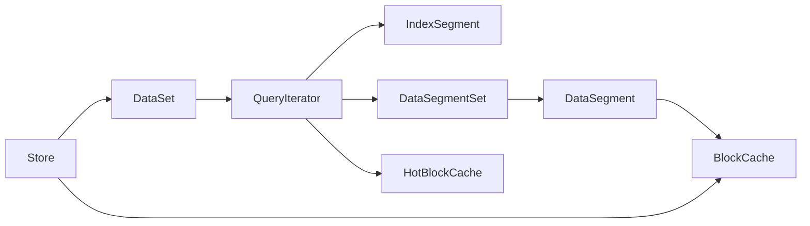

# Query Architecture

<cite>
**Referenced Files in This Document**
- [src/query/mod.rs](file://src/query/mod.rs)
- [src/query/iter.rs](file://src/query/iter.rs)
- [src/query/hot_block.rs](file://src/query/hot_block.rs)
- [src/cache.rs](file://src/cache.rs)
- [src/index/segment.rs](file://src/index/segment.rs)
- [src/index/mod.rs](file://src/index/mod.rs)
- [src/segment/data.rs](file://src/segment/data.rs)
- [src/dataset.rs](file://src/dataset.rs)
- [src/store.rs](file://src/store.rs)
- [src/lib.rs](file://src/lib.rs)
- [Cargo.toml](file://Cargo.toml)
</cite>

## Table of Contents
1. [Introduction](#introduction)
2. [Project Structure](#project-structure)
3. [Core Components](#core-components)
4. [Architecture Overview](#architecture-overview)
5. [Detailed Component Analysis](#detailed-component-analysis)
6. [Dependency Analysis](#dependency-analysis)
7. [Performance Considerations](#performance-considerations)
8. [Troubleshooting Guide](#troubleshooting-guide)
9. [Conclusion](#conclusion)

## Introduction
This document explains TimSLite’s query architecture with a focus on lazy evaluation, iterator-driven execution, memory-efficient streaming, and hot block optimization. It covers how queries traverse index segments, resolve data locations, and stream results with minimal memory overhead. It also documents query planning, execution stages, concurrency, and resource management.

## Project Structure
TimSLite organizes query logic under the query module, backed by index and data segment abstractions, and integrated into the dataset and store layers.

**Diagram sources**
- [src/query/mod.rs:1-5](file://src/query/mod.rs#L1-L5)
- [src/query/iter.rs:1-258](file://src/query/iter.rs#L1-L258)
- [src/query/hot_block.rs:1-4](file://src/query/hot_block.rs#L1-L4)
- [src/index/segment.rs:1-727](file://src/index/segment.rs#L1-L727)
- [src/index/mod.rs:1-800](file://src/index/mod.rs#L1-L800)
- [src/segment/data.rs:1-1513](file://src/segment/data.rs#L1-L1513)
- [src/cache.rs:1-427](file://src/cache.rs#L1-L427)
- [src/dataset.rs:1-800](file://src/dataset.rs#L1-L800)
- [src/store.rs:1-681](file://src/store.rs#L1-L681)

**Section sources**
- [src/query/mod.rs:1-5](file://src/query/mod.rs#L1-L5)
- [src/lib.rs:38-72](file://src/lib.rs#L38-L72)

## Core Components
- QueryIterator: Drives lazy, streaming iteration over index entries and yields (timestamp, data) pairs.
- QuerySource: Encapsulates either in-memory entries or a lazily opened index segment file.
- HotBlockCache: Per-query, lock-free cache of a decompressed block payload to avoid repeated decompression and parsing.
- BlockCache: Global LRU cache keyed by segment and block offsets for compressed blocks.
- IndexSegment: Provides time-range queries and direct lookup for continuous mode.
- DataSegment/DataSegmentSet: Manages block-level reads, decompression, and record extraction with optional caching.
- DataSet/Store: Expose query APIs and orchestrate background lifecycle and caches.

**Section sources**
- [src/query/iter.rs:13-216](file://src/query/iter.rs#L13-L216)
- [src/query/hot_block.rs:1-4](file://src/query/hot_block.rs#L1-L4)
- [src/cache.rs:43-191](file://src/cache.rs#L43-L191)
- [src/index/segment.rs:24-554](file://src/index/segment.rs#L24-L554)
- [src/segment/data.rs:924-1114](file://src/segment/data.rs#L924-L1114)
- [src/dataset.rs:629-676](file://src/dataset.rs#L629-L676)
- [src/store.rs:383-540](file://src/store.rs#L383-L540)

## Architecture Overview
The query pipeline transforms a time range into a sequence of index entries, then streams records by reading compressed or raw blocks with minimal memory overhead.

**Diagram sources**
- [src/dataset.rs:629-647](file://src/dataset.rs#L629-L647)
- [src/index/mod.rs:650-709](file://src/index/mod.rs#L650-L709)
- [src/query/iter.rs:158-216](file://src/query/iter.rs#L158-L216)
- [src/index/segment.rs:468-501](file://src/index/segment.rs#L468-L501)
- [src/segment/data.rs:1044-1114](file://src/segment/data.rs#L1044-L1114)
- [src/cache.rs:68-113](file://src/cache.rs#L68-L113)

## Detailed Component Analysis

### QueryIterator: Lazy Evaluation and Streaming
- Maintains a vector of QuerySource instances ordered by first timestamp.
- Iteration advances across sources and positions, skipping filler entries.
- Uses DataSegmentSet::read_at_index_with_hot_cache to fetch records efficiently.
- Provides collect_all for compatibility and entries_remaining/current_index for progress.

**Diagram sources**
- [src/query/iter.rs:13-216](file://src/query/iter.rs#L13-L216)

**Section sources**
- [src/query/iter.rs:120-216](file://src/query/iter.rs#L120-L216)

### QuerySource: In-Memory vs Segment-Based Index Entries
- InMemory: Holds pre-sorted, deduplicated entries for the requested window.
- SegmentFile: Lazily opens an IndexSegment, reads a contiguous range of entries, and tracks position.

**Diagram sources**
- [src/index/mod.rs:650-709](file://src/index/mod.rs#L650-L709)

**Section sources**
- [src/index/mod.rs:650-709](file://src/index/mod.rs#L650-L709)

### Hot Block Optimization and Memory Management
- HotBlockCache avoids repeated decompression and parsing by caching a single block’s payload per query.
- BlockCache provides global LRU caching for compressed blocks keyed by (segment_file_offset, block_offset).
- read_at_index_with_hot_cache checks hot cache first, then global cache for compressed blocks, fills hot cache, and extracts the record.

**Diagram sources**
- [src/segment/data.rs:1044-1114](file://src/segment/data.rs#L1044-L1114)
- [src/cache.rs:68-113](file://src/cache.rs#L68-L113)

**Section sources**
- [src/cache.rs:288-359](file://src/cache.rs#L288-L359)
- [src/segment/data.rs:1044-1114](file://src/segment/data.rs#L1044-L1114)

### IndexSegment: Continuous and Binary Search Queries
- Provides lower_bound/upper_bound and continuous-safe variants for O(1) direct lookup when index_continuous is enabled.
- Supports range queries and entry overwrite for continuous mode backfilling.

**Section sources**
- [src/index/segment.rs:238-425](file://src/index/segment.rs#L238-L425)

### DataSegmentSet and DataSegment: Record Retrieval and Lifecycle
- DataSegmentSet locates the correct segment and delegates to DataSegment for reading.
- DataSegment ensures mmap lifecycle, supports raw/pending/compressed blocks, and exposes read_at_index_with_hot_cache.

**Section sources**
- [src/segment/data.rs:922-1114](file://src/segment/data.rs#L922-L1114)

### DataSet and Store: Query Entry Points and Concurrency
- DataSet::query_iter constructs QueryIterator from prepared sources.
- Store coordinates global BlockCache and background tasks; integrates journal and queue.

**Section sources**
- [src/dataset.rs:629-676](file://src/dataset.rs#L629-L676)
- [src/store.rs:383-540](file://src/store.rs#L383-L540)

## Dependency Analysis
- QueryIterator depends on IndexSegment for entry enumeration and DataSegmentSet for record retrieval.
- HotBlockCache is a lightweight per-iterator optimization layered atop BlockCache.
- DataSet orchestrates query planning and execution, delegating to TimeIndex and DataSegmentSet.
- Store provides global cache and background lifecycle management.

**Diagram sources**
- [src/query/iter.rs:1-258](file://src/query/iter.rs#L1-L258)
- [src/index/segment.rs:1-727](file://src/index/segment.rs#L1-L727)
- [src/segment/data.rs:1-1513](file://src/segment/data.rs#L1-L1513)
- [src/cache.rs:1-427](file://src/cache.rs#L1-L427)
- [src/dataset.rs:1-800](file://src/dataset.rs#L1-L800)
- [src/store.rs:1-681](file://src/store.rs#L1-L681)

**Section sources**
- [src/lib.rs:69-71](file://src/lib.rs#L69-L71)

## Performance Considerations
- Lazy open/close of index/data segments reduces I/O overhead and memory footprint.
- HotBlockCache eliminates repeated decompression and parsing within a single block.
- Global BlockCache reduces repeated decompression across queries.
- Continuous index mode enables O(1) direct lookup, minimizing index traversal cost.
- Streaming results via QueryIterator avoid loading entire result sets into memory.

[No sources needed since this section provides general guidance]

## Troubleshooting Guide
- Filler entries: BLOCK_OFFSET_FILLER/IN_BLOCK_OFFSET_FILLER indicate deleted or unwritten entries in continuous mode; QueryIterator skips them automatically.
- Segment full conditions: DataSegment operations may return SegmentFull; callers should expand or seal as appropriate.
- Cache misses: If global cache misses occur frequently, consider increasing cache budget or tuning retention policies.
- Idle-close behavior: Segments are lazily reopened on demand; ensure proper lifecycle management to avoid unexpected reopen costs.

**Section sources**
- [src/index/segment.rs:19-64](file://src/index/segment.rs#L19-L64)
- [src/segment/data.rs:308-313](file://src/segment/data.rs#L308-L313)
- [src/cache.rs:152-173](file://src/cache.rs#L152-L173)

## Conclusion
TimSLite’s query architecture combines lazy evaluation, iterator-driven streaming, and targeted caching to deliver efficient, memory-conscious time-series reads. The separation of concerns across index, storage, and domain layers, together with hot block and global block caching, enables scalable query execution with predictable resource usage.