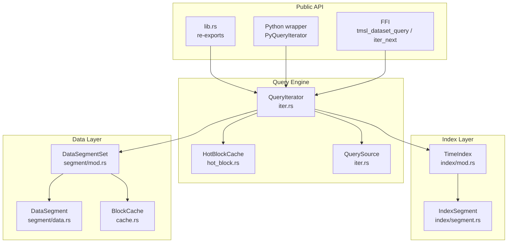
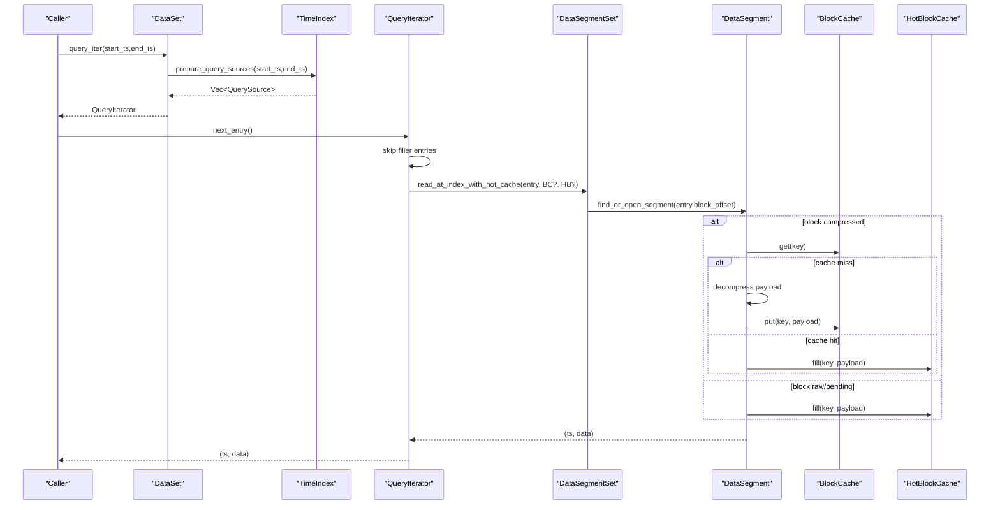
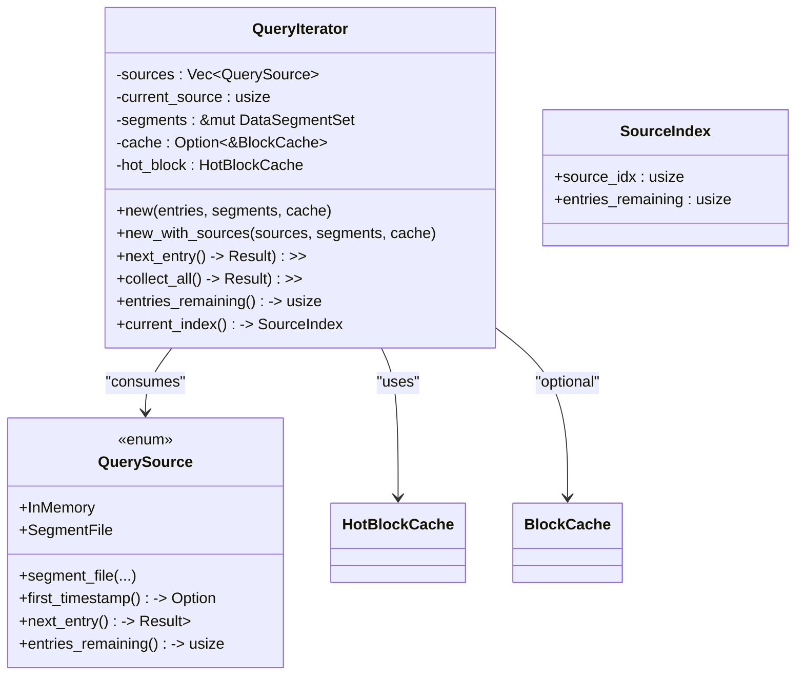
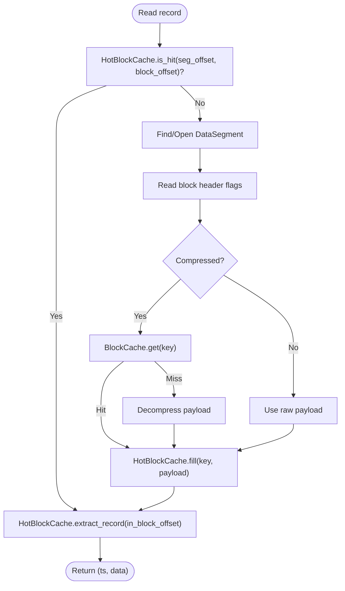
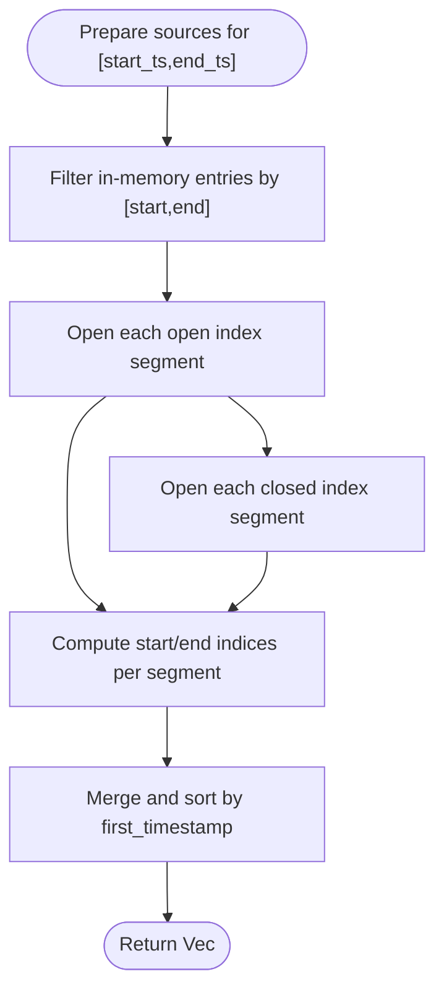
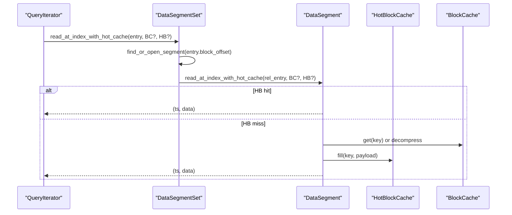
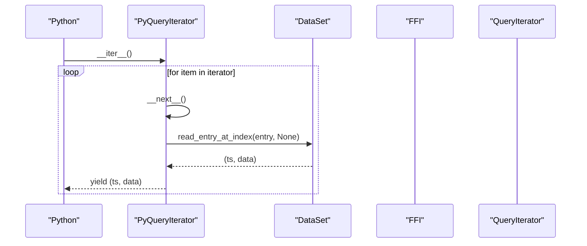
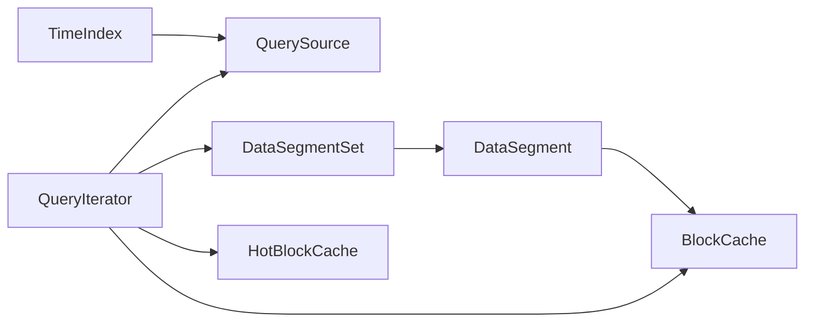

# Query Engine

<cite>
**Referenced Files in This Document**
- [lib.rs](file://src/lib.rs)
- [dataset.rs](file://src/dataset.rs)
- [iter.rs](file://src/query/iter.rs)
- [hot_block.rs](file://src/query/hot_block.rs)
- [cache.rs](file://src/cache.rs)
- [segment.rs](file://src/index/segment.rs)
- [data.rs](file://src/segment/data.rs)
- [mod.rs](file://src/segment/mod.rs)
- [ffi.rs](file://src/ffi.rs)
- [query.rs](file://wrapper/python/src/query.rs)
- [query_test.rs](file://tests/query_test.rs)
- [background-and-cache.md](file://docs/design/background-and-cache.md)
- [phase-13-query-iterator.md](file://docs/plan/phase-13-query-iterator.md)
</cite>

## Table of Contents
1. [Introduction](#introduction)
2. [Project Structure](#project-structure)
3. [Core Components](#core-components)
4. [Architecture Overview](#architecture-overview)
5. [Detailed Component Analysis](#detailed-component-analysis)
6. [Dependency Analysis](#dependency-analysis)
7. [Performance Considerations](#performance-considerations)
8. [Troubleshooting Guide](#troubleshooting-guide)
9. [Conclusion](#conclusion)
10. [Appendices](#appendices)

## Introduction
This document explains TimSLite’s query processing engine with a focus on lazy evaluation, iterator patterns, memory efficiency, and streaming results. It covers query execution plans, optimization strategies, and performance characteristics across range queries, single timestamp reads, and aggregate operations. It also documents the hot block optimization, query planning algorithms, result iteration patterns, concurrency and resource contention management, and practical tuning guidance.

## Project Structure
TimSLite organizes query functionality around a small set of modules:
- Query engine: lazy iterators, hot block caching, and index-driven planning
- Index: time-indexed segments with binary/continuous lookups
- Data segments: compressed blocks with mmap lifecycle and targeted caching
- FFI and Python wrappers: expose streaming iterators and integrate with external runtimes

**Diagram sources**
- [lib.rs:69-70](file://src/lib.rs#L69-L70)
- [iter.rs:120-126](file://src/query/iter.rs#L120-L126)
- [hot_block.rs:3](file://src/query/hot_block.rs#L3)
- [segment.rs:43-53](file://src/segment/mod.rs#L43-L53)
- [data.rs:39-67](file://src/segment/data.rs#L39-L67)
- [cache.rs:43-49](file://src/cache.rs#L43-L49)
- [index/segment.rs:72-93](file://src/index/segment.rs#L72-L93)
- [ffi.rs:764-794](file://src/ffi.rs#L764-L794)
- [query.rs:11-32](file://wrapper/python/src/query.rs#L11-L32)

**Section sources**
- [lib.rs:39-72](file://src/lib.rs#L39-L72)
- [iter.rs:1-258](file://src/query/iter.rs#L1-L258)
- [hot_block.rs:1-4](file://src/query/hot_block.rs#L1-L4)
- [segment/mod.rs:41-544](file://src/segment/mod.rs#L41-L544)
- [segment/data.rs:39-1115](file://src/segment/data.rs#L39-L1115)
- [cache.rs:1-427](file://src/cache.rs#L1-L427)
- [index/segment.rs:66-554](file://src/index/segment.rs#L66-L554)
- [ffi.rs:760-800](file://src/ffi.rs#L760-L800)
- [wrapper/python/src/query.rs:11-68](file://wrapper/python/src/query.rs#L11-L68)

## Core Components
- QueryIterator: lazy, streaming iterator over precomputed index entries; supports in-memory and segment-backed sources; skips filler entries; integrates HotBlockCache and optional BlockCache.
- QuerySource: abstraction for either in-memory entries or a segment file with a range; tracks position and lazily opens segments.
- HotBlockCache: per-query local cache of a decompressed block payload; avoids repeated decompression and parsing for consecutive records within the same block.
- BlockCache: global cache keyed by segment file offset and block offset; caches decompressed block payloads; LRU + idle eviction; disabled when configured with zero capacity.
- TimeIndex and IndexSegment: time-indexed index with continuous mode O(1) lookups and binary search fallback; prepares query sources for a time range.
- DataSegmentSet and DataSegment: multi-file data storage with mmap lifecycle; supports lazy open/idle-close; sealed/compressed blocks cached globally; pending raw blocks not cached.

Key public APIs:
- DataSet::query_iter and DataSet::query for range queries
- DataSet::read for single timestamp reads
- FFI tmsl_dataset_query and tmsl_iter_next for streaming iteration
- Python PyQueryIterator for Pythonic iteration

**Section sources**
- [iter.rs:120-216](file://src/query/iter.rs#L120-L216)
- [iter.rs:14-111](file://src/query/iter.rs#L14-L111)
- [hot_block.rs:288-359](file://src/query/hot_block.rs#L288-L359)
- [cache.rs:43-191](file://src/cache.rs#L43-L191)
- [index/segment.rs:202-236](file://src/index/segment.rs#L202-L236)
- [segment/mod.rs:43-544](file://src/segment/mod.rs#L43-L544)
- [segment/data.rs:952-1115](file://src/segment/data.rs#L952-L1115)
- [dataset.rs:629-660](file://src/dataset.rs#L629-L660)
- [dataset.rs:586-627](file://src/dataset.rs#L586-L627)
- [ffi.rs:764-794](file://src/ffi.rs#L764-L794)
- [ffi.rs:796-800](file://src/ffi.rs#L796-L800)
- [wrapper/python/src/query.rs:11-68](file://wrapper/python/src/query.rs#L11-L68)

## Architecture Overview
The query engine composes three layers:
- Planning: TimeIndex builds a list of QuerySource instances covering [start_ts, end_ts], sorted by first timestamp.
- Iteration: QueryIterator lazily consumes QuerySource entries, skipping fillers, and fetches data via DataSegmentSet.
- Storage: DataSegmentSet locates the correct segment, optionally opens it, and reads records with HotBlockCache and BlockCache.

**Diagram sources**
- [dataset.rs:629-647](file://src/dataset.rs#L629-L647)
- [index/segment.rs:650-709](file://src/index/segment.rs#L650-L709)
- [iter.rs:158-191](file://src/query/iter.rs#L158-L191)
- [segment/mod.rs:470-485](file://src/segment/mod.rs#L470-L485)
- [segment/data.rs:1044-1115](file://src/segment/data.rs#L1044-L1115)
- [cache.rs:68-113](file://src/cache.rs#L68-L113)
- [hot_block.rs:299-353](file://src/query/hot_block.rs#L299-L353)

## Detailed Component Analysis

### QueryIterator and QuerySource
- QueryIterator maintains a vector of QuerySource and advances across them. It skips entries with sentinel block offsets and uses DataSegmentSet to read records.
- QuerySource supports two modes:
  - InMemory: holds a pre-sorted, de-duplicated slice of index entries.
  - SegmentFile: lazily opens an IndexSegment, reads entries by index, and tracks position and bounds.
- The iterator exposes:
  - next_entry(): yields (ts, data) tuples
  - collect_all(): legacy method to collect all results into a Vec
  - entries_remaining(): estimates remaining entries for progress reporting
  - current_index(): reports current source and remaining count

**Diagram sources**
- [iter.rs:120-126](file://src/query/iter.rs#L120-L126)
- [iter.rs:14-111](file://src/query/iter.rs#L14-L111)
- [iter.rs:114-117](file://src/query/iter.rs#L114-L117)

**Section sources**
- [iter.rs:120-216](file://src/query/iter.rs#L120-L216)
- [iter.rs:14-111](file://src/query/iter.rs#L14-L111)

### Hot Block Optimization
- HotBlockCache stores a single decompressed block payload and extracts individual records by in-block offset. It avoids repeated decompression and parsing when scanning consecutive records from the same block.
- Behavior:
  - is_hit(): checks if the requested block matches the cached key
  - fill(): loads a new block payload into cache
  - extract_record(): decodes a single record from the cached payload
  - clear(): resets cache state
- Integration:
  - DataSegment.read_at_index_with_hot_cache uses HotBlockCache to accelerate repeated reads from the same block
  - Global BlockCache is bypassed for raw/pending blocks; compressed blocks are cached globally

**Diagram sources**
- [hot_block.rs:299-353](file://src/query/hot_block.rs#L299-L353)
- [segment/data.rs:1044-1115](file://src/segment/data.rs#L1044-L1115)
- [cache.rs:68-113](file://src/cache.rs#L68-L113)

**Section sources**
- [hot_block.rs:288-359](file://src/query/hot_block.rs#L288-L359)
- [segment/data.rs:1044-1115](file://src/segment/data.rs#L1044-L1115)
- [cache.rs:68-113](file://src/cache.rs#L68-L113)

### TimeIndex and Query Planning
- TimeIndex.prepare_query_sources constructs a list of QuerySource covering [start_ts, end_ts]:
  - In-memory entries filtered by range and deduplicated
  - Open/closed index segments queried for overlapping ranges; each segment contributes a SegmentFile QuerySource with start/end indices
  - Sources are sorted by first timestamp to ensure deterministic traversal order
- IndexSegment supports:
  - Continuous mode O(1) direct lookup and range queries
  - Binary search bounds for non-continuous mode
  - Overwrite_entry for backfilling filler entries with real data

**Diagram sources**
- [index/segment.rs:650-709](file://src/index/segment.rs#L650-L709)
- [index/segment.rs:277-330](file://src/index/segment.rs#L277-L330)
- [index/segment.rs:398-425](file://src/index/segment.rs#L398-L425)

**Section sources**
- [index/segment.rs:650-709](file://src/index/segment.rs#L650-L709)
- [index/segment.rs:277-330](file://src/index/segment.rs#L277-L330)
- [index/segment.rs:398-425](file://src/index/segment.rs#L398-L425)

### DataSegmentSet and DataSegment Reads
- DataSegmentSet routes reads by absolute block offset, lazily opening the appropriate segment and converting to a relative offset for the segment.
- DataSegment.read_at_index_with_hot_cache:
  - Uses HotBlockCache for intra-block record extraction
  - Uses BlockCache for compressed blocks
  - Skips raw/pending blocks from global cache
- Lazy lifecycle:
  - DataSegmentSet.idle_close_all closes segments to reduce memory pressure
  - DataSegment.ensure_open restores pending state and metadata

**Diagram sources**
- [segment/mod.rs:470-485](file://src/segment/mod.rs#L470-L485)
- [segment/data.rs:1044-1115](file://src/segment/data.rs#L1044-L1115)
- [cache.rs:68-113](file://src/cache.rs#L68-L113)
- [hot_block.rs:299-353](file://src/query/hot_block.rs#L299-L353)

**Section sources**
- [segment/mod.rs:470-521](file://src/segment/mod.rs#L470-L521)
- [segment/data.rs:952-1115](file://src/segment/data.rs#L952-L1115)
- [cache.rs:68-113](file://src/cache.rs#L68-L113)

### FFI and Python Iterators
- FFI tmsl_dataset_query returns an iterator handle populated with precomputed QuerySource list; tmsl_iter_next advances and returns the next record.
- Python PyQueryIterator pre-fetches index entries and lazily reads data under lock per iteration, supporting Python’s iterator protocol.

**Diagram sources**
- [ffi.rs:764-794](file://src/ffi.rs#L764-L794)
- [ffi.rs:796-800](file://src/ffi.rs#L796-L800)
- [query.rs:34-67](file://wrapper/python/src/query.rs#L34-L67)

**Section sources**
- [ffi.rs:764-800](file://src/ffi.rs#L764-L800)
- [wrapper/python/src/query.rs:11-68](file://wrapper/python/src/query.rs#L11-L68)

## Dependency Analysis
- QueryIterator depends on:
  - QuerySource for data sources
  - DataSegmentSet for segment resolution and reads
  - HotBlockCache for intra-block acceleration
  - Optional BlockCache for global block caching
- TimeIndex drives planning and produces ordered QuerySource lists
- DataSegmentSet encapsulates segment lifecycle and caching decisions

**Diagram sources**
- [iter.rs:120-126](file://src/query/iter.rs#L120-L126)
- [segment/mod.rs:43-53](file://src/segment/mod.rs#L43-L53)
- [segment/data.rs:39-67](file://src/segment/data.rs#L39-L67)
- [cache.rs:43-49](file://src/cache.rs#L43-L49)
- [index/segment.rs:72-93](file://src/index/segment.rs#L72-L93)

**Section sources**
- [iter.rs:120-126](file://src/query/iter.rs#L120-L126)
- [segment/mod.rs:43-53](file://src/segment/mod.rs#L43-L53)
- [segment/data.rs:39-67](file://src/segment/data.rs#L39-L67)
- [cache.rs:43-49](file://src/cache.rs#L43-L49)
- [index/segment.rs:72-93](file://src/index/segment.rs#L72-L93)

## Performance Considerations
- Lazy evaluation and streaming
  - QueryIterator yields records one-by-one; no intermediate Vec allocation for the full result set.
  - collect_all exists for backward compatibility but is discouraged for large ranges.
- Memory efficiency
  - HotBlockCache reduces CPU and memory by avoiding repeated decompression and parsing within a block.
  - BlockCache avoids repeated decompression across blocks; LRU and idle eviction bound memory.
  - DataSegmentSet idle_close_all reduces memory footprint when segments are not accessed.
- Query planning
  - TimeIndex.prepare_query_sources sorts sources by first timestamp, minimizing segment open/close churn.
  - Continuous mode index enables O(1) direct lookups and efficient range scans.
- I/O and decompression
  - Compressed blocks are decompressed once and cached; raw/pending blocks are not cached globally.
  - HotBlockCache accelerates sequential reads from the same block.

[No sources needed since this section provides general guidance]

## Troubleshooting Guide
Common issues and remedies:
- Slow queries
  - Verify continuous index mode is enabled for predictable O(1) lookups.
  - Ensure BlockCache is enabled and sized appropriately; monitor cache stats.
  - Use QueryIterator streaming instead of collecting all results.
- Memory spikes
  - Call DataSegmentSet.idle_close_all periodically to release segment mappings.
  - Reduce BlockCache.max_memory or increase cache_idle_timeout.
- Stalls or timeouts
  - Confirm background tasks are running; manual ticks can help in non-threaded environments.
  - Avoid long-lived iterators holding dataset locks in Python wrapper; prefer short iterations.

**Section sources**
- [background-and-cache.md:326-335](file://docs/design/background-and-cache.md#L326-L335)
- [segment/mod.rs:85-100](file://src/segment/mod.rs#L85-L100)
- [cache.rs:152-173](file://src/cache.rs#L152-L173)

## Conclusion
TimSLite’s query engine combines time-index planning, lazy iteration, and targeted caching to deliver streaming, memory-efficient, and high-performance queries. HotBlockCache and BlockCache minimize decompression costs, while lazy segment lifecycle and continuous index mode optimize I/O and CPU. The FFI and Python wrappers preserve streaming semantics across languages.

[No sources needed since this section summarizes without analyzing specific files]

## Appendices

### Query Types and Execution Patterns
- Range queries
  - Planned by TimeIndex.prepare_query_sources; executed by QueryIterator traversing QuerySource list.
  - Filler entries are skipped automatically.
- Single timestamp reads
  - DataSet.read resolves an index entry and reads the record directly.
- Aggregate operations
  - Implemented at the application level by iterating records and aggregating in user code.

**Section sources**
- [dataset.rs:629-660](file://src/dataset.rs#L629-L660)
- [dataset.rs:586-627](file://src/dataset.rs#L586-L627)
- [index/segment.rs:650-709](file://src/index/segment.rs#L650-L709)

### Query Performance Tuning Checklist
- Enable continuous index mode for predictable O(1) lookups
- Configure BlockCache with adequate max_memory and idle timeout
- Prefer streaming QueryIterator over collect_all for large ranges
- Periodically idle_close segments to free memory
- Monitor cache hit rate and adjust cache size accordingly

**Section sources**
- [index/segment.rs:277-330](file://src/index/segment.rs#L277-L330)
- [cache.rs:68-113](file://src/cache.rs#L68-L113)
- [segment/mod.rs:85-100](file://src/segment/mod.rs#L85-L100)

### Concurrency and Resource Contention
- Background tasks and foreground operations coordinate via explicit locks and state snapshots; no nested lock cycles are introduced.
- Foreground write/update operations update last_used_at to prevent idle-close races.
- FFI and Python wrappers manage iterator lifetimes carefully; iterators increment/decrement counts to prevent premature dataset closure.

**Section sources**
- [background-and-cache.md:308-325](file://docs/design/background-and-cache.md#L308-L325)
- [ffi.rs:253-261](file://src/ffi.rs#L253-L261)
- [ffi.rs:748-758](file://src/ffi.rs#L748-L758)

### Validation and Acceptance Criteria
- Unit and integration tests validate:
  - HotBlockCache correctness and hit rate
  - Lazy iteration semantics and filler skipping
  - Cross-source transitions (in-memory → open → closed segments)
  - Backward compatibility of query() and streaming APIs
  - Empty range queries return immediately

**Section sources**
- [phase-13-query-iterator.md:200-218](file://docs/plan/phase-13-query-iterator.md#L200-L218)
- [query_test.rs:17-110](file://tests/query_test.rs#L17-L110)