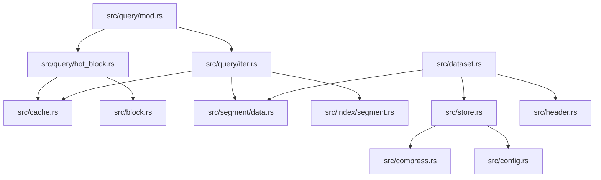
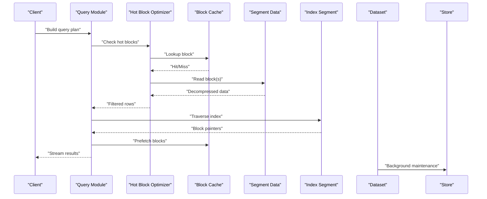
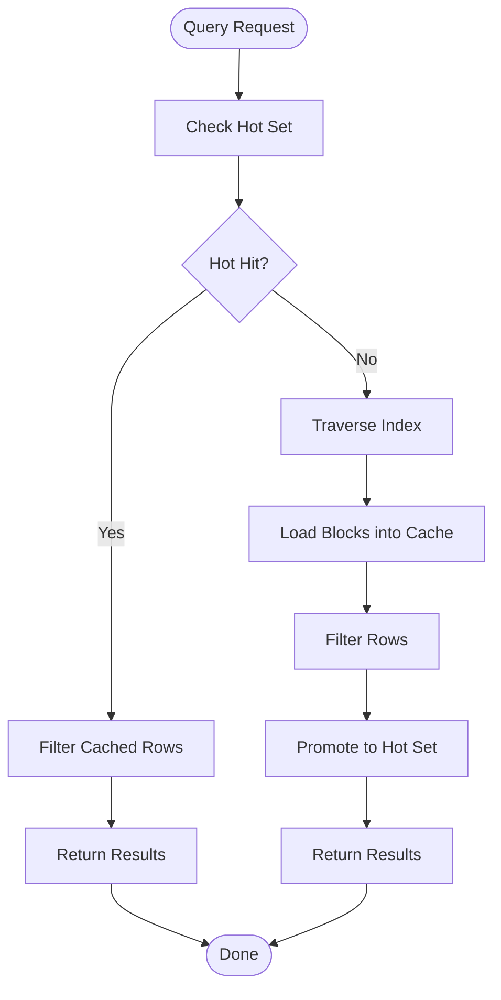
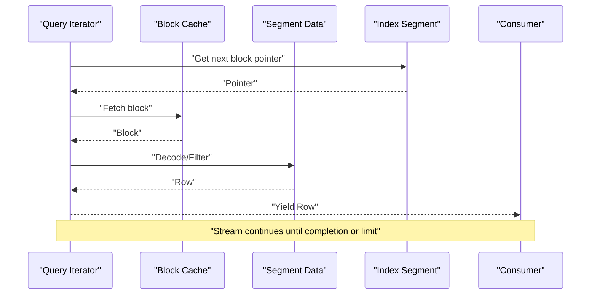
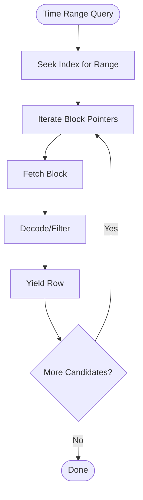
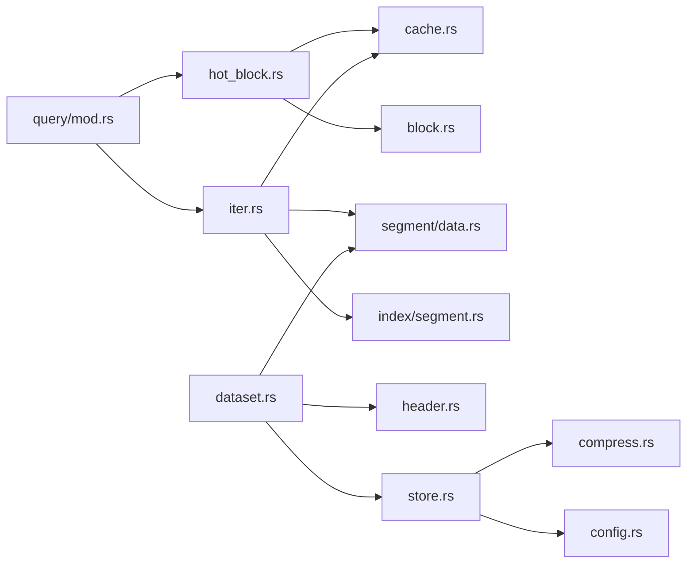

# Query Optimization

<cite>
**Referenced Files in This Document**
- [hot_block.rs](file://src/query/hot_block.rs)
- [iter.rs](file://src/query/iter.rs)
- [mod.rs](file://src/query/mod.rs)
- [cache.rs](file://src/cache.rs)
- [block.rs](file://src/block.rs)
- [dataset.rs](file://src/dataset.rs)
- [store.rs](file://src/store.rs)
- [index_segment.rs](file://src/index/segment.rs)
- [data.rs](file://src/segment/data.rs)
- [header.rs](file://src/header.rs)
- [compress.rs](file://src/compress.rs)
- [config.rs](file://src/config.rs)
- [lib.rs](file://src/lib.rs)
- [query_test.rs](file://tests/query_test.rs)
- [design.md](file://design.md)
- [plan.md](file://plan.md)
- [phase-09-blockcache.md](file://docs/plan/phase-09-blockcache.md)
- [phase-13-query-iterator.md](file://docs/plan/phase-13-query-iterator.md)
- [background-and-cache.md](file://docs/design/background-and-cache.md)
- [lazy-allocation.md](file://docs/design/lazy-allocation.md)
- [time-index.md](file://docs/design/time-index.md)
- [data-segment.md](file://docs/design/data-segment.md)
- [query-iterator.md](file://docs/design/query-iterator.md)
- [cargo-and-config.md](file://docs/design/cargo-and-config.md)
- [compression.md](file://docs/design/compression.md)
- [queue-overview.md](file://docs/design/queue-overview.md)
- [queue-state-file.md](file://docs/design/queue-state-file.md)
- [store-and-ffi.md](file://docs/design/store-and-ffi.md)
- [journal.md](file://docs/design/journal.md)
- [dataset-operations.md](file://docs/design/dataset-operations.md)
- [design-decisions.md](file://docs/design/design-decisions.md)
- [time-index.md](file://docs/design/time-index.md)
- [data-segment.md](file://docs/design/data-segment.md)
- [query-iterator.md](file://docs/design/query-iterator.md)
- [lazy-allocation.md](file://docs/design/lazy-allocation.md)
- [background-and-cache.md](file://docs/design/background-and-cache.md)
- [cargo-and-config.md](file://docs/design/cargo-and-config.md)
- [compression.md](file://docs/design/compression.md)
- [queue-overview.md](file://docs/design/queue-overview.md)
- [queue-state-file.md](file://docs/design/queue-state-file.md)
- [store-and-ffi.md](file://docs/design/store-and-ffi.md)
- [journal.md](file://docs/design/journal.md)
- [dataset-operations.md](file://docs/design/dataset-operations.md)
- [design-decisions.md](file://docs/design/design-decisions.md)
</cite>

## Table of Contents
1. [Introduction](#introduction)
2. [Project Structure](#project-structure)
3. [Core Components](#core-components)
4. [Architecture Overview](#architecture-overview)
5. [Detailed Component Analysis](#detailed-component-analysis)
6. [Dependency Analysis](#dependency-analysis)
7. [Performance Considerations](#performance-considerations)
8. [Troubleshooting Guide](#troubleshooting-guide)
9. [Conclusion](#conclusion)
10. [Appendices](#appendices)

## Introduction
This document explains TimSLite’s query optimization strategies and performance tuning. It focuses on hot block optimization, cache utilization, memory access patterns, query planning, index traversal, and result filtering. It also covers performance characteristics of different query types, adaptive execution, memory usage optimization, streaming result processing, resource contention management, benchmarking methodologies, profiling techniques, and practical tuning recommendations for varied workloads.

## Project Structure
TimSLite organizes query-related logic under the query module, with supporting components for caching, blocks, segments, indices, and datasets. Design documents and planning artifacts provide deeper insights into optimization decisions and trade-offs.

**Diagram sources**
- [mod.rs](file://src/query/mod.rs)
- [hot_block.rs](file://src/query/hot_block.rs)
- [iter.rs](file://src/query/iter.rs)
- [cache.rs](file://src/cache.rs)
- [block.rs](file://src/block.rs)
- [data.rs](file://src/segment/data.rs)
- [index_segment.rs](file://src/index/segment.rs)
- [dataset.rs](file://src/dataset.rs)
- [store.rs](file://src/store.rs)
- [header.rs](file://src/header.rs)
- [compress.rs](file://src/compress.rs)
- [config.rs](file://src/config.rs)

**Section sources**
- [mod.rs](file://src/query/mod.rs)
- [hot_block.rs](file://src/query/hot_block.rs)
- [iter.rs](file://src/query/iter.rs)
- [cache.rs](file://src/cache.rs)
- [block.rs](file://src/block.rs)
- [data.rs](file://src/segment/data.rs)
- [index_segment.rs](file://src/index/segment.rs)
- [dataset.rs](file://src/dataset.rs)
- [store.rs](file://src/store.rs)
- [header.rs](file://src/header.rs)
- [compress.rs](file://src/compress.rs)
- [config.rs](file://src/config.rs)

## Core Components
- Hot Block Optimization: Optimizes frequent reads by keeping recently accessed blocks hot, reducing repeated IO and computation.
- Query Iterator: Provides streaming iteration over results with minimal memory footprint and efficient filtering.
- Block Cache: Manages cached blocks with eviction policies and coherency guarantees.
- Segment Data Access: Encapsulates data layout, compression, and access patterns for efficient scanning.
- Index Segment: Supports fast traversal via time-based indexing and sparse continuous indices.
- Dataset and Store: Orchestrate write-back, compaction, and background tasks that influence query performance.

Key implementation anchors:
- Hot block optimization and iterator logic are defined in the query module.
- Caching and block-level primitives are in cache.rs and block.rs.
- Data segment and compression are handled in segment/data.rs and compress.rs.
- Index traversal is implemented in index/segment.rs.
- Dataset and store coordinate IO and background processing.

**Section sources**
- [hot_block.rs](file://src/query/hot_block.rs)
- [iter.rs](file://src/query/iter.rs)
- [cache.rs](file://src/cache.rs)
- [block.rs](file://src/block.rs)
- [data.rs](file://src/segment/data.rs)
- [index_segment.rs](file://src/index/segment.rs)
- [dataset.rs](file://src/dataset.rs)
- [store.rs](file://src/store.rs)

## Architecture Overview
TimSLite’s query pipeline integrates hot block optimization with a streaming iterator, leveraging a block cache and compressed data segments. Index segments accelerate traversal, while dataset and store manage persistence and background maintenance.

**Diagram sources**
- [mod.rs](file://src/query/mod.rs)
- [hot_block.rs](file://src/query/hot_block.rs)
- [iter.rs](file://src/query/iter.rs)
- [cache.rs](file://src/cache.rs)
- [data.rs](file://src/segment/data.rs)
- [index_segment.rs](file://src/index/segment.rs)
- [dataset.rs](file://src/dataset.rs)
- [store.rs](file://src/store.rs)

## Detailed Component Analysis

### Hot Block Optimization
Purpose:
- Reduce repeated IO and decompression by maintaining frequently accessed blocks in a hot set.
- Improve latency for hot-spot queries and reduce cache miss penalties.

Mechanisms:
- Hot block tracking identifies recent accesses and promotes blocks to hot storage.
- On hot hits, bypasses index traversal and returns filtered rows directly from cached blocks.
- Eviction and coherency policies ensure hot set remains beneficial and consistent.

Performance impact:
- Lower latency for repetitive reads.
- Reduced CPU overhead from skipping index scans when hot.
- Potential memory overhead for hot block retention.

**Diagram sources**
- [hot_block.rs](file://src/query/hot_block.rs)
- [cache.rs](file://src/cache.rs)
- [index_segment.rs](file://src/index/segment.rs)

**Section sources**
- [hot_block.rs](file://src/query/hot_block.rs)
- [cache.rs](file://src/cache.rs)
- [index_segment.rs](file://src/index/segment.rs)

### Query Iterator and Streaming
Purpose:
- Provide a streaming interface that minimizes memory usage and enables early filtering.
- Support incremental consumption of results during traversal.

Mechanisms:
- Iterator yields rows progressively, applying filters as data becomes available.
- Integrates with hot block optimization and cache prefetching.
- Coordinates with segment data access and index traversal.

Performance impact:
- Lower peak memory usage.
- Enables early termination for bounded queries.
- Reduces latency-to-first-byte for large scans.

**Diagram sources**
- [iter.rs](file://src/query/iter.rs)
- [cache.rs](file://src/cache.rs)
- [data.rs](file://src/segment/data.rs)
- [index_segment.rs](file://src/index/segment.rs)

**Section sources**
- [iter.rs](file://src/query/iter.rs)
- [cache.rs](file://src/cache.rs)
- [data.rs](file://src/segment/data.rs)
- [index_segment.rs](file://src/index/segment.rs)

### Index Traversal Strategies
Purpose:
- Accelerate query execution by navigating to relevant blocks efficiently.
- Support time-based and sparse continuous indexing to minimize scan cost.

Mechanisms:
- Index segment stores metadata pointers to blocks.
- Traversal follows index entries to locate candidate blocks for a given time range.
- Sparse indices reduce overhead while maintaining accuracy.

Performance impact:
- Dramatically reduces scan cost for time-range queries.
- Improves locality and cache friendliness when combined with prefetching.

**Diagram sources**
- [index_segment.rs](file://src/index/segment.rs)
- [iter.rs](file://src/query/iter.rs)
- [data.rs](file://src/segment/data.rs)

**Section sources**
- [index_segment.rs](file://src/index/segment.rs)
- [iter.rs](file://src/query/iter.rs)
- [data.rs](file://src/segment/data.rs)

### Result Filtering Mechanisms
Purpose:
- Apply filters incrementally to reduce downstream processing and memory pressure.
- Integrate with hot block optimization and index traversal for early pruning.

Mechanisms:
- Filters are applied during decode and row yield stages.
- Hot blocks bypass index traversal, so filtering occurs on cached rows.
- Streaming ensures that filtering happens close to data arrival.

Performance impact:
- Reduces total rows processed and returned.
- Lowers memory footprint by avoiding materialization of unnecessary rows.

**Section sources**
- [hot_block.rs](file://src/query/hot_block.rs)
- [iter.rs](file://src/query/iter.rs)
- [data.rs](file://src/segment/data.rs)

### Memory Access Optimization
Purpose:
- Optimize data access patterns to improve cache locality and reduce TLB pressure.
- Minimize random IO and maximize sequential access where possible.

Mechanisms:
- Compressed data segments enable compact storage and efficient sequential reads.
- Block-level caching improves spatial locality for repeated access.
- Lazy allocation and streaming reduce peak memory usage.

Performance impact:
- Lower cache misses and improved throughput.
- Reduced memory bandwidth pressure for large scans.

**Section sources**
- [data.rs](file://src/segment/data.rs)
- [compress.rs](file://src/compress.rs)
- [cache.rs](file://src/cache.rs)
- [lazy-allocation.md](file://docs/design/lazy-allocation.md)

### Adaptive Query Execution
Purpose:
- Dynamically select the most efficient execution path based on query characteristics and runtime conditions.

Mechanisms:
- Hot block detection influences whether to traverse the index or serve from cache.
- Streaming iterator adapts to query limits and early termination.
- Background store operations (compaction, maintenance) influence cache coherency and block availability.

Performance impact:
- Tailored performance per workload pattern.
- Improved responsiveness under varying data distributions.

**Section sources**
- [hot_block.rs](file://src/query/hot_block.rs)
- [iter.rs](file://src/query/iter.rs)
- [store.rs](file://src/store.rs)

## Dependency Analysis
The query module depends on cache, block, segment data, and index segment modules. Dataset and store orchestrate persistence and background tasks that indirectly affect query performance.

**Diagram sources**
- [mod.rs](file://src/query/mod.rs)
- [hot_block.rs](file://src/query/hot_block.rs)
- [iter.rs](file://src/query/iter.rs)
- [cache.rs](file://src/cache.rs)
- [block.rs](file://src/block.rs)
- [data.rs](file://src/segment/data.rs)
- [index_segment.rs](file://src/index/segment.rs)
- [dataset.rs](file://src/dataset.rs)
- [header.rs](file://src/header.rs)
- [store.rs](file://src/store.rs)
- [compress.rs](file://src/compress.rs)
- [config.rs](file://src/config.rs)

**Section sources**
- [mod.rs](file://src/query/mod.rs)
- [hot_block.rs](file://src/query/hot_block.rs)
- [iter.rs](file://src/query/iter.rs)
- [cache.rs](file://src/cache.rs)
- [block.rs](file://src/block.rs)
- [data.rs](file://src/segment/data.rs)
- [index_segment.rs](file://src/index/segment.rs)
- [dataset.rs](file://src/dataset.rs)
- [header.rs](file://src/header.rs)
- [store.rs](file://src/store.rs)
- [compress.rs](file://src/compress.rs)
- [config.rs](file://src/config.rs)

## Performance Considerations
- Hot block optimization:
  - Best for repetitive queries over small time windows or hot spots.
  - Tune hot set size and eviction policy to balance hit rate and memory usage.
- Streaming and filtering:
  - Prefer bounded queries and early termination to reduce memory and CPU.
  - Apply filters close to decode to minimize intermediate allocations.
- Cache utilization:
  - Monitor cache hit ratio and adjust prefetch sizes for workload patterns.
  - Coherency policies should align with write frequency and staleness tolerance.
- Index traversal:
  - Time-range queries benefit from sparse indices; ensure index coverage matches typical queries.
- Memory usage:
  - Use compressed segments and streaming to cap peak memory.
  - Leverage lazy allocation for optional structures.
- Background operations:
  - Compaction and maintenance can temporarily increase IO; schedule around peak load windows.

[No sources needed since this section provides general guidance]

## Troubleshooting Guide
Common issues and remedies:
- Poor hot block hit rate:
  - Verify query patterns and consider adjusting hot set size or promotion thresholds.
  - Inspect cache coherency and staleness policies.
- High memory usage:
  - Switch to streaming queries and apply filters earlier.
  - Review compression settings and block sizes.
- Slow index traversal:
  - Confirm index coverage and rebuild if stale.
  - Analyze query time ranges and consider pre-filtering.
- Background contention:
  - Adjust background task scheduling and concurrency limits.
  - Monitor IO saturation and throttle writes during heavy read periods.

**Section sources**
- [cache.rs](file://src/cache.rs)
- [hot_block.rs](file://src/query/hot_block.rs)
- [iter.rs](file://src/query/iter.rs)
- [store.rs](file://src/store.rs)

## Conclusion
TimSLite’s query optimization combines hot block caching, streaming iterators, and efficient index traversal to deliver strong performance across diverse workloads. By tuning cache policies, leveraging compression, and adapting execution dynamically, users can achieve low-latency, memory-efficient queries. Proper profiling and monitoring enable targeted improvements for specific patterns.

[No sources needed since this section summarizes without analyzing specific files]

## Appendices

### Benchmarking Methodologies
- Microbenchmarks:
  - Measure hot block hit rate, cache miss ratio, and decoding throughput.
  - Compare streaming vs. materialized results for memory and CPU.
- Macrobenchmarks:
  - Simulate realistic query mixes: single-timestamp reads, latest-timestamp reads, and time-range scans.
  - Track latency percentiles, throughput, and resource utilization.
- Regression testing:
  - Include query performance tests in CI to detect regressions after changes.

**Section sources**
- [query_test.rs](file://tests/query_test.rs)
- [phase-09-blockcache.md](file://docs/plan/phase-09-blockcache.md)
- [phase-13-query-iterator.md](file://docs/plan/phase-13-query-iterator.md)

### Performance Profiling Techniques
- CPU profiling:
  - Identify hotspots in decode/filter and index traversal.
- Memory profiling:
  - Track allocations during streaming and compression.
- IO profiling:
  - Measure block fetch latencies and cache hit ratios.
- Contention analysis:
  - Observe background task scheduling and lock contention.

**Section sources**
- [background-and-cache.md](file://docs/design/background-and-cache.md)
- [lazy-allocation.md](file://docs/design/lazy-allocation.md)
- [compression.md](file://docs/design/compression.md)

### Optimization Best Practices
- Align hot set sizing with workload locality.
- Prefer streaming queries and early filtering.
- Use compressed segments and appropriate block sizes.
- Schedule background tasks to avoid read peaks.
- Continuously monitor cache metrics and adjust policies.

**Section sources**
- [cargo-and-config.md](file://docs/design/cargo-and-config.md)
- [time-index.md](file://docs/design/time-index.md)
- [data-segment.md](file://docs/design/data-segment.md)
- [query-iterator.md](file://docs/design/query-iterator.md)
- [lazy-allocation.md](file://docs/design/lazy-allocation.md)
- [background-and-cache.md](file://docs/design/background-and-cache.md)