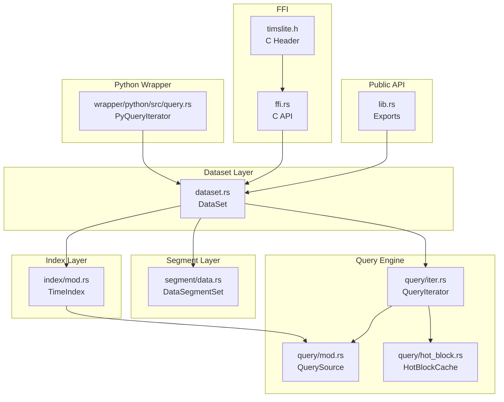
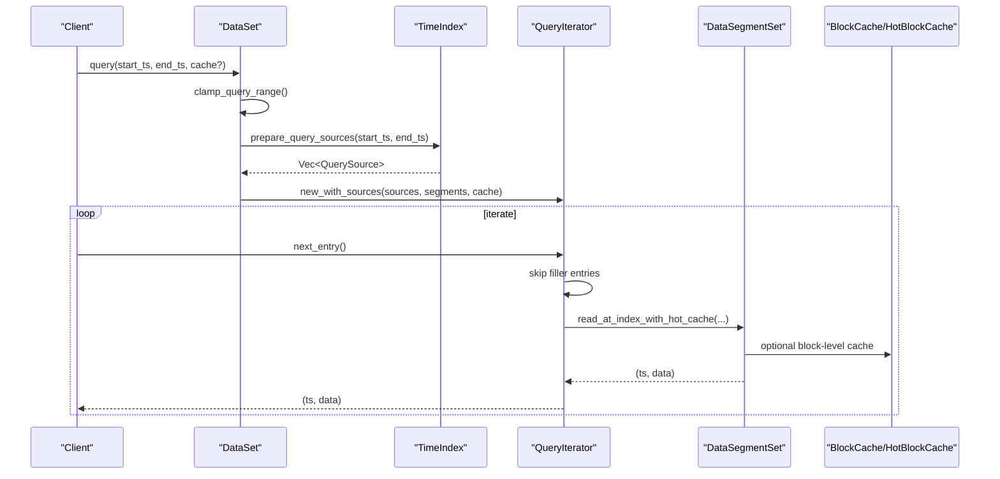
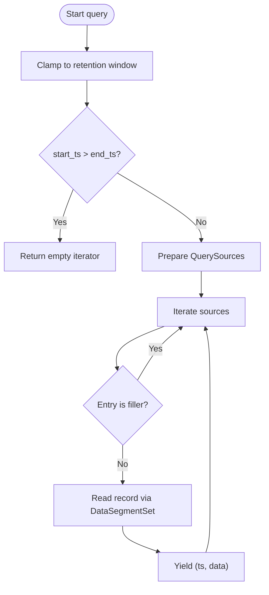
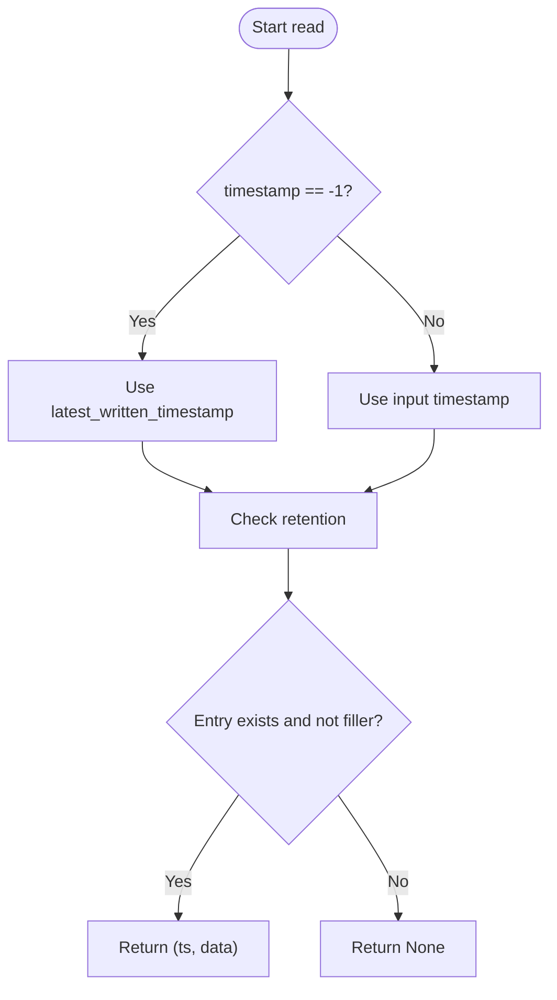
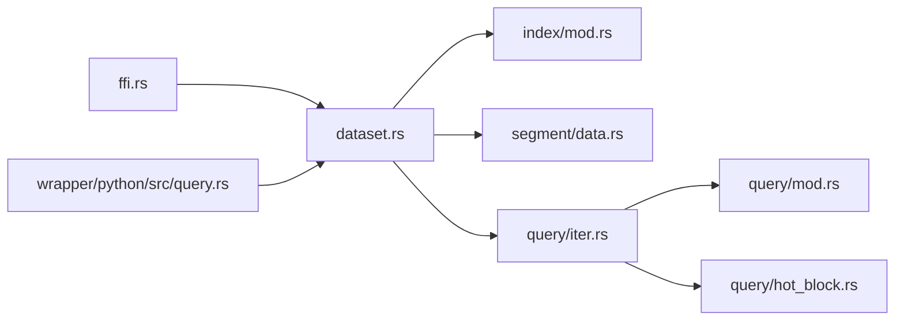

# Query Types and Operations

<cite>
**Referenced Files in This Document**
- [lib.rs](file://src/lib.rs)
- [dataset.rs](file://src/dataset.rs)
- [query/mod.rs](file://src/query/mod.rs)
- [query/iter.rs](file://src/query/iter.rs)
- [query/hot_block.rs](file://src/query/hot_block.rs)
- [index/mod.rs](file://src/index/mod.rs)
- [segment/data.rs](file://src/segment/data.rs)
- [ffi.rs](file://src/ffi.rs)
- [timslite.h](file://include/timslite.h)
- [query.rs](file://wrapper/python/src/query.rs)
- [query_test.rs](file://tests/query_test.rs)
- [error.rs](file://src/error.rs)
</cite>

## Table of Contents
1. [Introduction](#introduction)
2. [Project Structure](#project-structure)
3. [Core Components](#core-components)
4. [Architecture Overview](#architecture-overview)
5. [Detailed Component Analysis](#detailed-component-analysis)
6. [Dependency Analysis](#dependency-analysis)
7. [Performance Considerations](#performance-considerations)
8. [Troubleshooting Guide](#troubleshooting-guide)
9. [Conclusion](#conclusion)
10. [Appendices](#appendices)

## Introduction
This document describes all query types and operations supported by TimSLite’s query engine. It covers:
- Range query operations with inclusive start and end timestamps
- Single timestamp reads (including latest-resolver semantics)
- Aggregate function queries (conceptual coverage)
- Query syntax, parameter handling, and result formatting
- Execution patterns, iteration strategies, and data retrieval
- Validation, error handling, and exception management
- Practical examples, performance characteristics, and optimization strategies
- Query composition, chaining, and result transformation techniques

## Project Structure
TimSLite organizes query capabilities across several modules:
- Public API and exports are exposed via the library facade
- Dataset encapsulates query entry points and lifecycle
- Query engine builds lazy iterators over index sources
- Index module prepares efficient query sources across in-memory and segment-backed indices
- Segment module provides low-level record reads with caching
- FFI exposes C-compatible query iteration for external consumers
- Python wrapper adapts the query iterator to Python’s iterator protocol

**Diagram sources**
- [lib.rs:60-72](file://src/lib.rs#L60-L72)
- [dataset.rs:629-668](file://src/dataset.rs#L629-L668)
- [query/iter.rs:119-216](file://src/query/iter.rs#L119-L216)
- [index/mod.rs:650-709](file://src/index/mod.rs#L650-L709)
- [segment/data.rs](file://src/segment/data.rs)
- [ffi.rs:760-851](file://src/ffi.rs#L760-L851)
- [timslite.h:307-332](file://include/timslite.h#L307-L332)
- [query.rs:11-67](file://wrapper/python/src/query.rs#L11-L67)

**Section sources**
- [lib.rs:39-72](file://src/lib.rs#L39-L72)
- [dataset.rs:629-668](file://src/dataset.rs#L629-L668)
- [query/mod.rs:1-5](file://src/query/mod.rs#L1-L5)
- [index/mod.rs:650-709](file://src/index/mod.rs#L650-L709)

## Core Components
- DataSet query entry points:
  - Range query returning a vector of records
  - Lazy iterator-based range query
  - Index entry enumeration for a range
  - Single timestamp read with special latest semantics
- QueryIterator: lazy consumption of precomputed sources, skipping filler entries, reading records via DataSegmentSet with optional caches
- TimeIndex: prepares query sources across in-memory buffer and open/closed index segments
- DataSegmentSet: performs record reads with optional block-level caching and hot block reuse
- FFI: exposes C API for range queries and iteration
- Python wrapper: adapts lazy index entries to a Python iterator protocol

**Section sources**
- [dataset.rs:629-692](file://src/dataset.rs#L629-L692)
- [query/iter.rs:119-216](file://src/query/iter.rs#L119-L216)
- [index/mod.rs:650-709](file://src/index/mod.rs#L650-L709)
- [segment/data.rs](file://src/segment/data.rs)
- [ffi.rs:760-851](file://src/ffi.rs#L760-L851)
- [query.rs:11-67](file://wrapper/python/src/query.rs#L11-L67)

## Architecture Overview
The query pipeline transforms a time range into a sequence of records with minimal I/O overhead:

**Diagram sources**
- [dataset.rs:629-668](file://src/dataset.rs#L629-L668)
- [index/mod.rs:650-709](file://src/index/mod.rs#L650-L709)
- [query/iter.rs:158-191](file://src/query/iter.rs#L158-L191)
- [segment/data.rs](file://src/segment/data.rs)

## Detailed Component Analysis

### Range Queries
Range queries select records within an inclusive timestamp interval [start_ts, end_ts].

- Behavior
  - Range clamping accounts for retention windows
  - If start_ts > end_ts, returns an empty iterator
  - QuerySources are prepared from in-memory buffer and index segments
  - Filler entries (deleted placeholders) are skipped during iteration
- Parameters
  - start_ts: inclusive lower bound
  - end_ts: inclusive upper bound
  - cache: optional block cache reference
- Results
  - Vector form: collects all records into memory
  - Iterator form: yields lazily consumed (ts, data) pairs
- Validation
  - start_ts > end_ts yields empty result
  - Retention clamping ensures only retrievable timestamps are considered

**Diagram sources**
- [dataset.rs:629-668](file://src/dataset.rs#L629-L668)
- [index/mod.rs:650-709](file://src/index/mod.rs#L650-L709)
- [query/iter.rs:158-191](file://src/query/iter.rs#L158-L191)

**Section sources**
- [dataset.rs:629-668](file://src/dataset.rs#L629-L668)
- [index/mod.rs:650-709](file://src/index/mod.rs#L650-L709)
- [query/iter.rs:158-216](file://src/query/iter.rs#L158-L216)
- [query_test.rs:17-52](file://tests/query_test.rs#L17-L52)

### Single Timestamp Reads
Single timestamp reads fetch a record by exact timestamp with special latest semantics.

- Behavior
  - Special case: timestamp == -1 resolves to latest_written_timestamp
  - No backward search for the latest valid record; deleted latest entries return None
  - Retention checks apply to the resolved timestamp
- Parameters
  - timestamp: exact timestamp or -1 for latest
  - cache: optional block cache reference
- Results
  - Returns Some((ts, data)) if found and not a filler
  - Returns None if not found or entry is a filler

**Diagram sources**
- [dataset.rs:586-627](file://src/dataset.rs#L586-L627)

**Section sources**
- [dataset.rs:586-627](file://src/dataset.rs#L586-L627)

### Aggregate Function Queries
Aggregate functions (e.g., min, max, avg, sum, count) are not implemented in the current codebase. The query engine focuses on retrieving raw records within a time range. Aggregations can be performed client-side over the returned records or by extending the query pipeline to compute aggregates during iteration.

[No sources needed since this section provides conceptual guidance]

### Query Execution Patterns
- Vector-based retrieval: DataSet::query returns a Vec<(ts, data)> for convenience
- Lazy iteration: DataSet::query_iter returns a QueryIterator for streaming consumption
- Index enumeration: DataSet::query_index_entries enumerates IndexEntry objects for a range
- FFI iteration: tmsl_dataset_query + tmsl_iter_next provide C-compatible streaming
- Python iteration: PyQueryIterator adapts lazy index entries to Python’s iterator protocol

**Section sources**
- [dataset.rs:629-692](file://src/dataset.rs#L629-L692)
- [ffi.rs:760-851](file://src/ffi.rs#L760-L851)
- [query.rs:11-67](file://wrapper/python/src/query.rs#L11-L67)

### Result Iteration Methods and Data Retrieval Strategies
- QueryIterator
  - Skips filler entries automatically
  - Uses DataSegmentSet::read_at_index_with_hot_cache for efficient reads
  - Supports collect_all for backward compatibility
- FFI
  - tmsl_dataset_query returns an iterator handle
  - tmsl_iter_next returns one record at a time and allocates memory for data
  - tmsl_iter_close frees the iterator and decrements reference counts
- Python
  - PyQueryIterator implements __iter__/__next__ and skips fillers
  - Releases resources via close()

**Section sources**
- [query/iter.rs:158-216](file://src/query/iter.rs#L158-L216)
- [ffi.rs:760-851](file://src/ffi.rs#L760-L851)
- [query.rs:11-67](file://wrapper/python/src/query.rs#L11-L67)

### Query Validation, Error Handling, and Exception Management
- Validation
  - start_ts > end_ts returns empty results
  - Retention window clamps query ranges
  - Timestamp zero or negative is rejected for writes/appends; reads resolve -1 to latest
- Errors
  - TmslError enumerates domain-specific errors (I/O, invalid data, not found, expired, etc.)
  - FFI uses ffi_catch macros to translate errors into C-friendly buffers
- Exceptions
  - Rust panics are contained within FFI wrappers; callers receive error messages in err_buf

**Section sources**
- [dataset.rs:629-668](file://src/dataset.rs#L629-L668)
- [error.rs:8-43](file://src/error.rs#L8-L43)
- [ffi.rs:760-851](file://src/ffi.rs#L760-L851)

### Practical Examples of Common Query Patterns
- Small-range scan: query [50, 120] over regularly written timestamps
- Backward compatibility: inverted range [100, 1] returns empty
- Empty range before writes: query [1, 100] on an empty dataset returns empty
- Latest read: read with timestamp -1 returns the most recently written record if not deleted

**Section sources**
- [query_test.rs:17-52](file://tests/query_test.rs#L17-L52)
- [query_test.rs:74-79](file://tests/query_test.rs#L74-L79)
- [query_test.rs:104-109](file://tests/query_test.rs#L104-L109)

### Performance Characteristics and Optimization Strategies
- Range queries
  - Complexity proportional to number of returned records plus index traversal cost
  - Minimize I/O by leveraging DataSegmentSet’s block-level caching and HotBlockCache reuse
  - Prefer lazy iteration for large ranges to avoid large in-memory allocations
- Single timestamp reads
  - Efficient when index entry is present; fallbacks to latest resolution incur minimal overhead
- FFI and Python
  - FFI avoids extra copies by returning malloc’d buffers; callers must free via tmsl_iter_free_data
  - Python wrapper locks dataset per record; batch processing reduces contention
- Index continuity
  - Continuous mode enables sparse logical holes and efficient segment scans; non-continuous mode requires exact index entries for out-of-order writes

**Section sources**
- [query/iter.rs:183-191](file://src/query/iter.rs#L183-L191)
- [ffi.rs:799-836](file://src/ffi.rs#L799-L836)
- [query.rs:40-54](file://wrapper/python/src/query.rs#L40-L54)

### Query Composition, Chaining, and Result Transformation
- Composition
  - Chain multiple range queries by iterating over disjoint intervals and merging results
  - Combine with filtering and transformation in client code
- Chaining
  - Use lazy QueryIterator to chain transformations (filter, map) without loading all records
- Transformation
  - Convert raw bytes to typed structures in application code
  - Apply rolling windows or downsampling post-retrieval

[No sources needed since this section provides conceptual guidance]

## Dependency Analysis
The query engine exhibits clear separation of concerns with low coupling between layers.

**Diagram sources**
- [dataset.rs:629-668](file://src/dataset.rs#L629-L668)
- [index/mod.rs:650-709](file://src/index/mod.rs#L650-L709)
- [query/iter.rs:119-216](file://src/query/iter.rs#L119-L216)
- [query/mod.rs:1-5](file://src/query/mod.rs#L1-L5)
- [query/hot_block.rs:1-4](file://src/query/hot_block.rs#L1-L4)
- [ffi.rs:760-851](file://src/ffi.rs#L760-L851)
- [query.rs:11-67](file://wrapper/python/src/query.rs#L11-L67)

**Section sources**
- [lib.rs:60-72](file://src/lib.rs#L60-L72)
- [dataset.rs:629-668](file://src/dataset.rs#L629-L668)
- [query/iter.rs:119-216](file://src/query/iter.rs#L119-L216)

## Performance Considerations
- Prefer lazy iteration for large ranges to reduce peak memory usage
- Enable block-level caching and leverage HotBlockCache to minimize repeated reads
- Use continuous index mode for sparse data to reduce filler entries and improve scan locality
- Batch FFI calls to reduce allocation overhead; free returned buffers promptly
- Avoid excessive locking in Python wrapper by limiting per-record acquisitions

[No sources needed since this section provides general guidance]

## Troubleshooting Guide
- Empty results
  - Inverted range [start_ts, end_ts] where start > end returns empty
  - Range entirely outside retention window returns empty after clamping
- Not found or deleted entries
  - Single timestamp read returns None for missing or deleted entries
  - Latest read (-1) returns None when no records exist
- FFI errors
  - Check err_buf for detailed messages; ensure dataset handle is valid and iterator is not null
- Python iteration
  - Ensure entries are not mutated concurrently; close the iterator to release resources

**Section sources**
- [query_test.rs:74-79](file://tests/query_test.rs#L74-L79)
- [query_test.rs:104-109](file://tests/query_test.rs#L104-L109)
- [dataset.rs:586-627](file://src/dataset.rs#L586-L627)
- [ffi.rs:760-851](file://src/ffi.rs#L760-L851)
- [query.rs:61-67](file://wrapper/python/src/query.rs#L61-L67)

## Conclusion
TimSLite’s query engine provides efficient, flexible, and safe access to time-series data:
- Range queries support inclusive bounds with retention-aware clamping
- Single timestamp reads offer latest-resolution semantics
- Lazy iteration minimizes memory footprint and optimizes I/O
- Robust error handling and FFI/Python bindings enable cross-language usage
Future enhancements could include built-in aggregate functions and advanced query operators atop the existing iterator foundation.

[No sources needed since this section summarizes without analyzing specific files]

## Appendices

### API Reference Summary
- DataSet::query(start_ts, end_ts, cache?): returns Vec<(ts, data)>
- DataSet::query_iter(start_ts, end_ts, cache?): returns QueryIterator
- DataSet::query_index_entries(start_ts, end_ts): returns Vec<IndexEntry>
- DataSet::read(timestamp, cache?): returns Option<(ts, data)>
- FFI: tmsl_dataset_query, tmsl_iter_next, tmsl_iter_close, tmsl_data_free
- Python: QueryIterator implements __iter__/__next__

**Section sources**
- [dataset.rs:629-692](file://src/dataset.rs#L629-L692)
- [ffi.rs:760-851](file://src/ffi.rs#L760-L851)
- [query.rs:11-67](file://wrapper/python/src/query.rs#L11-L67)
- [timslite.h:307-332](file://include/timslite.h#L307-L332)