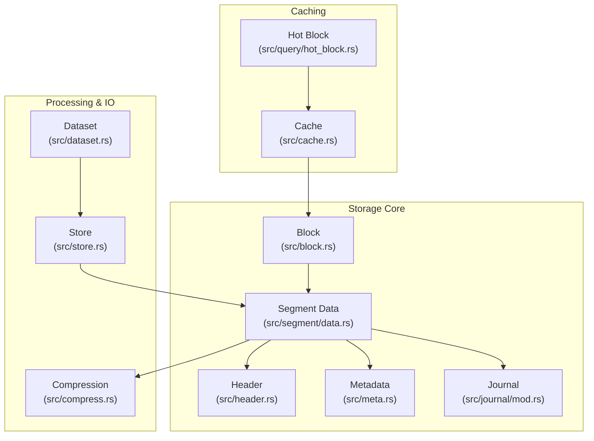
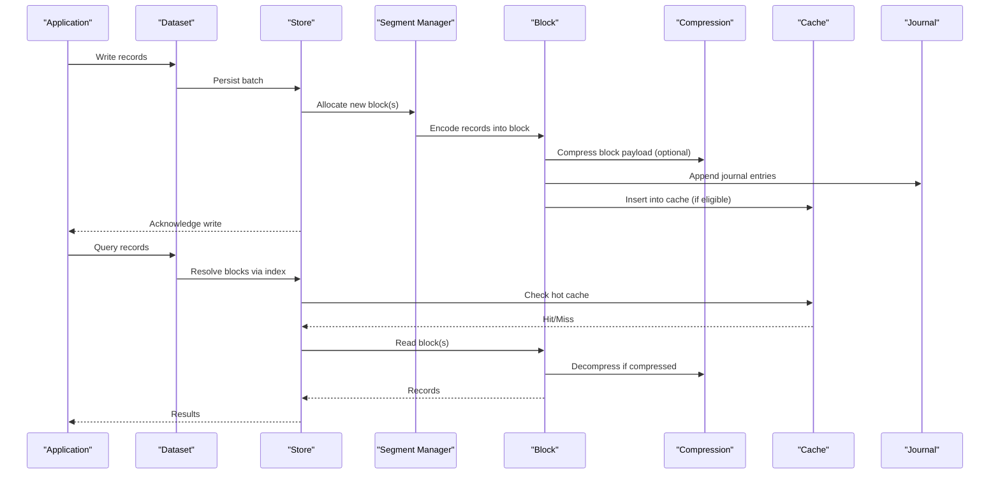
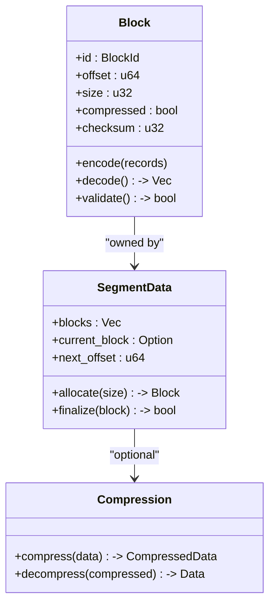
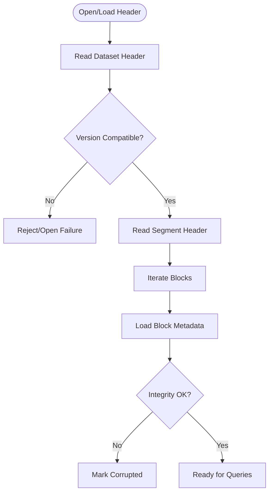
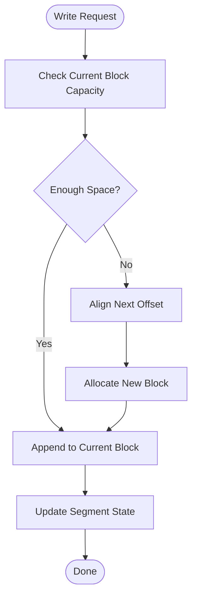
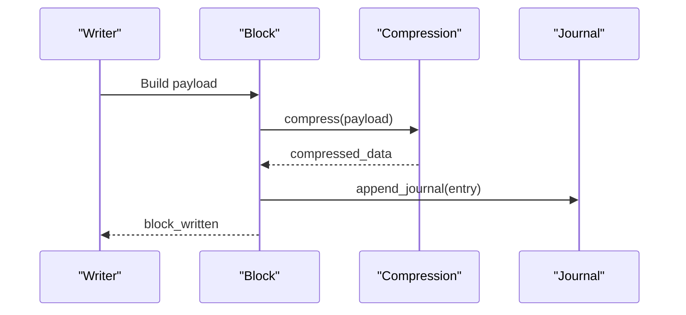
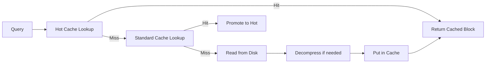
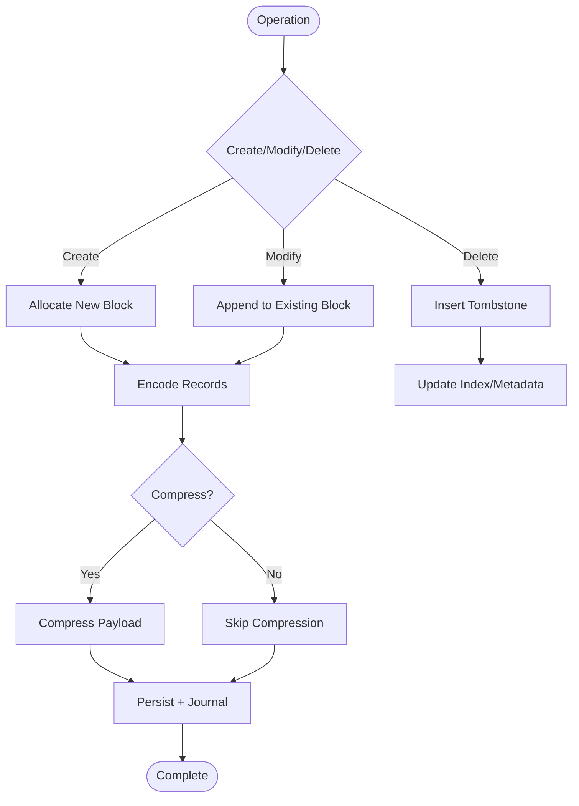
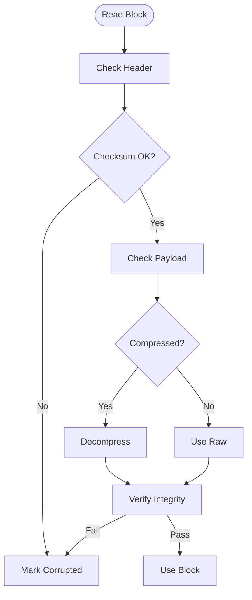
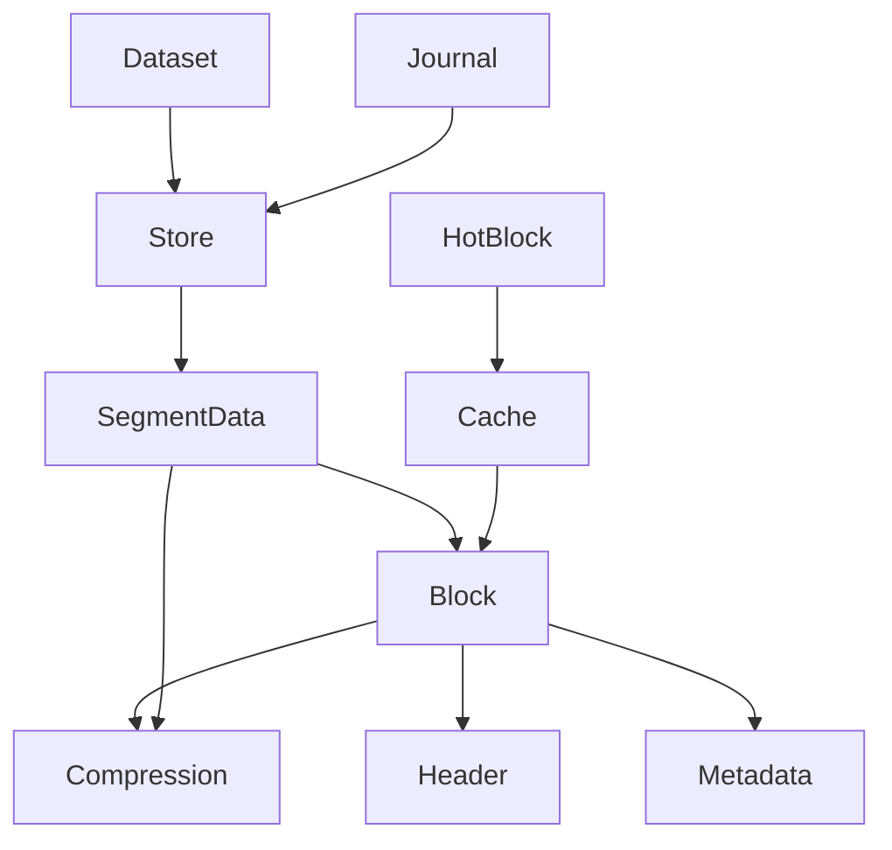

# Block Organization

<cite>
**Referenced Files in This Document**
- [block.rs](file://src/block.rs)
- [data.rs](file://src/segment/data.rs)
- [cache.rs](file://src/cache.rs)
- [compress.rs](file://src/compress.rs)
- [header.rs](file://src/header.rs)
- [hot_block.rs](file://src/query/hot_block.rs)
- [store.rs](file://src/store.rs)
- [meta.rs](file://src/meta.rs)
- [dataset.rs](file://src/dataset.rs)
- [journal.rs](file://src/journal/mod.rs)
- [lib.rs](file://src/lib.rs)
- [design.md](file://design.md)
- [phase-09-blockcache.md](file://docs/plan/phase-09-blockcache.md)
- [phase-03-datasegment.md](file://docs/plan/phase-03-datasegment.md)
- [phase-04-time-index.md](file://docs/plan/phase-04-time-index.md)
- [phase-12-lazy-allocation.md](file://docs/plan/phase-12-lazy-allocation.md)
- [phase-16-data-retention.md](file://docs/plan/phase-16-data-retention.md)
- [phase-18-out-of-order-write-and-delete.md](file://docs/plan/phase-18-out-of-order-write-and-delete.md)
- [phase-28-journal.md](file://docs/plan/phase-28-journal.md)
</cite>

## Table of Contents
1. [Introduction](#introduction)
2. [Project Structure](#project-structure)
3. [Core Components](#core-components)
4. [Architecture Overview](#architecture-overview)
5. [Detailed Component Analysis](#detailed-component-analysis)
6. [Dependency Analysis](#dependency-analysis)
7. [Performance Considerations](#performance-considerations)
8. [Troubleshooting Guide](#troubleshooting-guide)
9. [Conclusion](#conclusion)
10. [Appendices](#appendices)

## Introduction
This document explains TimSLite’s block-level data organization system. It covers block structure, header formats, data layout, allocation strategies, compression integration, metadata management, caching and hot block optimization, memory efficiency, block operations (creation, modification, deletion), block sizing and overhead, validation and recovery, and practical troubleshooting.

## Project Structure
TimSLite organizes storage around segments and blocks. Blocks are the fundamental units of persisted data, grouped into segments. The relevant modules include:
- Block definition and layout
- Segment-level data management
- Compression integration
- Caching and hot block optimization
- Header and metadata
- Journaling and persistence
- Store and dataset orchestration

**Diagram sources**
- [block.rs](file://src/block.rs)
- [data.rs](file://src/segment/data.rs)
- [compress.rs](file://src/compress.rs)
- [header.rs](file://src/header.rs)
- [meta.rs](file://src/meta.rs)
- [journal.rs](file://src/journal/mod.rs)
- [store.rs](file://src/store.rs)
- [dataset.rs](file://src/dataset.rs)
- [cache.rs](file://src/cache.rs)
- [hot_block.rs](file://src/query/hot_block.rs)

**Section sources**
- [lib.rs](file://src/lib.rs)
- [design.md](file://design.md)

## Core Components
- Block: The atomic unit of storage containing encoded records and optional compression. It defines boundaries for reads/writes and supports validation.
- Segment: A contiguous region holding multiple blocks, managed by a segment manager that tracks offsets, sizes, and alignment.
- Compression: Optional compression applied per block to reduce disk footprint while preserving random access characteristics.
- Header: Stores dataset-level metadata and segment-level state to enable reconstruction and validation.
- Metadata: Per-block and per-segment metadata for indexing, retention, and lifecycle management.
- Journal: Append-only log ensuring durability and recovery of recent writes.
- Cache: Block-level caching with hot block optimization to accelerate frequent queries.
- Store/Dataset: Orchestrate write, read, and maintenance operations across segments and blocks.

**Section sources**
- [block.rs](file://src/block.rs)
- [data.rs](file://src/segment/data.rs)
- [compress.rs](file://src/compress.rs)
- [header.rs](file://src/header.rs)
- [meta.rs](file://src/meta.rs)
- [journal.rs](file://src/journal/mod.rs)
- [cache.rs](file://src/cache.rs)
- [hot_block.rs](file://src/query/hot_block.rs)
- [store.rs](file://src/store.rs)
- [dataset.rs](file://src/dataset.rs)

## Architecture Overview
The block-level architecture integrates compression, caching, and journaling to support efficient, durable, and query-friendly storage.

**Diagram sources**
- [store.rs](file://src/store.rs)
- [dataset.rs](file://src/dataset.rs)
- [data.rs](file://src/segment/data.rs)
- [block.rs](file://src/block.rs)
- [compress.rs](file://src/compress.rs)
- [cache.rs](file://src/cache.rs)
- [journal.rs](file://src/journal/mod.rs)

## Detailed Component Analysis

### Block Structure and Layout
- Block boundary: Fixed or variable-sized depending on configuration. Each block contains a header, payload, and optional compression framing.
- Payload encoding: Records are serialized contiguously within the block payload. Alignment ensures efficient reads and minimizes fragmentation.
- Compression framing: When enabled, the payload is compressed and tagged with metadata indicating compression type and sizes.
- Validation markers: Each block stores checksums or integrity indicators to detect corruption during reads.

**Diagram sources**
- [block.rs](file://src/block.rs)
- [data.rs](file://src/segment/data.rs)
- [compress.rs](file://src/compress.rs)

**Section sources**
- [block.rs](file://src/block.rs)
- [data.rs](file://src/segment/data.rs)
- [compress.rs](file://src/compress.rs)

### Header Formats and Metadata Management
- Dataset header: Contains dataset configuration, versioning, and global settings.
- Segment header: Tracks segment-level state, timestamps, and indices.
- Block metadata: Per-block fields for compression info, offsets, and integrity flags.
- Lifecycle metadata: Creation time, retention policy, and deletion markers.

**Diagram sources**
- [header.rs](file://src/header.rs)
- [meta.rs](file://src/meta.rs)

**Section sources**
- [header.rs](file://src/header.rs)
- [meta.rs](file://src/meta.rs)

### Allocation Strategies and Lazy Allocation
- Allocation policy: Segments allocate blocks sequentially with padding/alignment to meet read/write efficiency targets.
- Lazy allocation: New blocks are allocated on demand when the current block reaches capacity or alignment thresholds.
- Fragmentation control: Alignment and preallocation reduce internal fragmentation and improve sequential IO.

**Diagram sources**
- [data.rs](file://src/segment/data.rs)
- [phase-12-lazy-allocation.md](file://docs/plan/phase-12-lazy-allocation.md)

**Section sources**
- [data.rs](file://src/segment/data.rs)
- [phase-12-lazy-allocation.md](file://docs/plan/phase-12-lazy-allocation.md)

### Compression Integration
- Per-block compression: Optional compression reduces disk usage; decompression occurs transparently during reads.
- Compression metadata: Stores compression algorithm and sizes to guide decompression and validation.
- Trade-offs: CPU cost vs. storage savings; balanced by selective application and block sizing.

**Diagram sources**
- [compress.rs](file://src/compress.rs)
- [block.rs](file://src/block.rs)
- [journal.rs](file://src/journal/mod.rs)

**Section sources**
- [compress.rs](file://src/compress.rs)
- [block.rs](file://src/block.rs)
- [journal.rs](file://src/journal/mod.rs)

### Block Caching and Hot Block Optimization
- Cache layer: Stores recently accessed blocks in memory keyed by block identifiers.
- Hot block detection: Frequently accessed blocks are prioritized for eviction-resistant placement.
- Eviction policy: LRU or adaptive policies to balance hit rate and memory usage.

**Diagram sources**
- [cache.rs](file://src/cache.rs)
- [hot_block.rs](file://src/query/hot_block.rs)

**Section sources**
- [cache.rs](file://src/cache.rs)
- [hot_block.rs](file://src/query/hot_block.rs)
- [phase-09-blockcache.md](file://docs/plan/phase-09-blockcache.md)

### Memory Efficiency Techniques
- Record alignment: Ensures efficient reads and reduces partial record overhead.
- Compression: Reduces memory footprint on disk and can lower in-memory copies when streaming.
- Copy-on-write patterns: Minimize allocations during updates by reusing buffers when safe.

**Section sources**
- [data.rs](file://src/segment/data.rs)
- [compress.rs](file://src/compress.rs)

### Block Operations: Creation, Modification, Deletion
- Creation: Allocate new block, encode records, optionally compress, update headers/metadata, append to journal.
- Modification: Append to existing block if space allows; otherwise allocate a new block. Update indices and metadata.
- Deletion: Mark records deleted via tombstones or logical deletion; apply retention policies to reclaim blocks.

**Diagram sources**
- [store.rs](file://src/store.rs)
- [dataset.rs](file://src/dataset.rs)
- [data.rs](file://src/segment/data.rs)
- [compress.rs](file://src/compress.rs)
- [journal.rs](file://src/journal/mod.rs)

**Section sources**
- [store.rs](file://src/store.rs)
- [dataset.rs](file://src/dataset.rs)
- [data.rs](file://src/segment/data.rs)
- [journal.rs](file://src/journal/mod.rs)
- [phase-18-out-of-order-write-and-delete.md](file://docs/plan/phase-18-out-of-order-write-and-delete.md)

### Block Size Calculations and Overhead
- Fixed overhead: Block header, checksum, and compression metadata.
- Variable overhead: Alignment padding, optional compression framing.
- Practical sizing: Choose block sizes to balance IO amplification, cache locality, and compression effectiveness.

**Section sources**
- [block.rs](file://src/block.rs)
- [data.rs](file://src/segment/data.rs)
- [compress.rs](file://src/compress.rs)

### Validation, Corruption Detection, and Recovery
- Validation pipeline: Verify checksums, header compatibility, and block boundaries.
- Corruption detection: On mismatch, mark block as corrupted and skip during reads.
- Recovery: Rebuild indices from journals, rebuild segments from headers, and re-validate.

**Diagram sources**
- [block.rs](file://src/block.rs)
- [header.rs](file://src/header.rs)
- [journal.rs](file://src/journal/mod.rs)

**Section sources**
- [block.rs](file://src/block.rs)
- [header.rs](file://src/header.rs)
- [journal.rs](file://src/journal/mod.rs)
- [phase-28-journal.md](file://docs/plan/phase-28-journal.md)

### Examples of Block Manipulation and Optimization
- Batch writes: Accumulate records until block threshold; flush to disk and journal.
- Hot block promotion: Track query frequency; promote top-N blocks to hot cache.
- Retention sweep: Apply retention policy to remove expired blocks; compact remaining data.

**Section sources**
- [store.rs](file://src/store.rs)
- [dataset.rs](file://src/dataset.rs)
- [cache.rs](file://src/cache.rs)
- [hot_block.rs](file://src/query/hot_block.rs)
- [phase-16-data-retention.md](file://docs/plan/phase-16-data-retention.md)

## Dependency Analysis
The block system interacts with segment management, compression, caching, and journaling. Coupling is primarily through well-defined interfaces: block encoding/decoding, segment allocation, and cache lookup.

**Diagram sources**
- [block.rs](file://src/block.rs)
- [data.rs](file://src/segment/data.rs)
- [compress.rs](file://src/compress.rs)
- [header.rs](file://src/header.rs)
- [meta.rs](file://src/meta.rs)
- [store.rs](file://src/store.rs)
- [dataset.rs](file://src/dataset.rs)
- [cache.rs](file://src/cache.rs)
- [hot_block.rs](file://src/query/hot_block.rs)
- [journal.rs](file://src/journal/mod.rs)

**Section sources**
- [block.rs](file://src/block.rs)
- [data.rs](file://src/segment/data.rs)
- [compress.rs](file://src/compress.rs)
- [header.rs](file://src/header.rs)
- [meta.rs](file://src/meta.rs)
- [store.rs](file://src/store.rs)
- [dataset.rs](file://src/dataset.rs)
- [cache.rs](file://src/cache.rs)
- [hot_block.rs](file://src/query/hot_block.rs)
- [journal.rs](file://src/journal/mod.rs)

## Performance Considerations
- IO efficiency: Larger blocks reduce IO count but increase latency; tune for workload.
- Compression ratio: Higher compression ratios save space but increase CPU; profile compression speed.
- Cache hit rate: Hot block optimization improves read throughput; size cache proportionally to working set.
- Alignment: Proper alignment reduces partial reads and improves sequential IO.
- Journaling overhead: Frequent small writes benefit from batching to reduce journal churn.

[No sources needed since this section provides general guidance]

## Troubleshooting Guide
- Symptoms: Reads fail with invalid checksums or truncated payloads.
  - Actions: Validate headers, rebuild from journals, re-check compression metadata.
- Symptoms: Slow queries despite sufficient cache.
  - Actions: Inspect hot block promotion, adjust cache size, verify alignment and block sizes.
- Symptoms: Disk usage higher than expected.
  - Actions: Review compression settings, check retention policy enforcement, and validate block sizes.

**Section sources**
- [block.rs](file://src/block.rs)
- [header.rs](file://src/header.rs)
- [journal.rs](file://src/journal/mod.rs)
- [phase-28-journal.md](file://docs/plan/phase-28-journal.md)

## Conclusion
TimSLite’s block-level organization balances durability, performance, and flexibility. By structuring data into aligned, optionally compressed blocks, integrating caching and hot block optimization, and maintaining robust headers and journals, the system supports efficient time-series storage and querying at scale.

[No sources needed since this section summarizes without analyzing specific files]

## Appendices
- Related design documents:
  - [Phase 03: Data Segment](file://docs/plan/phase-03-datasegment.md)
  - [Phase 04: Time Index](file://docs/plan/phase-04-time-index.md)
  - [Phase 09: Block Cache](file://docs/plan/phase-09-blockcache.md)
  - [Phase 12: Lazy Allocation](file://docs/plan/phase-12-lazy-allocation.md)
  - [Phase 16: Data Retention](file://docs/plan/phase-16-data-retention.md)
  - [Phase 18: Out-of-Order Write and Delete](file://docs/plan/phase-18-out-of-order-write-and-delete.md)
  - [Phase 28: Journal](file://docs/plan/phase-28-journal.md)

[No sources needed since this section lists references without analyzing specific files]