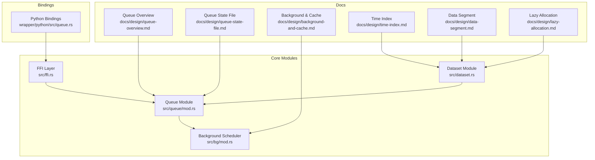
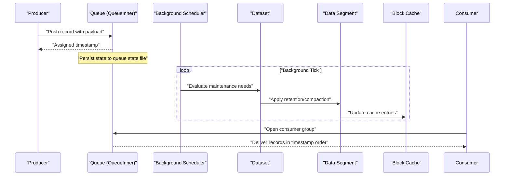
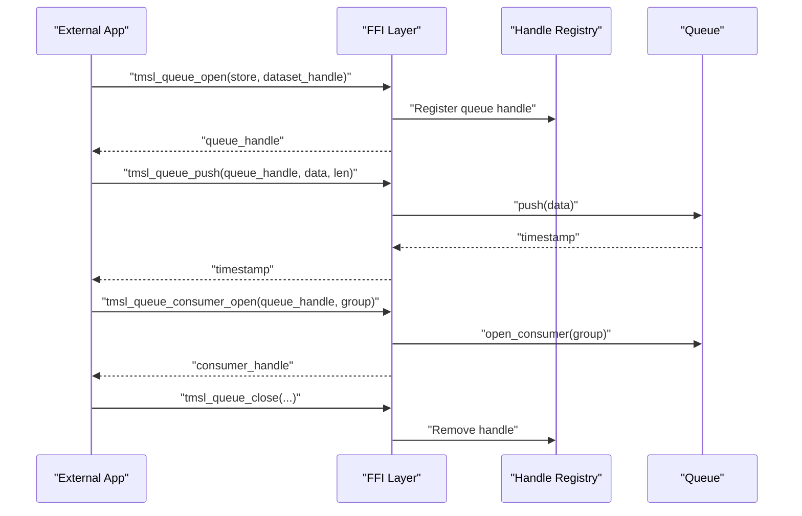
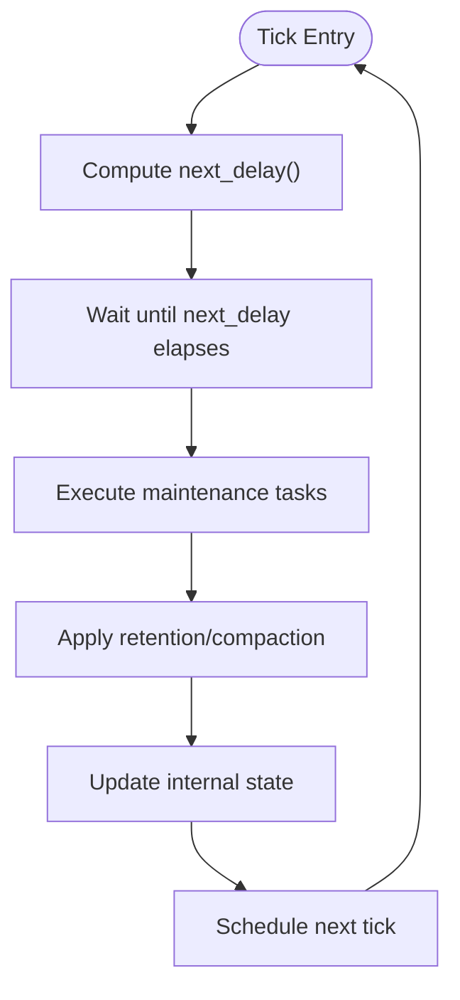
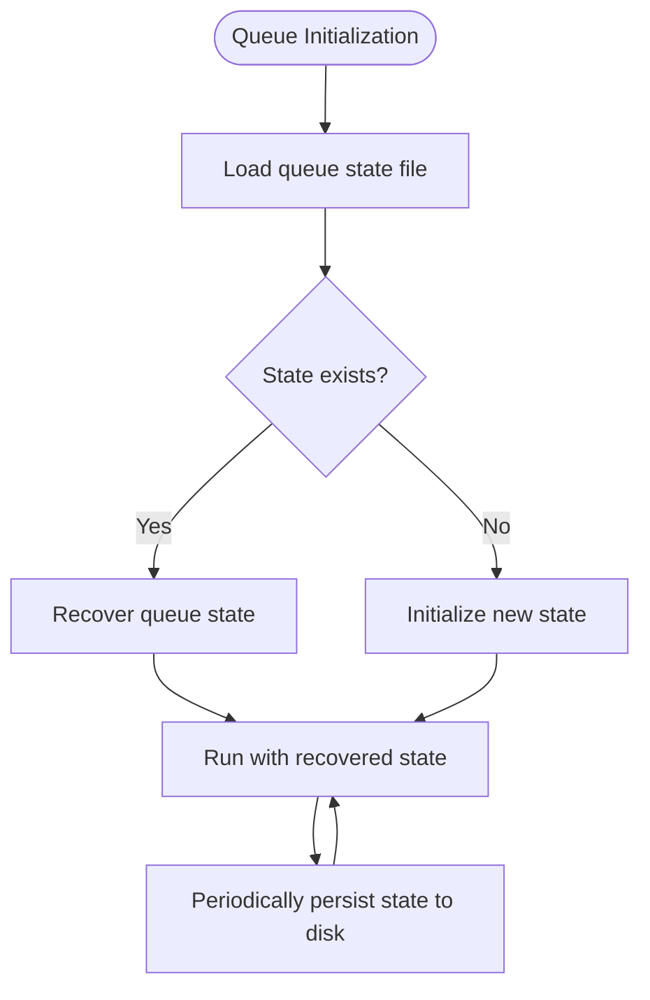
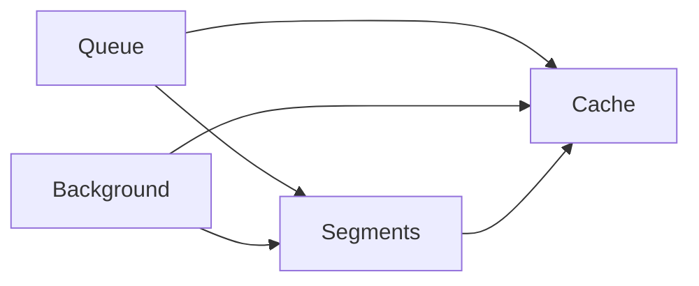
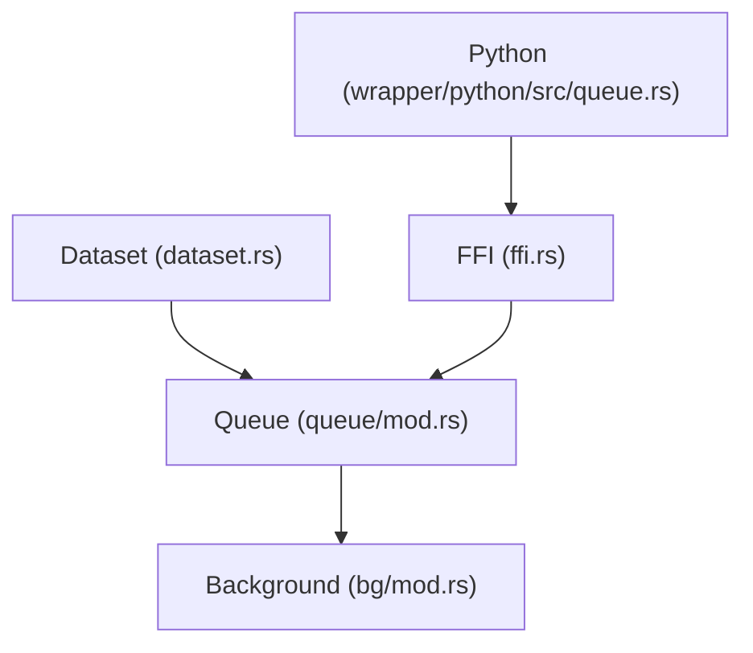

# Queue Coordination

<cite>
**Referenced Files in This Document**
- [mod.rs](file://src/queue/mod.rs)
- [dataset.rs](file://src/dataset.rs)
- [ffi.rs](file://src/ffi.rs)
- [mod.rs](file://src/bg/mod.rs)
- [queue_test.rs](file://tests/queue_test.rs)
- [queue.rs](file://wrapper/python/src/queue.rs)
- [queue-overview.md](file://docs/design/queue-overview.md)
- [queue-state-file.md](file://docs/design/queue-state-file.md)
- [background-and-cache.md](file://docs/design/background-and-cache.md)
- [time-index.md](file://docs/design/time-index.md)
- [data-segment.md](file://docs/design/data-segment.md)
- [lazy-allocation.md](file://docs/design/lazy-allocation.md)
</cite>

## Table of Contents
1. [Introduction](#introduction)
2. [Project Structure](#project-structure)
3. [Core Components](#core-components)
4. [Architecture Overview](#architecture-overview)
5. [Detailed Component Analysis](#detailed-component-analysis)
6. [Dependency Analysis](#dependency-analysis)
7. [Performance Considerations](#performance-considerations)
8. [Troubleshooting Guide](#troubleshooting-guide)
9. [Conclusion](#conclusion)
10. [Appendices](#appendices)

## Introduction
This document explains TimSLite’s background operation queue system and how it coordinates maintenance tasks, background operations, and resource management across datasets. It covers queue state management, scheduling and priority handling, persistence via queue state files, recovery procedures, coordination with segment operations and cache management, retention policies, configuration options, monitoring, and troubleshooting. The goal is to provide a practical guide for operators and developers integrating and operating the queue within TimSLite’s storage management system.

## Project Structure
TimSLite organizes queue-related logic primarily under the queue module, integrates with dataset lifecycle, exposes FFI APIs for external consumers, and includes Python bindings. Background scheduling and periodic maintenance are handled by the background module. Design documents describe queue overview, state file format, and operational integration with segments, caching, and retention.



**Diagram sources**
- [mod.rs](file://src/queue/mod.rs)
- [dataset.rs](file://src/dataset.rs)
- [mod.rs](file://src/bg/mod.rs)
- [ffi.rs](file://src/ffi.rs)
- [queue.rs](file://wrapper/python/src/queue.rs)
- [queue-overview.md](file://docs/design/queue-overview.md)
- [queue-state-file.md](file://docs/design/queue-state-file.md)
- [background-and-cache.md](file://docs/design/background-and-cache.md)
- [time-index.md](file://docs/design/time-index.md)
- [data-segment.md](file://docs/design/data-segment.md)
- [lazy-allocation.md](file://docs/design/lazy-allocation.md)

**Section sources**
- [mod.rs](file://src/queue/mod.rs)
- [dataset.rs](file://src/dataset.rs)
- [mod.rs](file://src/bg/mod.rs)
- [ffi.rs](file://src/ffi.rs)
- [queue.rs](file://wrapper/python/src/queue.rs)
- [queue-overview.md](file://docs/design/queue-overview.md)
- [queue-state-file.md](file://docs/design/queue-state-file.md)
- [background-and-cache.md](file://docs/design/background-and-cache.md)
- [time-index.md](file://docs/design/time-index.md)
- [data-segment.md](file://docs/design/data-segment.md)
- [lazy-allocation.md](file://docs/design/lazy-allocation.md)

## Core Components
- Queue subsystem: Manages producer/consumer groups, push operations, and state persistence to disk. See [mod.rs](file://src/queue/mod.rs).
- Dataset integration: Opens/closes queues per dataset, coordinates notifications, and flushes queue state during lifecycle events. See [dataset.rs](file://src/dataset.rs).
- Background scheduler: Periodic maintenance and task scheduling for queue-related operations. See [mod.rs](file://src/bg/mod.rs).
- FFI interface: Exposes queue open/close, consumer management, and push operations to external callers. See [ffi.rs](file://src/ffi.rs).
- Python bindings: Provides Python-friendly wrappers around queue operations. See [queue.rs](file://wrapper/python/src/queue.rs).
- Design docs: Define queue overview, state file format, and operational integration. See [queue-overview.md](file://docs/design/queue-overview.md), [queue-state-file.md](file://docs/design/queue-state-file.md), [background-and-cache.md](file://docs/design/background-and-cache.md).

Key responsibilities:
- Producer/consumer coordination with group semantics
- Timestamped enqueue with auto-increment behavior
- Persistence of queue state to enable recovery
- Integration with background maintenance for retention and compaction
- Coordination with segment operations and cache management

**Section sources**
- [mod.rs](file://src/queue/mod.rs)
- [dataset.rs](file://src/dataset.rs)
- [mod.rs](file://src/bg/mod.rs)
- [ffi.rs](file://src/ffi.rs)
- [queue.rs](file://wrapper/python/src/queue.rs)
- [queue-overview.md](file://docs/design/queue-overview.md)
- [queue-state-file.md](file://docs/design/queue-state-file.md)
- [background-and-cache.md](file://docs/design/background-and-cache.md)

## Architecture Overview
The queue system is designed around a producer-consumer model with explicit consumer groups. Producers push records with timestamps; consumers subscribe to groups and process records in order. The queue persists state to disk to support recovery and continuity across restarts. Background tasks coordinate maintenance such as retention cleanup and compaction, aligning with segment lifecycle and cache policies.



**Diagram sources**
- [mod.rs](file://src/queue/mod.rs)
- [mod.rs](file://src/bg/mod.rs)
- [dataset.rs](file://src/dataset.rs)
- [data-segment.md](file://docs/design/data-segment.md)
- [background-and-cache.md](file://docs/design/background-and-cache.md)

## Detailed Component Analysis

### Queue Subsystem
The queue subsystem encapsulates:
- Producer operations: push records with automatic timestamp assignment and notification of waiting consumers.
- Consumer groups: named groups that receive ordered delivery of queued records.
- State persistence: queue state files stored per dataset to persist queue metadata and enable recovery.
- Lifecycle integration: opening/closing queues within dataset lifecycle and flushing state on shutdown.

```mermaid
classDiagram
class QueueInner {
"+open_consumer(group)"
"+push(payload) -> timestamp"
"+flush_state()"
}
class Dataset {
"+open_queue() -> (QueueInner, NotifyPair)"
"+notify_queue()"
"+queue_dir() -> PathBuf"
}
class BackgroundScheduler {
"+tick()"
"+next_delay() -> Duration"
}
Dataset --> QueueInner : "owns"
Dataset --> BackgroundScheduler : "coordinates"
```

**Diagram sources**
- [mod.rs](file://src/queue/mod.rs)
- [dataset.rs](file://src/dataset.rs)
- [mod.rs](file://src/bg/mod.rs)

**Section sources**
- [mod.rs](file://src/queue/mod.rs)
- [dataset.rs](file://src/dataset.rs)

### FFI and Consumer APIs
The FFI layer exposes:
- Queue open/close: associates a queue handle with a dataset.
- Consumer open/drop: manages consumer groups for a given queue.
- Push operation: enqueues a raw byte payload and returns the assigned timestamp.



**Diagram sources**
- [ffi.rs](file://src/ffi.rs)
- [mod.rs](file://src/queue/mod.rs)

**Section sources**
- [ffi.rs](file://src/ffi.rs)
- [mod.rs](file://src/queue/mod.rs)

### Background Scheduling and Maintenance
The background scheduler:
- Computes next delay based on pending tasks and intervals.
- Executes maintenance ticks safely whether driven internally or externally.
- Coordinates with dataset operations to apply retention and compaction aligned with segment lifecycle.



**Diagram sources**
- [mod.rs](file://src/bg/mod.rs)
- [background-and-cache.md](file://docs/design/background-and-cache.md)

**Section sources**
- [mod.rs](file://src/bg/mod.rs)
- [background-and-cache.md](file://docs/design/background-and-cache.md)

### Queue State File Format and Recovery
Queue state files persist queue metadata to disk for recovery and continuity. The format and semantics are documented to ensure safe serialization and deserialization across restarts.



**Diagram sources**
- [queue-state-file.md](file://docs/design/queue-state-file.md)
- [mod.rs](file://src/queue/mod.rs)

**Section sources**
- [queue-state-file.md](file://docs/design/queue-state-file.md)
- [mod.rs](file://src/queue/mod.rs)

### Coordination with Segments, Cache, and Retention
- Segments: Queue-driven operations trigger segment compaction and retention decisions aligned with time indexing and data layout.
- Cache: Background maintenance updates cache entries and evictions according to segment changes.
- Retention: Background tasks enforce retention policies by removing outdated segments and updating queue state accordingly.



**Diagram sources**
- [data-segment.md](file://docs/design/data-segment.md)
- [time-index.md](file://docs/design/time-index.md)
- [background-and-cache.md](file://docs/design/background-and-cache.md)

**Section sources**
- [data-segment.md](file://docs/design/data-segment.md)
- [time-index.md](file://docs/design/time-index.md)
- [background-and-cache.md](file://docs/design/background-and-cache.md)

### Priority Handling and Task Scheduling
- Producer/consumer ordering is timestamp-based; later pushes receive higher timestamps.
- Background tasks schedule based on computed delays and maintenance intervals.
- Priority is implicit in timestamp ordering; no explicit priority queues are used.

**Section sources**
- [mod.rs](file://src/queue/mod.rs)
- [mod.rs](file://src/bg/mod.rs)

### Monitoring Queue Health
- Use background tick metrics to monitor next delay and executed tasks.
- Track queue state file persistence and flush behavior during dataset lifecycle.
- Validate consumer group operations and handle registry integrity.

**Section sources**
- [mod.rs](file://src/bg/mod.rs)
- [dataset.rs](file://src/dataset.rs)
- [queue_test.rs](file://tests/queue_test.rs)

## Dependency Analysis
The queue subsystem depends on dataset lifecycle hooks, background scheduler, and FFI bindings. Design documents define integration points with segments, cache, and retention.



**Diagram sources**
- [mod.rs](file://src/queue/mod.rs)
- [dataset.rs](file://src/dataset.rs)
- [mod.rs](file://src/bg/mod.rs)
- [ffi.rs](file://src/ffi.rs)
- [queue.rs](file://wrapper/python/src/queue.rs)

**Section sources**
- [mod.rs](file://src/queue/mod.rs)
- [dataset.rs](file://src/dataset.rs)
- [mod.rs](file://src/bg/mod.rs)
- [ffi.rs](file://src/ffi.rs)
- [queue.rs](file://wrapper/python/src/queue.rs)

## Performance Considerations
- Minimize contention by batching pushes and using consumer groups judiciously.
- Tune background tick intervals to balance maintenance overhead with responsiveness.
- Ensure queue state persistence does not bottleneck producers; consider asynchronous flush strategies where appropriate.
- Align segment compaction and cache updates with background schedules to avoid hot-spots.

[No sources needed since this section provides general guidance]

## Troubleshooting Guide
Common issues and remedies:
- Queue handle not found: Verify handle registration and lifecycle; ensure proper open/close sequences. See [ffi.rs](file://src/ffi.rs).
- Queue already open: Ensure exclusive access per dataset and consistent close before reopen. See [dataset.rs](file://src/dataset.rs).
- Consumer group errors: Validate group names and ensure proper open/drop semantics. See [ffi.rs](file://src/ffi.rs).
- State flush failures: Monitor warnings during dataset shutdown and investigate disk permissions or I/O errors. See [dataset.rs](file://src/dataset.rs).
- Background tick anomalies: Confirm tick safety and serialization under concurrent access. See [mod.rs](file://src/bg/mod.rs).

**Section sources**
- [ffi.rs](file://src/ffi.rs)
- [dataset.rs](file://src/dataset.rs)
- [mod.rs](file://src/bg/mod.rs)

## Conclusion
TimSLite’s queue system provides a robust, persistent, and integrable mechanism for coordinating background maintenance, segment operations, and cache management. Its design emphasizes clear separation of concerns, explicit state persistence, and safe integration with dataset lifecycle and background scheduling. Operators should focus on proper handle management, background tuning, and monitoring queue state files to maintain reliability and performance.

[No sources needed since this section summarizes without analyzing specific files]

## Appendices

### Queue Operations Examples
- Open queue for a dataset and push a record: see [ffi.rs](file://src/ffi.rs).
- Open a consumer group and consume records: see [ffi.rs](file://src/ffi.rs).
- Manual background tick invocation: see [mod.rs](file://src/bg/mod.rs).

**Section sources**
- [ffi.rs](file://src/ffi.rs)
- [mod.rs](file://src/bg/mod.rs)

### Configuration Options
- Background tick intervals and maintenance windows are configured within the background scheduler module. See [mod.rs](file://src/bg/mod.rs).
- Queue state file location and naming conventions are defined in the queue state file design. See [queue-state-file.md](file://docs/design/queue-state-file.md).

**Section sources**
- [mod.rs](file://src/bg/mod.rs)
- [queue-state-file.md](file://docs/design/queue-state-file.md)

### Integration with Storage Management
- Queue state files persist queue metadata alongside dataset state. See [queue-state-file.md](file://docs/design/queue-state-file.md).
- Background maintenance integrates with time index and data segment operations. See [time-index.md](file://docs/design/time-index.md), [data-segment.md](file://docs/design/data-segment.md).
- Lazy allocation and cache policies complement queue-driven compaction. See [lazy-allocation.md](file://docs/design/lazy-allocation.md), [background-and-cache.md](file://docs/design/background-and-cache.md).

**Section sources**
- [queue-state-file.md](file://docs/design/queue-state-file.md)
- [time-index.md](file://docs/design/time-index.md)
- [data-segment.md](file://docs/design/data-segment.md)
- [lazy-allocation.md](file://docs/design/lazy-allocation.md)
- [background-and-cache.md](file://docs/design/background-and-cache.md)