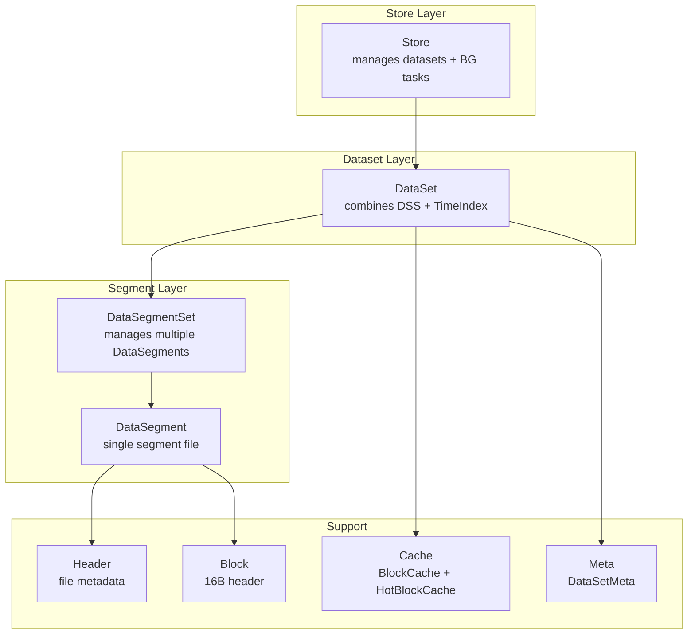
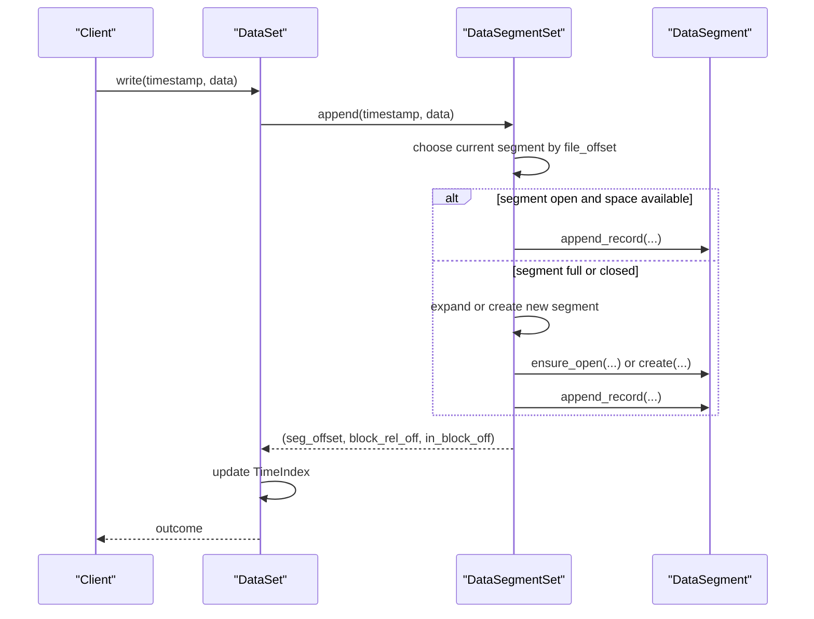
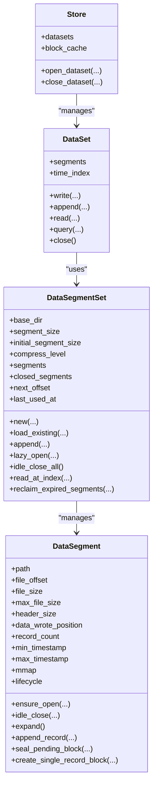

# Segment Management

<cite>
**Referenced Files in This Document**
- [segment/mod.rs](file://src/segment/mod.rs)
- [segment/data.rs](file://src/segment/data.rs)
- [dataset.rs](file://src/dataset.rs)
- [store.rs](file://src/store.rs)
- [header.rs](file://src/header.rs)
- [block.rs](file://src/block.rs)
- [cache.rs](file://src/cache.rs)
- [meta.rs](file://src/meta.rs)
- [lazy_allocation_test.rs](file://tests/lazy_allocation_test.rs)
</cite>

## Table of Contents
1. [Introduction](#introduction)
2. [Project Structure](#project-structure)
3. [Core Components](#core-components)
4. [Architecture Overview](#architecture-overview)
5. [Detailed Component Analysis](#detailed-component-analysis)
6. [Dependency Analysis](#dependency-analysis)
7. [Performance Considerations](#performance-considerations)
8. [Troubleshooting Guide](#troubleshooting-guide)
9. [Conclusion](#conclusion)

## Introduction
This document explains TimSLite’s DataSegmentSet and individual DataSegment management system. It covers the segment lifecycle (creation, opening, closing, expansion), the architecture for managing multiple segment files per dataset, lazy loading and idle closing, cross-segment operations, file naming and layout, memory mapping strategies, segment expansion and growth policies, metadata and timestamp tracking, validation, and practical operational guidance.

## Project Structure
TimSLite organizes segment management under the segment module, with DataSegmentSet coordinating multiple DataSegment files for a dataset. The dataset module integrates DataSegmentSet with the time index and global caches. The store module orchestrates datasets and background tasks. Supporting modules provide headers, blocks, caching, and dataset metadata.

**Diagram sources**
- [segment/mod.rs:43-54](file://src/segment/mod.rs#L43-L54)
- [segment/data.rs:39-67](file://src/segment/data.rs#L39-L67)
- [dataset.rs:71-82](file://src/dataset.rs#L71-L82)
- [store.rs:46-56](file://src/store.rs#L46-L56)
- [header.rs:217-247](file://src/header.rs#L217-L247)
- [block.rs:27-34](file://src/block.rs#L27-L34)
- [cache.rs:43-49](file://src/cache.rs#L43-L49)
- [meta.rs:24-34](file://src/meta.rs#L24-L34)

**Section sources**
- [segment/mod.rs:1-571](file://src/segment/mod.rs#L1-L571)
- [segment/data.rs:1-800](file://src/segment/data.rs#L1-L800)
- [dataset.rs:1-800](file://src/dataset.rs#L1-L800)
- [store.rs:1-681](file://src/store.rs#L1-L681)
- [header.rs:1-800](file://src/header.rs#L1-L800)
- [block.rs:1-154](file://src/block.rs#L1-L154)
- [cache.rs:1-427](file://src/cache.rs#L1-L427)
- [meta.rs:1-410](file://src/meta.rs#L1-L410)

## Core Components
- DataSegmentSet: Manages a collection of DataSegment files for a dataset. Provides lazy open, idle close, append, cross-segment reads, and retention-based reclaim.
- DataSegment: Single segment file with memory-mapped lifecycle, block aggregation, pending raw blocks, sealing, compression, and expansion.
- DataSet: Aggregates DataSegmentSet and TimeIndex, coordinates writes, reads, and deletes, and integrates with caches and queues.
- Store: Top-level manager for datasets, background tasks, and global caches.

Key responsibilities:
- Segment lifecycle: create, open, idle-close, expand, sync, and close.
- Cross-segment operations: locate, open, and read records spanning multiple segments.
- Metadata and timestamps: track min/max timestamps per segment for filtering and retention.
- Storage optimization: lazy allocation, 2x expansion up to configured max, and retention-based deletion.

**Section sources**
- [segment/mod.rs:43-54](file://src/segment/mod.rs#L43-L54)
- [segment/data.rs:39-67](file://src/segment/data.rs#L39-L67)
- [dataset.rs:71-82](file://src/dataset.rs#L71-L82)
- [store.rs:46-56](file://src/store.rs#L46-L56)

## Architecture Overview
The DataSegmentSet orchestrates segment files within a dataset directory. Segments are named by their file_offset (zero-padded 20-digit filename) and organized under a data/ subdirectory. Each segment maintains a memory-mapped file with a structured header and variable-length state. DataSegmentSet keeps both open and closed segments, enabling lazy loading and idle closing to conserve resources.

**Diagram sources**
- [segment/mod.rs:180-272](file://src/segment/mod.rs#L180-L272)
- [segment/data.rs:352-407](file://src/segment/data.rs#L352-L407)

**Section sources**
- [segment/mod.rs:126-176](file://src/segment/mod.rs#L126-L176)
- [segment/data.rs:76-122](file://src/segment/data.rs#L76-L122)

## Detailed Component Analysis

### DataSegmentSet
Responsibilities:
- Segment discovery and loading: scans data/ subdirectory for segment files and builds closed segment metadata.
- Lazy open: opens a closed segment on demand by file_offset.
- Append pipeline: selects current segment, ensures open, appends record, expands if needed, or creates new segment.
- Cross-segment reads: locates segment by absolute offset and delegates to DataSegment.
- Idle close: closes all open segments, preserving metadata for later lazy reopen.
- Retention: deletes closed segments whose max_timestamp is below a threshold.

Segment file naming:
- Files are named with zero-padded 20-digit file_offset under data/ (e.g., 00000000000000000000).

Timestamp tracking:
- Maintains min/max timestamps per closed segment for overlap checks and retention.

Expansion and growth:
- When appending fails due to space, attempts expand; if already at max_file_size, seals current segment and creates a new one with initial_segment_size.

Cross-segment operations:
- read_at_index routes by absolute offset to the correct segment, converting to segment-relative offsets.

Retention:
- reclaim_expired_segments removes closed segments whose max_timestamp < threshold.

**Section sources**
- [segment/mod.rs:126-176](file://src/segment/mod.rs#L126-L176)
- [segment/mod.rs:180-272](file://src/segment/mod.rs#L180-L272)
- [segment/mod.rs:451-521](file://src/segment/mod.rs#L451-L521)
- [segment/mod.rs:528-543](file://src/segment/mod.rs#L528-L543)

### DataSegment
Lifecycle states:
- Closed: file is not memory-mapped.
- OpenReady: file is open and memory-mapped.

Operations:
- create: initializes header, sets file length to initial_size, and maps.
- open: opens existing file, maps, reads header, and restores state/pending.
- ensure_open: reopens and restores pending state without sealing or compressing.
- idle_close: flushes and unmaps without sealing or compressing.
- expand: doubles file size up to max_file_size, remapping after resize.
- append_record: aggregates records into blocks, seals pending blocks when full, compresses on seal.
- create_single_record_block: writes a single large record as a sealed compressed block.
- read_mutable_tail_record, append_to_last_record, overwrite_in_last_block: operations on the last pending raw block.

Memory mapping:
- Uses memmap2::MmapMut for read/write access; unmaps on idle-close and expand.

Pending block handling:
- Tracks pending_block_offset, pending_wrote_position, and pending_record_count in header state.
- Pending raw blocks are sealed and compressed on next write or explicit seal.

Compression:
- Blocks are compressed when sealed; single large records are forced to compress.

Validation:
- Validates pending block boundaries and payload sizes; rejects invalid states.

**Section sources**
- [segment/data.rs:26-67](file://src/segment/data.rs#L26-L67)
- [segment/data.rs:76-122](file://src/segment/data.rs#L76-L122)
- [segment/data.rs:124-174](file://src/segment/data.rs#L124-L174)
- [segment/data.rs:226-276](file://src/segment/data.rs#L226-L276)
- [segment/data.rs:278-313](file://src/segment/data.rs#L278-L313)
- [segment/data.rs:343-407](file://src/segment/data.rs#L343-L407)
- [segment/data.rs:536-594](file://src/segment/data.rs#L536-L594)
- [segment/data.rs:652-732](file://src/segment/data.rs#L652-L732)
- [segment/data.rs:734-800](file://src/segment/data.rs#L734-L800)

### File Naming, Layout, and Metadata
File naming:
- Segment files are named by file_offset (zero-padded 20-digit) under data/.

Layout:
- Fixed prefix (magic, version, file_type, meta_length).
- Meta TLV (immutable): created_at, file_offset, file_size (stored as max_file_size), compress_level.
- State area (mutable): min/max timestamps, wrote_position, record_count, totals, pending state, invalid_record_count.

Header and block structures:
- DataFileMetadata defines the header layout and state fields.
- BlockHeader (16 bytes) holds payload_size, flags, record_count, uncompressed_size.

Timestamp tracking:
- min_timestamp and max_timestamp maintained per segment for filtering and retention.

**Section sources**
- [segment/mod.rs:20-39](file://src/segment/mod.rs#L20-L39)
- [header.rs:217-247](file://src/header.rs#L217-L247)
- [header.rs:249-457](file://src/header.rs#L249-L457)
- [block.rs:27-80](file://src/block.rs#L27-L80)

### Cross-Segment Operations and Cache Keys
- DataSegmentSet::find_or_open_segment locates the correct segment by absolute offset and lazily opens it if needed.
- DataSegmentSet::cache_key_for_absolute_offset computes a global cache key composed of segment_file_offset and block_offset for efficient caching.

Hot block caching:
- HotBlockCache supports per-query extraction from a cached decompressed block payload.

**Section sources**
- [segment/mod.rs:487-521](file://src/segment/mod.rs#L487-L521)
- [segment/mod.rs:279-283](file://src/segment/mod.rs#L279-L283)
- [cache.rs:288-359](file://src/cache.rs#L288-L359)

### Expansion Logic and Growth Policies
- Initial allocation: file is truncated to initial_segment_size to save disk space.
- Expansion: doubling up to max_file_size (segment_size), with header file_size remaining at max_file_size.
- Trigger: append_record checks capacity against header_len + data_wrote_position; if insufficient, expand or create new segment.
- New segment creation: uses initial_segment_size for the new segment.

Integration tests demonstrate lazy allocation, expansion, and disk-space efficiency.

**Section sources**
- [segment/data.rs:76-89](file://src/segment/data.rs#L76-L89)
- [segment/data.rs:284-306](file://src/segment/data.rs#L284-L306)
- [segment/mod.rs:224-268](file://src/segment/mod.rs#L224-L268)
- [lazy_allocation_test.rs:17-208](file://tests/lazy_allocation_test.rs#L17-L208)

### Metadata Management and Validation
- DataSetMeta persists immutable dataset configuration (sizes, compression level, retention window) in a meta file.
- DataFileMetadata and IndexFileMetadata define on-disk layouts and state fields.
- Validation includes magic/version checks, state length verification, and pending block boundary checks.

**Section sources**
- [meta.rs:24-34](file://src/meta.rs#L24-L34)
- [meta.rs:36-244](file://src/meta.rs#L36-L244)
- [header.rs:217-247](file://src/header.rs#L217-L247)
- [header.rs:335-389](file://src/header.rs#L335-L389)

## Dependency Analysis

**Diagram sources**
- [segment/mod.rs:43-54](file://src/segment/mod.rs#L43-L54)
- [segment/data.rs:39-67](file://src/segment/data.rs#L39-L67)
- [dataset.rs:71-82](file://src/dataset.rs#L71-L82)
- [store.rs:46-56](file://src/store.rs#L46-L56)

**Section sources**
- [segment/mod.rs:43-54](file://src/segment/mod.rs#L43-L54)
- [segment/data.rs:39-67](file://src/segment/data.rs#L39-L67)
- [dataset.rs:71-82](file://src/dataset.rs#L71-L82)
- [store.rs:46-56](file://src/store.rs#L46-L56)

## Performance Considerations
- Lazy allocation and expansion reduce initial disk usage and improve startup time for small datasets.
- Memory-mapped files enable fast random-access reads and writes; idle-close reduces memory footprint.
- Compression reduces storage and improves I/O throughput for bulk data.
- HotBlockCache avoids repeated decompression for sequential reads within a block.
- BlockCache reduces repeated disk I/O for frequently accessed blocks; LRU eviction and idle eviction keep memory usage bounded.
- Retention reclaim frees disk space by removing expired segments.

[No sources needed since this section provides general guidance]

## Troubleshooting Guide
Common issues and resolutions:
- Segment not found by offset: ensure the correct file_offset is used; verify segment file naming and data/ subdirectory layout.
- Segment full during append: check segment_size and initial_segment_size; verify expansion behavior and that max_file_size is sufficient.
- Pending block validation failures: confirm pending block boundaries and payload sizes; ensure pending state is consistent across reopen.
- Retention not reclaiming segments: verify thresholds and that segments are closed before reclaim; check max_timestamp values.
- Disk space anomalies: confirm initial_segment_size vs actual file sizes; note that header file_size remains at max_file_size while actual file grows.

Operational tips:
- Use idle_close_all before retention reclaim to ensure segments are closed.
- Monitor cache hit rates and tune BlockCache size for workload characteristics.
- Validate segment metadata and headers if corruption symptoms appear.

**Section sources**
- [segment/mod.rs:112-124](file://src/segment/mod.rs#L112-L124)
- [segment/mod.rs:528-543](file://src/segment/mod.rs#L528-L543)
- [segment/data.rs:176-221](file://src/segment/data.rs#L176-L221)
- [cache.rs:115-173](file://src/cache.rs#L115-L173)

## Conclusion
TimSLite’s DataSegmentSet and DataSegment provide a robust, efficient foundation for time-series data storage. The system balances performance and resource usage through lazy allocation, memory-mapped files, compression, and careful lifecycle management. Cross-segment operations, metadata tracking, and retention mechanisms enable scalable and maintainable dataset operations.