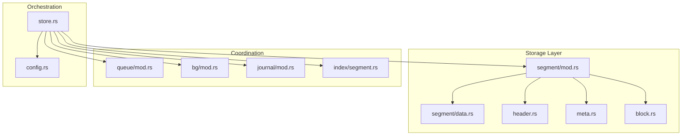
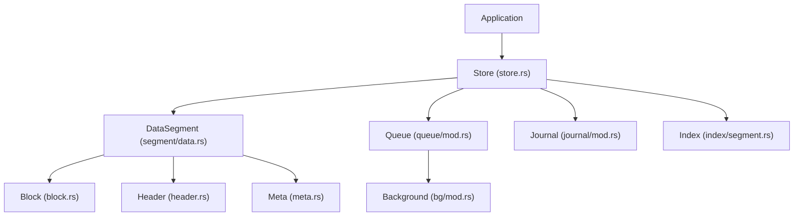
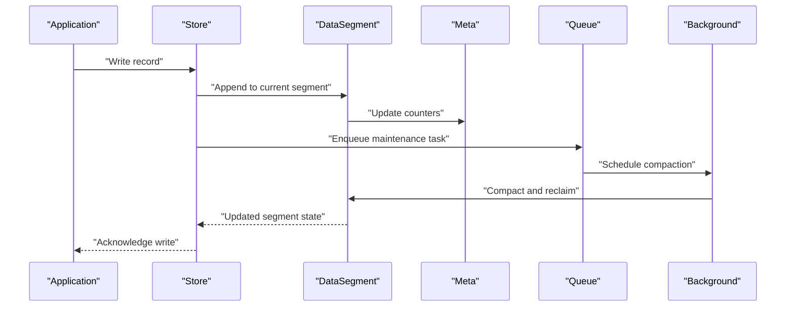
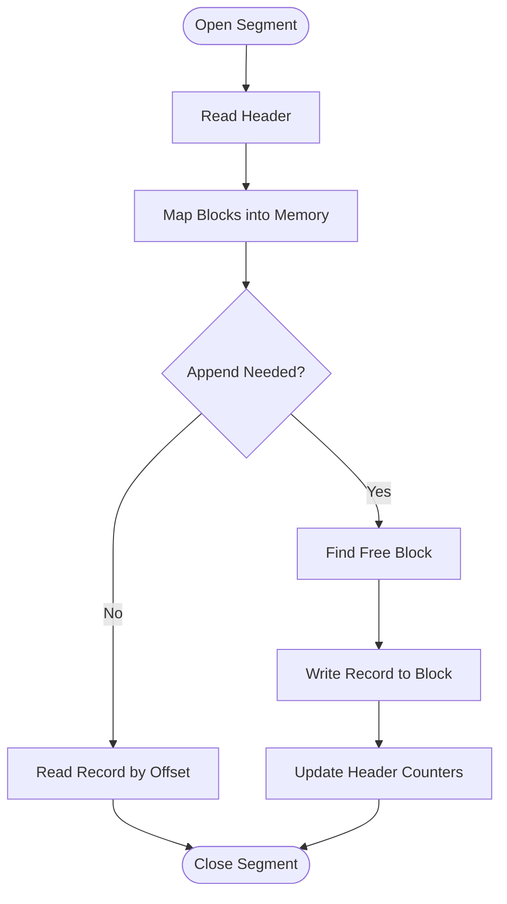
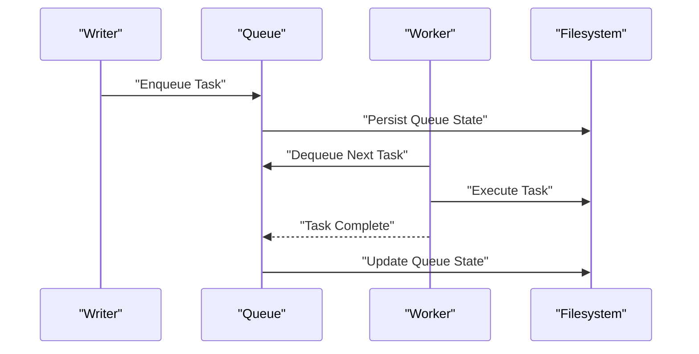
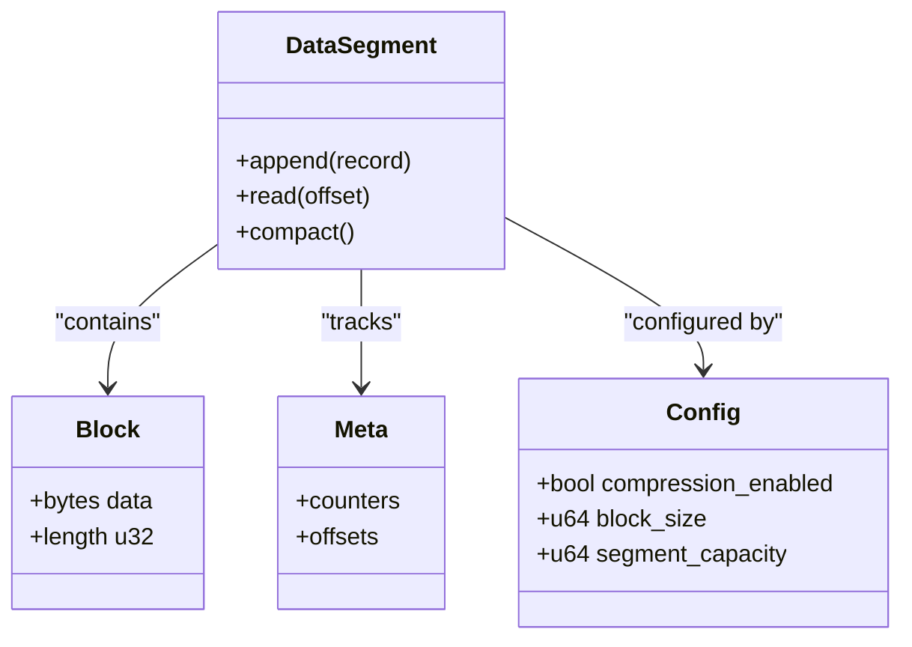
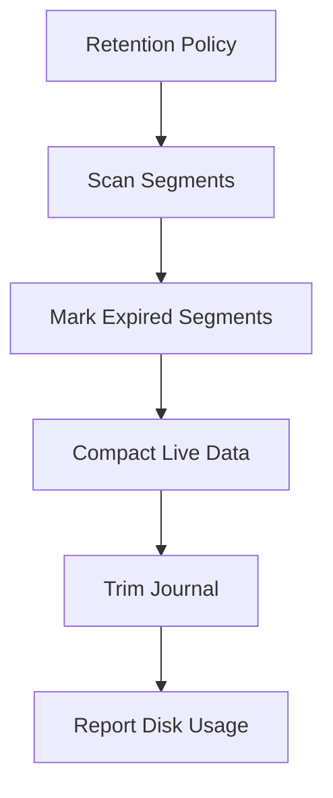
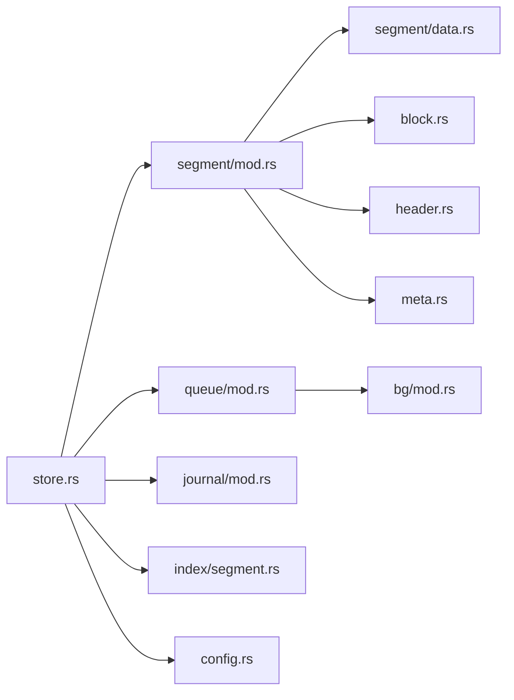

# Storage Management

<cite>
**Referenced Files in This Document**
- [lib.rs](file://src/lib.rs)
- [store.rs](file://src/store.rs)
- [segment/mod.rs](file://src/segment/mod.rs)
- [segment/data.rs](file://src/segment/data.rs)
- [block.rs](file://src/block.rs)
- [header.rs](file://src/header.rs)
- [meta.rs](file://src/meta.rs)
- [queue/mod.rs](file://src/queue/mod.rs)
- [bg/mod.rs](file://src/bg/mod.rs)
- [journal/mod.rs](file://src/journal/mod.rs)
- [index/segment.rs](file://src/index/segment.rs)
- [config.rs](file://src/config.rs)
- [error.rs](file://src/error.rs)
- [design.md](file://design.md)
- [docs/design/data-segment.md](file://docs/design/data-segment.md)
- [docs/design/queue-overview.md](file://docs/design/queue-overview.md)
- [docs/design/queue-state-file.md](file://docs/design/queue-state-file.md)
- [docs/design/background-and-cache.md](file://docs/design/background-and-cache.md)
- [docs/design/lazy-allocation.md](file://docs/design/lazy-allocation.md)
- [docs/design/compression.md](file://docs/design/compression.md)
- [docs/design/time-index.md](file://docs/design/time-index.md)
- [docs/plan/phase-03-datasegment.md](file://docs/plan/phase-03-datasegment.md)
- [docs/plan/phase-06-store-bg.md](file://docs/plan/phase-06-store-bg.md)
- [docs/plan/phase-09-blockcache.md](file://docs/plan/phase-09-blockcache.md)
- [docs/plan/phase-10-continuous-storage.md](file://docs/plan/phase-10-continuous-storage.md)
- [docs/plan/phase-12-lazy-allocation.md](file://docs/plan/phase-12-lazy-allocation.md)
- [docs/plan/phase-16-data-retention.md](file://docs/plan/phase-16-data-retention.md)
- [docs/plan/phase-28-journal.md](file://docs/plan/phase-28-journal.md)
- [tests/dataset_lifecycle_test.rs](file://tests/dataset_lifecycle_test.rs)
- [tests/background_test.rs](file://tests/background_test.rs)
- [tests/queue_test.rs](file://tests/queue_test.rs)
</cite>

## Table of Contents
1. [Introduction](#introduction)
2. [Project Structure](#project-structure)
3. [Core Components](#core-components)
4. [Architecture Overview](#architecture-overview)
5. [Detailed Component Analysis](#detailed-component-analysis)
6. [Dependency Analysis](#dependency-analysis)
7. [Performance Considerations](#performance-considerations)
8. [Troubleshooting Guide](#troubleshooting-guide)
9. [Conclusion](#conclusion)
10. [Appendices](#appendices)

## Introduction
This document describes TimSLite’s storage management system with emphasis on segment lifecycle, DataSegment architecture, block-level organization, memory mapping concepts, file layout, background operation queues, coordination, and resource management. It also covers allocation strategies, memory efficiency, disk optimization, monitoring, troubleshooting, capacity planning, and backup/recovery procedures for persistent storage.

## Project Structure
TimSLite organizes storage-related logic under dedicated modules:
- Segment layer: DataSegment and block-level abstractions
- Store: Top-level persistence and lifecycle orchestration
- Queue: Background work coordination and state persistence
- Journal: Write-ahead logging for durability
- Index: Time-based indexing for fast retrieval
- Config: Tunable parameters affecting storage behavior
- Docs: Design and planning artifacts detailing storage decisions

**Diagram sources**
- [store.rs](file://src/store.rs)
- [segment/mod.rs](file://src/segment/mod.rs)
- [segment/data.rs](file://src/segment/data.rs)
- [block.rs](file://src/block.rs)
- [header.rs](file://src/header.rs)
- [meta.rs](file://src/meta.rs)
- [queue/mod.rs](file://src/queue/mod.rs)
- [bg/mod.rs](file://src/bg/mod.rs)
- [journal/mod.rs](file://src/journal/mod.rs)
- [index/segment.rs](file://src/index/segment.rs)
- [config.rs](file://src/config.rs)

**Section sources**
- [lib.rs](file://src/lib.rs)
- [design.md](file://design.md)

## Core Components
- DataSegment: Persistent storage unit composed of blocks and headers, supporting append, read, and compaction workflows.
- Block: Fixed-size unit containing serialized records with metadata for alignment and length.
- Header: Per-segment metadata describing layout, offsets, and statistics.
- Meta: Runtime state and counters for segments and datasets.
- Queue: Background job coordinator persisting state and scheduling maintenance tasks.
- Journal: Append-only log ensuring write durability and crash recovery.
- Index: Time-based index enabling efficient range scans and pruning.
- Config: Tunable parameters controlling segment sizing, compression, and background behavior.

**Section sources**
- [segment/mod.rs](file://src/segment/mod.rs)
- [segment/data.rs](file://src/segment/data.rs)
- [block.rs](file://src/block.rs)
- [header.rs](file://src/header.rs)
- [meta.rs](file://src/meta.rs)
- [queue/mod.rs](file://src/queue/mod.rs)
- [bg/mod.rs](file://src/bg/mod.rs)
- [journal/mod.rs](file://src/journal/mod.rs)
- [index/segment.rs](file://src/index/segment.rs)
- [config.rs](file://src/config.rs)

## Architecture Overview
The storage stack integrates segment management, background operations, and indexing to provide durable, efficient, and scalable time-series storage.

**Diagram sources**
- [store.rs](file://src/store.rs)
- [segment/data.rs](file://src/segment/data.rs)
- [block.rs](file://src/block.rs)
- [header.rs](file://src/header.rs)
- [meta.rs](file://src/meta.rs)
- [queue/mod.rs](file://src/queue/mod.rs)
- [bg/mod.rs](file://src/bg/mod.rs)
- [journal/mod.rs](file://src/journal/mod.rs)
- [index/segment.rs](file://src/index/segment.rs)

## Detailed Component Analysis

### DataSegment Lifecycle: Creation, Expansion, Cleanup
- Creation: Segments are initialized with a header and prepared for writes. The header encodes layout and offsets; runtime metadata tracks counters and state.
- Expansion: New blocks are appended as needed. When a segment reaches capacity thresholds, a new segment is created and linked via metadata.
- Cleanup: Compaction merges contiguous segments, removes deleted entries, and reclaims disk space. Journal entries are replayed to ensure consistency during cleanup.

**Diagram sources**
- [store.rs](file://src/store.rs)
- [segment/data.rs](file://src/segment/data.rs)
- [meta.rs](file://src/meta.rs)
- [queue/mod.rs](file://src/queue/mod.rs)
- [bg/mod.rs](file://src/bg/mod.rs)

**Section sources**
- [segment/data.rs](file://src/segment/data.rs)
- [header.rs](file://src/header.rs)
- [meta.rs](file://src/meta.rs)
- [docs/design/data-segment.md](file://docs/design/data-segment.md)
- [docs/plan/phase-03-datasegment.md](file://docs/plan/phase-03-datasegment.md)

### DataSegment Architecture: Blocks, Headers, Memory Mapping, File Layout
- Block-level organization: Records are stored contiguously within fixed-size blocks with explicit lengths and alignment. Blocks are appended sequentially and indexed for reads.
- Header: Describes segment boundaries, block counts, offsets, and optional compression flags. It anchors the segment’s logical layout.
- Memory mapping: Segments leverage OS-level memory mapping to access file regions efficiently, reducing copies and enabling zero-copy reads where applicable.
- File layout: Header precedes data blocks; optional padding aligns blocks to device/page boundaries. Journal entries are interleaved to preserve ordering and durability.

**Diagram sources**
- [segment/data.rs](file://src/segment/data.rs)
- [block.rs](file://src/block.rs)
- [header.rs](file://src/header.rs)
- [docs/design/data-segment.md](file://docs/design/data-segment.md)

**Section sources**
- [segment/data.rs](file://src/segment/data.rs)
- [block.rs](file://src/block.rs)
- [header.rs](file://src/header.rs)
- [docs/design/data-segment.md](file://docs/design/data-segment.md)

### Queue System: Background Operations, Coordination, Resource Management
- Purpose: Decouples write throughput from maintenance work (compaction, retention, index updates) by queuing tasks and executing them asynchronously.
- State persistence: Queue state persists to disk to survive restarts, ensuring tasks are not lost after crashes.
- Coordination: Queue coordinates with background workers to process tasks in order, respecting priorities and resource limits.

**Diagram sources**
- [queue/mod.rs](file://src/queue/mod.rs)
- [bg/mod.rs](file://src/bg/mod.rs)
- [docs/design/queue-overview.md](file://docs/design/queue-overview.md)
- [docs/design/queue-state-file.md](file://docs/design/queue-state-file.md)

**Section sources**
- [queue/mod.rs](file://src/queue/mod.rs)
- [bg/mod.rs](file://src/bg/mod.rs)
- [docs/design/queue-overview.md](file://docs/design/queue-overview.md)
- [docs/design/queue-state-file.md](file://docs/design/queue-state-file.md)

### Storage Allocation Strategies and Memory Efficiency
- Lazy allocation: Segments and blocks are allocated on demand to minimize initial footprint and reduce fragmentation.
- Compression: Optional compression reduces disk usage and I/O bandwidth at the cost of CPU cycles; applied per block or per segment depending on configuration.
- Continuous storage: Adjacent blocks are laid out contiguously to improve locality and reduce random I/O.
- Block cache: Hot blocks are cached to accelerate frequent reads while maintaining low memory overhead.

**Diagram sources**
- [segment/data.rs](file://src/segment/data.rs)
- [block.rs](file://src/block.rs)
- [meta.rs](file://src/meta.rs)
- [config.rs](file://src/config.rs)
- [docs/design/lazy-allocation.md](file://docs/design/lazy-allocation.md)
- [docs/design/compression.md](file://docs/design/compression.md)
- [docs/plan/phase-09-blockcache.md](file://docs/plan/phase-09-blockcache.md)
- [docs/plan/phase-10-continuous-storage.md](file://docs/plan/phase-10-continuous-storage.md)
- [docs/plan/phase-12-lazy-allocation.md](file://docs/plan/phase-12-lazy-allocation.md)

**Section sources**
- [config.rs](file://src/config.rs)
- [docs/design/lazy-allocation.md](file://docs/design/lazy-allocation.md)
- [docs/design/compression.md](file://docs/design/compression.md)
- [docs/plan/phase-09-blockcache.md](file://docs/plan/phase-09-blockcache.md)
- [docs/plan/phase-10-continuous-storage.md](file://docs/plan/phase-10-continuous-storage.md)
- [docs/plan/phase-12-lazy-allocation.md](file://docs/plan/phase-12-lazy-allocation.md)

### Disk Space Optimization and Retention
- Retention policies: Automatic deletion of old data based on time windows to cap disk usage.
- Compaction: Merges segments, removes tombstones, and rewrites live data to reclaim space.
- Journal trimming: Journal entries older than the retention window are removed to prevent unbounded growth.

**Diagram sources**
- [docs/design/background-and-cache.md](file://docs/design/background-and-cache.md)
- [docs/plan/phase-16-data-retention.md](file://docs/plan/phase-16-data-retention.md)
- [docs/plan/phase-28-journal.md](file://docs/plan/phase-28-journal.md)

**Section sources**
- [docs/design/background-and-cache.md](file://docs/design/background-and-cache.md)
- [docs/plan/phase-16-data-retention.md](file://docs/plan/phase-16-data-retention.md)
- [docs/plan/phase-28-journal.md](file://docs/plan/phase-28-journal.md)

### Monitoring Storage Usage and Capacity Planning
- Metrics: Track segment count, total bytes, block utilization, and queue backlog.
- Alerts: Trigger notifications when disk usage exceeds thresholds or queue backlog grows.
- Capacity planning: Use historical growth rates and retention windows to estimate future disk needs.

**Section sources**
- [meta.rs](file://src/meta.rs)
- [docs/design/background-and-cache.md](file://docs/design/background-and-cache.md)

### Backup and Recovery Procedures
- Backup: Snapshot segments and headers; optionally compress and transfer offsite.
- Recovery: Restore headers and segments; replay journal to bring the store up to the latest committed state; rebuild indexes if necessary.

**Section sources**
- [journal/mod.rs](file://src/journal/mod.rs)
- [header.rs](file://src/header.rs)
- [docs/design/data-segment.md](file://docs/design/data-segment.md)

## Dependency Analysis
Storage modules depend on each other in a layered fashion: Store orchestrates DataSegment, Queue, Journal, and Index; DataSegment depends on Block and Header; Meta provides runtime state; Config governs behavior.

**Diagram sources**
- [store.rs](file://src/store.rs)
- [segment/mod.rs](file://src/segment/mod.rs)
- [segment/data.rs](file://src/segment/data.rs)
- [block.rs](file://src/block.rs)
- [header.rs](file://src/header.rs)
- [meta.rs](file://src/meta.rs)
- [queue/mod.rs](file://src/queue/mod.rs)
- [bg/mod.rs](file://src/bg/mod.rs)
- [journal/mod.rs](file://src/journal/mod.rs)
- [index/segment.rs](file://src/index/segment.rs)
- [config.rs](file://src/config.rs)

**Section sources**
- [store.rs](file://src/store.rs)
- [segment/mod.rs](file://src/segment/mod.rs)
- [segment/data.rs](file://src/segment/data.rs)
- [block.rs](file://src/block.rs)
- [header.rs](file://src/header.rs)
- [meta.rs](file://src/meta.rs)
- [queue/mod.rs](file://src/queue/mod.rs)
- [bg/mod.rs](file://src/bg/mod.rs)
- [journal/mod.rs](file://src/journal/mod.rs)
- [index/segment.rs](file://src/index/segment.rs)
- [config.rs](file://src/config.rs)

## Performance Considerations
- Minimize random I/O by writing sequentially and keeping blocks aligned to page boundaries.
- Use compression judiciously; evaluate CPU vs I/O trade-offs against workload characteristics.
- Tune segment sizes to balance compaction frequency and memory usage.
- Keep queue backlog low to avoid write stalls; scale background workers as needed.

[No sources needed since this section provides general guidance]

## Troubleshooting Guide
- Symptoms: Slow writes, high queue backlog, disk usage near capacity.
- Actions:
  - Inspect queue state and task logs.
  - Verify segment and block integrity.
  - Check journal replay progress.
  - Review retention and compaction schedules.
- Errors: Consult error types and messages for actionable diagnostics.

**Section sources**
- [error.rs](file://src/error.rs)
- [queue/mod.rs](file://src/queue/mod.rs)
- [bg/mod.rs](file://src/bg/mod.rs)
- [journal/mod.rs](file://src/journal/mod.rs)
- [segment/data.rs](file://src/segment/data.rs)

## Conclusion
TimSLite’s storage management combines segmented block storage, memory-mapped access, background coordination, and robust durability primitives to deliver efficient, scalable time-series persistence. Proper tuning of allocation, compression, and retention, combined with monitoring and disciplined backup/recovery practices, ensures reliable operations at scale.

[No sources needed since this section summarizes without analyzing specific files]

## Appendices
- Related design and planning documents:
  - DataSegment design and file layout
  - Queue overview and state persistence
  - Background tasks and caching
  - Lazy allocation and continuous storage
  - Compression strategies
  - Time index design
  - Data retention and journaling
- Test coverage:
  - Dataset lifecycle tests
  - Background operation tests
  - Queue operation tests

**Section sources**
- [docs/design/data-segment.md](file://docs/design/data-segment.md)
- [docs/design/queue-overview.md](file://docs/design/queue-overview.md)
- [docs/design/queue-state-file.md](file://docs/design/queue-state-file.md)
- [docs/design/background-and-cache.md](file://docs/design/background-and-cache.md)
- [docs/design/lazy-allocation.md](file://docs/design/lazy-allocation.md)
- [docs/design/compression.md](file://docs/design/compression.md)
- [docs/design/time-index.md](file://docs/design/time-index.md)
- [docs/plan/phase-03-datasegment.md](file://docs/plan/phase-03-datasegment.md)
- [docs/plan/phase-06-store-bg.md](file://docs/plan/phase-06-store-bg.md)
- [docs/plan/phase-09-blockcache.md](file://docs/plan/phase-09-blockcache.md)
- [docs/plan/phase-10-continuous-storage.md](file://docs/plan/phase-10-continuous-storage.md)
- [docs/plan/phase-12-lazy-allocation.md](file://docs/plan/phase-12-lazy-allocation.md)
- [docs/plan/phase-16-data-retention.md](file://docs/plan/phase-16-data-retention.md)
- [docs/plan/phase-28-journal.md](file://docs/plan/phase-28-journal.md)
- [tests/dataset_lifecycle_test.rs](file://tests/dataset_lifecycle_test.rs)
- [tests/background_test.rs](file://tests/background_test.rs)
- [tests/queue_test.rs](file://tests/queue_test.rs)