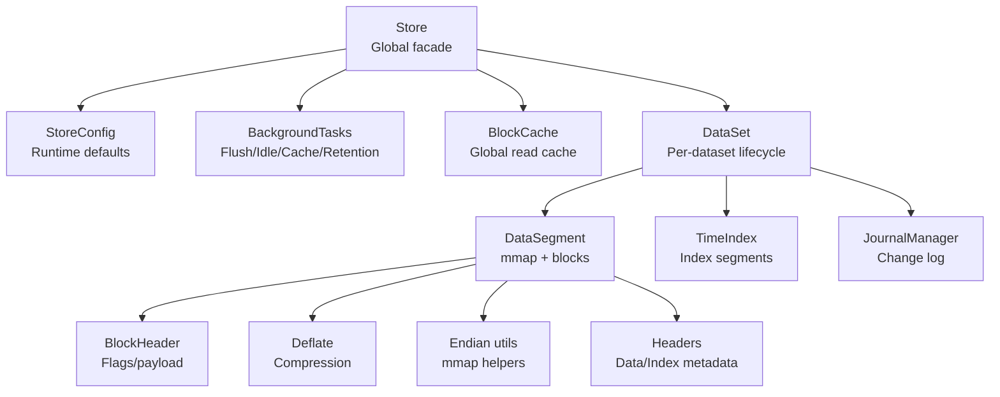
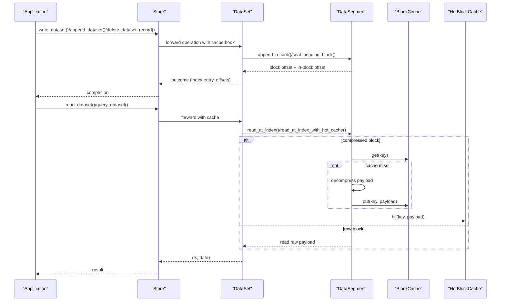
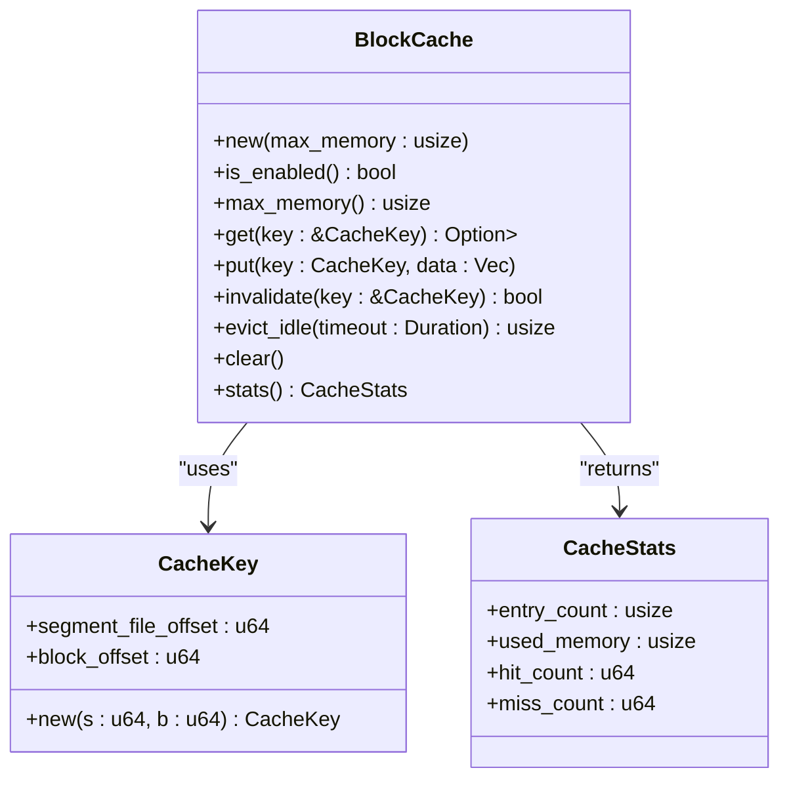
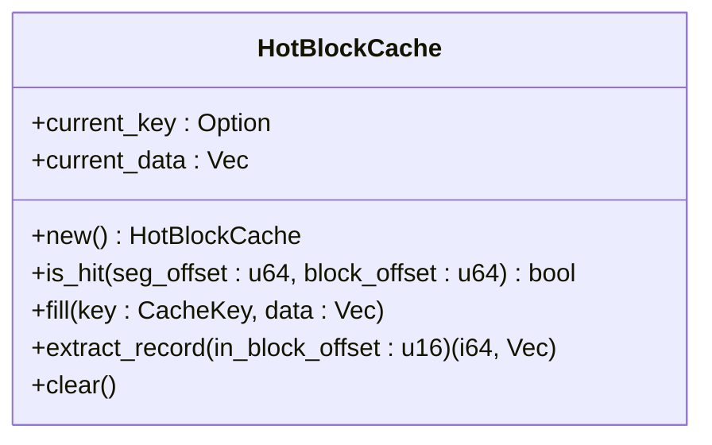
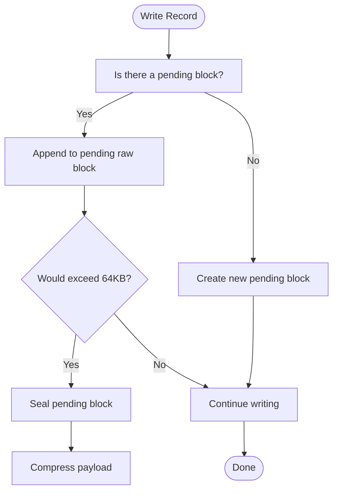
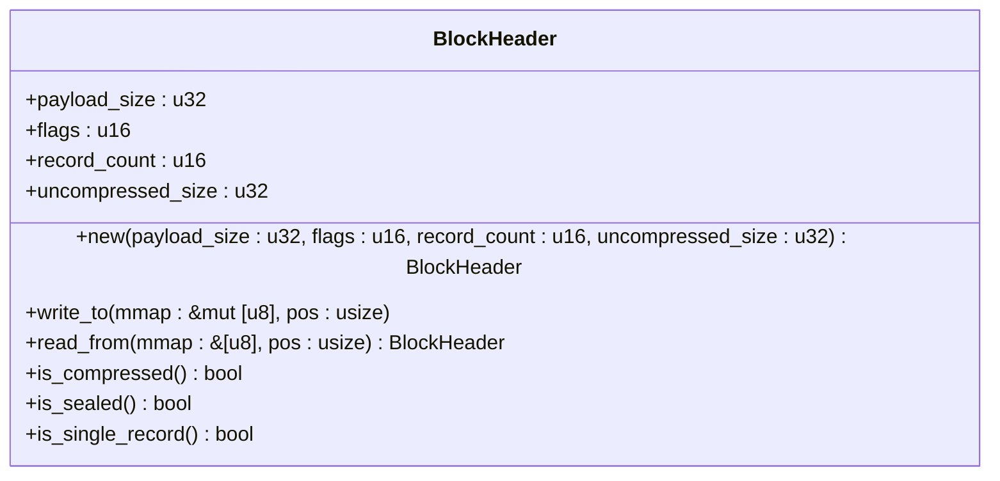
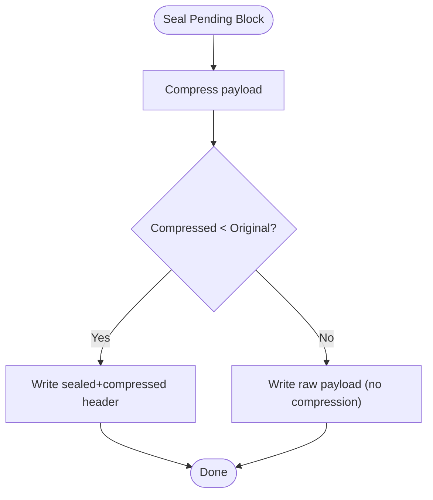
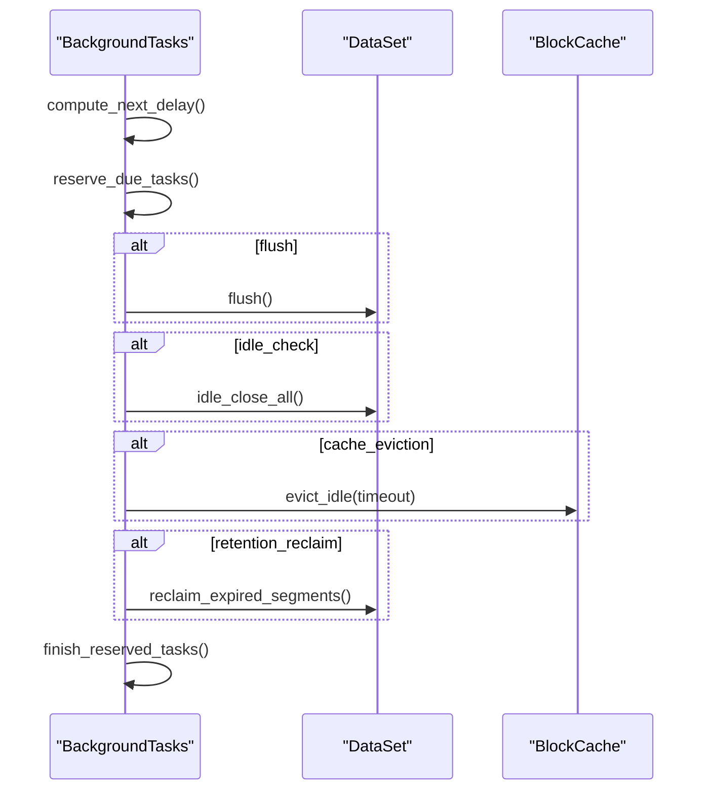
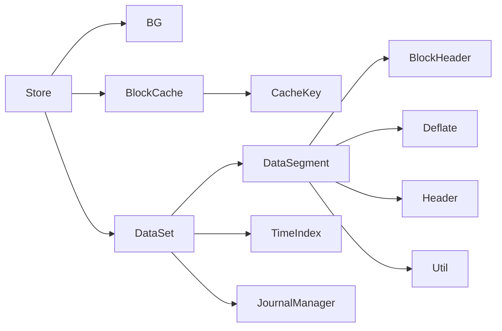

# Storage Optimization

<cite>
**Referenced Files in This Document**
- [cache.rs](file://src/cache.rs)
- [compress.rs](file://src/compress.rs)
- [block.rs](file://src/block.rs)
- [store.rs](file://src/store.rs)
- [config.rs](file://src/config.rs)
- [dataset.rs](file://src/dataset.rs)
- [util.rs](file://src/util.rs)
- [bg/mod.rs](file://src/bg/mod.rs)
- [journal/mod.rs](file://src/journal/mod.rs)
- [segment/data.rs](file://src/segment/data.rs)
- [header.rs](file://src/header.rs)
- [meta.rs](file://src/meta.rs)
</cite>

## Table of Contents
1. [Introduction](#introduction)
2. [Project Structure](#project-structure)
3. [Core Components](#core-components)
4. [Architecture Overview](#architecture-overview)
5. [Detailed Component Analysis](#detailed-component-analysis)
6. [Dependency Analysis](#dependency-analysis)
7. [Performance Considerations](#performance-considerations)
8. [Troubleshooting Guide](#troubleshooting-guide)
9. [Conclusion](#conclusion)
10. [Appendices](#appendices)

## Introduction
This document explains TimSLite’s storage optimization strategies with a focus on memory mapping, cache management, and compression integration. It covers storage allocation patterns, space efficiency optimizations, and disk I/O optimization strategies. It also documents the global block cache architecture, LRU eviction policies, cache warming techniques, compression algorithms, timing strategies, and performance trade-offs. Additionally, it provides guidance on storage monitoring, capacity planning, space reclamation, fragmentation handling, and long-term maintenance.

## Project Structure
TimSLite organizes storage around:
- Memory-mapped files for data/index segments
- Block-level aggregation with optional compression
- Global block cache and per-query hot cache
- Background tasks for flush, idle-close, cache eviction, and retention reclamation
- Journal-based change logging for durability and recovery

**Diagram sources**
- [store.rs:46-161](file://src/store.rs#L46-L161)
- [config.rs:26-71](file://src/config.rs#L26-L71)
- [bg/mod.rs:44-134](file://src/bg/mod.rs#L44-L134)
- [cache.rs:43-191](file://src/cache.rs#L43-L191)
- [dataset.rs:71-82](file://src/dataset.rs#L71-L82)
- [segment/data.rs:39-67](file://src/segment/data.rs#L39-L67)
- [block.rs:27-80](file://src/block.rs#L27-L80)
- [compress.rs:8-16](file://src/compress.rs#L8-L16)
- [util.rs:55-109](file://src/util.rs#L55-L109)
- [header.rs:222-457](file://src/header.rs#L222-L457)
- [journal/mod.rs:321-399](file://src/journal/mod.rs#L321-L399)

**Section sources**
- [store.rs:46-161](file://src/store.rs#L46-L161)
- [config.rs:26-71](file://src/config.rs#L26-L71)
- [bg/mod.rs:44-134](file://src/bg/mod.rs#L44-L134)
- [cache.rs:43-191](file://src/cache.rs#L43-L191)
- [dataset.rs:71-82](file://src/dataset.rs#L71-L82)
- [segment/data.rs:39-67](file://src/segment/data.rs#L39-L67)
- [block.rs:27-80](file://src/block.rs#L27-L80)
- [compress.rs:8-16](file://src/compress.rs#L8-L16)
- [util.rs:55-109](file://src/util.rs#L55-L109)
- [header.rs:222-457](file://src/header.rs#L222-L457)
- [journal/mod.rs:321-399](file://src/journal/mod.rs#L321-L399)

## Core Components
- Global Block Cache: LRU-style cache keyed by segment and block offsets, storing decompressed block payloads for compressed blocks.
- Hot Block Cache: Lightweight per-query cache avoiding lock contention, used for repeated reads within a single query.
- DataSegment: Memory-mapped file with block aggregation, sealing, compression, and lazy open/close semantics.
- BlockHeader: 16-byte header describing payload size, flags, record count, and uncompressed size.
- Compression: Deflate-based compression with “should-use” decision logic.
- Background Tasks: Periodic flush, idle-close, cache eviction, and retention reclamation.
- Journal: Built-in change log for dataset lifecycle and write/delete operations.

**Section sources**
- [cache.rs:43-191](file://src/cache.rs#L43-L191)
- [cache.rs:290-359](file://src/cache.rs#L290-L359)
- [segment/data.rs:39-67](file://src/segment/data.rs#L39-L67)
- [block.rs:27-80](file://src/block.rs#L27-L80)
- [compress.rs:8-23](file://src/compress.rs#L8-L23)
- [bg/mod.rs:44-134](file://src/bg/mod.rs#L44-L134)
- [journal/mod.rs:321-399](file://src/journal/mod.rs#L321-L399)

## Architecture Overview
TimSLite’s storage architecture centers on memory-mapped files and block-level compression. Writes aggregate records into blocks, which are sealed and compressed when full or when exceeding thresholds. Reads leverage a global block cache for compressed blocks and a hot cache for repeated access within queries. Background tasks maintain space efficiency and availability.

**Diagram sources**
- [store.rs:400-530](file://src/store.rs#L400-L530)
- [dataset.rs:257-316](file://src/dataset.rs#L257-L316)
- [segment/data.rs:958-1116](file://src/segment/data.rs#L958-L1116)
- [cache.rs:68-113](file://src/cache.rs#L68-L113)
- [cache.rs:1014-1018](file://src/cache.rs#L1014-L1018)

## Detailed Component Analysis

### Global Block Cache
- Purpose: Cache decompressed block payloads for compressed blocks to reduce I/O and CPU.
- Keying: Composite key of segment file offset and block offset.
- Eviction: LRU-like eviction driven by a watermark (85% of configured max memory) and periodic idle eviction.
- Stats: Tracks entry count, used memory, hits, and misses.

**Diagram sources**
- [cache.rs:43-191](file://src/cache.rs#L43-L191)
- [cache.rs:9-21](file://src/cache.rs#L9-L21)
- [cache.rs:35-41](file://src/cache.rs#L35-L41)

**Section sources**
- [cache.rs:43-191](file://src/cache.rs#L43-L191)
- [cache.rs:129-150](file://src/cache.rs#L129-L150)
- [cache.rs:152-173](file://src/cache.rs#L152-L173)

### Hot Block Cache (Per-query)
- Purpose: Local cache inside a query to avoid global cache contention and accelerate repeated reads within the same block.
- Behavior: Stores the entire decompressed block payload; supports extracting individual records by in-block offset.
- Interaction: Prefills from global cache when available; avoids populating global cache for raw blocks.

**Diagram sources**
- [cache.rs:290-359](file://src/cache.rs#L290-L359)

**Section sources**
- [cache.rs:290-359](file://src/cache.rs#L290-L359)
- [segment/data.rs:1047-1116](file://src/segment/data.rs#L1047-L1116)

### DataSegment and Block Management
- Memory mapping: Lazy open/close; pending blocks are restored on reopen.
- Block aggregation: Up to 64 KB per block; raw pending blocks are mutable tail for append/correction.
- Sealing and compression: Pending blocks are sealed and compressed when full or oversized; single-record blocks are compressed automatically.
- Read path: For compressed blocks, payload is cached globally; for raw blocks, payload is not cached.

**Diagram sources**
- [segment/data.rs:352-407](file://src/segment/data.rs#L352-L407)
- [segment/data.rs:500-534](file://src/segment/data.rs#L500-L534)
- [segment/data.rs:536-596](file://src/segment/data.rs#L536-L596)

**Section sources**
- [segment/data.rs:352-407](file://src/segment/data.rs#L352-L407)
- [segment/data.rs:500-534](file://src/segment/data.rs#L500-L534)
- [segment/data.rs:536-596](file://src/segment/data.rs#L536-L596)
- [segment/data.rs:958-1044](file://src/segment/data.rs#L958-L1044)

### BlockHeader and Flags
- 16-byte header with payload size, flags, record count, and uncompressed size.
- Flags indicate sealed/compressed/single-record states; enforced pairing for sealed/compressed.

**Diagram sources**
- [block.rs:27-80](file://src/block.rs#L27-L80)

**Section sources**
- [block.rs:27-80](file://src/block.rs#L27-L80)

### Compression Integration
- Deflate compression via miniz_oxide with configurable level (0–9).
- “Should use compression” decision compares compressed vs original size.
- Compression is applied to sealed blocks and single-record blocks.

**Diagram sources**
- [segment/data.rs:500-534](file://src/segment/data.rs#L500-L534)
- [compress.rs:8-23](file://src/compress.rs#L8-L23)

**Section sources**
- [compress.rs:8-23](file://src/compress.rs#L8-L23)
- [segment/data.rs:500-534](file://src/segment/data.rs#L500-L534)

### Background Tasks and Timing Strategies
- Flush: Periodic flush of index and data segments to disk.
- Idle-close: Close segments after inactivity to free memory.
- Cache eviction: Periodic idle eviction of global cache entries.
- Retention reclamation: Daily reclamation of expired segments based on retention window.

**Diagram sources**
- [bg/mod.rs:221-248](file://src/bg/mod.rs#L221-L248)
- [bg/mod.rs:250-284](file://src/bg/mod.rs#L250-L284)
- [bg/mod.rs:286-318](file://src/bg/mod.rs#L286-L318)
- [bg/mod.rs:320-332](file://src/bg/mod.rs#L320-L332)
- [bg/mod.rs:334-376](file://src/bg/mod.rs#L334-L376)
- [bg/mod.rs:378-385](file://src/bg/mod.rs#L378-L385)
- [bg/mod.rs:387-439](file://src/bg/mod.rs#L387-L439)

**Section sources**
- [bg/mod.rs:221-248](file://src/bg/mod.rs#L221-L248)
- [bg/mod.rs:250-284](file://src/bg/mod.rs#L250-L284)
- [bg/mod.rs:320-332](file://src/bg/mod.rs#L320-L332)
- [bg/mod.rs:334-376](file://src/bg/mod.rs#L334-L376)
- [bg/mod.rs:378-385](file://src/bg/mod.rs#L378-L385)
- [bg/mod.rs:387-439](file://src/bg/mod.rs#L387-L439)

### Journal Change Log
- Built-in change log dataset for dataset lifecycle and write/delete operations.
- Encodes dataset metadata and index positions for recovery and auditing.

**Section sources**
- [journal/mod.rs:321-399](file://src/journal/mod.rs#L321-L399)
- [journal/mod.rs:480-493](file://src/journal/mod.rs#L480-L493)

## Dependency Analysis
- Store composes BackgroundTasks, BlockCache, and manages multiple DataSet instances.
- DataSet orchestrates DataSegment and TimeIndex, coordinates cache invalidation, and integrates with Journal.
- DataSegment depends on BlockHeader, compression utilities, and header/state metadata.
- Cache interacts with DataSegment via cache keys and hot cache for per-query acceleration.

**Diagram sources**
- [store.rs:46-161](file://src/store.rs#L46-L161)
- [dataset.rs:71-82](file://src/dataset.rs#L71-L82)
- [segment/data.rs:39-67](file://src/segment/data.rs#L39-L67)
- [block.rs:27-80](file://src/block.rs#L27-L80)
- [compress.rs:8-16](file://src/compress.rs#L8-L16)
- [header.rs:222-457](file://src/header.rs#L222-L457)
- [util.rs:55-109](file://src/util.rs#L55-L109)
- [cache.rs:9-21](file://src/cache.rs#L9-L21)
- [journal/mod.rs:321-399](file://src/journal/mod.rs#L321-L399)

**Section sources**
- [store.rs:46-161](file://src/store.rs#L46-L161)
- [dataset.rs:71-82](file://src/dataset.rs#L71-L82)
- [segment/data.rs:39-67](file://src/segment/data.rs#L39-L67)
- [block.rs:27-80](file://src/block.rs#L27-L80)
- [compress.rs:8-16](file://src/compress.rs#L8-L16)
- [header.rs:222-457](file://src/header.rs#L222-L457)
- [util.rs:55-109](file://src/util.rs#L55-L109)
- [cache.rs:9-21](file://src/cache.rs#L9-L21)
- [journal/mod.rs:321-399](file://src/journal/mod.rs#L321-L399)

## Performance Considerations
- Memory mapping reduces kernel overhead and enables zero-copy reads for compressed blocks when cached.
- Block-level compression reduces disk I/O and storage footprint; choose compression levels based on workload characteristics.
- LRU eviction and idle eviction balance memory usage and hit rates; tune cache_max_memory and cache_idle_timeout.
- Background flush intervals should align with throughput and durability requirements.
- Large records (>64 KB) are placed in single-record blocks; consider splitting large payloads to improve locality and cache hit rates.

[No sources needed since this section provides general guidance]

## Troubleshooting Guide
Common issues and remedies:
- Cache disabled: Verify cache_max_memory > 0 in StoreConfig.
- Low cache hit rate: Increase cache_max_memory; reduce cache_idle_timeout; ensure frequent access patterns.
- Excessive memory usage: Lower cache_max_memory; shorten cache_idle_timeout; enable background idle eviction.
- Disk I/O spikes: Adjust flush_interval; ensure background thread is enabled; consider increasing data_segment_size to reduce file count.
- Retention not reclaiming: Confirm retention_window > 0 and retention_check_hour alignment; verify background retention task is running.
- Segment expansion failures: Check disk space; verify max_file_size limits; ensure lazy-open semantics are respected.

**Section sources**
- [config.rs:26-71](file://src/config.rs#L26-L71)
- [bg/mod.rs:221-248](file://src/bg/mod.rs#L221-L248)
- [segment/data.rs:284-306](file://src/segment/data.rs#L284-L306)

## Conclusion
TimSLite’s storage optimization blends memory-mapped files, block-level compression, and a global cache with background maintenance to achieve strong space efficiency and I/O performance. Proper configuration of cache sizes, compression levels, and background schedules yields predictable behavior across diverse workloads. Monitoring cache stats, retention windows, and segment growth ensures long-term stability and capacity planning.

[No sources needed since this section summarizes without analyzing specific files]

## Appendices

### Practical Configuration Examples
- Enable global cache with 256 MiB limit and 30-minute idle eviction.
- Choose compression level 6 for balanced speed and ratio.
- Set flush_interval to 10 minutes; adjust idle_timeout to 30 minutes.
- Enable background thread for automatic maintenance; disable only for controlled environments.

**Section sources**
- [config.rs:26-71](file://src/config.rs#L26-L71)
- [config.rs:174-202](file://src/config.rs#L174-L202)
- [bg/mod.rs:104-134](file://src/bg/mod.rs#L104-L134)

### Storage Monitoring and Capacity Planning
- Monitor cache stats (entry_count, used_memory, hit_count, miss_count) via BlockCache.stats().
- Track segment growth and invalid record counts to anticipate expansion needs.
- Plan retention windows to control long-term storage growth.

**Section sources**
- [cache.rs:182-190](file://src/cache.rs#L182-L190)
- [segment/data.rs:887-893](file://src/segment/data.rs#L887-L893)

### Space Reclamation and Maintenance
- Retention-based reclamation: Configure retention_window and rely on background tasks.
- Idle-close: Reduce memory footprint by closing inactive segments.
- Journal overhead: Keep enable_journal setting aligned with operational needs.

**Section sources**
- [bg/mod.rs:387-439](file://src/bg/mod.rs#L387-L439)
- [bg/mod.rs:334-376](file://src/bg/mod.rs#L334-L376)
- [journal/mod.rs:329-379](file://src/journal/mod.rs#L329-L379)